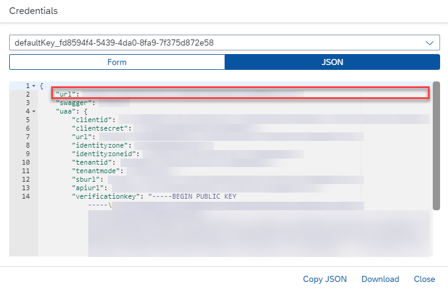
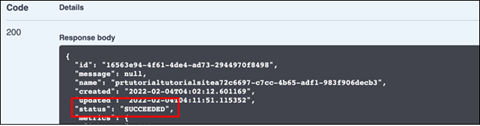
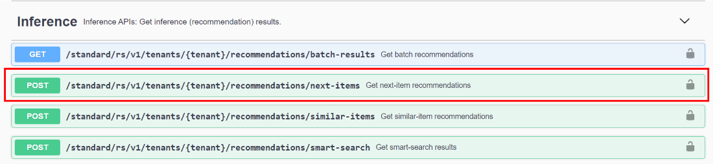

# Use Your Own Data to Train a Machine Learning Model and Get Recommendations Based on Users' Browsing History
<!-- description --> Use the Personalized Recommendation service to train your own machine learning model to give visitors to your website highly personalized recommendations based on their browsing history.

## Prerequisites
- You have completed the tutorial: [Get OAuth Access Token for Personalized Recommendation via Web Browser](cp-aibus-pr-web-oauth-token)

## You will learn
  - How to call and test the Personalized Recommendation service
  - How to access and use Swagger UI (User Interface)
  - How to submit a training job and trigger model serving
  - How to get recommendations based on users' browsing history

## Intro
In this tutorial, you will use your own dataset to train a machine learning model to get next-item recommendations.

---

### Authorize Swagger UI


You will use Swagger UI, via any web browser, to call the Personalized Recommendation service APIs. Swagger UI allows developers to effortlessly interact and try out every single operation an API exposes for easy consumption. For more information, see [Swagger UI](https://swagger.io/tools/swagger-ui/).   

In the service key you created for Personalized Recommendation in the previous tutorial: [Use the Free Tier Service Plan to Set Up Account for Personalized Recommendation and Get Service Key](cp-aibus-pr-booster-free-key), you should find (outside the `uaa` section of the service key) an entry called `url` (as highlighted in the image below).

1. To access the Personalized Recommendation Swagger UI, add **`/doc`** to the `url` value, paste it into any web browser and press **Enter**.

    <!-- border -->

2. To be able to use the Swagger UI endpoints, you need to authorize yourself. In the top right corner, click **Authorize**.

    <!-- border -->

3. Get the `access_token` value created in the previous tutorial: [Get OAuth Access Token for Personalized Recommendation via Web Browser](cp-aibus-pr-web-oauth-token), then add **Bearer** in front of it, and enter in the **Value** field.

    ```
    bearer <access_token>
    ```

    <!-- border -->

4. Click **Authorize** and then click **Close**.

    <!-- border -->


### Prepare dataset


The training endpoint can only receive an input in the form of a ZIP file. The ZIP file should contain two files: the `Clickstream file` and the `Item Catalogue file`. Here's an overview of these files:

**Clickstream file**

*Overview*

Clickstream data is essential in understanding customer behavior based on the sequences of historical item interactions for each user. This data enables the model to do the following:

-	Learn relations between items that appear in the same context, for example, user session item.

-	Identify browsing patterns for each user, providing the basis for personalized recommendations, for example, for users with different histories interacting with the same item.

-	(If *item catalogue* is provided) learn relations between items and their attributes, for example, from consecutive items in the same session belonging to the same *category* or having a similar *name*.

-	(If *user metadata* is provided) learn relations between user's attributes and item interaction sequences, for example, users with the same attribute values have different histories of item interactions.

To cover a wide range of recommendation domains or business scenarios, the clickstream schema detailed below is domain agnostic. Data size limits and content recommendations are provided in the subsequent sections.

*Data schema*

The clickstream is a CSV file with the following columns:

-	`userId`: raw user ID (string)

-	`itemId`: raw item ID (string).

-	`timestamp`: timestamp (float).

Each row represents an event defined by the tuple (user, item, time). Note the agnostic nature of the event definition: it may refer to *any type of user-item interaction*, for example, view, add to cart, subscribe, rate, and so on. When preparing the clickstream data to fit this format, it's up to you to determine which type of events to export. All events are treated as *one type* by the model.

Click on [data](https://help.sap.com/doc/72f40f2a9a664f458cc8643c9d754645/SHIP/en-US/) to download a sample clickstream file for your reference.


**Item catalogue file**

*Overview*

The item catalogue provides additional information on the items in the form of categorical and text features. This information can be used by the model in the following ways:

-	To improve the quality of the predictions: more item information results in more patterns in the clickstream data being identified and forecast.

-	To support item cold start: approximate item representations (for example, embeddings) based on attribute representations.

-	To give flexibility during inference: item attributes may be customized (modified attribute values and/or weights), influencing the recommendations.

-	To enable smart search: as the model learns to represent words and item attributes, it can take them as inputs to recommend relevant items.

To avoid ambiguity in interpreting the attributes and standardize the catalogue format, the data schema has been fixed, as described in the next section. Additional information on size limits and recommended content of the catalogue is provided in the subsequent sections.

Therefore, while not mandatory, it's highly recommended to have the item catalogue together with the clickstream data and unlock the full potential of the recommendation engine.

*Data Schema*

The item catalogue is a JSON file with the following structure:

    ```
    {
        raw item ID (string): {
            'categoricalFeatures': {
                categorical attribute (string): {
                    'values': attribute values (list of strings),
                    'weights' (optional): attribute weights (list of float)
                },
                ...
            },
            'textFeatures': {
                text attribute (string): attribute value (string),
                ...
            },
            'numericalFeatures': {
                numerical attribute (string): attribute value (float),
                ...
            },
            'unavailable' (optional): availability flag (boolean)
        }
    }
    ```

Click on [data](https://help.sap.com/doc/72f40f2a9a664f458cc8643c9d754645/SHIP/en-US/) to download a sample item catalogue file for your reference.


### Train your own machine learning model


Use the **POST /standard/rs/v1/tenants/{tenant}/jobs/file-upload** endpoint to upload data and trigger the machine learning model training job.

1. Click the endpoint name to expand it.

2. Click **Try it out**.

    <!-- border -->

3.  Enter tenant name. You must enter a name for the tenants, so please input a name of your choice.

4.  Upload Data. Choose the ZIP file that contains the newly created training data.

5.  Enter site name. A site name is also required, but if you leave this field blank, it is automatically filled with "default".

    <!-- border -->

6.  Set `serve_model` to `true`. Make this setting to automatically deploy the real-time model serving instance.

    <!-- border -->

7.  Click the **Execute** button. *Bear in mind that users with the free tier model for SAP BTP are limited to a total number of 2 trainings per month*. When you call the third training API, you get a 403 response stating that you have exceeded your quota for the month.

After you trigger the training, there are two possible outcomes:

- Still ongoing, where the status is "PENDING", and code 200.

    <!-- border -->

- Conflict, where the trigger clashed with the ongoing training from the previous trigger. The status is "Previously submitted job still in progress", and the code is 409.

    <!-- border -->


### Get training job status


Use the **GET /standard/rs/v1/tenants/{tenant}/jobs/latest** endpoint to check the status of the ongoing training job.

1. Click the endpoint name to expand it.

2. Click **Try it out**.

3. Enter tenant name and site name (must be exactly the same as in the previous step). Click **Execute**.

<!-- border -->

There are three possible outcomes:

- Job is still ongoing, with the status "SUBMITTED" and code 200. Please wait for around 5–10 minutes before rechecking the progress.

    <!-- border -->

- The job is completed, with the status "SUCCEEDED" and code 200. You can now proceed to the next step.

    <!-- border -->

- The job fails, with status "FAILED" and code 200. Please retrigger the training and make sure that you have entered all information correctly.

    <!-- border -->


### Make inference call


There are four different choices of inference calls as you can see in [Inference Options](https://help.sap.com/docs/Personalized_Recommendation/2c2078b9efa84566ac19d44df9625c65/8da4bc50e07f43f497da30833f6aea5e.html). For this tutorial, we will use next-item recommendations.

Use the **POST /standard/rs/v1/tenants/{tenant}/recommendations/next-items** endpoint to get next-item recommendations.

1. Click the endpoint name to expand it.

    <!-- border -->

2. Click **Try it out**.

3. Insert **payload**.

    Here, you provide all the relevant inference input data in the payload. Each of the different inference endpoints has different requirements: For **`next_items`**, the **`items_ls`** parameter is required while the other parameters are not required (but imputable). The **`items_ls`** parameter is a list of **`items_id`** representing the past item interactions (clickstream) of the user to generate the recommendations.

    For this parameter to be valid, the input must meet the following requirements:

    -	Correspond to an object entry in the **`item_Catalogue`** training data used to train the model, or

    -	Be provided as an entry in the metadata parameter as a cold start item, or

    -	Be provided as a cold start item via the 'metadata update' feature

    Taking an example from our sample dataset, insert a payload with the following content:

    ```JSON
    {
       "items_ls":[
          "2858"
       ]
    }
    ```

    For more details regarding the payload input, please refer to [Next-Item Recommendations](https://help.sap.com/docs/Personalized_Recommendation/2c2078b9efa84566ac19d44df9625c65/e24aff359e6645d0b758d15143ec4ddc.html).

4. Enter tenant name and site name (must be exactly the same as in the previous steps). Click **Execute**.

You can expect the following responses:

- The model is able to understand the request and successfully return a set of recommendations. This returns a 200 code, stating the recommended items with their respective confidence scores.

    <!-- border -->

- The user entered an incorrect payload. This returns a 400 code, stating that the model doesn't understand the payload request.

    <!-- border -->

- Forbidden. The user has exceeded their inference quota for the month. A short message is displayed with code 403. *Bear in mind that users with the free tier model for SAP BTP are limited to a total number of 1000 inference requests per month*.

    <!-- border -->

- The training process has not finished yet. This returns a 404 code, stating that no model instances were found.

    <!-- border -->

You have now successfully used the Personalized Recommendation service and your own dataset to train a machine learning model and get recommendations based on users' browsing history and/or item description.
