# Get Recommendations Based on Users' Browsing History
<!-- description --> Use the Personalized Recommendation service to give visitors to your website recommendations based on their browsing history.

## Prerequisites
- You have completed the tutorial: [Get OAuth Access Token for Personalized Recommendation via Web Browser](cp-aibus-pr-web-oauth-token)

## You will learn
  - How to call and test the Personalized Recommendation service
  - How to access and use Swagger UI (User Interface)
  - How to submit a training job and trigger model serving
  - How to get recommendations based on users' browsing history
  - How to delete serving and resource

## Intro
The Personalized Recommendation service uses state-of-the-art machine learning techniques to give visitors to your website highly personalized recommendations based on their browsing history and/or item description. Train and use machine learning models to deliver these recommendations across a wide range of business scenarios. With Personalized Recommendation, you can elevate user experience and engagement, enhance item discovery and conversion, retain business control, curate relevance, and meet key performance indicators.

To try out the Personalized Recommendation service, the first step is to upload data that will be used to train a machine learning model. For more information, see [Personalized Recommendation SAP Help Portal documentation](https://help.sap.com/docs/Personalized_Recommendation). For further definition of specific terms, see [Concepts](https://help.sap.com/docs/Personalized_Recommendation/2c2078b9efa84566ac19d44df9625c65/f7e79f6a86b2407eb135f1ca9905b56f.html). See also [Free Tier Option Technical Constraints](https://help.sap.com/docs/Personalized_Recommendation/2c2078b9efa84566ac19d44df9625c65/fd208e8dcb7f40d1ac377cf26c5720b8.html).

In this tutorial, you will use a dataset that contains users' browsing history to train a machine learning model to get next-item recommendations, similar-item recommendations, smart-search results, and user-affinity recommendations. For more information, see [Inference Options](https://help.sap.com/docs/Personalized_Recommendation/2c2078b9efa84566ac19d44df9625c65/8da4bc50e07f43f497da30833f6aea5e.html).

---


### Authorize Swagger UI

You will use Swagger UI, via any web browser, to call the Personalized Recommendation service APIs. Swagger UI allows developers to effortlessly interact and try out every single operation an API exposes for easy consumption. For more information, see [Swagger UI](https://swagger.io/tools/swagger-ui/).   

In the service key you created for Personalized Recommendation in the previous tutorial: [Use the Free Tier Service Plan to Set Up Account for Personalized Recommendation and Get Service Key](cp-aibus-pr-booster-free-key), you should find (outside the `uaa` section of the service key) an entry called `url` (as highlighted in the image below).

1. To access the Personalized Recommendation Swagger UI, add **`/doc`** to the `url` value, paste it into any web browser and press **Enter**.

    <!-- border --> 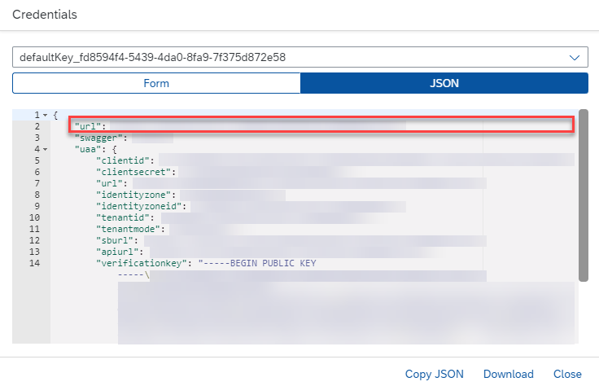

2. To be able to use the Swagger UI endpoints, you need to authorize yourself. In the top right corner, click **Authorize**.

    <!-- border --> 

3. Get the `access_token` value created in the previous tutorial: [Get OAuth Access Token for Personalized Recommendation via Web Browser](cp-aibus-pr-web-oauth-token), then add **Bearer** in front of it, and enter in the **Value** field.

    ```
    Bearer <access_token>
    ```
    <!-- border --> 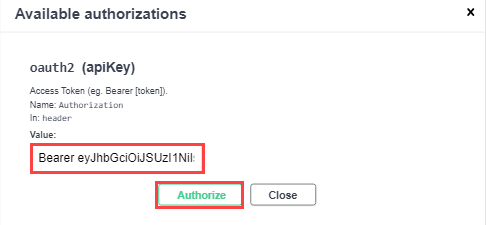

4. Click **Authorize** and then click **Close**.

    <!-- border --> 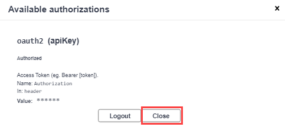


### Upload training data

Use the **POST /standard/rs/v1/tenants/{tenant}/jobs/file-upload** endpoint to upload data and trigger the machine learning model training job.

1. Click the endpoint name to expand it.

2. Click **Try it out**.

    <!-- border --> 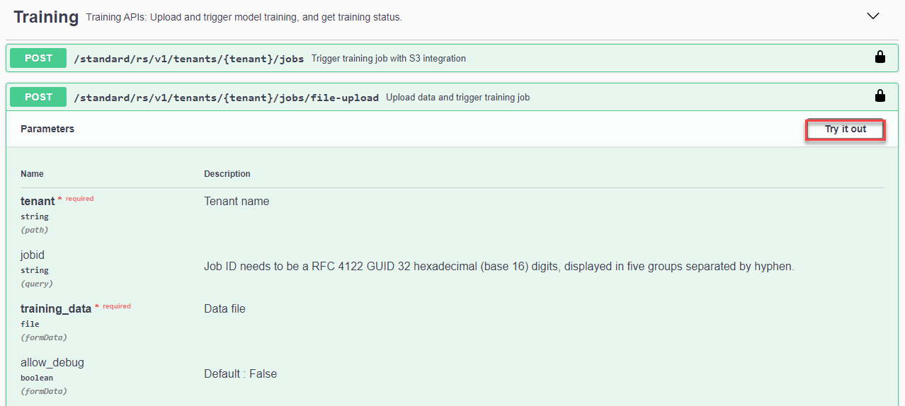

3. Enter tenant name. It is required to enter a name of your choice for tenants. You can use, for example, `pr_tutorial`.

4. Click on [data](https://help.sap.com/doc/72f40f2a9a664f458cc8643c9d754645/SHIP/en-US/) to download the training data ZIP file. Click **Choose File** to upload the training data.

5. Enter site name. Same as tenant name, but if you leave the field blank, it will be named automatically as **default**. You can use, for example, `pr_tutorial_site`.

    <!-- border --> 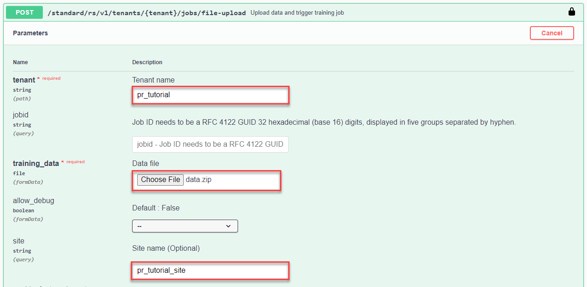

6. Set `serve_model` to `true` for automatic deployment of real-time model serving instance. To trigger the machine learning training, click **Execute**.

    <!-- border --> 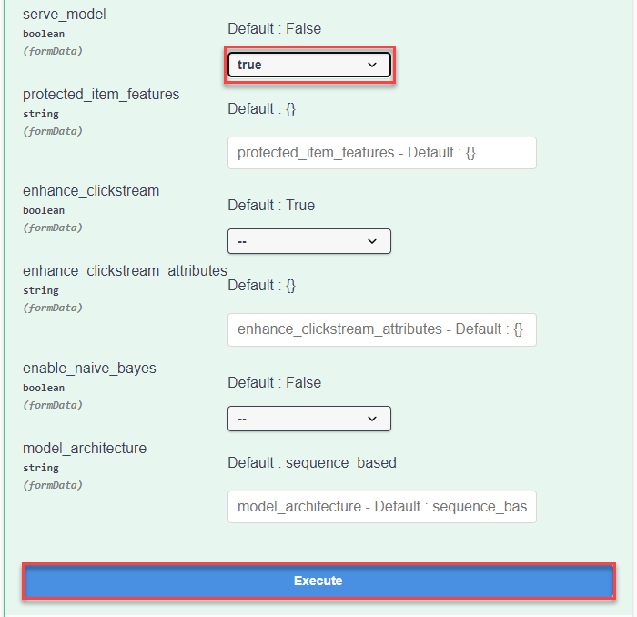

    You should receive a response like the following:

    <!-- border --> 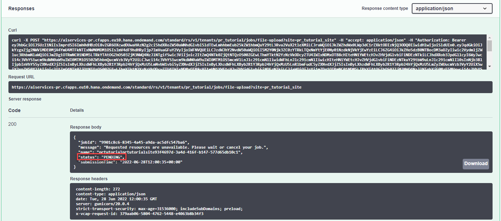  


### Get training job status

Use the **GET /standard/rs/v1/tenants/{tenant}/jobs/latest** endpoint to check the status of the ongoing training job.

1. Click the endpoint name to expand it.

2. Click **Try it out**.

3. Enter tenant name (`pr_tutorial`) and site name (`pr_tutorial_site`). Click **Execute**.

    <!-- border --> 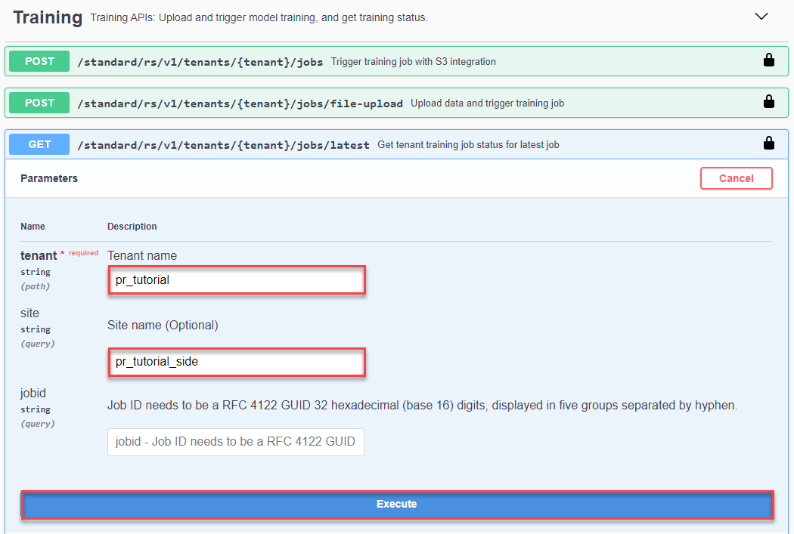

    You should receive a response like the following:

    <!-- border --> 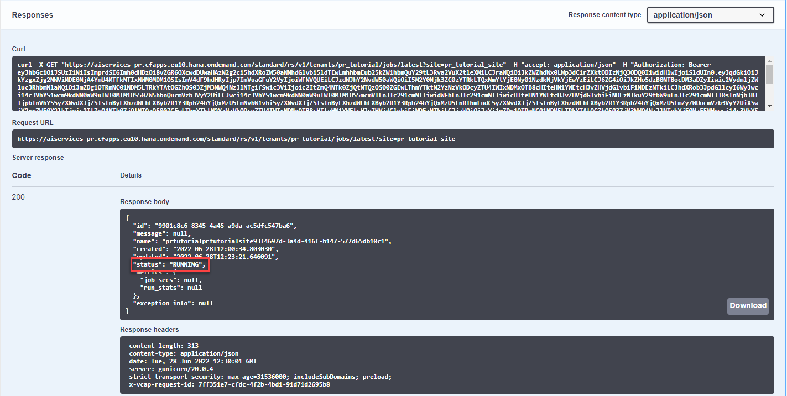

    After a few minutes, the training job status should change to `SUCCEEDED`.

    <!-- border --> 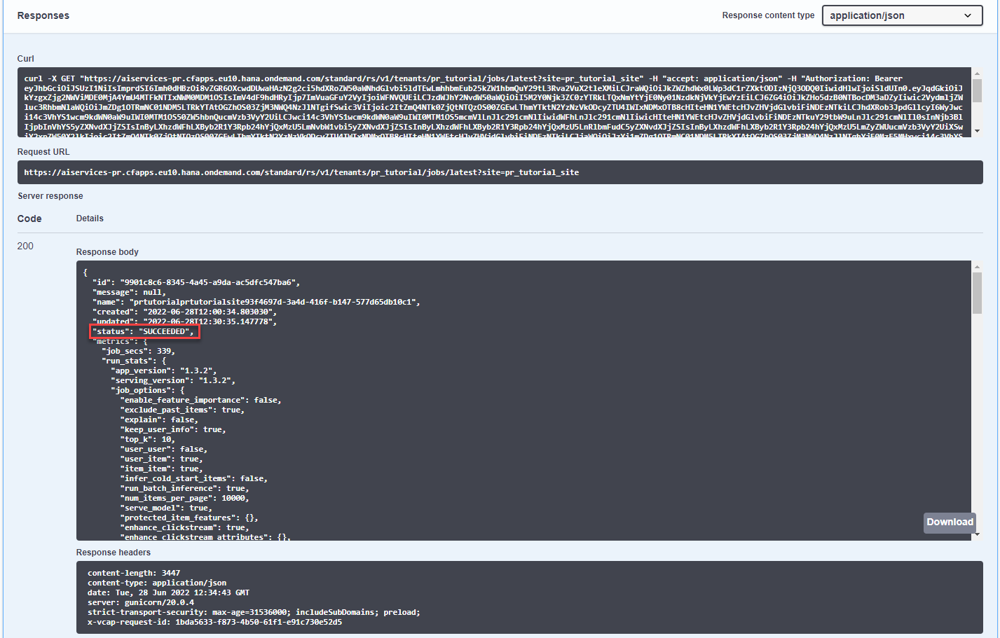


### Get deployment status for model serving

Use the **GET /standard/rs/v1/tenants/{tenant}/servings** endpoint to check the deployment status for model serving.

1. Click the endpoint name to expand it.

2. Click **Try it out**.

3. Enter site name (`pr_tutorial_site`) and tenant name (`pr_tutorial`). Click **Execute**.

    <!-- border --> 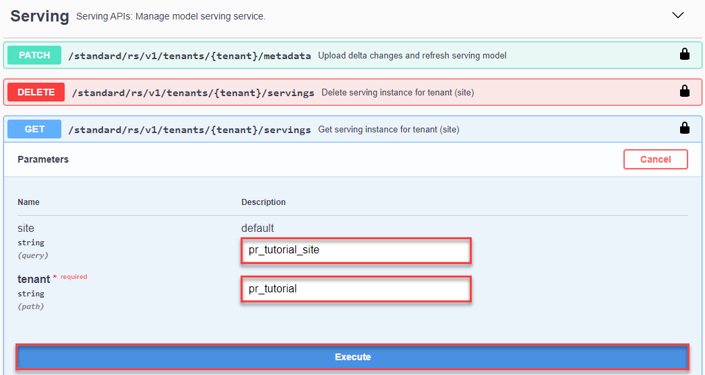

    You should receive a response like the following:

    <!-- border --> 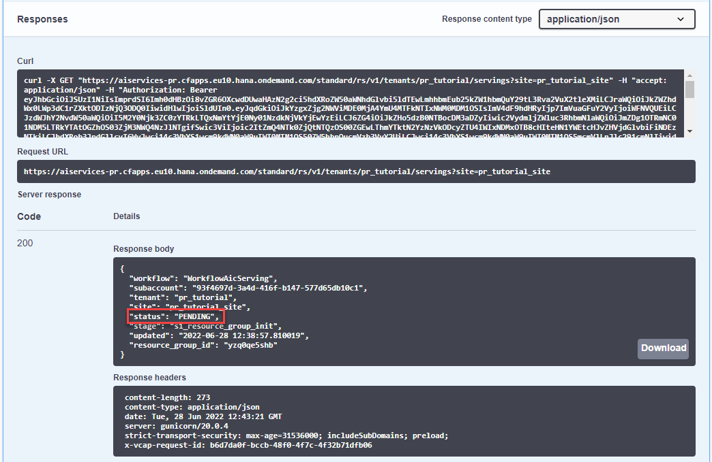

    After a few minutes, the serving job status should change from `PENDING` to `SUCCEEDED`.

    <!-- border --> 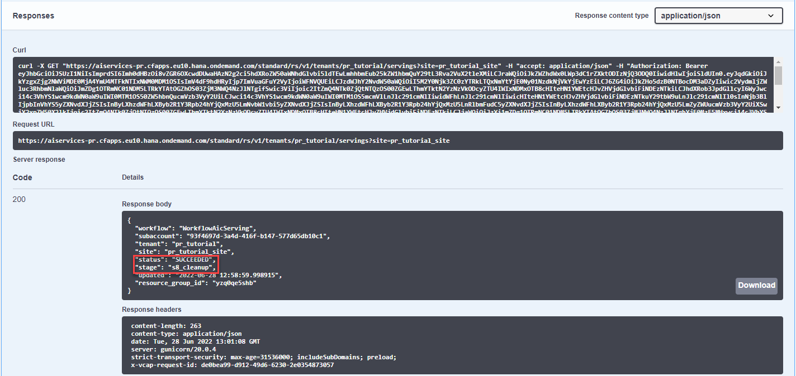


### Get next-item recommendations

There are four different choices of inference calls as you can see in [Inference Options](https://help.sap.com/docs/Personalized_Recommendation/2c2078b9efa84566ac19d44df9625c65/8da4bc50e07f43f497da30833f6aea5e.html). In this step, we will use [Next-Item Recommendations](https://help.sap.com/docs/Personalized_Recommendation/2c2078b9efa84566ac19d44df9625c65/e24aff359e6645d0b758d15143ec4ddc.html).

Use the **POST /standard/rs/v1/tenants/{tenant}/recommendations/next-items** endpoint to get next-item recommendations.

1. Click the endpoint name to expand it.

2. Click **Try it out**.

3. In the **payload**, you can enter the following (that means the user has recently clicked an item with ID "2858"):

    ```JSON
    {
       "items_ls":[
          "2858"
       ]
    }
    ```

4. Enter site name (`pr_tutorial_site`) and tenant name (`pr_tutorial`). Click **Execute**.

    <!-- border --> 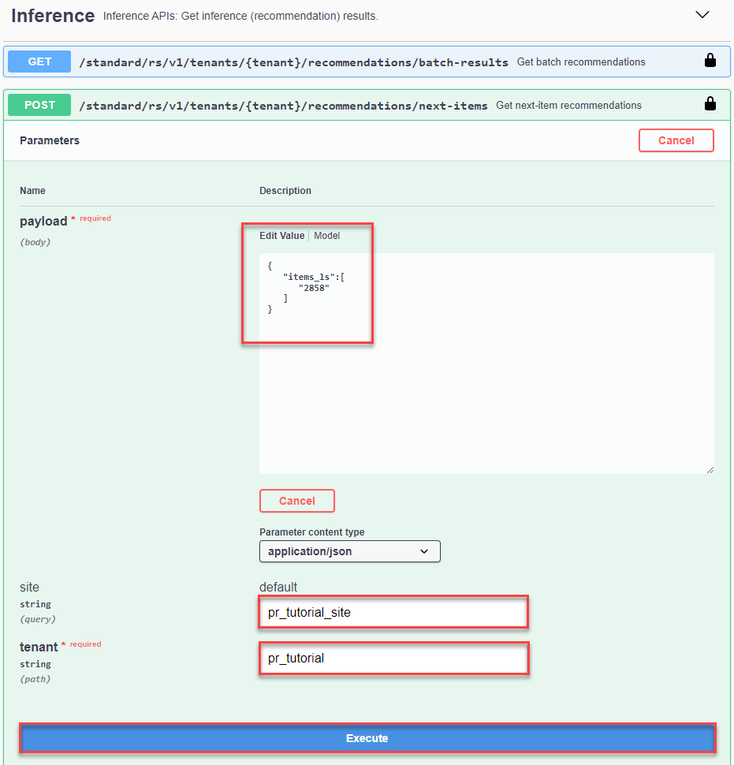

    You should receive a response like the following:

    <!-- border --> 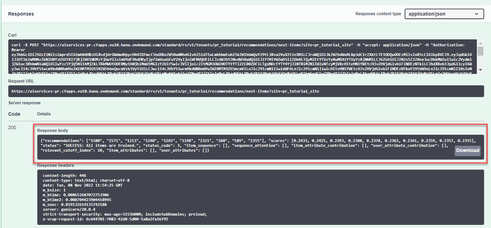

The response shows a sequence of recommendations based on the user's past clickstreams. Since we included in the **payload** the item "2858" as our past clickstream, the model is able to recommend 10 other items related to the item "2858".

The confidence score represents how certain the model is about its prediction. The higher the score the more confident the model is that the prediction is actually correct. If the score is close to 1, the model is very certain.

For this tutorial, we're using a small dataset that results in a low model quality and that's why the scores are also low. A bigger and more complex dataset would take much more time to be trained but would provide better scores.


### Get similar-item recommendations

There are four different choices of inference calls as you can see in [Inference Options](https://help.sap.com/docs/Personalized_Recommendation/2c2078b9efa84566ac19d44df9625c65/8da4bc50e07f43f497da30833f6aea5e.html). In this step, we will use [Similar-Item Recommendations](https://help.sap.com/docs/Personalized_Recommendation/2c2078b9efa84566ac19d44df9625c65/ac3306e614504363b0db057357eb99d5.html).

Use the **POST /standard/rs/v1/tenants/{tenant}/recommendations/similar-items** endpoint to get similar-item recommendations.

1. Click the endpoint name to expand it.

2. Click **Try it out**.

3. In the **payload**, you can enter the following (that means you want to get similar-item recommendations for item "1196"):

    ```JSON
    {
       "item":"1196",
       "k":3,
       "explain":true
    }
    ```

4. Enter site name (`pr_tutorial_site`) and tenant name (`pr_tutorial`). Click **Execute**.

    <!-- border --> 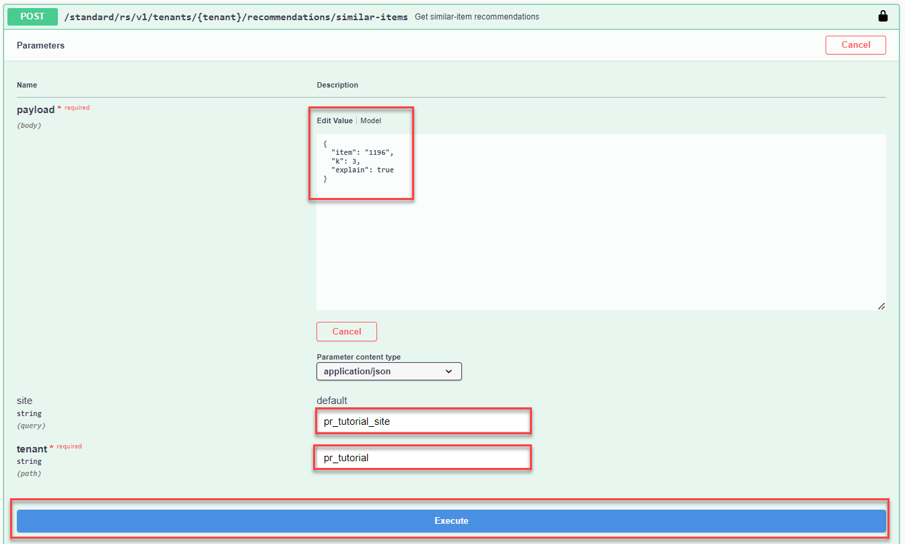

    You should receive a response like the following:

    <!-- border --> 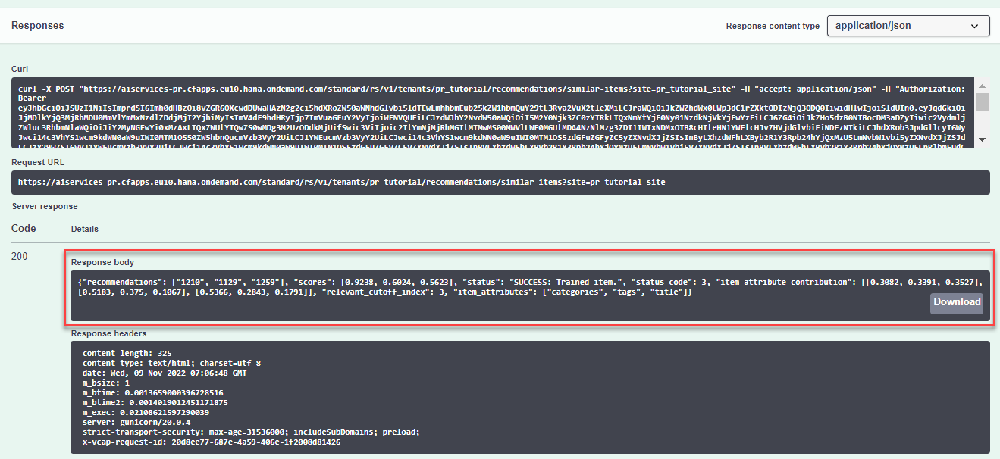

The response shows 3 similar-item recommendation results (`"k":3`) based on the item you selected (`"item":"1196"`). As ML `explainability` is enabled (`"explain":true`), in the response, you receive quantifiable insights into how the recommendations engine computes the recommendation results.  


### Get smart-search results

There are four different choices of inference calls as you can see in [Inference Options](https://help.sap.com/docs/Personalized_Recommendation/2c2078b9efa84566ac19d44df9625c65/8da4bc50e07f43f497da30833f6aea5e.html). In this step, we will use [Smart-search results](https://help.sap.com/docs/Personalized_Recommendation/2c2078b9efa84566ac19d44df9625c65/5b1af71e45114d01b2e7891718fb3a46.html?locale=en-US).

Use the **POST /standard/rs/v1/tenants/{tenant}/recommendations/smart-search** endpoint to get smart-search results.

1. Click the endpoint name to expand it.

2. Click **Try it out**.

3. In the **payload**, you can enter the following (that means the recommendations are personalized by taking into account the user ID (`"user":"user_id1"`) and the current clickstream (`"items_ls":["item_id1","item_id2"]`)):


    ```JSON
    {
       "string_queries":"Lord of the Rings",
       "user":"user_id1",
       "items_ls":[
          "item_id1",
          "item_id2"
       ],
       "explain":true,
       "k":3,
       "attribute_queries":{
          "categoricalFeatures":{
             "tags":{
                "values":[
                   "trilogy",
                   "imdb top 250"
                ],
                "clauses":[
                   "must",
                   "should"
                ]
             }
          }
       }
    }
    ```

4. Enter site name (`pr_tutorial_site`) and tenant name (`pr_tutorial`). Click **Execute**.

    <!-- border --> 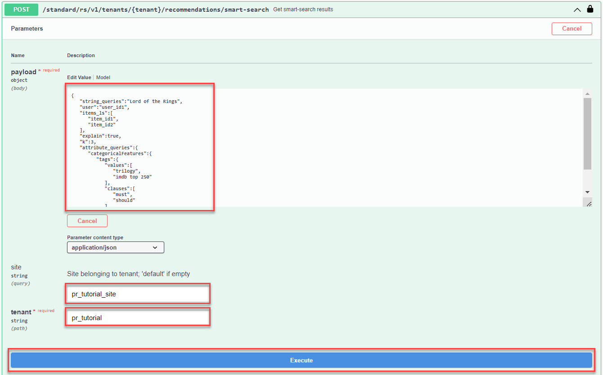

    You should receive a response like the following:

    <!-- border --> 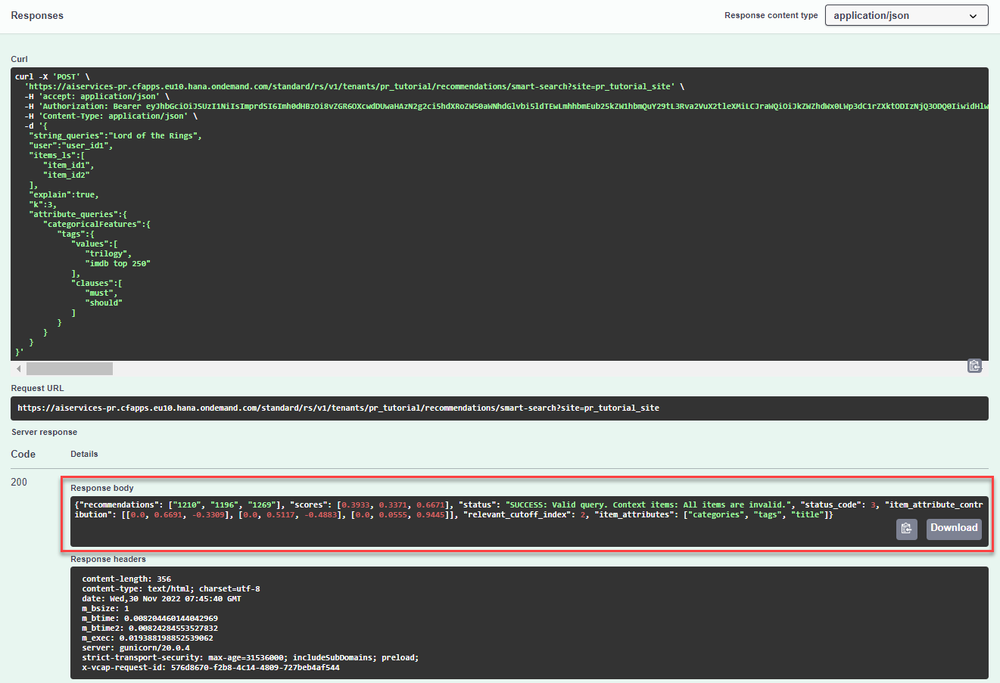

The response shows, based on a list of free-form text input (`string_queries`), and/or a list of attribute values (`attribute_queries`), a number of recommendation results (`"recommendations":["1210","1196","1269"]`) along with their scores (`"scores": [0.3933, 0.3371, 0.6671]`). In this example, the item "1210" has a score of 0.3933, the item "1196" has a score of 0.3371, and the item "1269" has a score of 0.6671. When you enable ML `explainability`, you can better understand the "scores". For "`item_attribute_contribution`", the position of the nested list corresponds to the position of the item in the "recommendations" list. The first nested list `[0.0, 0.6691,-0.3309]` is the "`item_attribute_contribution`" for the first item in "recommendations" that is "1210". And the second nested list `[0.0, 0.5117, -0.4883]`, is the "`item_attribute_contribution`" for the second item in "recommendations" that is "1196".


### Get user-affinity recommendations

There are four different choices of inference calls as you can see in [Inference Options](https://help.sap.com/docs/Personalized_Recommendation/2c2078b9efa84566ac19d44df9625c65/8da4bc50e07f43f497da30833f6aea5e.html). In this step, we will use [User-affinity Recommendations](https://help.sap.com/docs/Personalized_Recommendation/2c2078b9efa84566ac19d44df9625c65/9f7d0520b2594503886dd2b3802e7bde.html).

Use the **POST /standard/rs/v1/tenants/{tenant}/recommendations/user-affinity** endpoint to get user-affinity recommendations.

1. Click the endpoint name to expand it.

2. Click **Try it out**.

3. In the **payload**, you can enter the following (that means the user has recently clicked the items with IDs "364", "1064", and "3108"):

    ```JSON
    {
       "items_ls":[
          "364",
          "1064",
          "3108"
       ],
       "features":[
          "categories",
          "tags"
       ],
       "k":3
    }
    ```

4. Enter site name (`pr_tutorial_site`) and tenant name (`pr_tutorial`). Click **Execute**.

    <!-- border --> 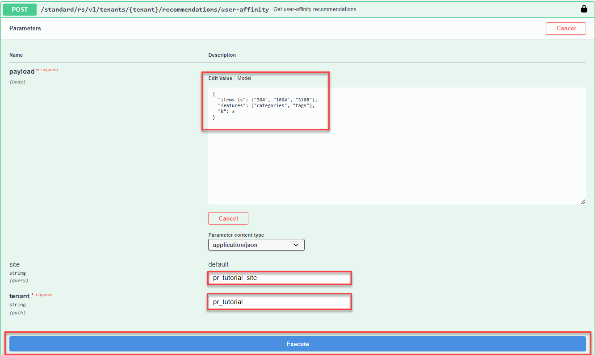

    You should receive a response like the following:

    <!-- border --> 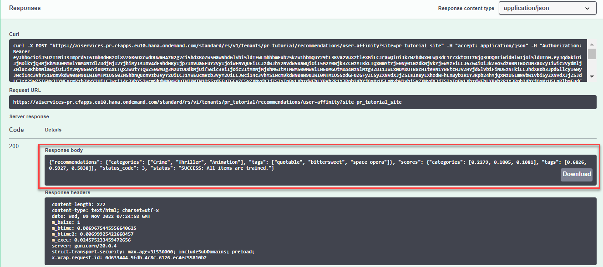

The response shows, based on user past item interactions (`"items_ls":["364","1064","3108"]`) from the request **payload**, a number of recommended category affinities (`"recommendations":{"categories":["Crime","Thriller","Animation"]`) along with their scores (`"scores":{"categories":[0.2279,0.1805,0.1081]`). In this example, the category "Crime" has an affinity score of 0.2279, the category "Thriller" has a score of 0.1805, and the category "Animation" has a score of 0.1081.


### Delete serving

Now that you've learned the whole process on how to consume the Personalized Recommendation service, it's time to clean up.

When you trigger the `DELETE` request, a workflow to delete the model starts. The metering for model serving then stops. Deleting an unused model serving will help free tier users to save inference quota for future usage, for users of the standard service plan, it'll help to save model serving cost.

Use the **DELETE /standard/rs/v1/tenants/{tenant}/servings** endpoint to delete the model serving instance of the tenant (site).

1. Click the endpoint name to expand it.

2. Click **Try it out**.

3. Enter tenant name (`pr_tutorial`) and site name (`pr_tutorial_site`). Click **Execute**.

    <!-- border --> 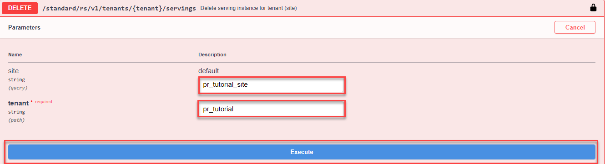

    You should receive a response like the following:

    <!-- border --> 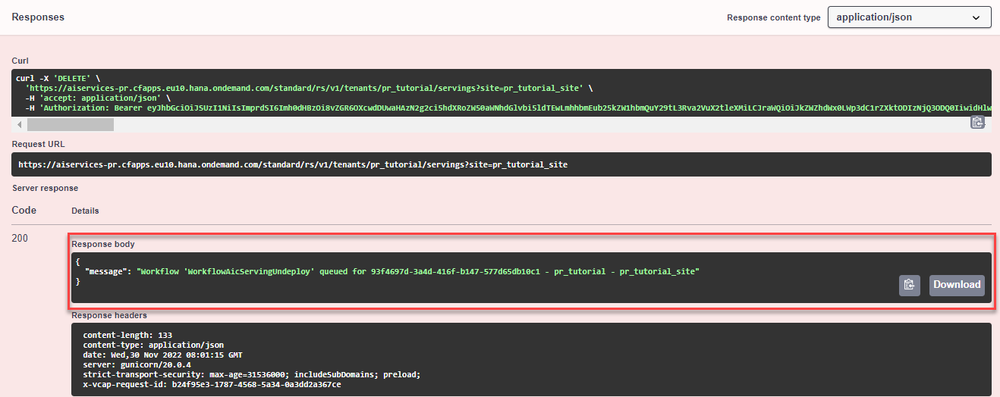


### Delete resource

Use the **DELETE /standard/rs/v1/tenants/{tenant}** endpoint to delete all files for any sites that belong to a subaccount and tenant.

1. Click the endpoint name to expand it.

2. Click **Try it out**.

3. Enter tenant name (`pr_tutorial`) and site name (`pr_tutorial_site`).

4. Set `all_sites` to `true` and click **Execute**.

    <!-- border --> 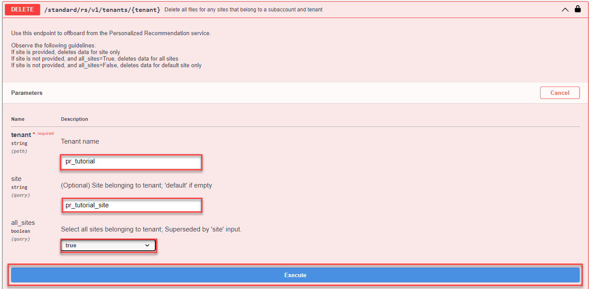

    You should receive a response like the following:

    <!-- border --> 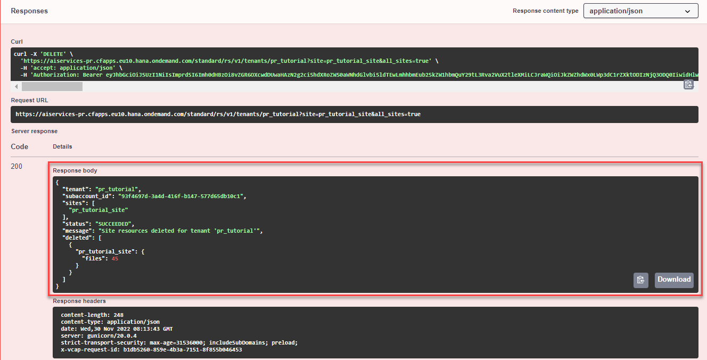

You have now successfully used the Personalized Recommendation service to get recommendations based on users' browsing history.
