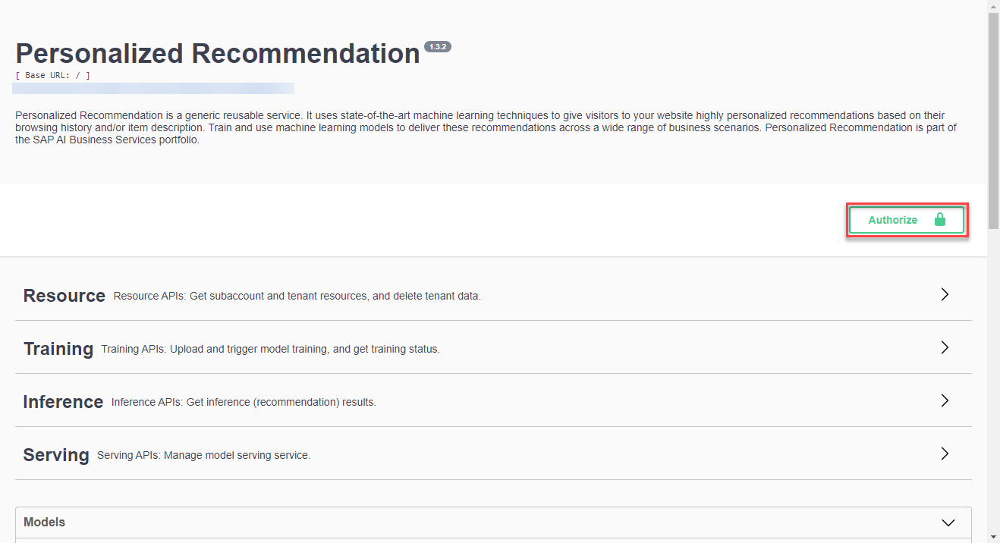
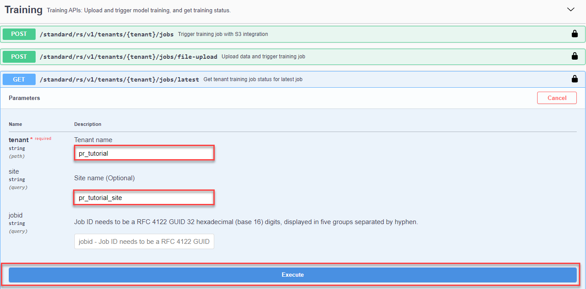

## Details
### You will learn
  - How to call and test the Personalized Recommendation service
  - How to access and use Swagger UI (User Interface)
  - How to submit a training job and trigger model serving
  - How to get recommendations based on users' browsing history

The Personalized Recommendation service uses state-of-the-art machine learning techniques to give visitors to your website highly personalized recommendations based on their browsing history and/or item description. Train and use machine learning models to deliver these recommendations across a wide range of business scenarios. With Personalized Recommendation, you can elevate user experience and engagement, enhance item discovery and conversion, retain business control, curate relevance, and meet key performance indicators.

To try out the Personalized Recommendation service, the first step is to upload data that will be used to train a machine learning model. For more information, see [Personalized Recommendation SAP Help Portal documentation](https://help.sap.com/docs/Personalized_Recommendation). For further definition of specific terms, see [Concepts](https://help.sap.com/docs/Personalized_Recommendation/2c2078b9efa84566ac19d44df9625c65/f7e79f6a86b2407eb135f1ca9905b56f.html). See also [Free Tier Option Technical Constraints](https://help.sap.com/docs/Personalized_Recommendation/2c2078b9efa84566ac19d44df9625c65/fd208e8dcb7f40d1ac377cf26c5720b8.html).

In this tutorial, you will use a dataset that contains users' browsing history to train a machine learning model to get next-item recommendations based on an item that has been recently clicked by a visitor to your website.

---

[ACCORDION-BEGIN [Step 1: ](Authorize Swagger UI)]

You will use Swagger UI, via any web browser, to call the Personalized Recommendation service APIs. Swagger UI allows developers to effortlessly interact and try out every single operation an API exposes for easy consumption. For more information, see [Swagger UI](https://swagger.io/tools/swagger-ui/).   

In the service key you created for Personalized Recommendation in the previous tutorial: [Use the Free Tier Service Plan to Set Up Account for Personalized Recommendation and Get Service Key](cp-aibus-pr-booster-free-key), you should find (outside the `uaa` section of the service key) an entry called `url` (as highlighted in the image below).

1. To access the Personalized Recommendation Swagger UI, add **`/doc`** to the `url` value, paste it into any web browser and press **Enter**.

    !

2. To be able to use the Swagger UI endpoints, you need to authorize yourself. In the top right corner, click **Authorize**.

    !

3. Get the `access_token` value created in the previous tutorial: [Get OAuth Access Token for Personalized Recommendation via Web Browser](cp-aibus-pr-web-oauth-token), then add **Bearer** in front of it, and enter in the **Value** field.

    ```
    Bearer <access_token>
    ```

    !

4. Click **Authorize** and then click **Close**.

    !

[VALIDATE_1]
[ACCORDION-END]


[ACCORDION-BEGIN [Step 2: ](Upload training data)]

Use the **POST /standard/rs/v1/tenants/{tenant}/jobs/file-upload** endpoint to upload data and trigger the machine learning model training job.

1. Click the endpoint name to expand it.

2. Click **Try it out**.

    !

3. Enter tenant name. It is required to enter a name of your choice for tenants. You can use, for example, `pr_tutorial`.

4. Click on [data](https://help.sap.com/doc/72f40f2a9a664f458cc8643c9d754645/SHIP/en-US/) to download the training data ZIP file. Click **Choose File** to upload the training data.

5. Enter site name. Same as tenant name, but if you leave the field blank, it will be named automatically as **default**. You can use, for example, `pr_tutorial_site`.

    !

6. Set `serve_model` to `true` for automatic deployment of real-time model serving instance. To trigger the machine learning training, click **Execute**.

    !

    You should receive a response like the following:

    !

[DONE]
[ACCORDION-END]


[ACCORDION-BEGIN [Step 3: ](Get training job status)]

Use the **GET /standard/rs/v1/tenants/{tenant}/jobs/latest** endpoint to check the status of the ongoing training job.

1. Click the endpoint name to expand it.

2. Click **Try it out**.

3. Enter tenant name (`pr_tutorial`) and site name (`pr_tutorial_site`). Click **Execute**.

!

You should receive a response like the following:

!

After a few minutes, the training job status should change to `SUCCEEDED`.

!

[DONE]
[ACCORDION-END]


[ACCORDION-BEGIN [Step 4: ](Get deployment status for model serving)]

Use the **GET /standard/rs/v1/tenants/{tenant}/servings** endpoint to check the deployment status for model serving.

1. Click the endpoint name to expand it.

2. Click **Try it out**.

3. Enter site name (`pr_tutorial_site`) and tenant name (`pr_tutorial`). Click **Execute**.

!

You should receive a response like the following:

!

After a few minutes, the serving job status should change from `PENDING` to `SUCCEEDED`.

!

[DONE]
[ACCORDION-END]


[ACCORDION-BEGIN [Step 5: ](Get recommendations)]

There are four different choices of inference calls as you can see in [Inference Options](https://help.sap.com/docs/Personalized_Recommendation/2c2078b9efa84566ac19d44df9625c65/8da4bc50e07f43f497da30833f6aea5e.html). For this tutorial, we will use [Next-Item Recommendations](https://help.sap.com/docs/Personalized_Recommendation/2c2078b9efa84566ac19d44df9625c65/e24aff359e6645d0b758d15143ec4ddc.html).

Use the **POST /standard/rs/v1/tenants/{tenant}/recommendations/next-items** endpoint to get next-item recommendations.

1. Click the endpoint name to expand it.

2. Click **Try it out**.

3. In the **payload**, you can enter the following (that means the user has recently clicked an item with `itemID` 2858):

    ```JSON
    {
       "items_ls":[
          "2858"
       ]
    }
    ```

4. Enter site name (`pr_tutorial_site`) and tenant name (`pr_tutorial`). Click **Execute**.

!

You should receive a response like the following:

!

The response shows a sequence of recommendations based on the user's past clickstreams. Since we included in the **payload** the `itemID` "2858" as our past clickstream, the model is able to recommend 10 other items related to the `itemID` "2858".  

You have now successfully used the Personalized Recommendation service to get recommendations based on users' browsing history.

[DONE]
[ACCORDION-END]
