# Use Free Tier to Set Up Account for Service Ticket Intelligence and Download Postman Sample Files
<!-- description --> Use the Free Tier service plan and an SAP BTP booster to automatically create a service instance, and download Postman environment and collection JSON sample code files for Service Ticket Intelligence.

## Prerequisites
- You have created an account on SAP BTP to try out free tier service plans: [Get an Account on SAP BTP to Try Out Free Tier Service Plans](btp-free-tier-account)
- You are entitled to use the Service Ticket Intelligence service: [Manage Entitlements Using the Cockpit](btp-cockpit-entitlements).

## You will learn
  - How to access your SAP BTP account
  - What are interactive guided boosters
  - How to use the **Set up account for Service Ticket Intelligence** booster to assign entitlements, update your subaccount (or create a new one), create a service instance and the associated service key, and also to download Postman environment and collection JSON sample code files for Service Ticket Intelligence
---

### Go to your SAP BTP account

1. Open the [SAP BTP cockpit](https://account.hana.ondemand.com/cockpit#/home/allaccounts).

2. Access your global account.

    <!-- border -->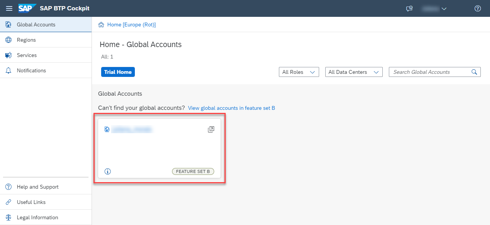    

### Run booster

SAP Business Technology Platform creates interactive guided boosters to automate cockpit steps, so users can save time when trying out the services.

Now, you will use the **Set up account for Service Ticket Intelligence** booster to automatically assign entitlements, update your subaccount, create a service instance and the associated service instance for Service Ticket Intelligence.

1. On the navigation side bar, click **Boosters**.

    <!-- border -->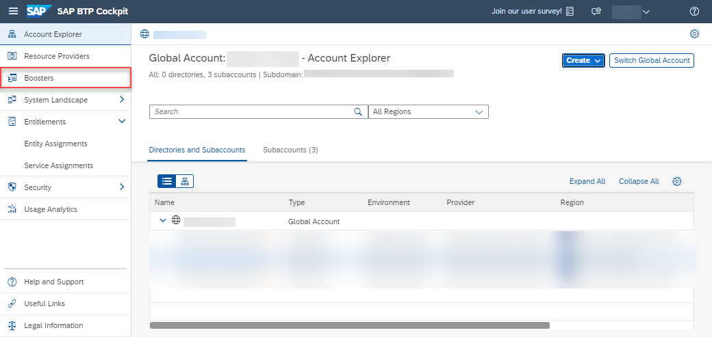

2. Search for **Service Ticket Intelligence** and click the tile to access the booster.

    <!-- border -->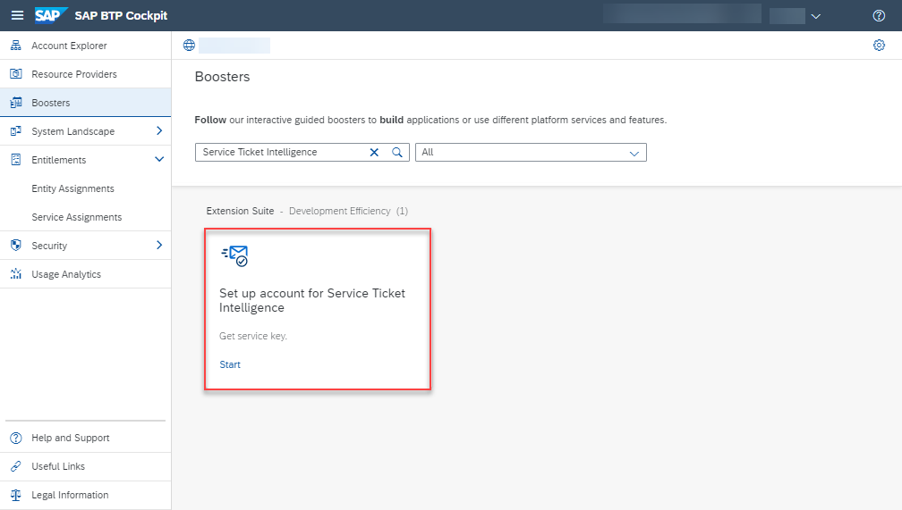

3. Click **Start**.

    <!-- border -->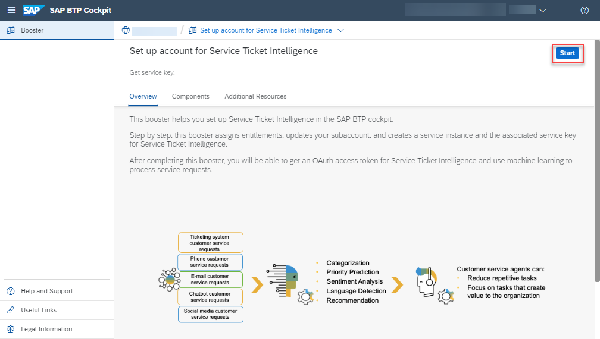

4. Click **Next**.

    <!-- border -->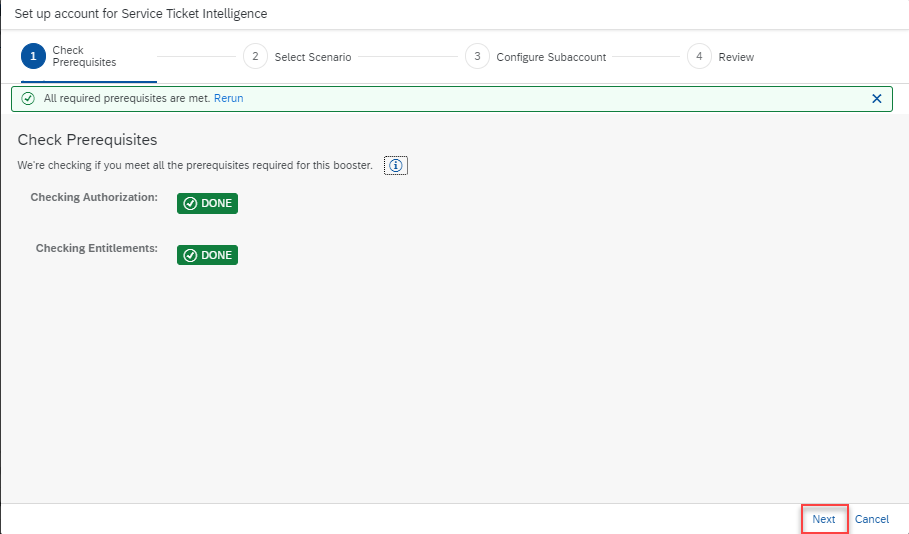

5. If you want to create a dedicated subaccount for the service instance, choose **Create Subaccount**. If you want to use an already created subaccount, choose **Select Subaccount** (the selection comes in the next step). For this tutorial, we'll create a dedicated subaccount. When you're done with the selection, click **Next**.

    <!-- border -->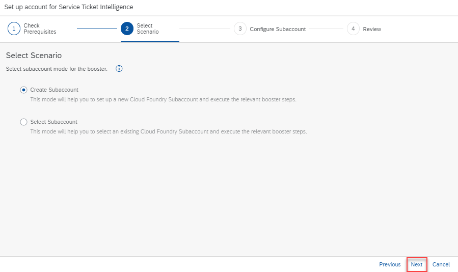

6. Choose the **free** plan. You can also rename the subaccount to `sti-free-tier-service-plan-tutorial`, for example. Choose the region closest to you. For this tutorial, we'll use **Europe (Frankfurt)**. Click **Next**.

    <!-- border -->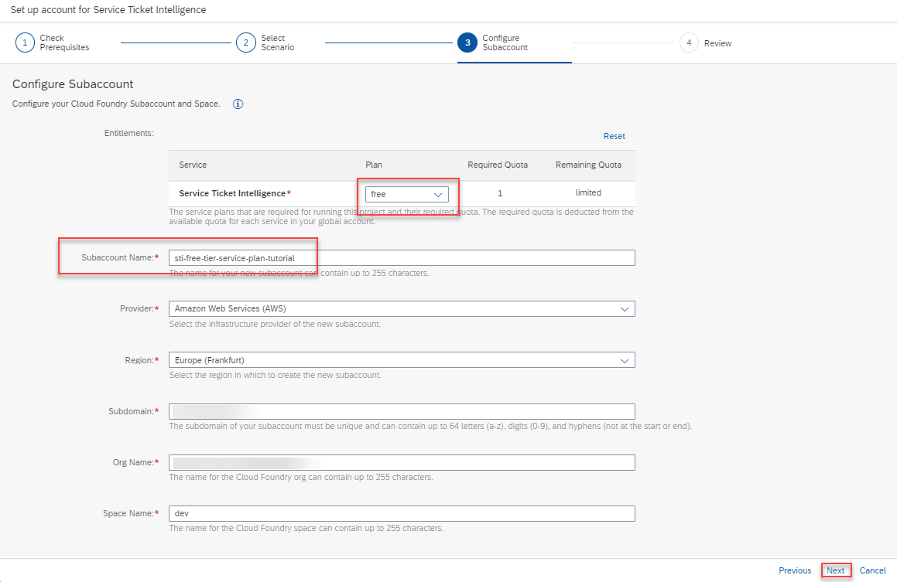

    >You can also perform this tutorial series using the `blocks_of_100` service plan. For that, choose the `blocks_of_100` plan in this step (instead of free). For more information on the service plans available for Service Ticket Intelligence, see [Service Plans](https://help.sap.com/docs/SERVICE_TICKET_INTELLIGENCE/934ccff77ddb4fa2bf268a0085984db0/12e4b770e0d741a3911a5b196bf383f8.html).

7. Click **Finish**.

    <!-- border -->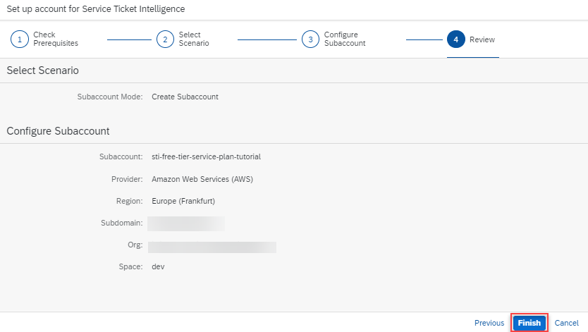

    Follow the progress of the booster automated tasks.

    <!-- border -->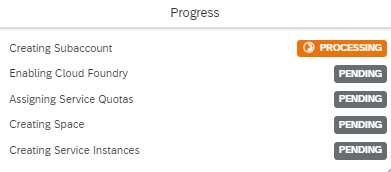

    When the automated tasks are done, see the **Success** dialog box.

    <!-- border -->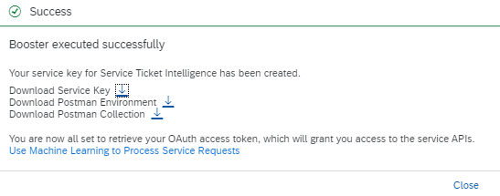

### Download Postman sample files

Download Postman environment and collection sample files. Make a local copy of the files.

<!-- border -->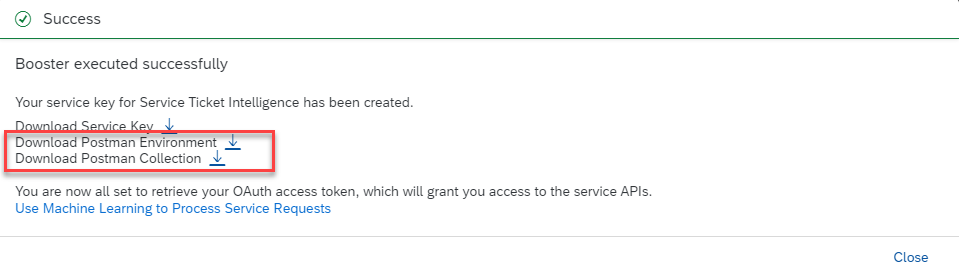

>If you face any issue with the booster **Set up account for Service Ticket Intelligence**, you can alternatively follow the steps in [Use Free Tier to Create a Service Instance for Service Ticket Intelligence](cp-aibus-sti-free-service-instance) to manually create the service instance and service key for Service Ticket Intelligence using the free tier service plan, and download and edit the Postman environment and collection sample files, as described in [Set Up Postman to Call Service Ticket Intelligence APIs](cp-aibus-sti-setup-postman).

Congratulations, you have completed this tutorial. You are now all set to [Install Postman REST Client](api-tools-postman-install) and [Set Up Postman to Call Service Ticket Intelligence APIs](cp-aibus-sti-setup-postman).

