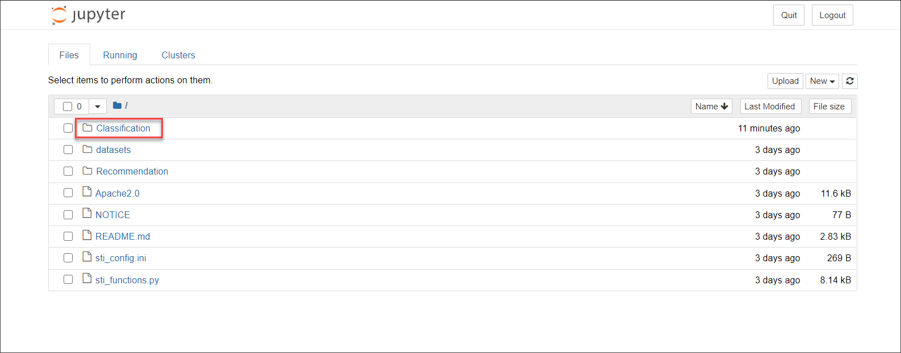
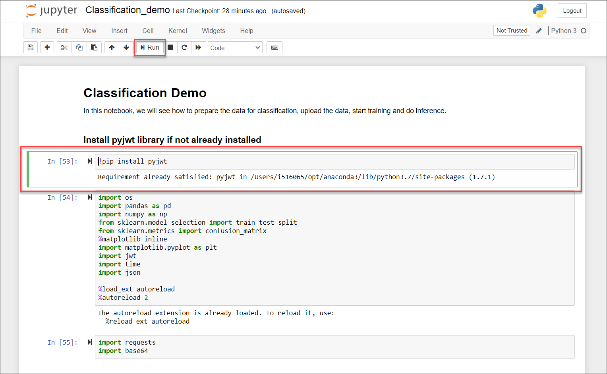

## Details
### You will learn
  - How to analyze datasets and upload the training data
  - How to train a machine learning model to classify service requests
  - How to classify service requests into categories
  - How to evaluate the performance of your machine learning model

Service Ticket Intelligence provides machine learning functionalities to effectively deal with service requests. Thereby, the service offers three main functionalities:

1. The service is able to analyze the unstructured information in service requests and classify the requests into categories.

2. The service is able to recommend solutions for service requests based on historical data.

3. The service is able to identify in unstructured data trends or patterns in service tickets from the clusters and keywords you have created.

This tutorial deals with classifying service requests. Find more details on the Service Ticket Intelligence features [here](https://help.sap.com/docs/SERVICE_TICKET_INTELLIGENCE/934ccff77ddb4fa2bf268a0085984db0/2f0e49ac91c24d54acb694d967e0cfc0.html).

---

[ACCORDION-BEGIN [Step 1: ](Open the Jupyter notebook)]

First, start your local Jupyter server.

The first page that you see shows the content of the repository that you cloned from GitHub in [Set Up Jupyter Notebook for Service Ticket Intelligence](cp-aibus-sti-jupyter-setup), including the notebooks, datasets and configuration file that you edited in the previous tutorial. To open the notebook for classification, click **Classification** to navigate into the folder.

Next, click **Classification_demo.ipynb** to open the notebook. You can recognize Jupyter notebooks by their `.ipynb` file extension.

[DONE]
[ACCORDION-END]

[ACCORDION-BEGIN [Step 2: ](What is a Jupyter notebook)]

Jupyter Notebooks are interactive playgrounds to code and are often used in data science to explore datasets.

Notebooks contain a number of cells in a sequence whereas each cell mainly contains text or code but can also output diagrams and graphics. If cells contain code they can be executed.

The numbers in front of a cell tell the number of executed cells in this notebook. While the cell is being executed a `*` is printed instead of a number so you can tell if the operation is still running or already finished.

Once you click into a cell, it is marked with a border so you can tell at which position in the notebook you are.

A cell can be executed by clicking the play button at the top. If you execute code then there will be additional output printed below the cell.

[DONE]
[ACCORDION-END]

[ACCORDION-BEGIN [Step 3: ](Run the tutorial)]

As mentioned above, a notebook can also contain text. We made sure that there are sufficient explanations for every step in the notebook.

Go through the notebook by executing the cells and reading the explanations that are given. Come back here to complete the tutorial and test your understanding.

[DONE]
[ACCORDION-END]

[ACCORDION-BEGIN [Step 4: ](Test yourself)]

[VALIDATE_1]
[ACCORDION-END]

---
