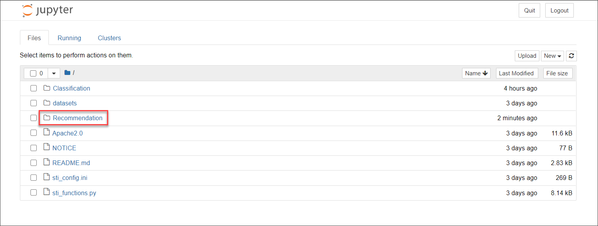
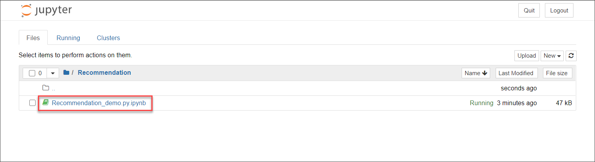
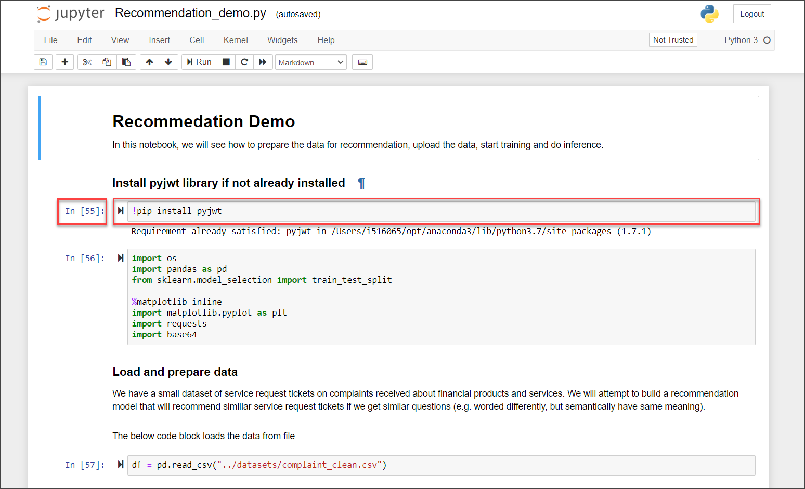
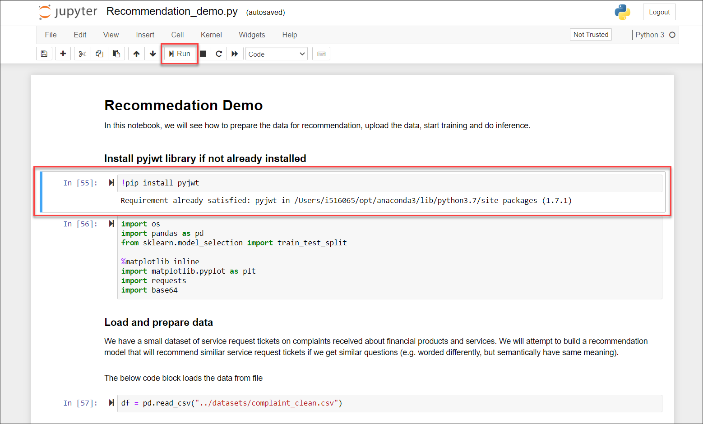

## Details
### You will learn
  - How to upload the training data
  - How to train a machine learning model based on historical service requests
  - How to recommend solutions for an incoming service request
  - How to evaluate the performance of your machine learning model

  Service Ticket Intelligence provides machine learning functionalities to effectively deal with service requests. Thereby, the service offers two main functionalities:

  1. The service is able to analyze the unstructured information in service requests and classify the requests into categories.

  2. The service is able to recommend solutions for service requests based on historical data.

  The following tutorial deals with retrieving recommendations for service requests. Find more details on the Service Ticket Intelligence concepts [here](https://help.sap.com/viewer/934ccff77ddb4fa2bf268a0085984db0/SHIP/en-US/c8e6afbe13f74d53ab1ecc221d8a92be.html).

---

[ACCORDION-BEGIN [Step 1: ](Open the Jupyter notebook)]

First, start your local Jupyter server. Review step 4 of [Set Up Jupyter Notebook for Service Ticket Intelligence](cp-aibus-sti-jupyter-setup) to see how to do it.

The first page that you see shows the content of the repository that you cloned from GitHub, including the notebooks, datasets and configuration file that you edited in the previous tutorial. To open the notebook for classification, click **Recommendation** to navigate into the folder.

Next, click **Recommendation_demo.ipynb** to open the notebook. You can recognize Jupyter notebooks by their `.ipynb` file extension. 

[DONE]
[ACCORDION-END]

[ACCORDION-BEGIN [Step 2: ](What is a Jupyter notebook)]

Jupyter Notebooks are interactive playgrounds to code and are often used in data science to explore datasets.

Notebooks contain a number of cells in a sequence whereas each cell mainly contains text or code but can also output diagrams and graphics. If cells contain code they can be executed.

The numbers in front of a cell tell the number of executed cells in this notebook. While the cell is being executed a `*` is printed instead of a number so you can tell if the operation is still running or already finished.

Once you click into a cell, it is marked with a border so you can tell at which position in the notebook you are.

A cell can be executed by clicking the play button at the top. If you execute code then there will be additional output printed below the cell.

[DONE]
[ACCORDION-END]

[ACCORDION-BEGIN [Step 3: ](Run the tutorial)]

As mentioned above, a notebook can also contain text. We made sure that there are sufficient explanations for every step in the notebook.

Go through the notebook by executing the cells and reading the explanations that are given. Come back here to complete the tutorial and test your understanding.

[DONE]
[ACCORDION-END]

[ACCORDION-BEGIN [Step 4: ](Test yourself)]

[VALIDATE_1]
[ACCORDION-END]

---
