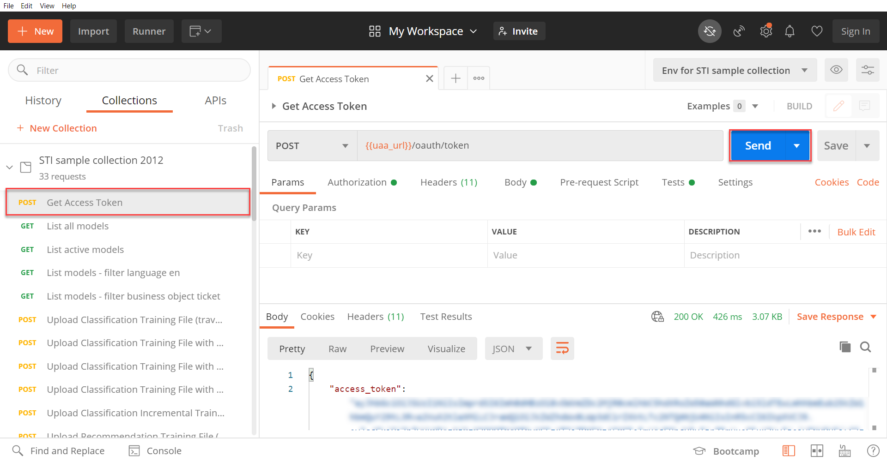

## Details
### You will learn
  - How to authorize your client to communicate with your Service Ticket Intelligence service instance
  - How to upload training data and train a machine learning model to classify service requests
  - How to classify service requests into categories

Service Ticket Intelligence provides machine learning functionalities to effectively deal with service requests. Thereby, the service offers two main functionalities:

  1. The service is able to analyze the unstructured information in service requests and classify the requests into categories.

  2. The service is able to recommend solutions for service requests based on historical data.

Find more details on the Service Ticket Intelligence concepts [here](https://help.sap.com/viewer/934ccff77ddb4fa2bf268a0085984db0/SHIP/en-US/c8e6afbe13f74d53ab1ecc221d8a92be.html).

---

[ACCORDION-BEGIN [Step 1: ](Get an access token)]

First, you need to retrieve an OAuth access token which will grant you access to the Service Ticket Intelligence APIs and allows you to communicate with your service instance. This access token is added to all your service instance requests.

**Open** Postman and make sure that the `Env for STI sample collection 2012` environment is selected. For detailed steps, see [Set Up Postman Environment and Collection to Call Service Ticket Intelligence APIs](cp-aibus-sti-setup-postman).

On the left, expand the `STI sample collection 2012`. Select the request, `Get Access Token`.

Click **Send** to send the request to your service instance. 

The response includes your `access_token` that is valid for 1799 seconds (30 minutes). After that time, you will need to generate a new one using once again the `Get Access Token` request. There is no need to copy the access token as the collection automatically adds the token to all requests.

If you send a request and receive a response, as in the image below, with a status of `401 Unauthorized`, your access token has expired. In this case please redo this step in order to get a new access token.

[DONE]
[ACCORDION-END]

[ACCORDION-BEGIN [Step 2: ](Upload training data)]

Now, you can upload data that will be used to train a machine learning model. The training data contains historical service requests that the model can use to learn from. The dataset contains travel-related data and has the following three possible categories: `Complaint`, `Compliment` and `Request`.

Select the request `Upload Classification Training File (travel data - small)`. The training data is already included in the `Body` of the request. If you would like to use your own set of training data, please ensure that the data is in CSV file format and encoded in Base64. Click **Send** to upload the training data.

The service now automatically creates a new model and sets its status to `NEW`. That indicates that the model was just created and has not been trained yet. Both the ID of the new model, as well as its status, can be found in the response of the request.

[DONE]
[ACCORDION-END]

[ACCORDION-BEGIN [Step 3: ](Train model)]

Next, you can start training the model based on the data that was uploaded in the previous step.

Therefore, select the request `Start model training` and click **Send**. This will trigger the model training process.

To observe the current status of your model, select the request `Get model status` and click **Send**.

The response of the request includes all the details of your model along with its current status. When training is triggered, the status is `PENDING_TRAINING` which indicates that the model is queued for training. Once training has started, the status changes to `IN_TRAINING`. When training is done, the status changes to `READY`. Make sure to send the request `Get model status` every couple of minutes until training is completed. Training time varies depending on data size and infrastructure resource utilizations. In this example, it should take approximately 10 to 20 minutes to complete.

[DONE]
[ACCORDION-END]

[ACCORDION-BEGIN [Step 4: ](Activate model)]

To actually classify new service requests using the trained machine learning model, it is necessary to activate (deploy) the model.

Select the request `Activate model` and click **Send**. This will start the activation process of the model.

Use the request `Get model status` from the previous step again to observe the process. Once the status of the model changes to `ACTIVE`, the model is ready and activated.

[VALIDATE_1]
[ACCORDION-END]

[ACCORDION-BEGIN [Step 5: ](Classify requests)]

Finally, the model can be used to classify requests.

Select the request `Classify single message (without options)`. Open the `Body` tab to see the service request message that will be sent to the service. Feel free to change the message to whatever you like. Click **Send** to classify the request.

The response of the request includes the predicted category which, for this training data, can be `Complaint`, `Compliment` and `Request`. In this example, the predicted category is `Complaint`. The prediction is made with a probability indicated by the **confidence** field which represents how certain a model is about its prediction across all other categories. A confidence of 1 means that the model is 100% sure of its prediction. The training dataset used in this Postman collection is kept small and lightweight, so that the training process can complete within 10-15 minutes. Because of that, expect an impact on prediction performance (confidence score).  

Feel free to try different service request messages in the `Body` tab and find out which category the service predicts.

You can also try out the other `POST /Classify` requests.

!

You have now successfully used Service Ticket Intelligence to classify new service requests.

[DONE]
[ACCORDION-END]
