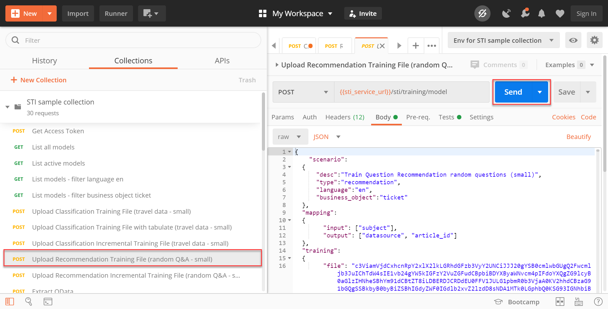
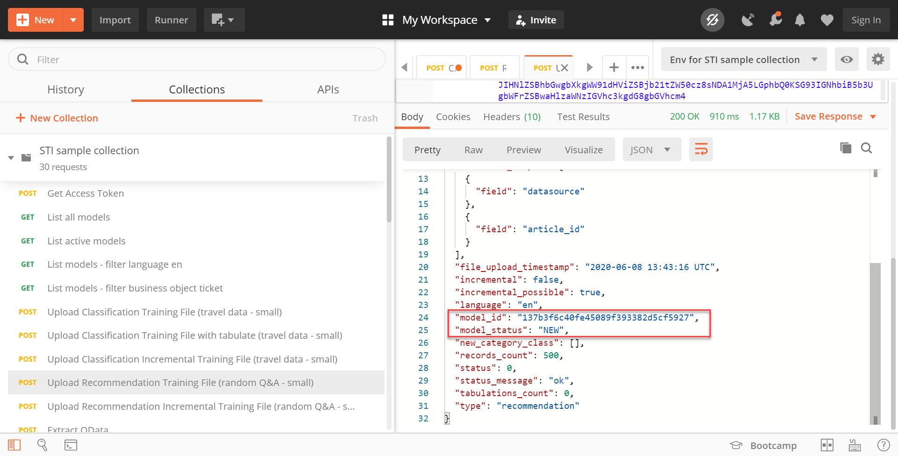
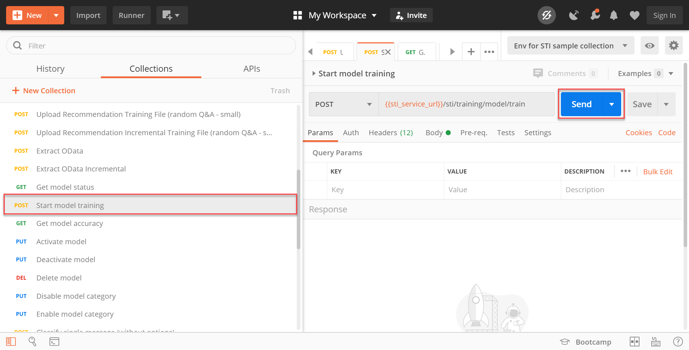
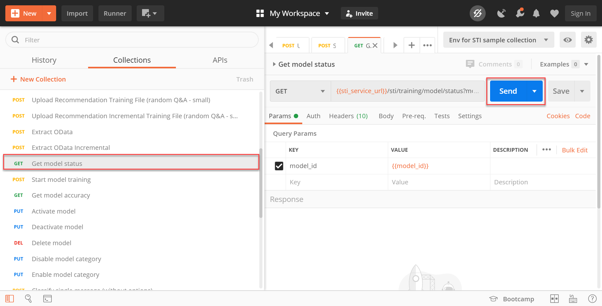
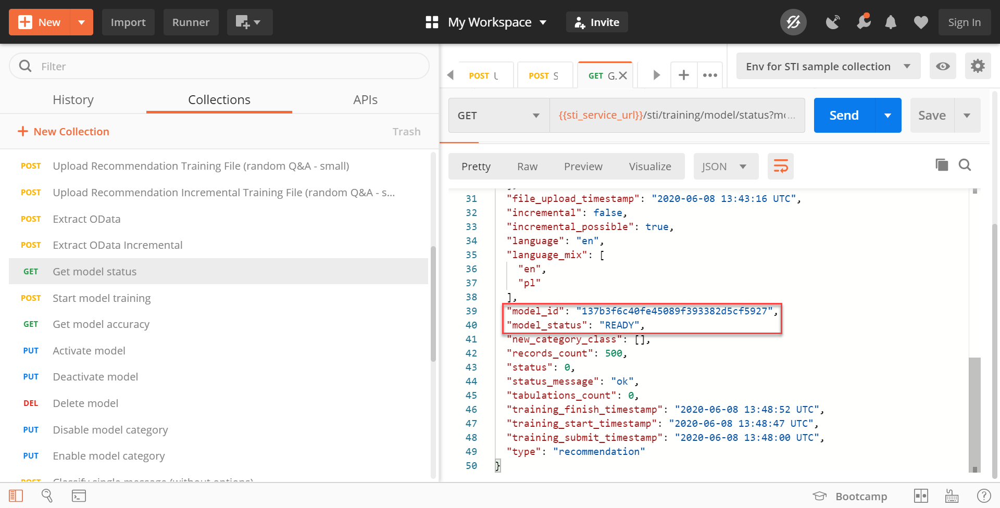
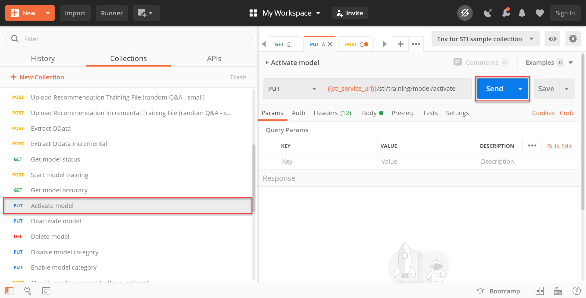
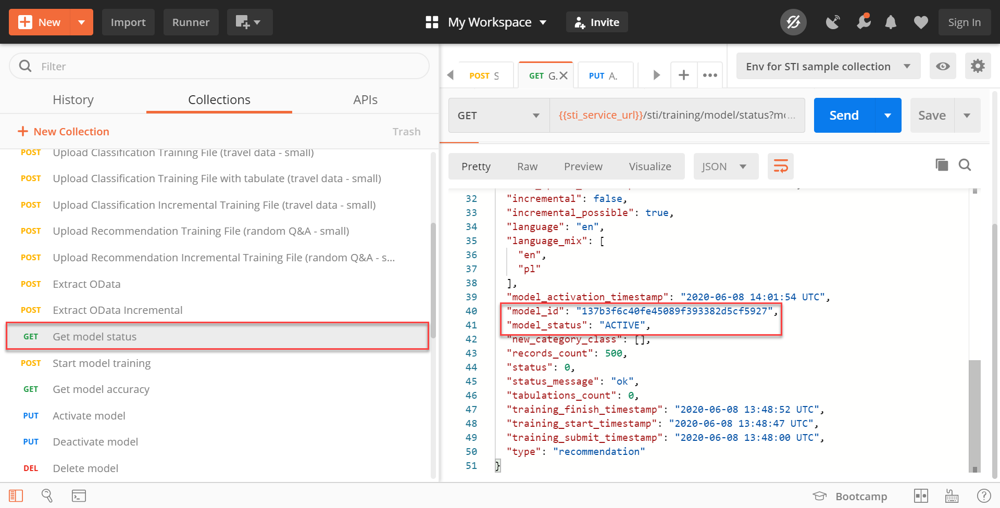
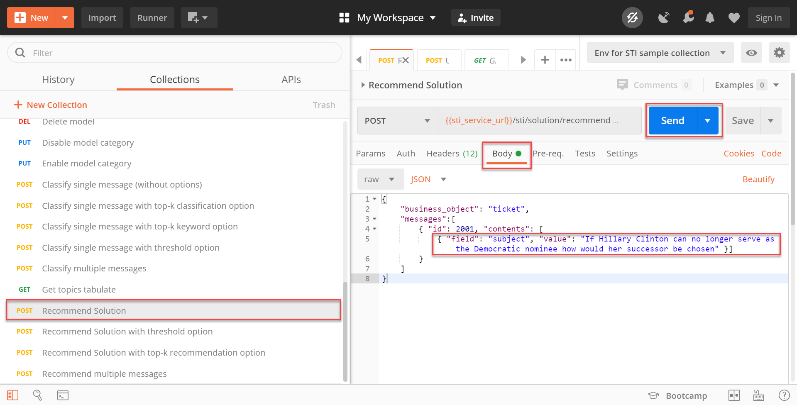
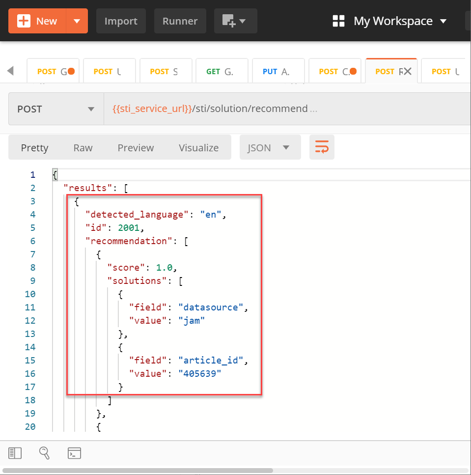
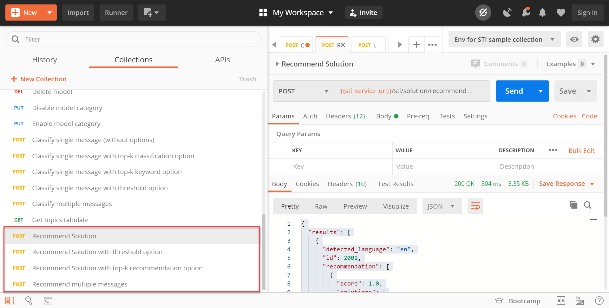

## Details
### You will learn
  - How to upload training data and train a machine learning model to get solution recommendations for new service requests.
  - How to get solution recommendations for new service requests.

Service Ticket Intelligence provides machine learning functionalities to effectively deal with service requests. Thereby, the service offers two main functionalities:

  1. The service is able to analyze the unstructured information in service requests and classify the requests into categories.

  2. The service is able to recommend solutions for service requests based on historical data.

Find more details on the Service Ticket Intelligence concepts [here](https://help.sap.com/viewer/934ccff77ddb4fa2bf268a0085984db0/SHIP/en-US/c8e6afbe13f74d53ab1ecc221d8a92be.html).

---

[ACCORDION-BEGIN [Step 1: ](Upload training data)]

Select the request `Upload Recommendation Training File (random Q&A - small)`. The training data is already included in the `Body` of the request. Click **Send** to upload the training data. The dataset contains question-article related data and has the following information: `subject`, `datasource` and `article_id`. If you would like to use your own set of training data, please ensure that the data is in CSV file format and encoded in Base64.

!

The service now automatically creates a new model and sets its status to `NEW`. That indicates that the model was just created and has not been trained yet. Both the ID of the new model, as well as its status, can be found in the response of the request.

!

[DONE]
[ACCORDION-END]


[ACCORDION-BEGIN [Step 2: ](Train model)]

Next, you can start training the model based on the data that was uploaded in the previous step. 

Therefore, select the request `Start model training` and click **Send**. This will trigger the model training process.

!

To observe the current status of your model, select the request `Get model status` and click **Send**.

!

The response of the request includes all the details of your model along with its current status. When training is triggered, the status is `PENDING_TRAINING` which indicates that the model is queued for training. Once training has started, the status changes to `IN_TRAINING`. When training is done, the status changes to `READY`. Make sure to send the request `Get model status` every couple of minutes until training is completed. Training time varies depending on data size and infrastructure resource utilizations. In this example, it should take approximately 10 to 20 minutes to complete.

!

[DONE]
[ACCORDION-END]


[ACCORDION-BEGIN [Step 3: ](Activate model)]

To actually get solution recommendations for new service requests using the trained machine learning model, it is necessary to activate (deploy) the model.

Select the request `Activate model` and click **Send**. This will start the activation process of the model.

!

Use the request `Get model status` from the previous step again to observe the process. The model status will change from `READY` to `LOADING` as the model is being loaded and deployed. This process may take up to 15 minutes on the first activation of your subaccount. Once the status of the model changes to `ACTIVE`, the model is ready and activated.

!

[VALIDATE_1]
[ACCORDION-END]


[ACCORDION-BEGIN [Step 4: ](Get solution recommendations)]

Finally, the model can be used to get solution recommendations for new service requests.

Select the request `Recommend Solution`. Open the `Body` tab to see the service request message that will be sent to the service. Click **Send** to get solution recommendations for this service request. The prediction results contain similar historical article recommendations and the details `datasource` and `article_id`. You can map `article_id` back to the content of the historical data that you have parsed in for the training process.

The request and response look as follows:

!

!

This is the full prediction:

```JSON
{
   "results": [
      {
         "detected_language": "en",
         "id": 2001,
         "recommendation": [
            {
               "score": 1.0,
               "solutions": [
                  {
                     "field": "datasource",
                     "value": "jam"
                  },
                  {
                     "field": "article_id",
                     "value": "405639"
                  }
               ]
            },
            {
               "score": 1.0,
               "solutions": [
                  {
                     "field": "datasource",
                     "value": "jam"
                  },
                  {
                     "field": "article_id",
                     "value": "405352"
                  }
               ]
            },
            {
               "score": 1.0,
               "solutions": [
                  {
                     "field": "datasource",
                     "value": "mindtouch"
                  },
                  {
                     "field": "article_id",
                     "value": "406961"
                  }
               ]
            },
            {
               "score": 1.0,
               "solutions": [
                  {
                     "field": "datasource",
                     "value": "mindtouch"
                  },
                  {
                     "field": "article_id",
                     "value": "405980"
                  }
               ]
            },
            {
               "score": 1.0,
               "solutions":[
                  {
                     "field": "datasource",
                     "value": "jam"
                  },
                  {
                     "field": "article_id",
                     "value": "407027"
                  }
               ]
            },
            {
               "score": 0.5,
               "solutions": [
                  {
                     "field": "datasource",
                     "value": "jam"
                  },
                  {
                     "field": "article_id",
                     "value": "406000"
                  }
               ]
            },
            {
               "score": 0.5,
               "solutions":[
                  {
                     "field": "datasource",
                     "value": "mindtouch"
                  },
                  {
                     "field": "article_id",
                     "value": "405727"
                  }
               ]
            },
            {
               "score": 0.5,
               "solutions": [
                  {
                     "field": "datasource",
                     "value": "jam"
                  },
                  {
                     "field": "article_id",
                     "value": "407386"
                  }
               ]
            },
            {
               "score": 0.5,
               "solutions": [
                  {
                     "field": "datasource",
                     "value": "jam"
                  },
                  {
                     "field": "article_id",
                     "value": "407725"
                  }
               ]
            },
            {
               "score": 0.5,
               "solutions": [
                  {
                     "field": "datasource",
                     "value": "jam"
                  },
                  {
                     "field": "article_id",
                     "value": "405552"
                  }
               ]
            }
         ],
         "status": 0,
         "status_message": "ok"
      }
   ]
}    
```

You can also try out the other `POST /Recommend` requests.

!

You have now successfully used Service Ticket Intelligence to get solution recommendations for new service requests.

[DONE]
[ACCORDION-END]
