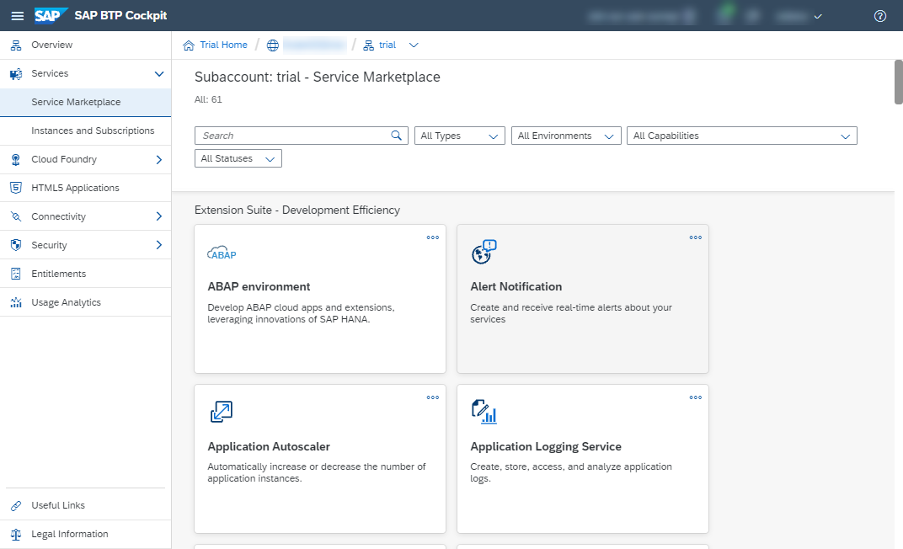
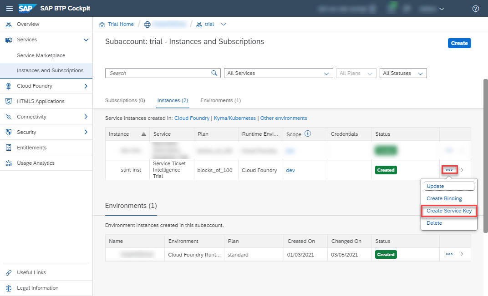
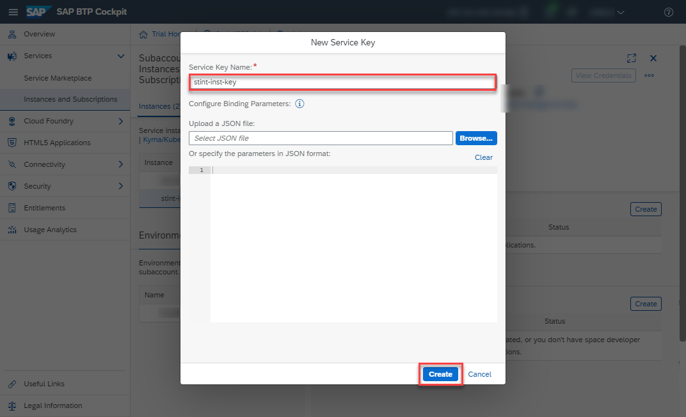

## Details
### You will learn
  - How to check your Service Ticket Intelligence entitlements
  - How to create a service instance of Service Ticket Intelligence
  - How to create service keys for your service instance

---

[ACCORDION-BEGIN [Step 1: ](Enter your trial account)]

1. In your web browser, open the [SAP Cloud Platform trial cockpit](https://cockpit.hanatrial.ondemand.com/).

2. Navigate to the trial global account by clicking **Enter Your Trial Account**.

    !

    >Service Ticket Intelligence is only available in the Europe (Frankfurt) region. Follow the steps described in [Get a Free Trial Account on SAP Cloud Platform](hcp-create-trial-account) and choose the Europe (Frankfurt) region. If this is not possible, create a new subaccount in the Europe (Frankfurt) region. You should then be able to find **Service Ticket Intelligence Trial** in your new subaccount **Entitlements**.

    >If this is your first time accessing your trial account, you'll have to configure your account by choosing a region. Your user profile will be set up for you automatically.

    >Wait till your account is set up and ready to go. Your global account, your subaccount, your organization, and your space are launched. This may take a couple of minutes.

    >Choose **Continue**.

    >!

3. From your global account page, choose the `trial` tile to access your subaccount.

    !

[DONE]
[ACCORDION-END]

[ACCORDION-BEGIN [Step 2: ](Check entitlements)]

To try out Service Ticket Intelligence, you need to make sure that your account is properly configured.

On the navigation sidebar, click **Entitlements** to see a list of all eligible services. You are entitled to use every service in this list according to the assigned service plan.

Search for **Service Ticket Intelligence Trial**. If you find the service in the list, you are entitled to use it. Now you can set this step to **Done** and proceed with step 3.

If you do not find the service in your list, proceed as follows:

  1. Click **Configure Entitlements**.

    

  2. Click **Add Service Plans** to add service plans to your entitlements.

    

  3. Select **Service Ticket Intelligence Trial**, and choose the **standard** service plan. Click **Add 1 Service Plan**.

    

  4. **Save** your entitlement changes.

        

You are now entitled to use the service and to create instances of the service.

[DONE]
[ACCORDION-END]

[ACCORDION-BEGIN [Step 3: ](Access space)]

All applications and services live in spaces. By default, trial accounts only have the **dev** space available.

To access your spaces, click **Spaces** on the navigation sidebar and select the **dev** space to open it.

In this space you will create your service instance.

[DONE]
[ACCORDION-END]

[ACCORDION-BEGIN [Step 4: ](Access service via Service Marketplace)]

The **Service Marketplace** is where you find the available services on SAP Cloud Platform.

To access it, click **Service Marketplace** on the navigation sidebar.

Next, search for **Service Ticket Intelligence**. Click the tile named `service-ticket-intelligence-trial` to access the service.

[DONE]
[ACCORDION-END]

[ACCORDION-BEGIN [Step 5: ](Create service instance)]

You will now create an instance of your service.

To create an instance, click **Instances** on the navigation sidebar.

Next, click **New Instance** to start the creation dialog.

  1. In the dialog, leave the default value for the service plan and click **Next**.

    

  2. Leave the parameters empty and click **Next**.

  3. Do not assign any application and click **Next**.

  4. Finally, enter the name `sti-demo` for your new instance. Click **Finish** to create the instance.

    

You have successfully created a service instance for Service Ticket Intelligence.

[DONE]
[ACCORDION-END]

[ACCORDION-BEGIN [Step 6: ](Create service keys)]

You are now able to create service keys for your new service instance. Service keys are used to generate credentials to enable apps to access and communicate with the service instance.

To create service keys, first access your service instance by clicking its name.

Now, select **Service Keys** on the navigation sidebar, and click **Create Service Key** to start the creation dialog.

In the dialog, enter the name **`sti-demo-key`** for your service keys. Leave empty the **Configuration Parameters (JSON)** box.

 Click **Save** to create the service keys.

You have successfully created service keys for your service instance. Make a local copy of the service keys. You will need the service keys values in [Set Up Postman Environment and Collection to Call Service Ticket Intelligence APIs](cp-aibus-sti-setup-postman).

[VALIDATE_1]
[ACCORDION-END]

[ACCORDION-BEGIN [Step 7: ](List service instances)]

To list and access your service instances, there is no need to access the service via the Service Marketplace every time. In your **Space**, you can see a list of all your service instances.

**Go back** to your **dev** space using the breadcrumbs at the top of the page.

As you navigate through the SAP Cloud Platform Cockpit and dig into more detail, the breadcrumbs at the top of the page show you the hierarchy of your navigation. You can use them to go back to previous steps.

Back in your space, click **Service Instances** on the navigation sidebar.

The list shows all your service instances across all services, including the service instance you have just created. You find here information on the service plan, referencing applications, created service keys and the current status of your instances. From here, you can manage your service instances, access or delete them, for example.

[DONE]
[ACCORDION-END]
