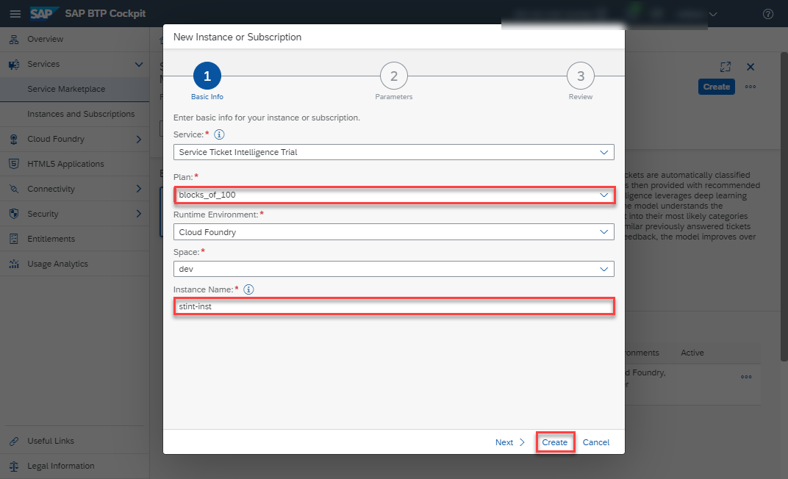
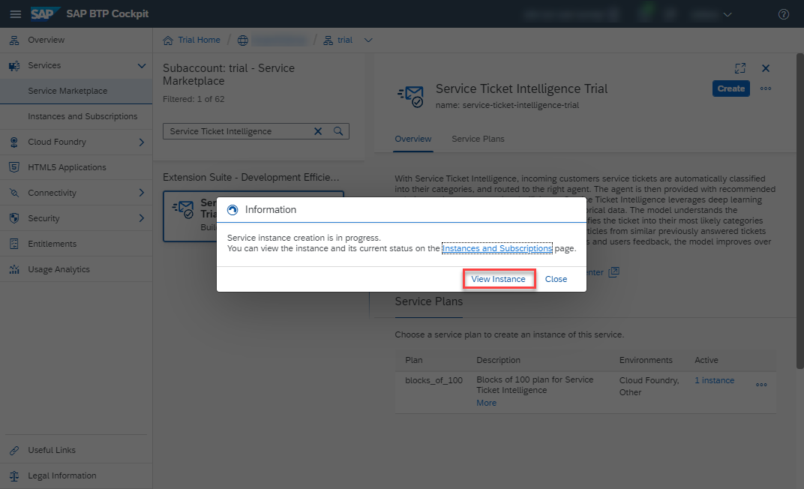
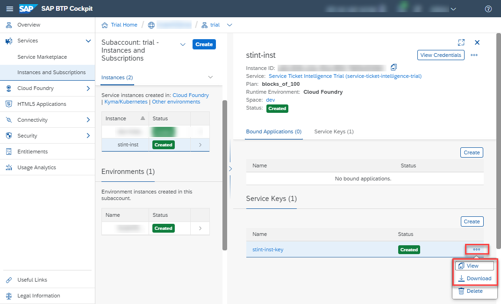

## Prerequisites
- You have created a trial account on SAP BTP: [Get a Free Account on SAP BTP Trial](hcp-create-trial-account)
- You have a subaccount and dev space with **Europe (Frankfurt)** as region: [Manage Entitlements on SAP BTP Trial](cp-trial-entitlements). See also [Create a Subaccount](https://help.sap.com/viewer/65de2977205c403bbc107264b8eccf4b/Cloud/en-US/261ba9ca868f469baf64c22257324a75.html).

## Details
### You will learn
  - How to check your Service Ticket Intelligence entitlements
  - How to create a service instance of Service Ticket Intelligence
  - How to create a service key for your service instance
---

[ACCORDION-BEGIN [Step 1: ](Enter your trial account)]

1. In your web browser, open the [SAP BTP Trial cockpit](https://cockpit.hanatrial.ondemand.com/).

2. Navigate to the trial global account by clicking **Enter Your Trial Account**.

    !

    >If this is your first time accessing your trial account, you'll have to configure your account by choosing a region. **Please select Europe (Frankfurt)**. Your user profile will be set up for you automatically.

    >Wait till your account is set up and ready to go. Your global account, your subaccount, your organization, and your space are launched. This may take a couple of minutes.

    >Choose **Continue**.

    >!

3. From your global account page, choose the `trial` tile to access your subaccount.

    !

[DONE]
[ACCORDION-END]

[ACCORDION-BEGIN [Step 2: ](Check entitlements)]

To try out Service Ticket Intelligence, you need to make sure that your account is properly configured.

1. On the navigation sidebar, click **Entitlements** to see a list of all eligible services. You are entitled to use every service in this list according to the assigned service plan.

2. Search for **Service Ticket Intelligence Trial**. ***If you find the service in the list, you are entitled to use it. Now you can set this step to **Done** and proceed with Step 3.***

    

***ONLY if you DO NOT find the service in your list, proceed as follows:***

  1. Click **Configure Entitlements**.

    

  2. Click **Add Service Plans** to add service plans to your entitlements.

    

  3. Select **Service Ticket Intelligence Trial**, and choose the **standard** service plan. Click **Add 1 Service Plan**.

    

  4. **Save** your entitlement changes.

        

You are now entitled to use the service and to create instances of the service.

>For more details on how to configure entitlements, quotas, subaccounts and service plans on SAP BTP Trial, see [Manage Entitlements on SAP BTP Trial](cp-trial-entitlements).

[DONE]
[ACCORDION-END]

[ACCORDION-BEGIN [Step 3: ](Access space)]

All applications and services live in spaces. By default, trial accounts only have the **dev** space available.

To access your spaces, click **Spaces** on the navigation sidebar and select the **dev** space to open it.

In this space you will create your service instance.

[DONE]
[ACCORDION-END]

[ACCORDION-BEGIN [Step 4: ](Access service via Service Marketplace)]

The **Service Marketplace** is where you find the available services on SAP BTP.

To access it, click **Service Marketplace** on the navigation sidebar.

Next, search for **Service Ticket Intelligence**. Click the tile named `service-ticket-intelligence-trial` to access the service.

[DONE]
[ACCORDION-END]

[ACCORDION-BEGIN [Step 5: ](Create service instance)]

You will now create an instance of your service.

Click **Create Instance** to start the creation dialog.

In the dialog, leave the default value for the service and the service plan. Enter a name for your new instance as `sti-demo` and click **Create Instance** to skip the other steps and create the instance.

In the following dialog, click on **View Instance** to be navigated to the list of your service instances.

You have successfully created a service instance for Service Ticket Intelligence.

[DONE]
[ACCORDION-END]

[ACCORDION-BEGIN [Step 6: ](Create service key)]

You are now able to create a service key for your new service instance. Service keys are used to generate credentials to enable apps to access and communicate with the service instance.

  1. Click the navigation arrow to open the details of your service instance. Then, click the dots to open the menu and select **Create Service Key**.

      

  2. In the dialog, enter `sti-demo-key` as the name of your service key. Click **Create** to create the service key.

      

You have successfully created a service key for your service instance. You can now either view the service key in the browser or download it.

You will need the service key values in [Set Up Postman Environment and Collection to Call Service Ticket Intelligence APIs](cp-aibus-sti-setup-postman).

[VALIDATE_1]
[ACCORDION-END]
