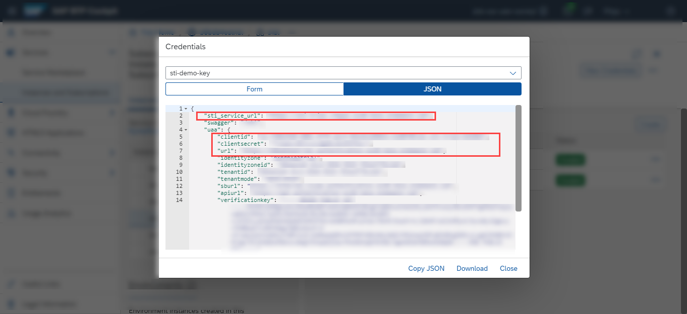

## Details
### You will learn
  - What Postman environments and collections are and how to use them
  - How to adjust the Postman environment for your service instance
  - How to import Postman environments and collections

In the following tutorials, Postman is used to communicate and interact with your Service Ticket Intelligence service instance. Postman is an API client you use to call APIs. For more information, see [Postman](https://learning.getpostman.com/).

---

[ACCORDION-BEGIN [Step 1: ](Download locally Postman environment)]

If you have downloaded locally the Postman environment and collection sample files from the **Set up account for Service Ticket Intelligence** booster, as detailed in [Set Up Account for Service Ticket Intelligence and Download Postman Sample Files](cp-aibus-sti-booster-postman), you can set steps 1 and 2 to **Done** and proceed with Step 3.

Postman offers the option to add environments. Environments represent key-value pairs which can be reused in requests, so you don't have to remember them. For more information, see [Postman Environments](https://learning.getpostman.com/docs/postman/environments-and-globals/intro-to-environments-and-globals/).

In step 5, you are going to use this feature to store your service key details obtained in [Set Up Account for Service Ticket Intelligence and Get Service Key](cp-aibus-sti-booster-key) and reuse them in your requests to your service instance.

Make a local copy of the Postman environment sample file for Service Ticket Intelligence available on GitHub:

1. Open the [environment sample file](https://github.com/SAP-samples/service-ticket-intelligence-postman-collection/blob/main/Env%20for%20STI%20sample%20collection%202012.postman_environment.json).

2. Click **Raw**.

    !

3. Right click and then click ***Save as*** to download locally the JSON file.

    !

[VALIDATE_1]
[ACCORDION-END]

[ACCORDION-BEGIN [Step 2: ](Download locally Postman collection)]

Collections let you group requests together and save them for later use. This helps with the organization of requests as well as sharing requests. For more information, see [Postman Collections](https://learning.getpostman.com/docs/postman/collections/intro-to-collections/).

Make a local copy of the Postman collection sample file for Service Ticket Intelligence available on GitHub:

1. Open the [collection sample file](https://github.com/SAP-samples/service-ticket-intelligence-postman-collection/blob/main/STI%20sample%20collection%202012.postman_collection.json).

2. Click **Raw**.

    !

3. Right click and then click ***Save as*** to download locally the JSON file.

    !

[DONE]
[ACCORDION-END]

[ACCORDION-BEGIN [Step 3: ](Import Postman collection and environment)]

1. **Open** Postman and click **Import** to open the import dialog.

    !

2. Drag and drop the Postman collection and environment JSON files in the import dialog. Click **Import**.

    !

A message appears to inform you about the successful import.

!

After you have imported the collection, it will appear on the left. As previously explained, the folder `STI sample collection 2012` contains requests which you can use to call the Service Ticket Intelligence APIs.

!

You have successfully imported the Postman environment and collection for Service Ticket Intelligence.

[DONE]
[ACCORDION-END]

[ACCORDION-BEGIN [Step 4: ](Select Postman environment)]

`Env for STI sample collection 2012` now shows up in the environment dropdown menu.

!

Select it to be able to use the requests in the collection.

!

[DONE]
[ACCORDION-END]

[ACCORDION-BEGIN [Step 5: ](Edit Postman environment)]

If you are using the Postman environment and collection sample files from the **Set up account for Service Ticket Intelligence** booster, as detailed in [Set Up Account for Service Ticket Intelligence and Download Postman Sample Files](cp-aibus-sti-booster-postman), your service key details have already been entered in the Postman environment sample file. You can set this step to **Done** and proceed with the next tutorial: [Use Service Ticket Intelligence and Postman to Classify Service Requests](cp-aibus-sti-postman-classification).

1. Click **Environment quick look**.

    !

2. Click **Edit**.

    !

    As detailed in the images below, enter the following values from your service key (obtained in [Set Up Account for Service Ticket Intelligence and Get Service Key](cp-aibus-sti-booster-key)) into the corresponding spaces of the **Manage Environments** dialog box:

    |  Service key value                                                | Postman variable
    |  :----------------------------------------------------------------| :--------------------
    |  `url` (inside the `uaa` section of the service key)              | `uaa_url`
    |  `sti_service_url` (outside the `uaa` section of the service key) | `sti_service_url`
    |  `clientid` (inside the `uaa` section of the service key)         | `client_id`
    |  `clientsecret` (inside the `uaa` section of the service key)     | `client_secret`

    !

    !

3. Click **Update**.

    !

4. Click **X**.

    !

Now the Postman environment and collection are ready to be used in the next tutorial: [Use Service Ticket Intelligence and Postman to Classify Service Requests](cp-aibus-sti-postman-classification).

[DONE]
[ACCORDION-END]
