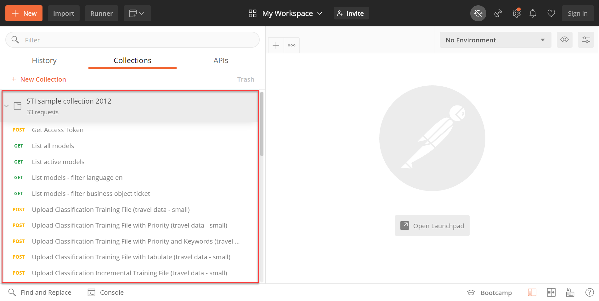
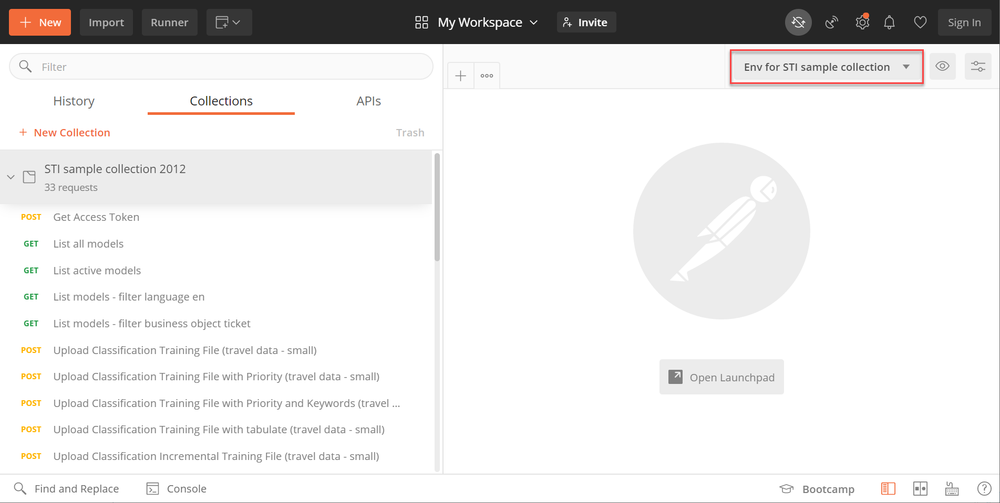

## Details
### You will learn
  - What Postman environments and collections are and how to use them
  - How to adjust the Postman environment for your service instance
  - How to import Postman environments and collections

In the following tutorials Postman is used to communicate and interact with your Service Ticket Intelligence service instance. Postman is an API client you use to call APIs. For more information, see [Postman](https://learning.getpostman.com/).

---

[ACCORDION-BEGIN [Step 1: ](Add service key credentials to Postman environment)]

Postman offers the option to add environments. Environments represent key-value pairs which can be reused in requests, so you don't have to remember them. For more information, see [Postman Environments](https://learning.getpostman.com/docs/postman/environments-and-globals/intro-to-environments-and-globals/).

You can use this feature to store your service key details created in [Create Service Instance for Service Ticket Intelligence](cp-aibus-sti-service-instance) and reuse them in your requests to your service instance.

Make a local copy of the environment template for Service Ticket Intelligence available on GitHub:

1. Open the [environment template](https://github.com/SAP-samples/service-ticket-intelligence-postman-collection-sample/blob/master/Env%20for%20STI%20sample%20collection.postman_environment.json).

2. Click **Raw**.

3. Right click and then click ***Save link as*** to download locally the JSON file.

Open the downloaded JSON file in an editor of your choice. Then, insert the following values from your service key into the corresponding spaces of the template:

|  Service key property                                         | Property in template
|  :----------------------------------------------------------- | :--------------------
|  `url` (inside the `uaa` section of the service key)          | `uaa_url`
|  `url` (outside the `uaa` section of the service key)         | `sti_service_url`

Save the changes in the JSON file.

Now the Postman environment is ready to be used.

[DONE]
[ACCORDION-END]

[ACCORDION-BEGIN [Step 2: ](Import the Postman environment)]

**Open** Postman and click **Import** to open the import dialog.

In the dialog, select the tab **Import File** and then click **Choose Files** to upload your environment file.

>Alternatively, you can select the tab **Paste Raw Text** and paste the text from your environment file directly in the available text area.

After you have imported the environment, a message appears to inform you about the successful import.

Your new environment now shows up in the dropdown menu and can be selected.

You have successfully imported the Postman environment for Service Ticket Intelligence.

[DONE]
[ACCORDION-END]

[ACCORDION-BEGIN [Step 3: ](Import the Postman collection)]

Collections let you group requests together and save them for later use. This helps with the organization of requests as well as sharing requests. For more information, see [Postman Collections](https://learning.getpostman.com/docs/postman/collections/intro-to-collections/).

To get started, make a local copy of the [collection template](https://github.com/SAP-samples/service-ticket-intelligence-postman-collection-sample/blob/master/STI%20sample%20collection.postman_collection.json) for Service Ticket Intelligence available on GitHub. There is no need to adjust anything.

**Import** the collection the same way as you did for the environment in the previous step.

After you have imported the collection, it will appear on the left. As previously explained, the folder `STI sample collection` contains requests which you can use to call the Service Ticket Intelligence APIs.

You have successfully imported the Postman collection for Service Ticket Intelligence.

[DONE]
[ACCORDION-END]

[ACCORDION-BEGIN [Step 4: ](Select the environment)]

Finally, make sure to **select** the `Env for STI sample collection` environment in the dropdown menu. Otherwise you will not be able to use the requests in the collection.

[DONE]
[ACCORDION-END]

[ACCORDION-BEGIN [Step 5: ](Test yourself)]

[VALIDATE_1]
[ACCORDION-END]
