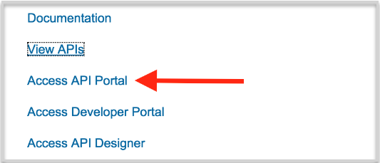
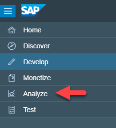
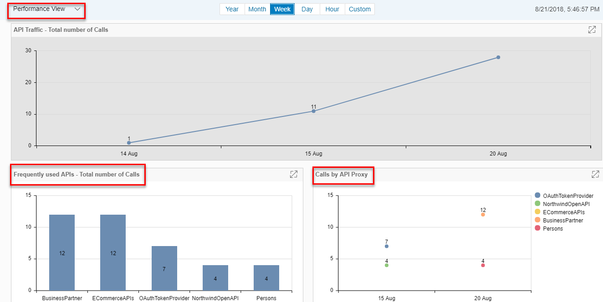
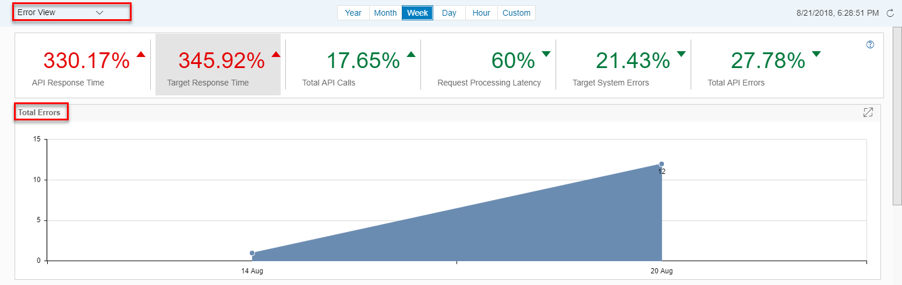
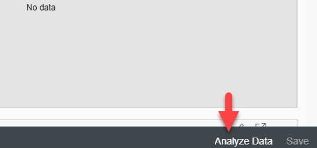
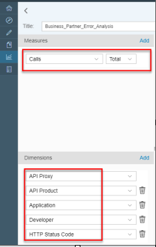
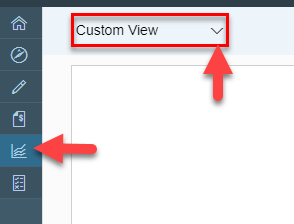
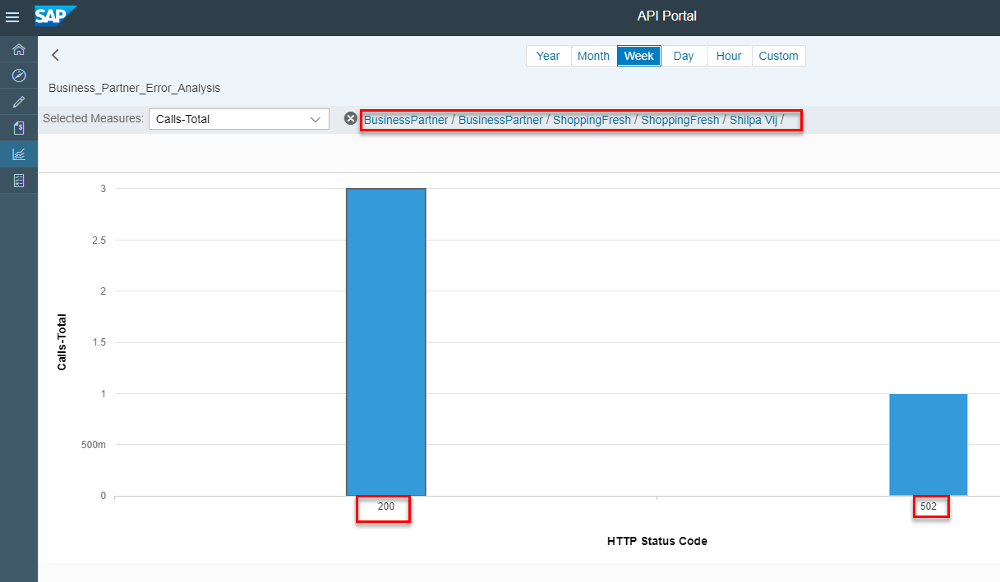

---

title: Monitor and Analyze your APIs
description: In this tutorial, you will learn analytics feature of SAP Cloud Platform API Management to monitor and analyze the APIs. You will also build your own custom views and use the drill down functionality.
auto_validation: true
time: 20
tags: [tutorial>beginner, products>sap-api-management, products>sap-cloud-platform]
primary_tag: products>sap-api-management
---

## Prerequisites
 - **Tutorials:** [Create an API Proxy](https://developers.sap.com/tutorials/hcp-apim-create-api.html)

## Details
### You will learn
  - How to use the analytics feature in API Management.
  - Use drill down functionality.
  - Build the custom analytics views to analyze the problem.

At the end of this tutorial, you will have a custom view that has different measures and dimensions for use cases that are not part of performance and error views. You can also save the custom view for future reference to analyze the error details.

---

[ACCORDION-BEGIN [Step 1: ](Access SAP Cloud Platform API Management API Portal)]
Open the SAP API Management API Portal (you can get the URL from Enable the SAP Cloud Platform, API Management Service.

[DONE]
[ACCORDION-END]

[ACCORDION-BEGIN [Step 2: ](Navigate to Analyse)]

In this step we cover how you can look at the usage information for your APIs, Products and Applications in the API Portal in the list view and the Object detail header.

From the left-hand navigation bar, select Analyze.

[DONE]
[ACCORDION-END]

[ACCORDION-BEGIN [Step 3: ](Analyze Performance of Your APIs)]

By default performance view is selected. Performance view provides  information on the following.

- API Traffic
- API Provider
- Frequently used APIs
- Hits by API proxy
- Frequently used products
- Frequently used applications
- Slowest APIs
- Provider systems response time

[DONE]
[ACCORDION-END]

[ACCORDION-BEGIN [Step 4: ](Analyze Error Prone APIs)]

Select Error View from the drop down. Error View provides information on the following.

- Total errors
- Error-prone APIs
- Provider system errors
- Error-prone applications
- Error by request verb

[VALIDATE_4]
[ACCORDION-END]

[ACCORDION-BEGIN [Step 5: ](Create Custom View)]
Here in the below step, different measures and dimensions of the custom view are covered. How to create a custom view to solve the use cases that are not part of performance and error views. Custom view can also be saved and used for future reference to analyze the error details.

Select Custom View from the drop down.

Click on Analyze Data to create a custom chart.

Give a Title to your custom chart example **Business-Partner-Error-Analysis**

Select Measures and Dimensions as listed below.

**Number** | **Measures**
---- | ----
1 |`Errors`

**Number** | **Dimensions**
---- | ----
1 |`Developer`
2 |`API Product`
3 |`API Proxy`
4 |`Application`
5 |`HTTP Status Code`

Click on Save.

[DONE]
[ACCORDION-END]

[ACCORDION-BEGIN [Step 6: ](Drill Down)]

Double click on your API and then drill down till the Status code.

Click on the created custom chart and drill down till the error code of the API which has caused the error.

[DONE]
[ACCORDION-END]

## You Can Also
- [Monitoring and Analyzing APIs](https://blogs.sap.com/2017/07/04/sap-cloud-platform-api-management-analytics-and-drill-down/)
- Documentation on [Analyze your APIs](https://help.sap.com/viewer/66d066d903c2473f81ec33acfe2ccdb4/Cloud/en-US/7712c611015045afb47d7c244fffee63.html)

---
