## Details
### You will learn
  - How to clone and consume common resource templates

---

[ACCORDION-BEGIN [Step 1: ](Navigate to Common Resources)]
1. Navigate to  Open Connectors home or landing page.

    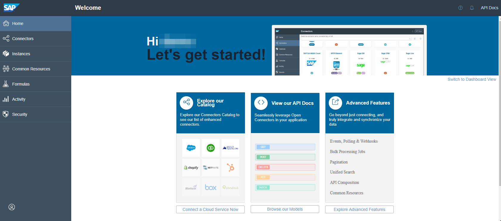

2. Click on the **Common Resources** tab and then select the **Common Resource Templates** tab to view and explore all the pre-shipped common resource templates.

    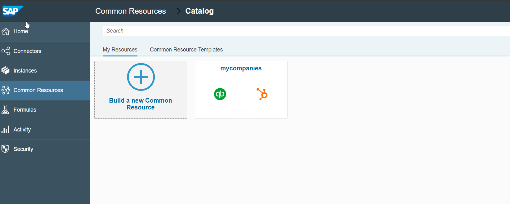

    >The pre-shipped Common Resource Templates are displayed in this tab.

3. Select the `basic-companies` tile.

    >The **My Resources** tab shows details about the exposed fields, field types, description, and list of mapped connectors for the selected templates.

    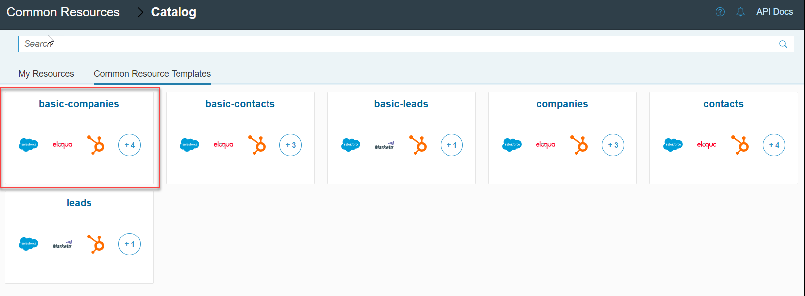

[DONE]
[ACCORDION-END]

[ACCORDION-BEGIN [Step 2: ](Clone Common Resources)]

1. Select the **Mappings** tab to view details about the mapped connectors of the selected common resource template.

    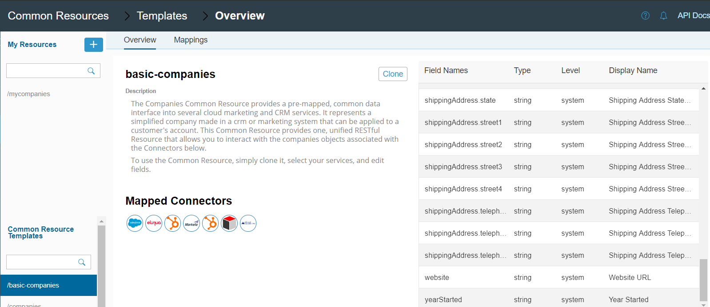

2. Select **Clone** to copy or clone the selected common resource template to your Open Connectors tenant.

    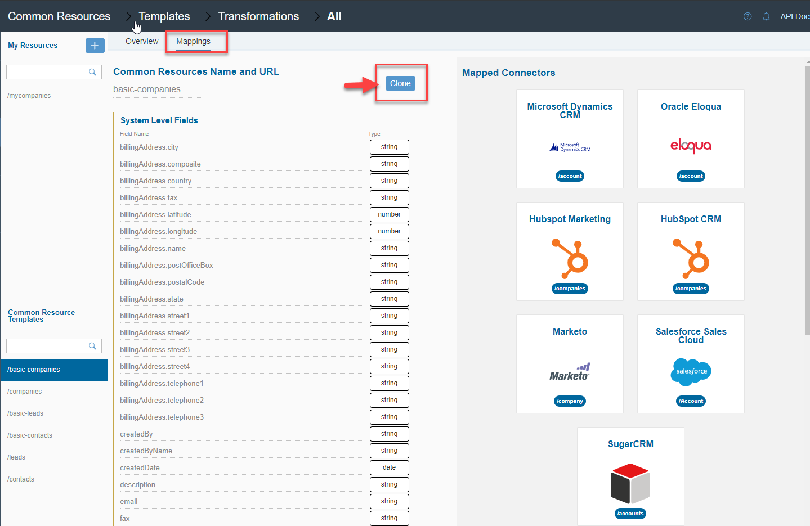

3. In the clone wizard, select the checkbox next to **Connector Name** to select all the connectors and select **Next**.

    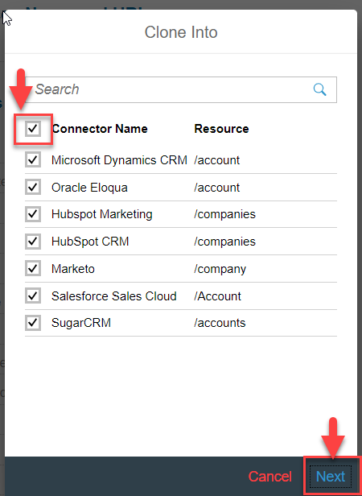

4. Select the **Level > Account** and click **Next**.

    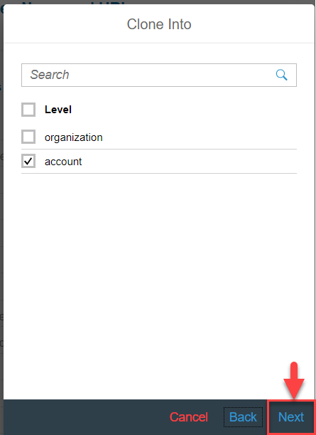

5. Provide a unique name for the cloned common resource and click **Save**.

    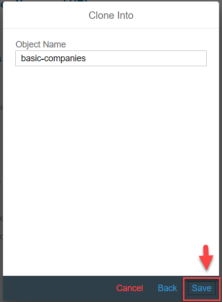

    >After the common resource is cloned, you would see the common resource cloned to your  Open Connectors tenant and it would show all the mapped connector instances that are present in your tenant.

[VALIDATE_2]
[ACCORDION-END]

[ACCORDION-BEGIN [Step 3: ](Test Common Resources template)]

1. Select the connector instance for HubSpot that you have in your  Open Connectors tenant.

    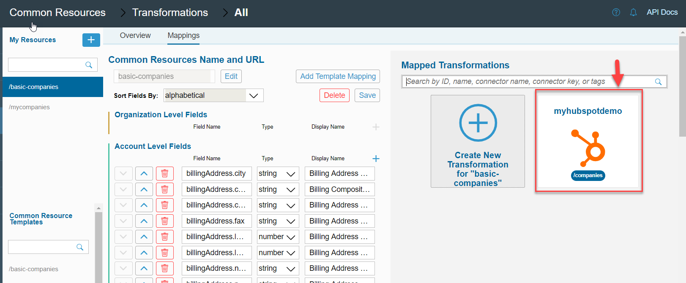

2. The mapping of the basic-companies to the selected non-SAP connector can be tested from Open Connectors.

    - Select the non-SAP CRM connector instance, say `myhubspotdemo`.

    - Select the **Play** button to test the common resources.

    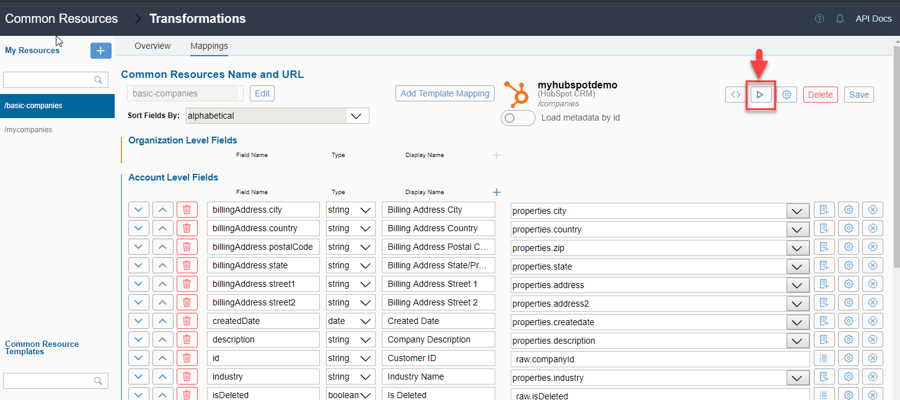

3. Click **Send** to test the Common Resource template.

    - Both the transformed response and raw response can be viewed in the test pane.

    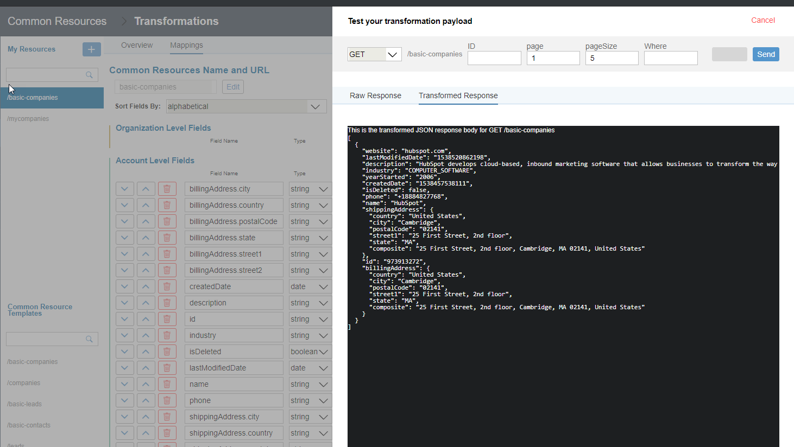

    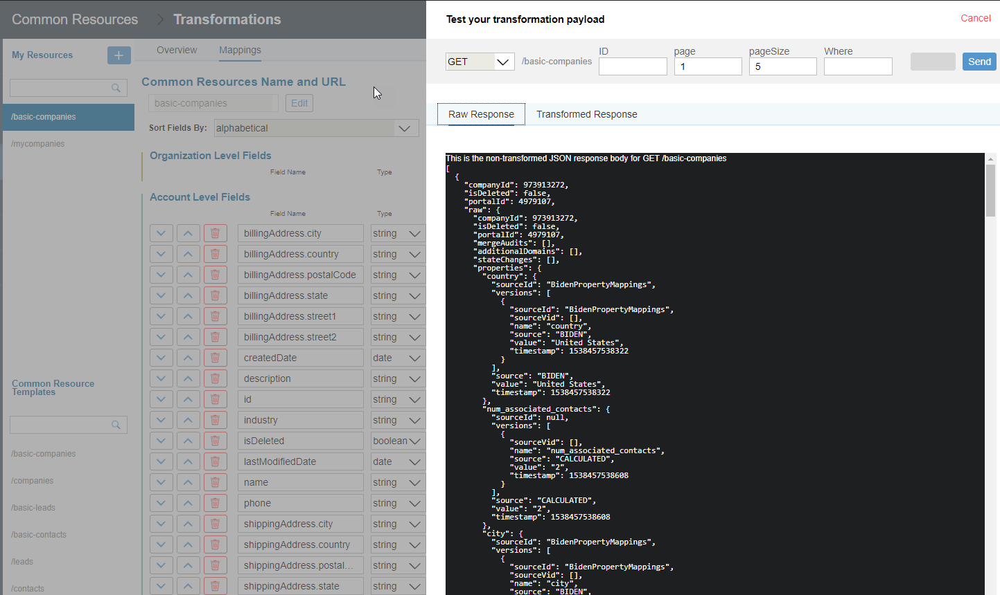

[DONE]
[ACCORDION-END]

---
