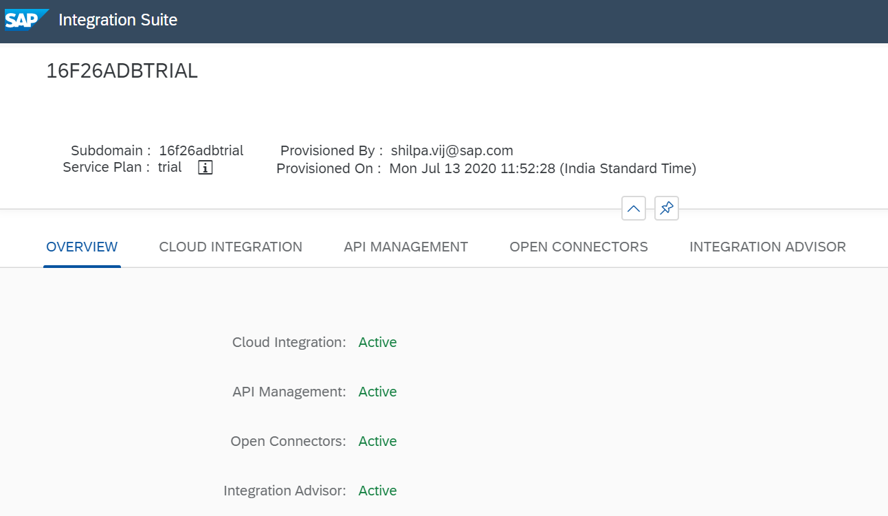

## Prerequisites
- You should have your test or sandbox tenant in `HubSpot(CRM)` or any other third-party application.

## Details
### You will learn
  - How to get the integration or API key to access `HubSpot`
  - How to connect to a third-party application from Open Connectors

[ACCORDION-BEGIN [Step 1: ](Get integration key to access HubSpot)]

1. Log on to your `HubSpot` [tenant](https://www.hubspot.com/) by providing your login credentials.
    - Click **Setting** and then click **Integrations**.

    

2. Expand the **Integrations** from menu item.

3. Select **API key** menu item and then click **Show**.

    >You will get the API Key that can be used to connect securely from  Open Connectors.

    

3. Click **Copy** to copy the API key that can be used from Open Connectors.

    

    >If you have not created API Key already click on Create to create one that can be used to connect securely from Open Connectors

[DONE]
[ACCORDION-END]

[ACCORDION-BEGIN [Step 2: ](Connect to third-party application)]

1. Enter your [SAP  trial](https://account.hanatrial.ondemand.com/).

    - Navigate to the **Cloud Foundry** environment by clicking on **Enter Your Trial Account** and click on **trial**.

    

2. From the **Subscriptions** tab, search and select **Integration Suite** tile.

3. Click **Go to Application**.

4. Integration Suite is launched

    

5. Select **OPEN CONNECTORS** and click on the URL

    

    

6. Click **Connectors** tab to view all the available pre-built connectors.

    

7. In the search bar, enter **`CRM`** to view all connectors for third-party CRM Hub.

    

    >In this exercise, `HubSpot` is used and therefore select the `HubSpot` CRM connectors. You can also explore and try out third-party connectors of your choice from the available connectors catalog.

8. Hover over the **HubSpot CRM** and select the option **Authenticate** to connect to your own HubSpot tenant.

    

    >You are on **Create Authenticated Connector** page.

9.  Create an instance of the connector and set up authentication.

    - Enter **`myhubspot`** as the name for your authenticated connector.

    - Select `apikey` from the **Authentication Type** drop down.

    - Click **Show Optional Field** to enter your HubSpot API key.

    

    - Enter your HubSpot API key and then click **Create Instance**.

    

    >This creates an authenticated connector instance to your own HubSpot tenant.

    >In case you have selected an OAuth authentication based flow, then click **Create Instance** and you are redirected to your third-party OAuth token provider for an OAuth authorization code flow.

10.  To try out the REST APIs from the specific third-party application, click **Test in the API Docs**.

    

    >After the authenticated connection to your third-party application has been created successfully, you can test the connection from
11. Select any of the available resources and click **Try it Out** to test the connectivity to third-party applications, and then click **Execute**.

    

    >This shows the CURL command with the harmonized REST URIs to your third-party application and the normalized authentication token which can be used to securely and seamless connect to your third-party application.

    >The harmonized URIs and authentication headers can be used to connect securely to your third-party application via SAP Business Technology Platform from any application that supports connecting to an HTTP endpoints.

    

[VALIDATE_2]
[ACCORDION-END]
