## Prerequisites
- **Tutorials:** [Enable SAP Cloud Platform API Management Service](https://developers.sap.com/tutorials/hcp-apim-enable-service.html)

## Details
### You will learn
  - How to build a SAP Fiori application showing data from a third-party CRM system.

---

[ACCORDION-BEGIN [Step 1: ](Create a Destination to API Portal)]

1. Log onto your SAP Cloud Platform trial and navigate to the **Neo Environment**.

    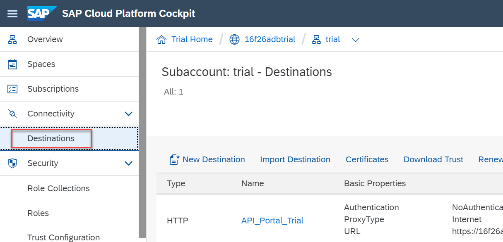

2. Select the **Destinations** tab and then select **New Destination** to create a new destination.

    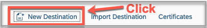

    >Use the existing destination pointing to API Portal if it already exists.

3. Enter **`API_Portal`** as the destination name and then enter the URL to SAP Cloud Platform API Management trial tenant.

    ```
    https://<your_number>trial-trial.apim1.hanatrial.ondemand.com
    ```
    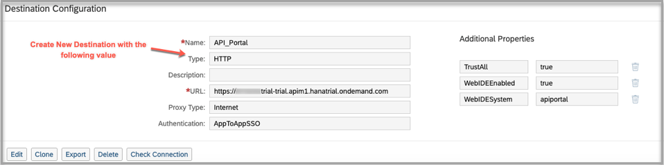

4. Under the additional properties tab, add the following properties:

    **Field** | **Value**
    ---- | ----
    `WebIDEEnabled` |`true`
    `TrustAll` |`true`
    `WebIDESystem` |`apiportal`

    >The name of this destination would have to be noted and it would be later used in the SAP Fiori application (in the `neo-app.json` file).

[DONE]
[ACCORDION-END]

[ACCORDION-BEGIN [Step 2: ](Create SAP Fiori app)]

1. Go to **Services**, click on SAP Web IDE Full-Stack, and then click on **Go to Service**.

      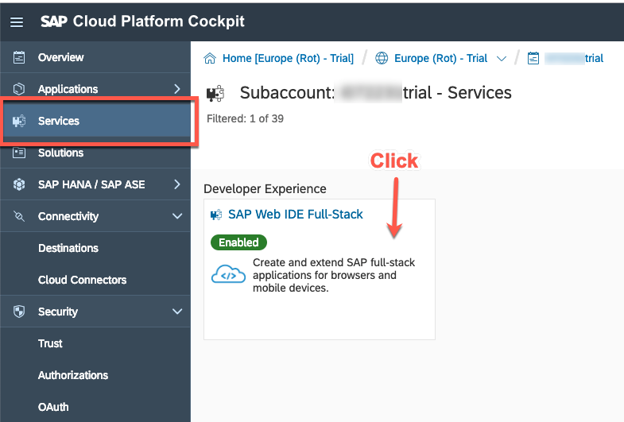

2. Click on **New Project** from template to create a project.

    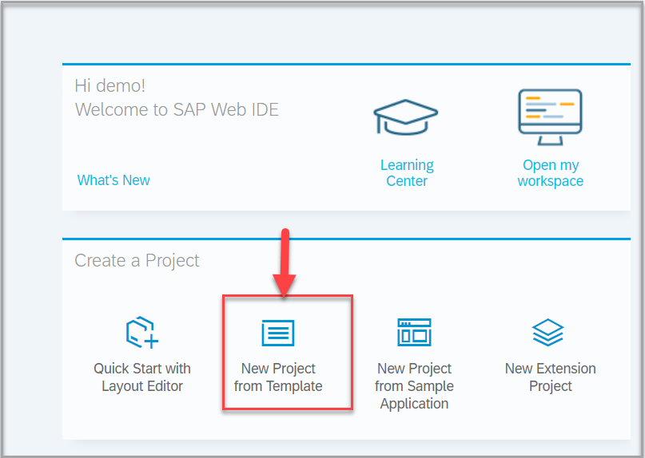

3. Click on **SAPUI5 Application** and then click **Next**.

    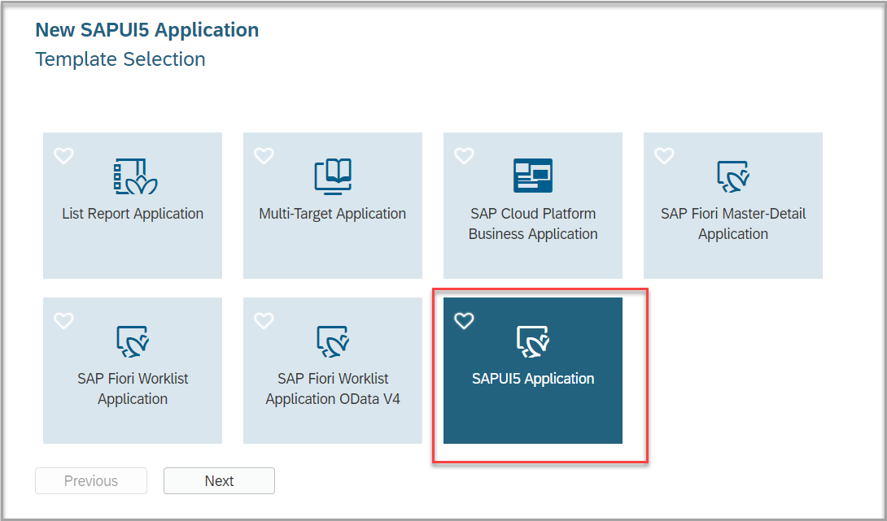

4. Fill the following details:

    **Field** | **Value**
    ---- | ----
    `Project Name` |`thirdpartydemo`
    `Namespace` |`ocn`

    Click **Next**.

    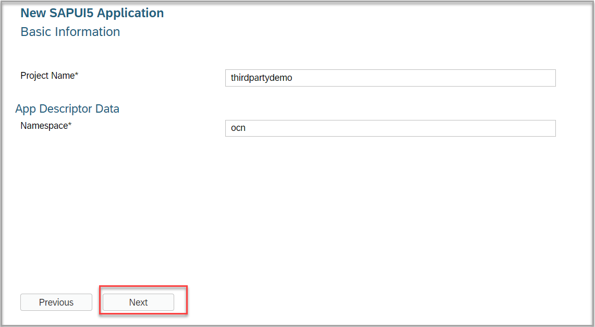

5. Click **Finish** to create the project.

    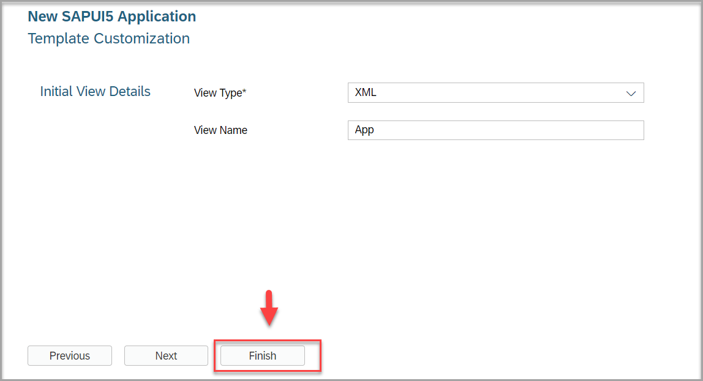

6. Open `neo-app.json` and copy the following code:

    ```Destination

    {
      "path": "/<replace_by_account_id>trial/HubSpotCRM/Basic_Companies",
      "target": {
        "type": "destination",
        "name": "API_Portal",
        "entryPath": "/<replace_by_account_id>trial/HubSpotCRM/Basic_Companies"
      },
      "description": "API_Portal OpenConnectors"
    },

    ```
    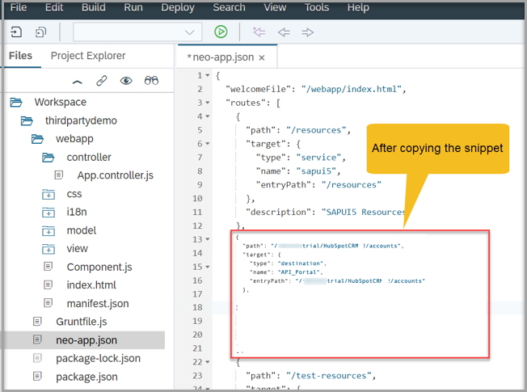

    >Make sure you right-click on the editor and select `Beautify` to format the code.

7. Add the `headerWhiteList`.

    ```JSON
    "headerWhiteList": [
    "authorization"
    ],
    ```
    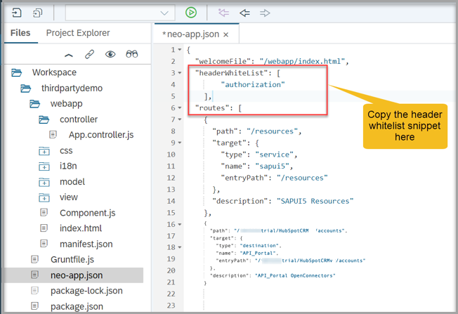

8. Go to the folder `model` and open `model.js` and replace the code with the following code:

    ```JavaScript
    createDataModel: function () {
    var oModel = new JSONModel();
    var sHeaders = {};
    oModel.loadData("/<you_number>trial/HubSpotCRM/<your common Resource template name>", null, true, "GET", null, false, sHeaders);
    return oModel;
    }

    ```
    >UI binding has been done based on the response from the basic-companies common resource templates
    and therefore the same binding can be re-used irrespective of the actual non-SAP CRM
    application that you would be connecting to.
    
    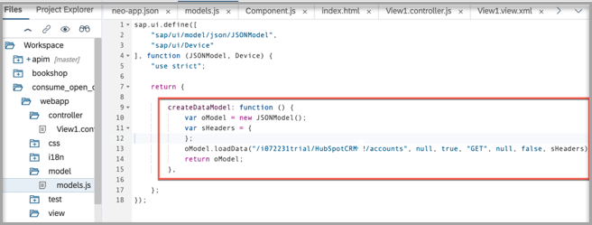

9. In the `Component.js` file, paste the following code:

    ```JavaScript
    this.setModel(models.createDataModel(),"data");
    ```
    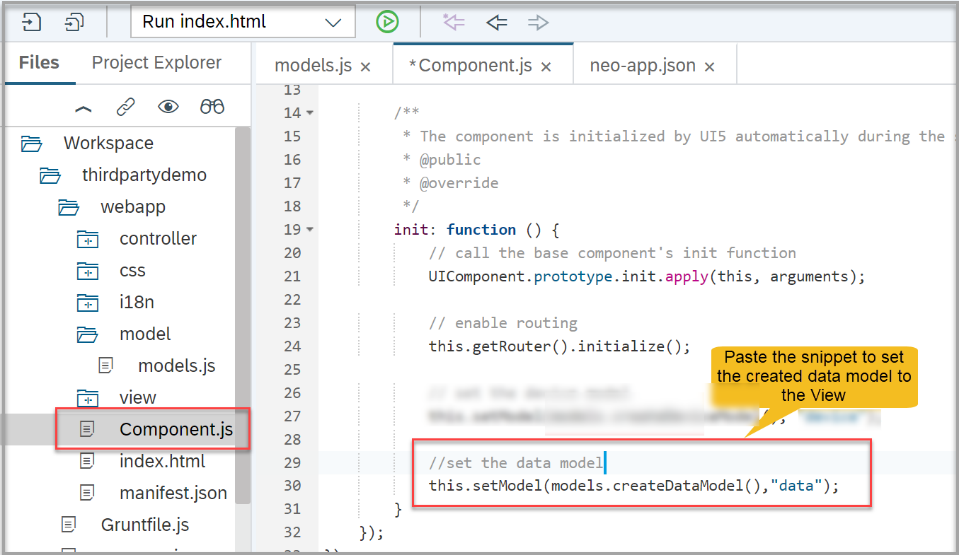

10. Paste the following table control XML in to `View1.view.xml`:

    ```XML
    <<Table items="{data>/}">
							<columns>
								<Column>
									<Text text="Name"/>
								</Column>
								<Column>
									<Text text="Phone"/>
								</Column>
								<Column>
									<Text text="Website"/>
								</Column>
								<Column>
									<Text text="Industry"/>
								</Column>
								<Column>
									<Text text="Shipping Address"/>
								</Column>
								<Column>
									<Text text="Billing Address"/>
								</Column>
							</columns>
							<items>
								<ColumnListItem>
									<cells>
										<ObjectIdentifier title="{data>name}"/>
										<Text text="{data>phone}"/>
										<Text text="{data>website}"/>
										<Text text="{data>industry}"/>
										<Text text="{data>shippingAddress/composite}"/>
										<Text text="{data>billingAddress/composite}"/>
									</cells>
								</ColumnListItem>
							</items>
						</Table>
    ```
    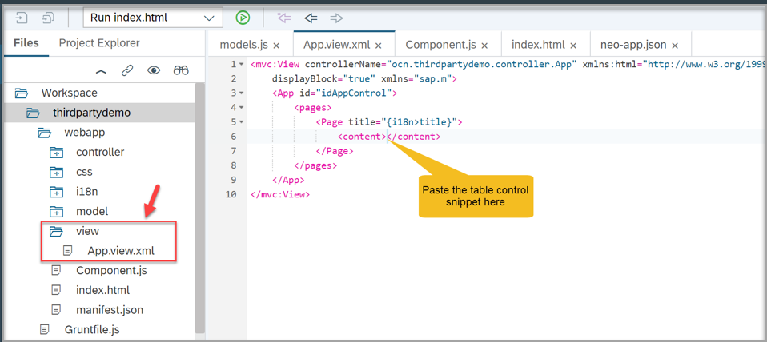

11. Go to the `i18n` folder and open `i18n.properties`, change the title of the page as follows:

    ```i18n
    title = Accounts Data from HubSpot CRM
    ```
    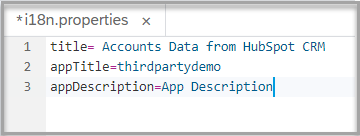

12. Save all the changes and run your SAP Fiori app as **Web Application**

    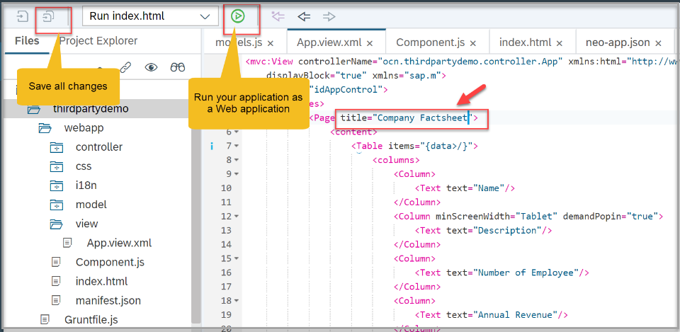

13. Now the contents of the Open Connectors are visible in the app.

    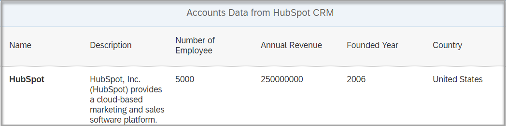

[VALIDATE_2]
[ACCORDION-END]

---
