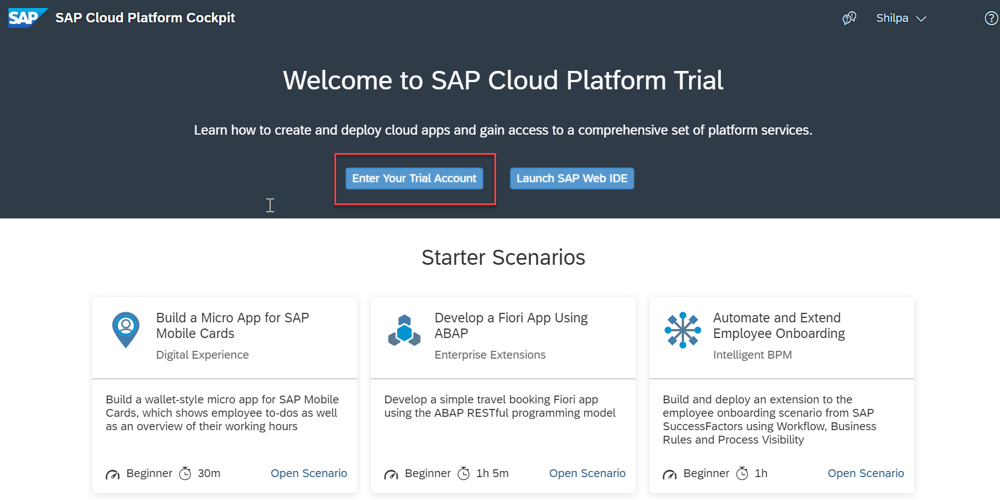
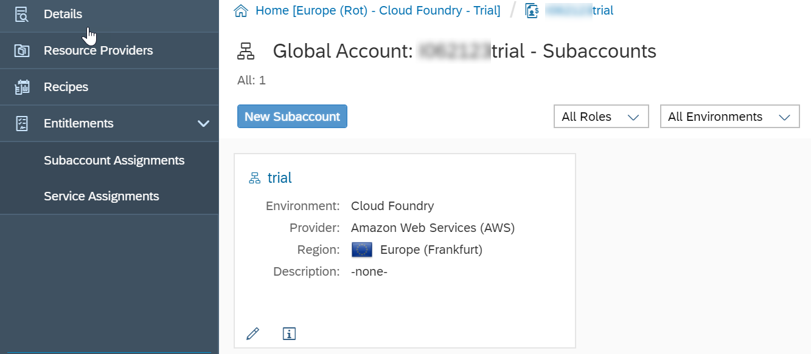
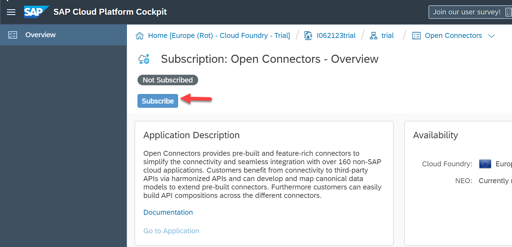
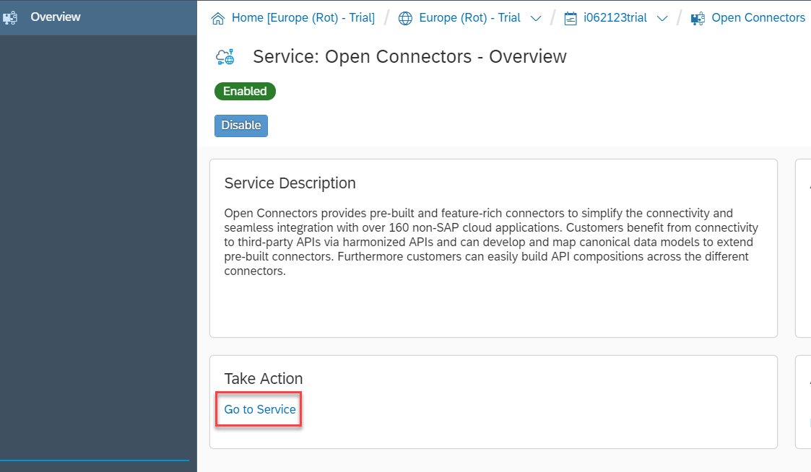
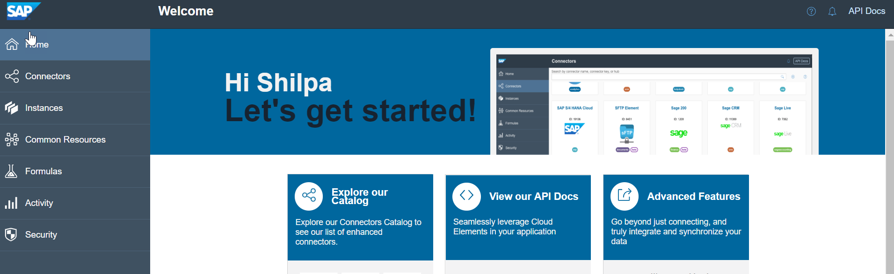

## Prerequisites
- **Tutorials:** [Sign up for an account on SAP Cloud Platform](https://developers.sap.com/tutorials/hcp-create-trial-account.html)

## Details
### You will learn
  - How to enable SAP Cloud Platform, Open Connectors on trial account.

By enabling the service, you get your own instance of Open Connectors, which allows you to connect to third-party applications.

---

[ACCORDION-BEGIN [Step 1: ](Enter your trial account)]

Enter your trial account by clicking on **Enter Your Trial Account**.

Click on **trial** tile to open the cockpit for the Cloud Foundry trial environment.

[DONE]
[ACCORDION-END]

[ACCORDION-BEGIN [Step 2: ](Enable Open Connectors service)]

Navigate to **Subscriptions**.

In the **SaaS Applications** section, click  **Open Connectors**.

Click  **Subscribe** if you are not already subscribed to it.

[VALIDATE_5]

[ACCORDION-END]

[ACCORDION-BEGIN [Step 6: ](Access Open Connectors home page)]

Click **Go to Application**.

>You are logged into your Open Connectors instance and can see all the available third-party connectors.

[DONE]
[ACCORDION-END]
