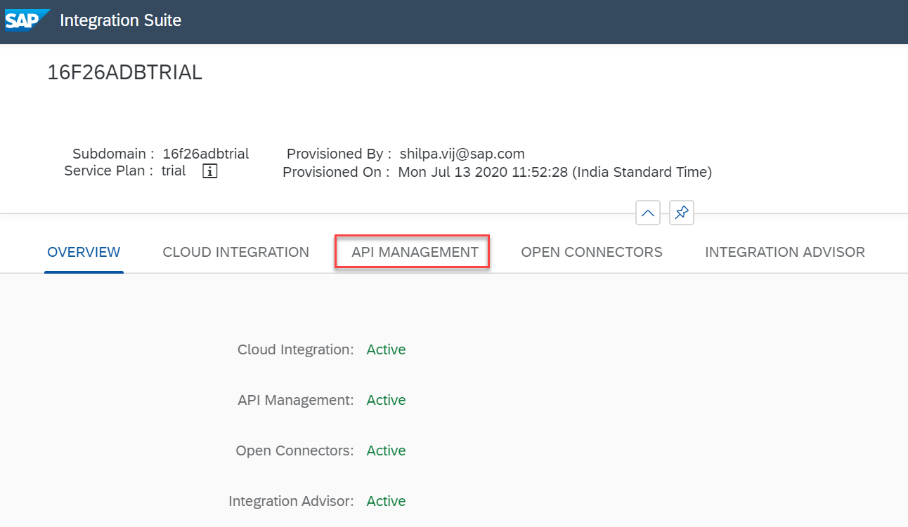

## Prerequisites
- **Tutorials:** [Enable SAP Cloud Platform API Management Service](https://developers.sap.com/tutorials/hcp-apim-enable-service.html)

## Details
### You will learn
  - How to create provider of type Open Connectors
  - How to discover Open Connectors instance and create an API proxy

[ACCORDION-BEGIN [Step 1: ](Create API provider)]

1. Navigate to your API Portal.

    

2. Click **Configure** and then click **Create**.

    

3. Provide a name and description of the provider.

    

4. Go to the Open Connectors cockpit and copy the following:

    - Organization Secret
    - User Secret  

    

5. Click the **Connection** tab and provide the following details:

    **Field** | **Value**
    ---- | ----
    `Type` |`Open Connectors`
    `Regions` |`Europe-Trial`
    `Organization Secret` |`<your organization secret>`
    `User Secret` | `<you user secret>`

    

    Click **Save**.

6. Click **Test Connection**.

    

    >If successful, the response code is **200**.

[DONE]
[ACCORDION-END]

[ACCORDION-BEGIN [Step 2: ](Discover Open Connectors instance)]
1. Navigate to **Develop** and click **Create**.

    

2. Select the created API provider pointing to the Open Connectors instance.

    Click **Discover** to discover the associated APIs.

    

    >It should list all the connectors with instances.

[VALIDATE_2]
[ACCORDION-END]

[ACCORDION-BEGIN [Step 3: ](Create API proxy)]

1. Select `HubSpotCRM` connector.

    - Select `myHubspot` instance from the list.

    

2. By default, the name field will have a space in it. You **MUST** change the space to an underscore -- **`HubSpot_CRM`**.

3. Click **Create** and then click **OK**.

    

[DONE]
[ACCORDION-END]

[ACCORDION-BEGIN [Step 4: ](Deploy and test from browser)]

1. Click **Deploy** to deploy the proxy.

    

2. Try out the URL of the proxy to get the details of accounts from HubSpot instances in the browser.

    

    >`https://<HostAlias><id>trial<API Base Path>/accounts`

[DONE]
[ACCORDION-END]
