## Prerequisites

## Details
### You will learn
  - How to discover APIs from SAP API Business Hub
  - How to create API proxy
  - How to tryout APIs in API Management
  - How to get the API key

[ACCORDION-BEGIN [Step 1: ](Discover S/4HANA APIs in API portal)]

1. From trial cockpit, click **Access API Portal** link to launch API portal.

    

2. From API Portal expand menu, click **Discover** to connect to API catalog of SAP API Business Hub.

    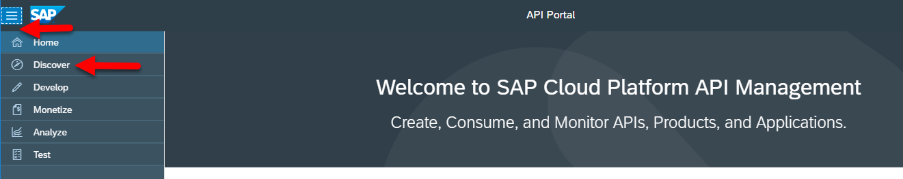
    The API Discovery menu will open with many API packages available for consumption.

3. Click the **SAP S/4HANA Cloud** package to discover available APIs.

    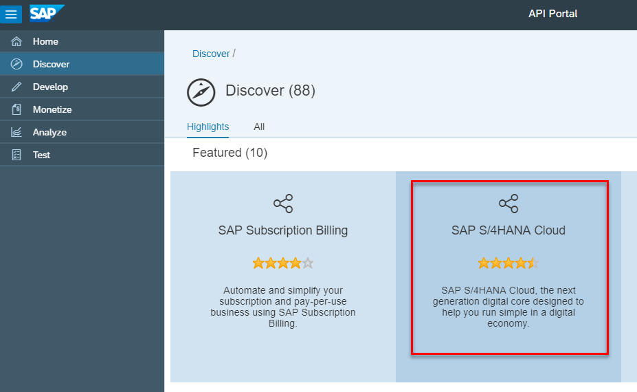

4. Click the **Artifacts** tab to view the available APIs.

    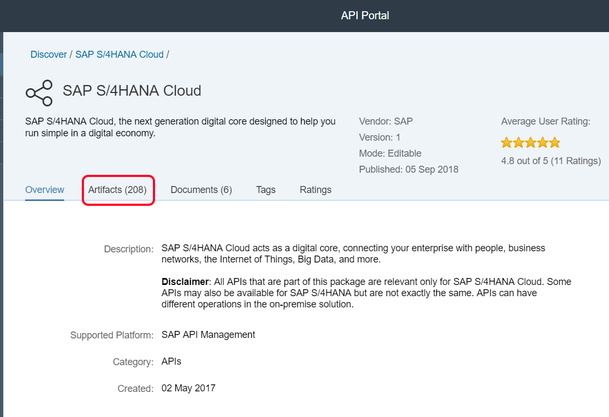

[DONE]
[ACCORDION-END]

[ACCORDION-BEGIN [Step 2: ](Create API proxy)]

1. Click the Search Bar and type **sales order** to search for sales order API.

2. Find the **Sales Order – Create, Read, Update, Delete (A2X)** API and under **Actions** select **Copy**.

    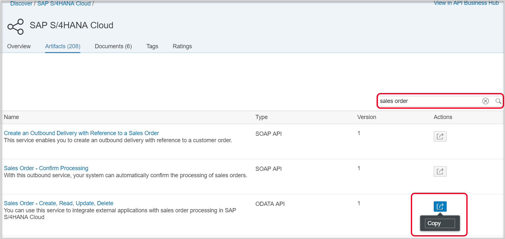

3. From the copy wizard, select sandbox URL and click **OK**.

    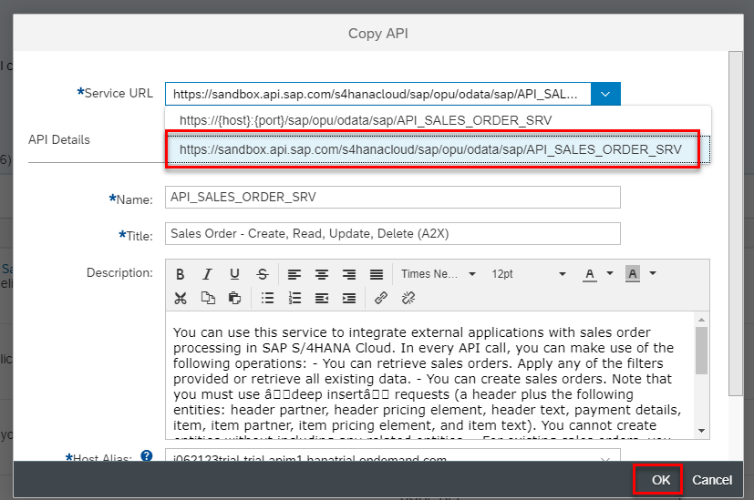

    You will be returned to the API Develop area.

4. For **`API_SALES_ORDER_SRV`** click **Deploy**.

    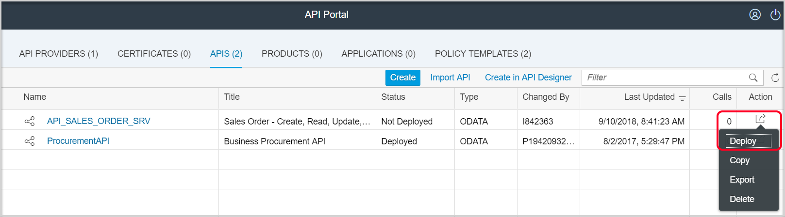

5. Open the created API proxy for example **`API_SALES_ORDER_SRV`**

    API Proxy has all the documentation  imported automatically.

    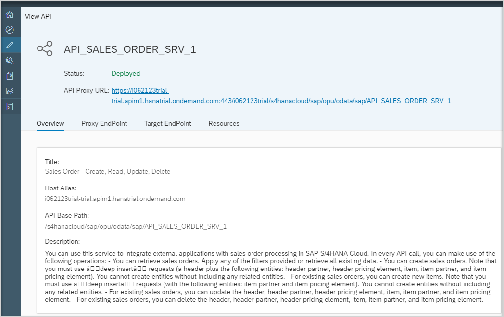

7. Click **Resources** tab to see the Open API spec (Swagger) documentation that will be published to developers.

    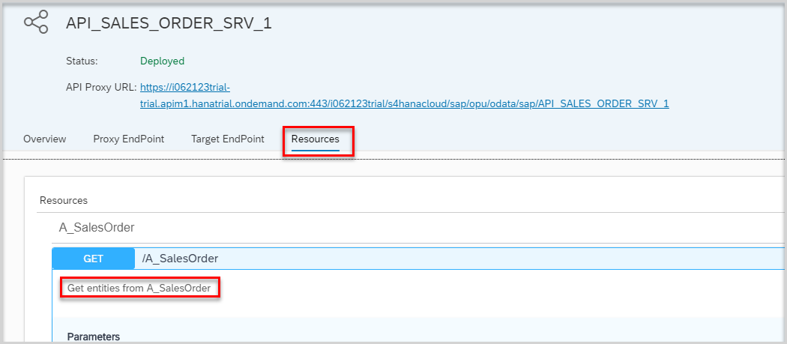

[DONE]
[ACCORDION-END]

[ACCORDION-BEGIN [Step 3: ](Try out APIs)]

1. Expand the open API specification definition to see additional documentation and **Try out** feature which can help developers get started on the API more quickly.

    Click **Try out**

    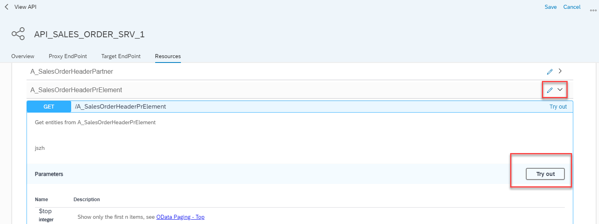

2. Give **$top** as 3.

    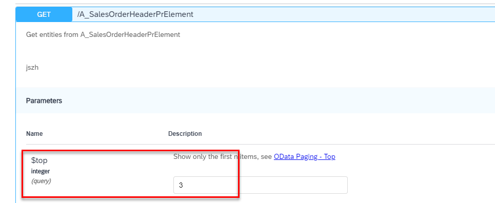

3. Click **Execute**.

    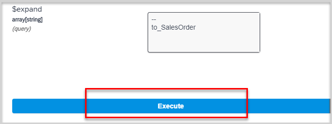
    >The call will fail as it requires **Verify API Key** policy.

    >The Verify API Key policy lets you enforce verification of API keys at runtime, letting only apps with approved API keys access your APIs. This policy ensures that API keys are valid, have not been revoked, and are approved to consume the specific resources associated with your API products.

[DONE]
[ACCORDION-END]

[ACCORDION-BEGIN [Step 4: ](Get API Key)]

1. Go to [SAP API Business Hub](https://api.sap.com), to get your API Key.

    Click **Log On** button.

    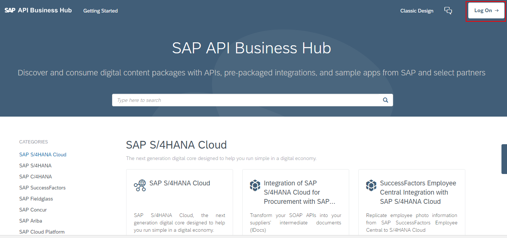

2. Click API package for example **SAP S/4HANA Cloud**.

    

3. Click **Sales Order** API to open the API details.

    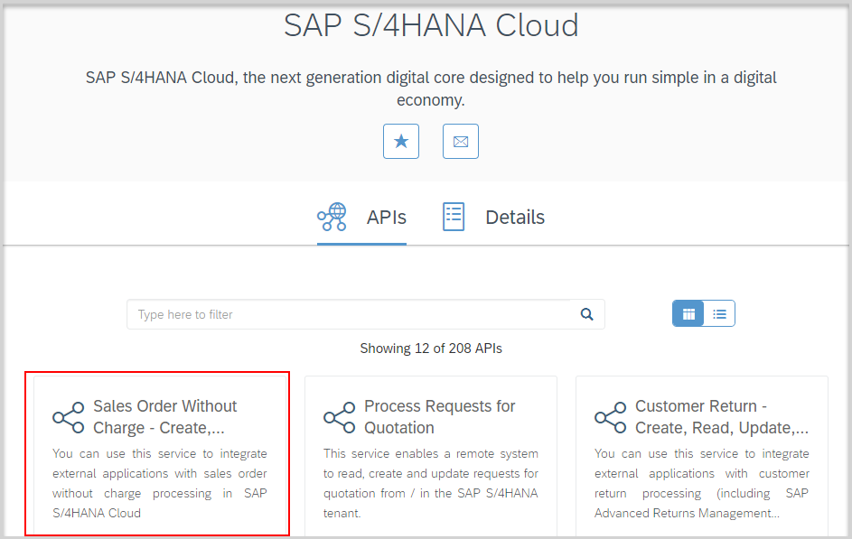

4. Click **Show API Key** button.

    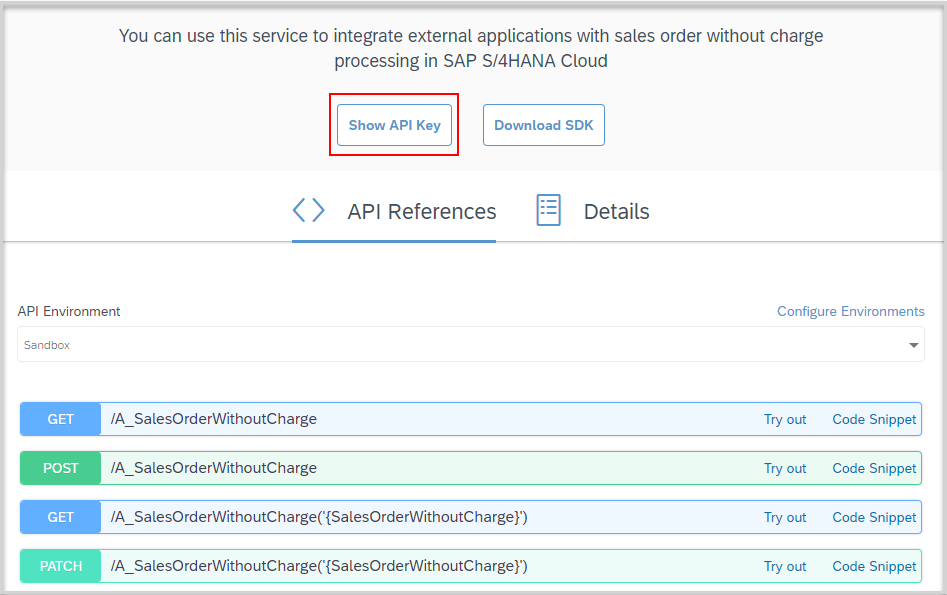

5. Click **Copy Key and Close button**.

    Save API Key value somewhere for later, e.g. Notepad or Notes, etc.

    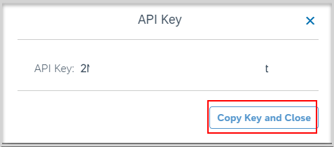

[VALIDATE_4]

[ACCORDION-END]

---
