## Prerequisites

## Details
### You will learn
  - How to pass the API key retrieved from SAP API Business Hub
  - How to limit the number of fields returned by S/4HANA

---

[ACCORDION-BEGIN [Step 1: ](Navigate to policy editor)]

1. From the left-hand navigation bar, select **Develop** and search for the **`API_SALES_ORDER_SRV`**.

    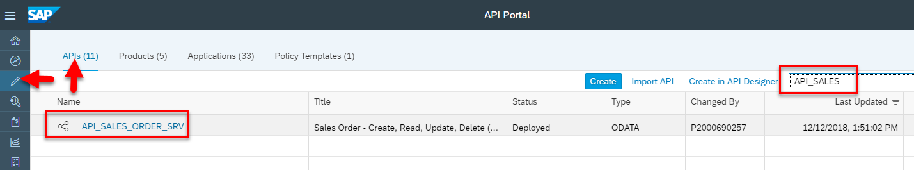

2. Click **`API_SALES_ORDER_SRV`** API proxy and select **Policies**.

    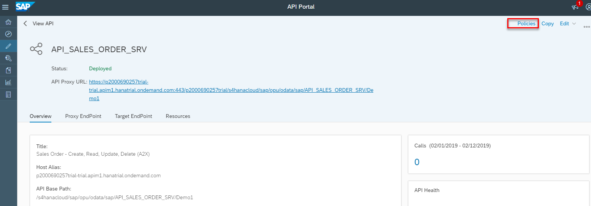

    >Right side of Policy editor you can see out of the box policies arranged to help choose policy for your use cases.
    All security policies are grouped under Security, similarly Traffic Management policies, Mediation policies and Extension policies are grouped accordingly.

    >Left side of the Policy editor has Flows, **`PreFlow`** and **`PostFlow`** are present under Proxy End Point and Target End Point.

    >Also there are Conditional Flows which are created if required.

[VALIDATE_1]

[ACCORDION-END]

[ACCORDION-BEGIN [Step 2: ](Apply Assign Message policy)]

1. Click  Edit button in the policy editor.

    

2. Select **`PreFlow`** under **`ProxyEndpoint`**.

    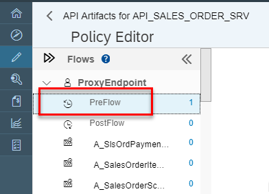

3. Select  **Assign Message** policy and click **+** icon to add policy.

    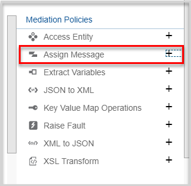

4. In the Policy Name field, enter **`AddKey`** and click **Add**.

    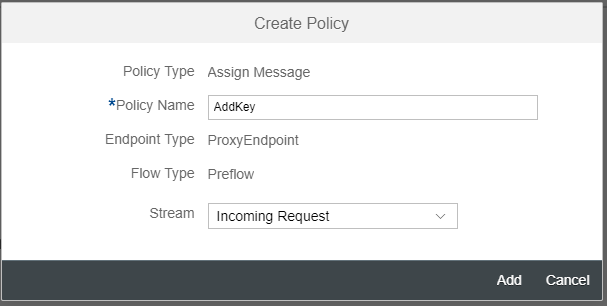

5. An icon will be added to the flow diagram.

    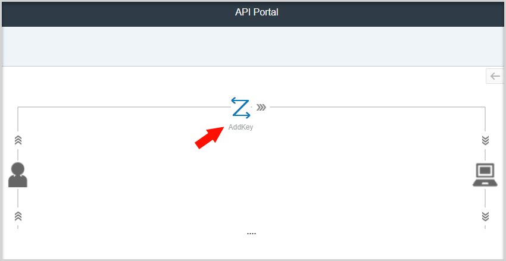

6. Click policy icon to bring up the code box below.

    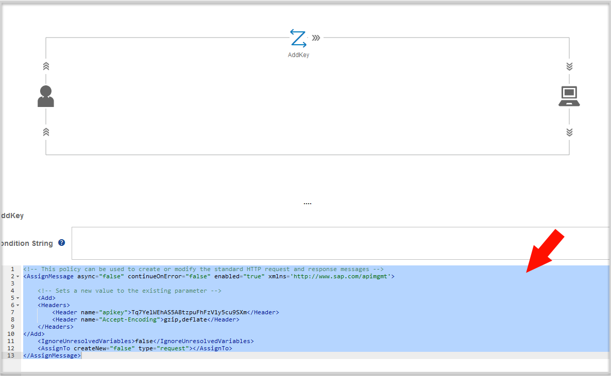

7. Replace the template with the following code:

    ```
    <AssignMessage async="false" continueOnError="false" enabled="true" xmlns='http://www.sap.com/apimgmt'>
<Add>
    <Headers>
        <Header name="apikey">** REPLACE WITH YOUR API KEY **</Header>
        <Header name="Accept-Encoding">gzip,deflate</Header>
   </Headers>
</Add>
	<IgnoreUnresolvedVariables>false</IgnoreUnresolvedVariables>
	<AssignTo createNew="false" type="request"></AssignTo>
</AssignMessage>

    ```
    >**NOTE**: You must replace the marked text with the API Key that you copied earlier.

    >This code will have SAP API Management add the required API Key value to every request sent to the API Hub, and accept the compression format used to transmit data efficiently for consumer.

8. Save your changes.

[DONE]
[ACCORDION-END]


[ACCORDION-BEGIN [Step 3: ](Set limit)]

1. Click conditional flow **`A_SalesOrder`** under **`ProxyEndpoint`** flow  and click **""+""** next to **Assign Message** policy.

    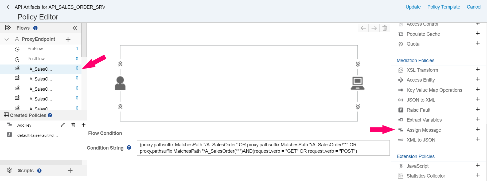

    >Since the S4 Data is quite massive, we will introduce a limiting request on condition of requesting Sales Order Data.

2. In popup give name as `setLimit` and click on **Add**.

    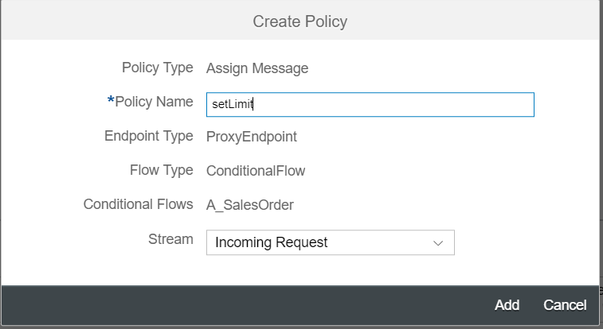

3. In the **Assign Message** policy select the code area and replace the template with the following code:

    ```
    <!-- This policy can be used to create or modify the standard HTTP request and response messages -->
<AssignMessage async="false" continueOnError="false" enabled="true" xmlns='http://www.sap.com/apimgmt'>

	 	<!-- Sets a new value to the existing parameter -->
	 	<Add>
    <QueryParams>
        <QueryParam name="$top">3</QueryParam>
    </QueryParams>
</Add>

	 	<IgnoreUnresolvedVariables>false</IgnoreUnresolvedVariables>
 	<AssignTo createNew="false" type="request"></AssignTo> </AssignMessage>

    ```
    >This will limit the number of fields returned by S/4HANA.

4. Click **Update**.

    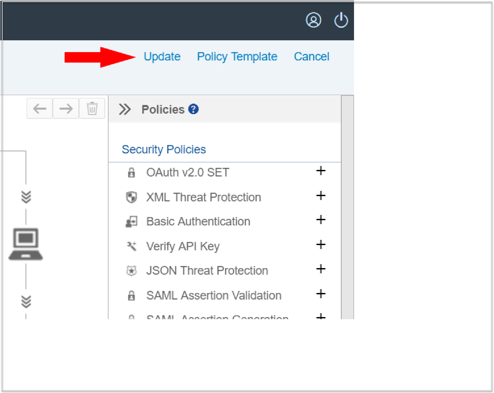

5. Click **Save** on the next screen.

    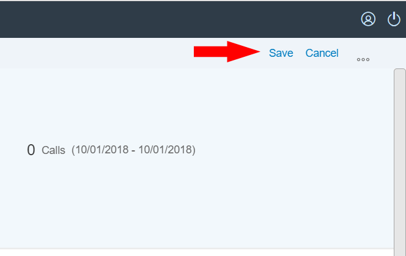

6. After the save has completed click the API Proxy URL.

    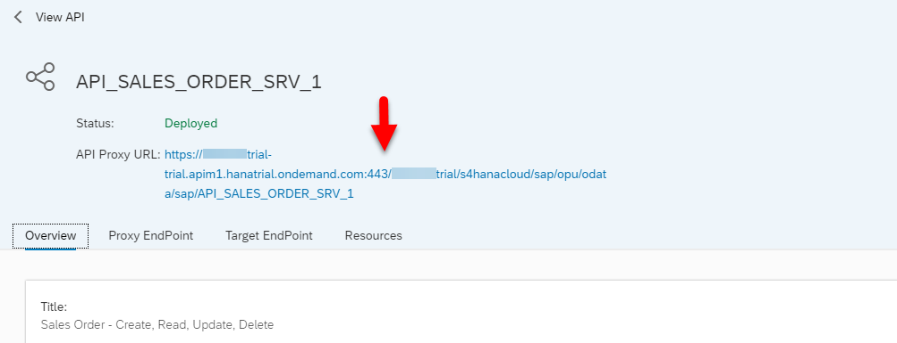

7. Sales order from S/4HANA should be retrieved without prompting for any authorization.

    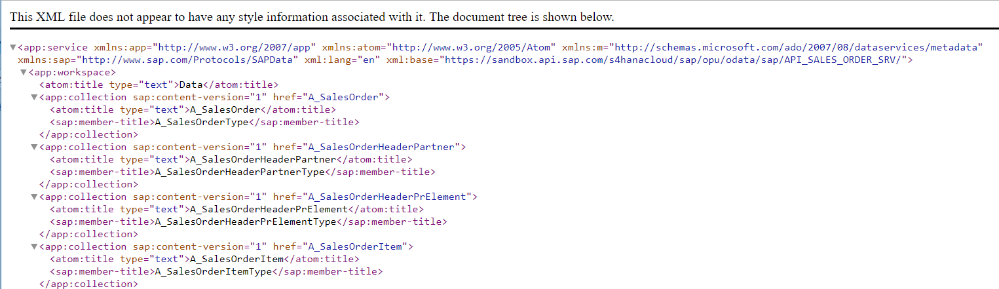


[DONE]
[ACCORDION-END]


---
