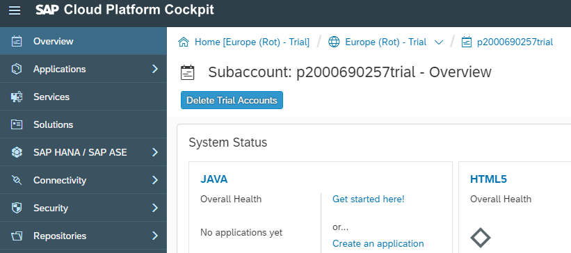
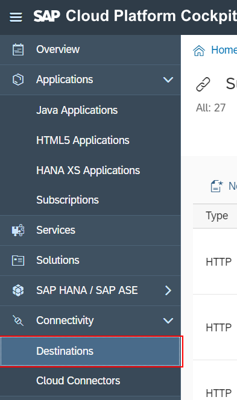
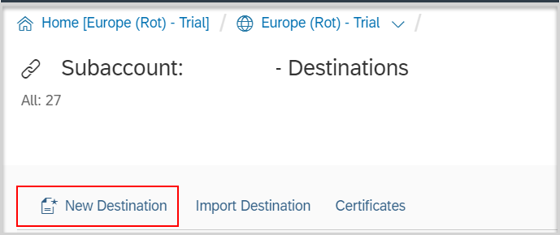
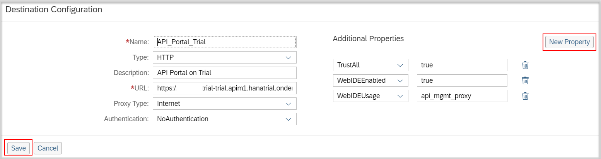

## Prerequisites

## Details
### You will learn
  - How to create destination on trial account
  - How to connect API Management and Mobile services

---

[ACCORDION-BEGIN [Step 1: ](Log into SAP Cloud Platform)]

Login to [SAP Cloud Platform Cockpit](https://account.hanatrial.ondemand.com ) and navigate to Neo Trial account.

[DONE]
[ACCORDION-END]

[ACCORDION-BEGIN [Step 2: ](Create destination)]

1. Under the side menu select **Connectivity** and then select **Destinations**.

    

2. Click **New Destination**.

    

3. Enter the following values:

    

    **Field** | **Value**
    ---- | ----
    Name |`API_Portal_Trial`
    Type |`HTTP`
    Description |`API Portal on Trial`
    URL |`https://<yourP#>trial-trial.apim1.hanatrial.ondemand.com`
    Proxy Type |`Internet`
    Authentication |`NoAuthentication`

    **Additional Properties**

    **Field** | **Value**
    ---- | ----
    `TrustAll` | **`true`**
    `WebIDEEnabled` |**`true`**
    `WebIDEUsage` |**`api_mgmt_proxy`**

[VALIDATE_2]

[ACCORDION-END]
