## Prerequisites


## Details
### You will learn
  - How to create a new mobile card
  - How to give the query and collection query URL pointing to the proxy endpoint created in SAP API Management

---

[ACCORDION-BEGIN [Step 1: ](Create a new mobile card)]

1. Open Mobile Services [Cockpit](https://account.hanatrial.ondemand.com ).

    - Under the side menu Select **Services**.

    - Under Services Select **Mobile Services, users**.

    - Click **Go to Service** to launch Mobile Cards.

    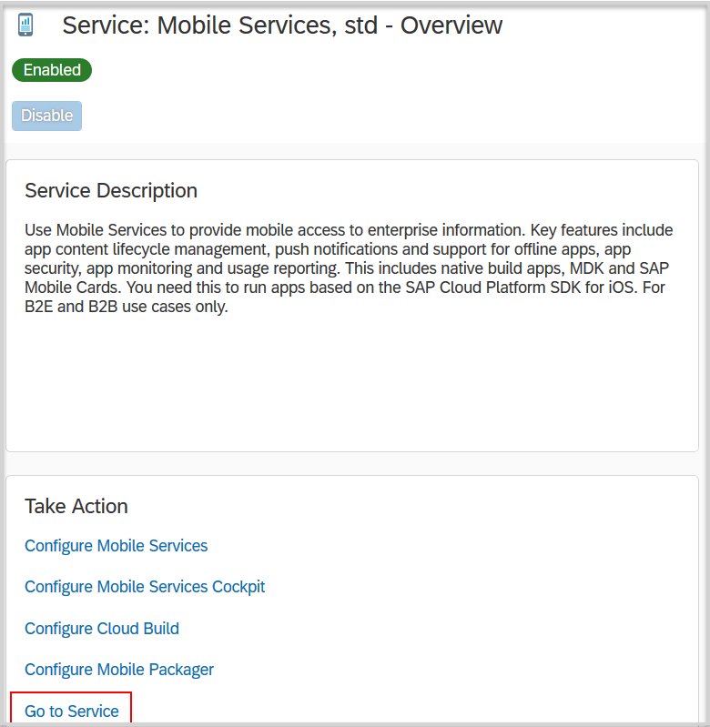

2. Click **Close**.

    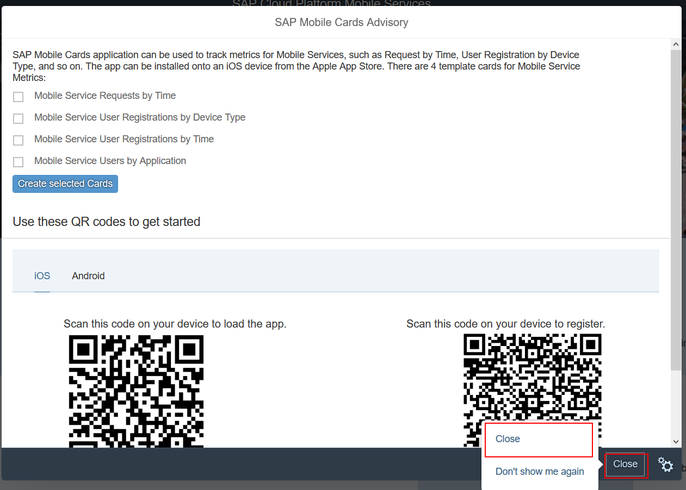

3. In the main screen click **Create** to create a new mobile card.

    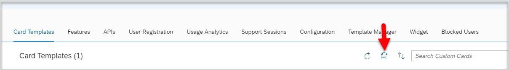

4. Give the following values:

    **Field** | **Value**
    ---- | ----
    Name |`SalesOrderCard`
    Destination |`<your destination>`
    Template Source |`Template Manager`
    HTML Template |`User defined template`
    Card Template |`Automatic Instance Generation`

    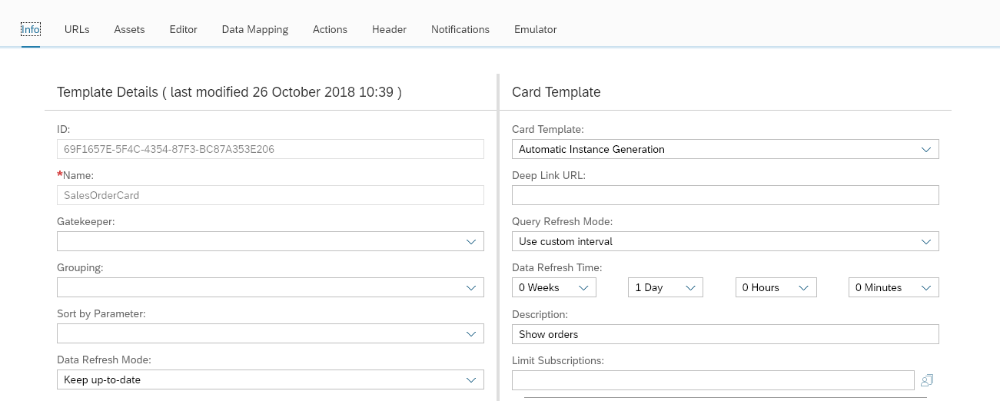

5. Navigate to **URLs** tab and give the following values:

    **Field** | **Value**
    ---- | ----
    Query |`/<yourP#>trial/s4hanacloud/sap/opu/odata/sap/API_SALES_ORDER_SRV/A_SalesOrder?$expand=to_Item`
    Collection Handling |`Generic REST API`
    Query URL Collection Root |`$.d.results`
    Query Entity Key Paths |`$.d.__metadata.uri`

    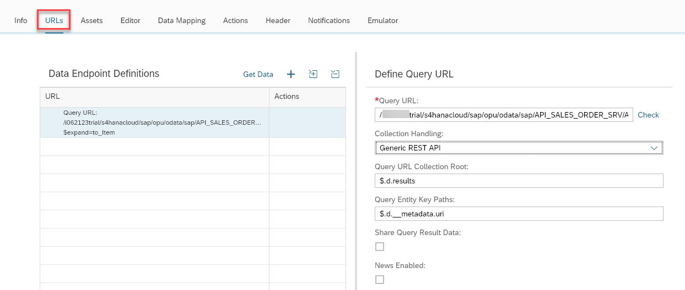

6. Click **+** and click the **Get Data**.

    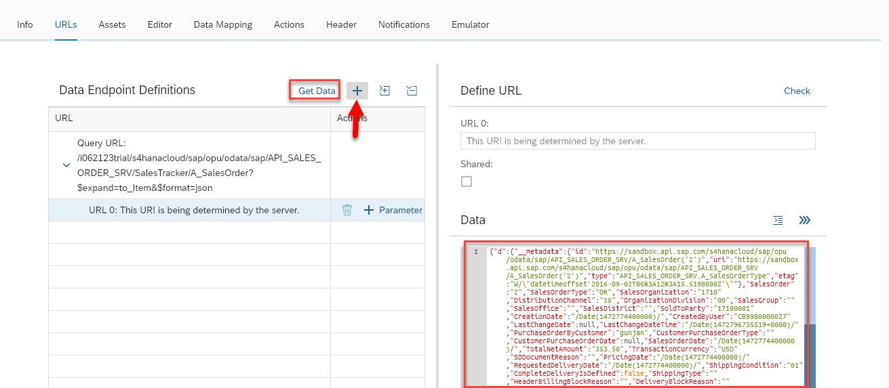

7. Click the **Editor** tab.

8.	Copy the below code and paste it into the Source Code box.

        ```
        <div id="mySimpleTemplate" class="myTemplate" data-type="text/x-handlebars-template">
           <div class="header">
               <h1>
                   SalesOrder
               </h1>
               <span class="name">
                   {{SalesOrderId}}
               </span>
           </div>
           <div class="card-content">
               <div class="all">
                   <div class="title-content">
                       <span class="title">
                           Order Created At
                       </span>
                       <br>
                       <span class="content">
                           {{CreatedAt}}
                       </span>
                   </div>
                   <div class="title-content">
                       <span class="title">
                           Overall Delivery Status
                       </span>
                       <br>
                       <span class="content">
                           {{OverallDeliveryStatus}}
                       </span>
                   </div>    
                   <div class="title-content">
                       <span class="title">
                           Sold to ID
                       </span>
                       <br>
                       <span class="content">
                           {{SoldtoID}}
                       </span>
                   </div>
               </div>
               
            </div>
            <div class="desciprtion">
                <div>
                   <span class="d-title">
                       Description
                   </span>
                   <span class="d-title-a">
                       Amount
                   </span>
                   </div>
              <div>
                   <hr>
                   {{#each Items}}
                       {{PurchaseOrderbyCustomer}}
                   <span style="float:right;">
                       {{NetAmount}}
                           {{CurrencyCode}}
                   </span>
                  <div style="clear:both; height: 10px;">
                  </div>
                   {{/each}}
           </div>
        </div>
        </div>
        ```
    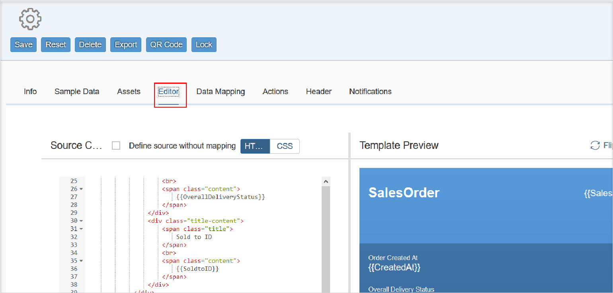

9. Click **Flip to Back**.

    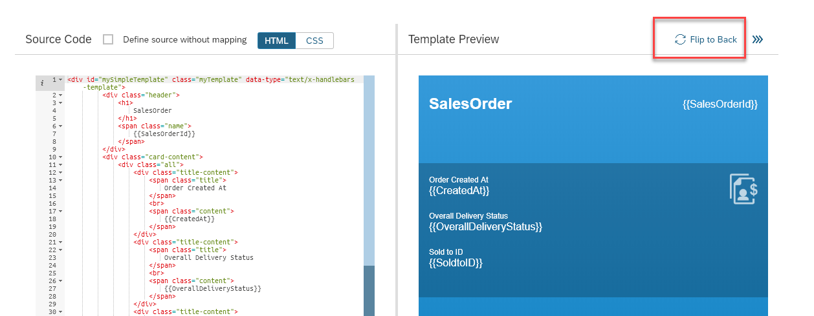

10.	Copy the below code and paste it into the Source Code box.

        ```
        <div id="mySimpleTemplate" class="myTemplate" data-type="text/x-handlebars-template">
        <div>
          <header>
              <span style="font-weight: bold; font-size: 24px; float: left; display: inline; padding:16px">
                  Sales Order Items Details
              </span>
          </header>
        </div>
        <div style="clear:both;">
        </div>
        <hr>
        <table width="100%" style="margin: 0px;">
        <tr>
          <th>Payment Terms</th>
          <th align="center">Sales Order Date</th>
          <th align="right" >Created By</th>
        </tr>
          {{#each Items}}
        <tr>
          <td>{{CustomerPaymentTerms}}</td>
          <td align="center">{{SalesOrderDate}}</td>
          <td align="right">{{CreatedByUser}}</td>
         </tr>
        <tr>
        {{/each}}
          </table>
        </div>
        ```

11. Click the **Data Mapping** tab

     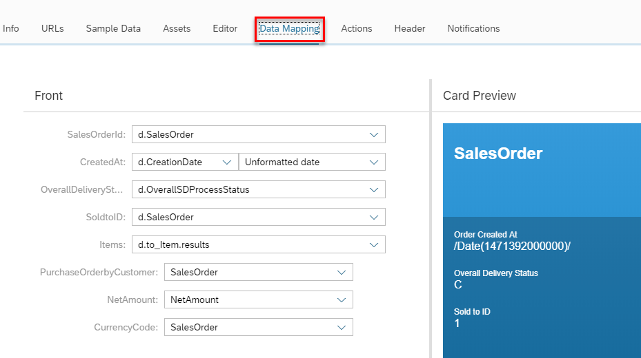

    >Here we will link the actual backend data to the fields defined in the UI Editor code.

12. Give the following values:

    **Field** | **Value**
    ---- | ----
    `SalesOrderId` |`SalesOrder`
    `CreatedAt` |`CreationDate`
    `OverallDeliveryStatus` |`d.OverallTotalDeliveryStatus`
    `SoldtoID` |`SalesOrder`
    `Items`  |`d.to_Item.results `
    `PurchaseOrderbyCustomer` |`PurchaseOrderByCustomer`
    `NetAmount`  |`NetAmount`
    `CurrencyCode` |`TransactionCurrency`   

13. Click **Flip to Back** and link backend data for additional fields.

    **Field** | **Value**
    ---- | ----
    `CustomerPaymentTerms` |`CustomerPaymentTerms`
    `SalesOrderDate` |`<select format>`
    `CreatedByUser` |`PurchaseOrderByCustomer`

14. Click **Save**.

[VALIDATE_1]

[ACCORDION-END]

[ACCORDION-BEGIN [Step 4: ](Emulate Mobile App)]

1. On the main page click the **Emulator** tab, click **Load/Refresh**.

    

[DONE]
[ACCORDION-END]

[ACCORDION-BEGIN [Step 5: ](Scan QR code)]

1. On the main page click the **APIs** tab.

    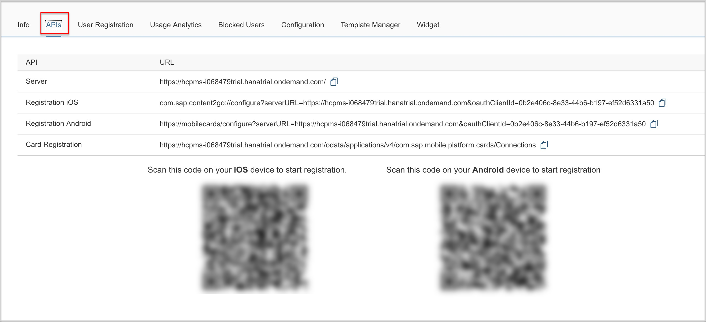

2.	Scan the QR code for your device to register Mobile Cards to your app.

[DONE]
[ACCORDION-END]

[ACCORDION-BEGIN [Step 6: ](Get the mobile card on your device)]

1. Log in to the app using your `<P#>`

    >Skip any passcode requirements.

2. Subscribe to the card `SalesOrderCard`.

3.	You will now have a Mobile Card on your phone with record information provided from S4HANA.

    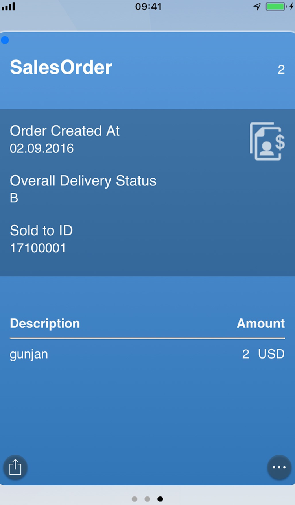

[DONE]
[ACCORDION-END]
