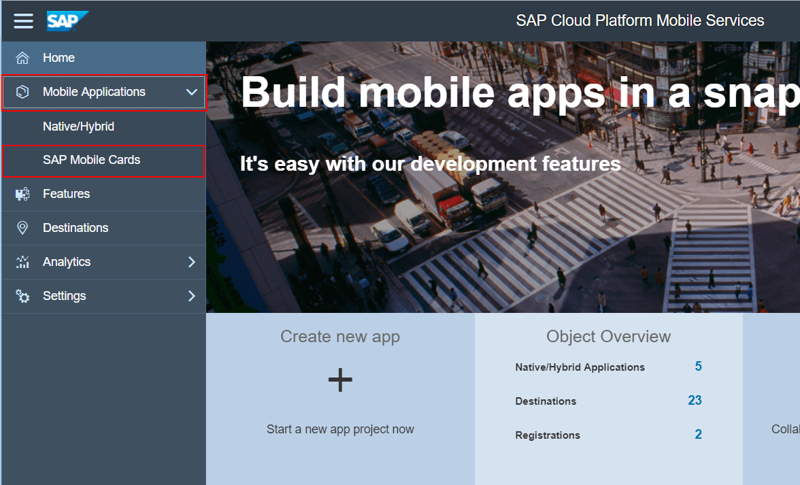
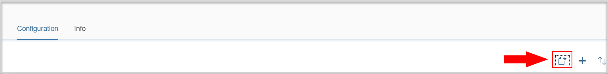
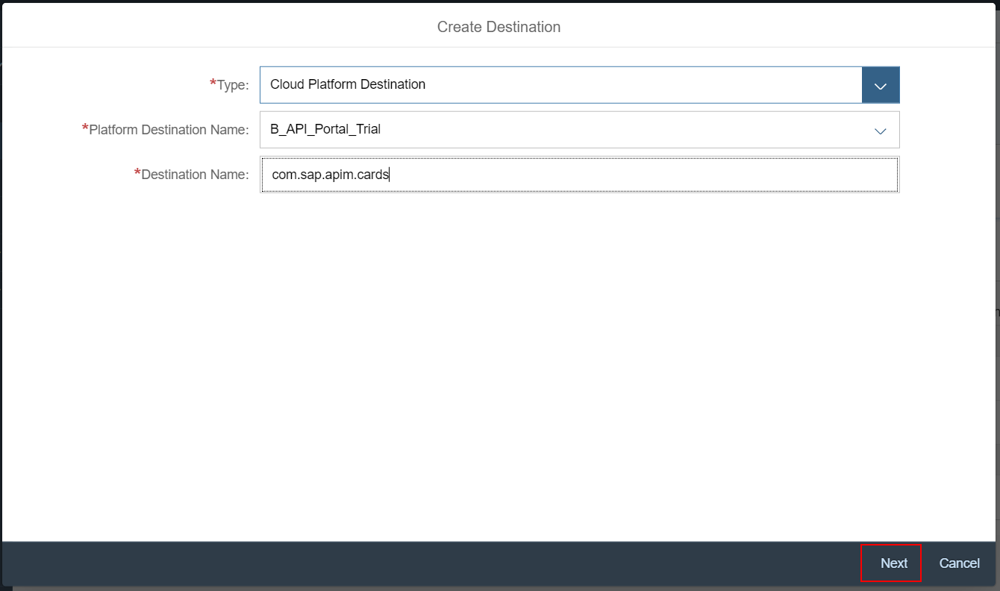
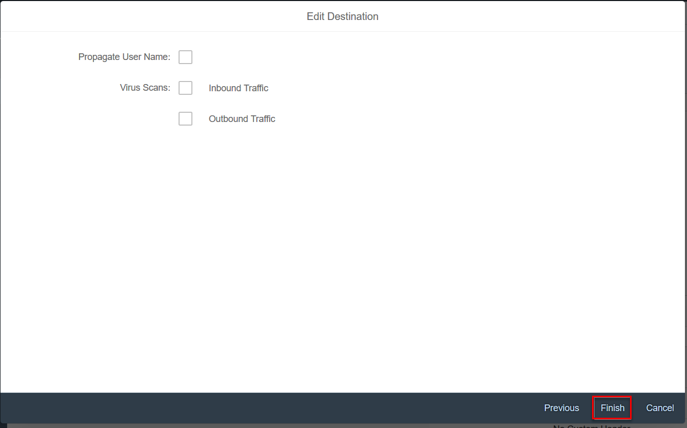

## Prerequisites

## Details
### You will learn
- How to download SAP mobile card onto your iOS device
- How to download SAP mobile card onto your android device
- How to register to SAP Mobile Cards service

Add additional information: Background information, longer prerequisites

---

[ACCORDION-BEGIN [Step 1: ](Install Mobile Cards app)]

1. Install Mobile Card app

  - [iOS](https://itunes.apple.com)
  
  

  - [Android](https://itunes.apple.com)

  

[VALIDATE_1]
[ACCORDION-END]

[ACCORDION-BEGIN [Step 2: ](Open Mobile Services)]

1. Return to the [Cockpit](https://account.hanatrial.ondemand.com ).

2. Under the side menu, Select **Services**.

3. Under Services, Select **Mobile Services, users**.

    It should be **Enabled**.

4. Click **Go to Service** to launch Mobile Cards.

    

5. Click **Close**.

    

[DONE]
[ACCORDION-END]

[ACCORDION-BEGIN [Step 3: ](Register to Mobile Cards)]

1. Select and expand **Mobile Applications**.

    Click **SAP Mobile Cards** to launch the Mobile Cards Service.

    

2. Navigate to **Features** and select **Connectivity**.

    

3. Click **Create**.

    

    >Adds the Cloud Platform destination we just created

4. In the Destination wizard enter the following:

    

    **Field** | **Value**
    ---- | ----
    Type |`API_Portal_Trial`
    Platform Destination Name |`HTTP`
    Destination Name |`API Portal on Trial`

5.  Click **Next** till you get **Finish**.

    

[DONE]
[ACCORDION-END]
