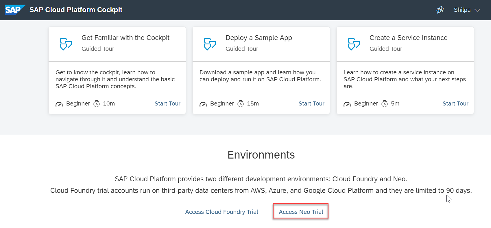
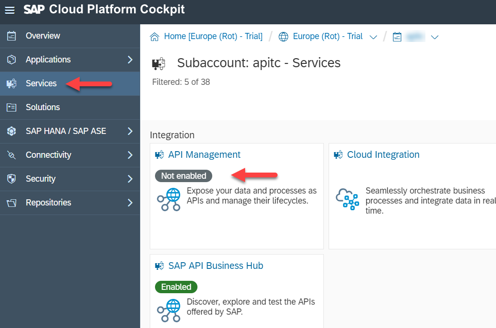
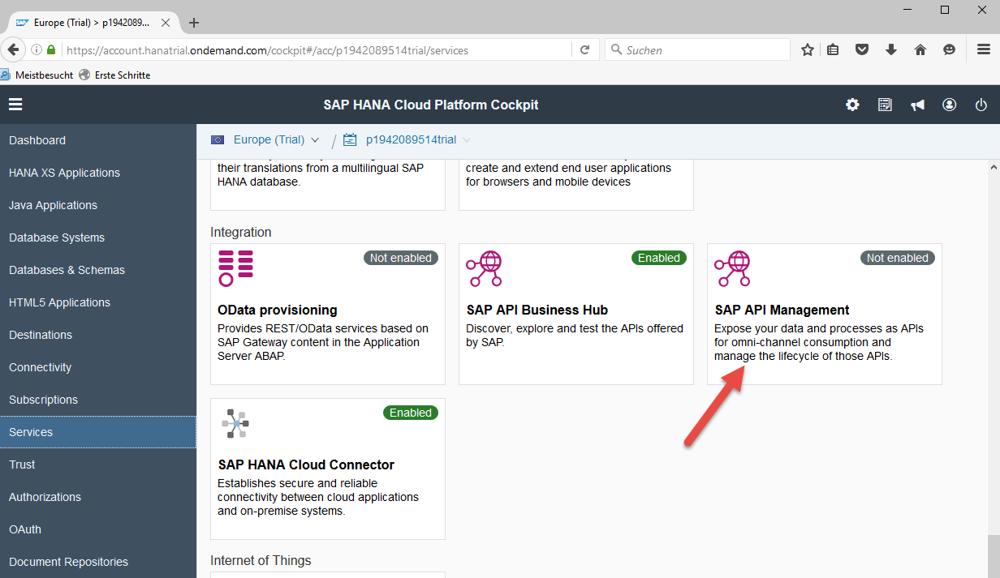
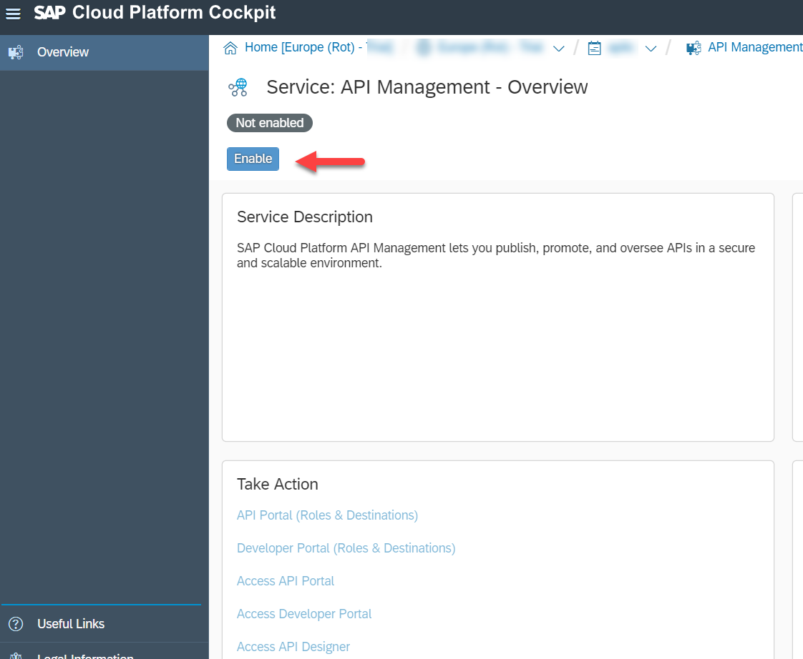
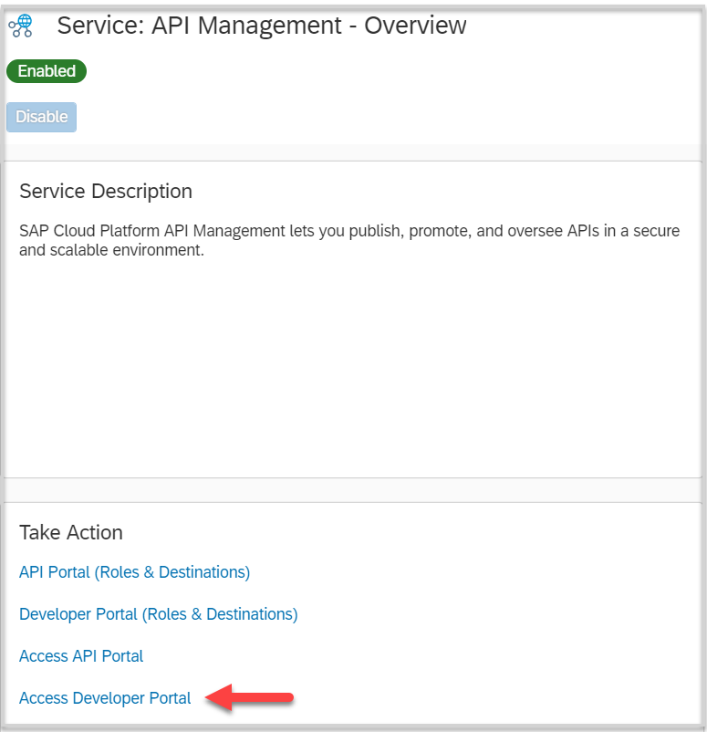
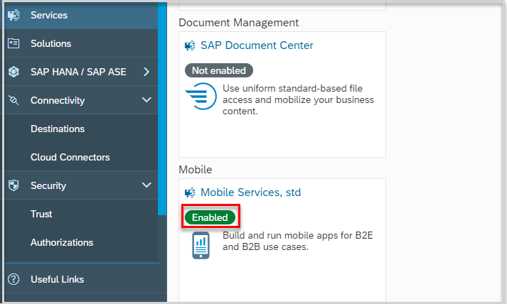
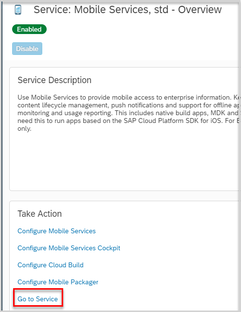

# Enable Services for Sales Tracker App
<!-- description --> Set up required services to build Sales Tracker app to demonstrate SAP API Management and other technologies.

## Prerequisites
- **Tutorials:** [Sign up for an account on SAP Cloud Platform](https://developers.sap.com/tutorials/hcp-create-trial-account.html)

## You will learn
  - How to enable SAP Cloud Platform, API Management on trial account
  - How to enable Mobile services on trial account

## Intro
With this, you have your own instance of SAP API Management and Mobile Services which allows you to create APIs, mobile apps and connect them to your systems (both SAP and non-SAP) and "play" with the available features.

---

### Log in to SAP Cloud Platform cockpit

[Log into SAP Cloud Platform](https://cockpit.hanatrial.ondemand.com/)

Click on **Access Neo Trial** to open the cockpit for Neo environment.

### Select services in SAP Cloud Platform cockpit

From the **SAP Cloud Platform cockpit**, select **Services**.

### Enable SAP API Management service

1. In the **Integration** section, click **SAP API Management**.

2. Click  **Enable**.

### Access the SAP API Management portals

You now have access to the SAP API Management API Portal ...

... and the SAP API Management Dev Portal

### Enable Mobile Services

In the **Integration** section, click  **Mobile Services**.

Click  **Enable**.

### Access Mobile Service

Click **Go to Service**.

---
