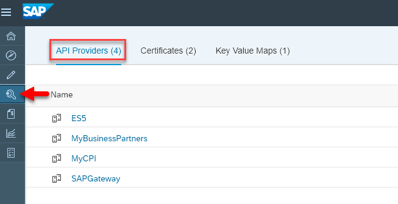
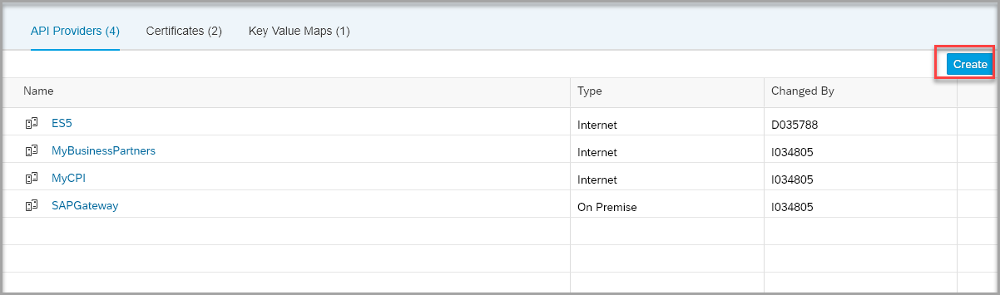
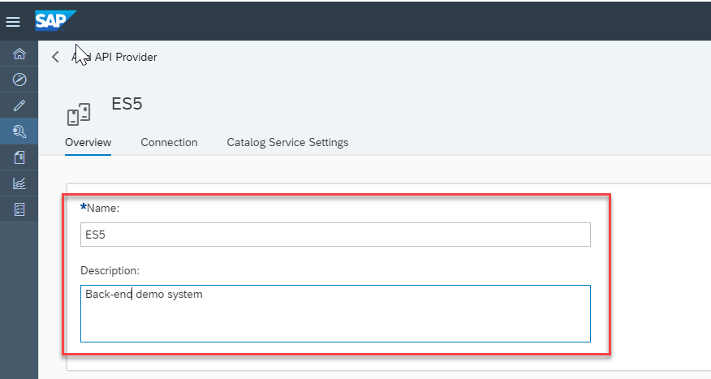
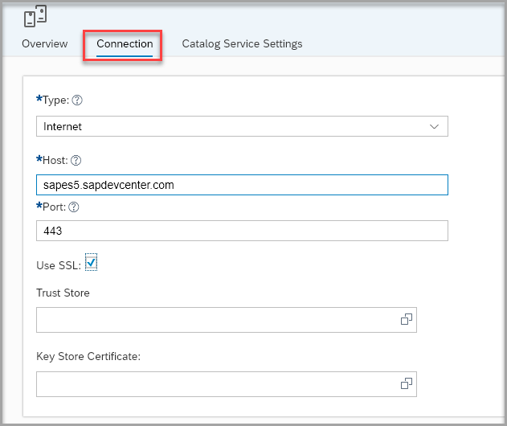
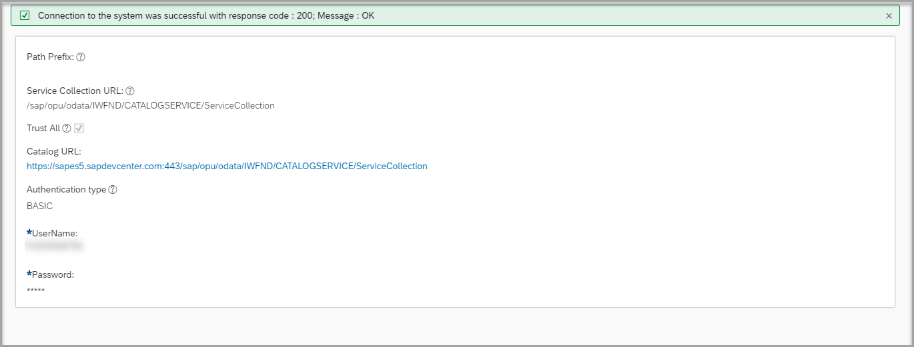
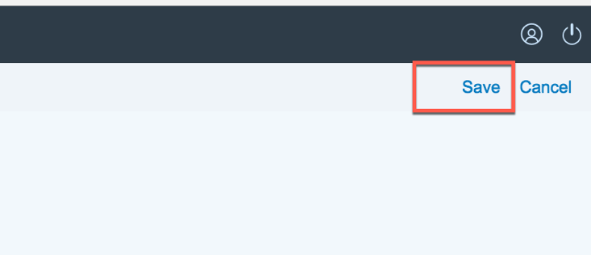

## Prerequisites
  - **Tutorial** [Create an Account on the Gateway Demo System](gateway-demo-signup)

## Details
### You will learn
  - How to create an API provider that points to SAP Gateway demo system named ES5

---

[ACCORDION-BEGIN [Step 1: ](Navigate to API Providers)]

From the API portal home page, navigate to **Configure**, by default **API Providers** tab will be selected.

[DONE]
[ACCORDION-END]
[ACCORDION-BEGIN [Step 2: ](Create API provider)]

1. Click on **Create**, to create a new API provider system.

    

2. Give the name in **Overview** tab as "ES5" and description.

    

3. Navigate to **Connection** tab, enter the following values:

    **Field** | **Value**
    ---- | ----
    Type |`Internet`
    Host |`sapes5.sapdevcenter.com`
    Port |`443`
    Use SSL |`Checked`

    

4. Navigate to **Catalog Service Settings**, enter the following values:

    **Field** | **Value**
    ---- | ----
    Service Collection URL |`/sap/opu/odata/IWFND/CATALOGSERVICE/ServiceCollection`
    Authentication Type |`Basic`
    User Name |`<Your user name of gateway system for eg ES5>`
    Password |`<Your password of gateway system for eg ES5>`
    TrustAll |`true`

    

5. Once the required fields are configured, click on **Save**.

    

[VALIDATE_2]

[ACCORDION-END]
