## Prerequisites

## Details
### You will learn
  - How to configure SAP Web IDE with the required destinations so that SAP Web IDE natively understands API Management as a data source
  - How to create a Fiori application using SAP UI5

---

[ACCORDION-BEGIN [Step 1: ](Create destinations)]

1. Navigate to cloud cockpit and click **Destinations**.

    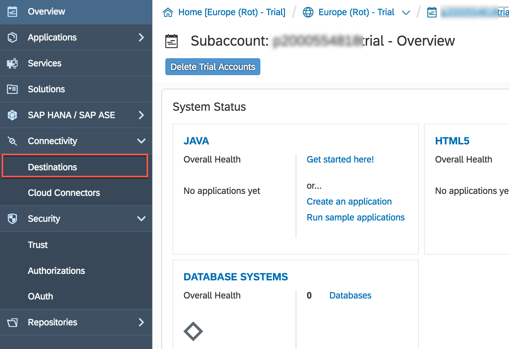

2. Copy the below destination as `apimgmt_proxy` and save it in your local filesystem.

    ```
    #
    #Mon Oct 22 09:36:47 UTC 2018
    Description=API Management Runtime
    Type=HTTP
    TrustAll=true
    Authentication=NoAuthentication
    WebIDEUsage=api_mgmt_proxy
    Name=apimgmt_proxy
    WebIDEEnabled=true
    URL=https://yourtrialuserpath.apim1.hanatrial.ondemand.com\:443<yourtrialuser>trial\
    ProxyType=Internet

    ```

    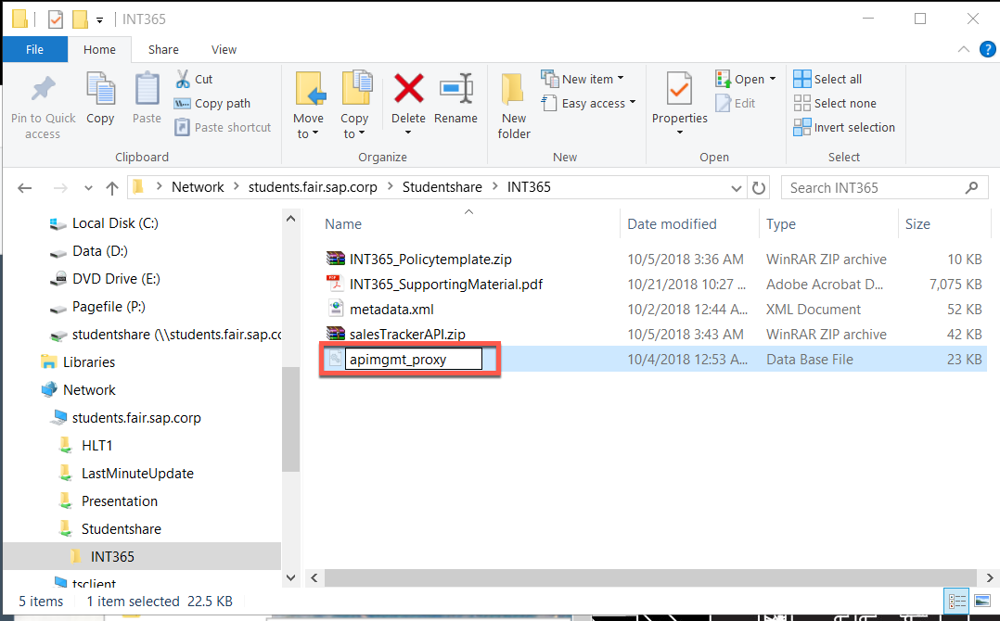

3. Click **Import Destination** and set the path to your local folder where you will place the two destination files and import `apimgmt_proxy`.

4. Once the destination is imported, change the URL to point to the API's virtual host URL.

    >We have used this URL in the above sections. Note that there are Additional Properties that we have also set.

5. Add the additional properties as below:
    >ignore if it is already added

    **Field** | **Value**
    ---- | ----
    `WEBIDEEnabled` |`true`
    `WEBIDEUsage` |`api_mgmt_proxy`
    `TrustAll` |`true`

    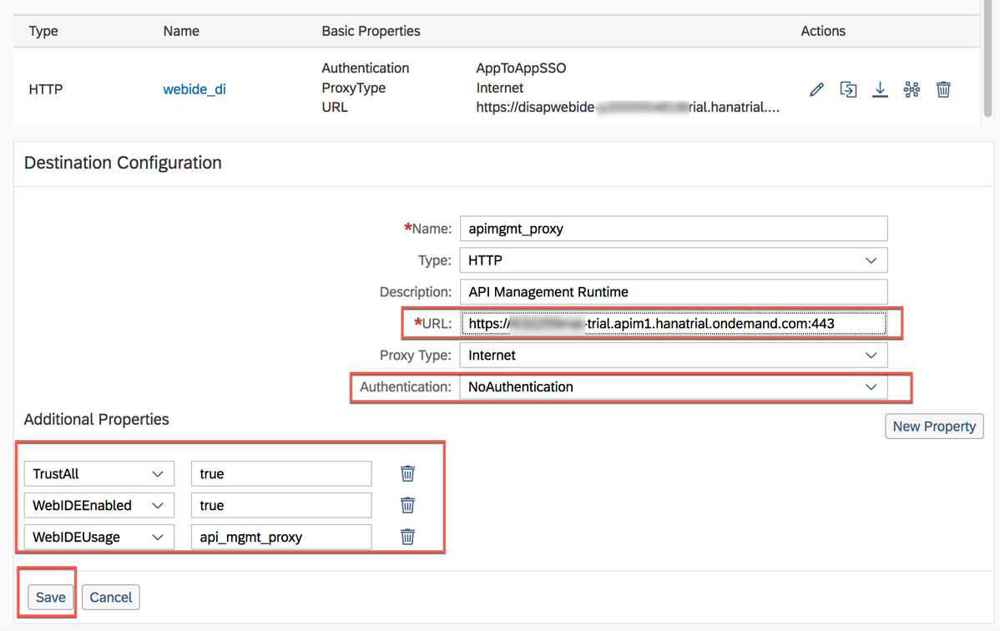

6. Copy the below destinations as `apimgmtdevportal` and save it in your local file system.

    ```INI
    #
    #Mon Oct 22 09:39:39 UTC 2018
    Description=API Management Dev Portal
    Type=HTTP
    TrustAll=true
    Authentication=AppToAppSSO
    WebIDEUsage=api_mgmt_catalog
    Name=apimgmtdevportal
    WebIDEEnabled=true
    URL=https://devportalu34f5b50f-yourtrialusernametrial.hanatrial.ondemand.com/
    ProxyType=Internet

    ```
    

7. Click again on **Import Destination** and set the path to your local folder where you will place the two destination files and import `apimgmtdevportal`.

8. Change the URL for this destination to point to the Developer Portal.

9. Add the additional properties as below:

    **Field** | **Value**
    ---- | ----
    `WEBIDEEnabled` |`true`
    `WEBIDEUsage` |`api_mgmt_proxy`
    `TrustAll` |`true`

    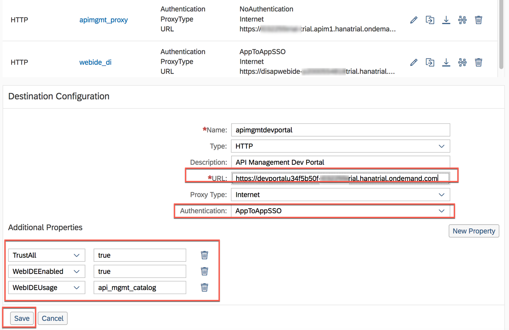

[VALIDATE_1]      
[ACCORDION-END]

[ACCORDION-BEGIN [Step 2: ](Enable SAP Web IDE)]

1. Navigate to your **Cloud Services** tab and search for `WebIDE`, click the SAP Web IDE Full-Stack tile.

    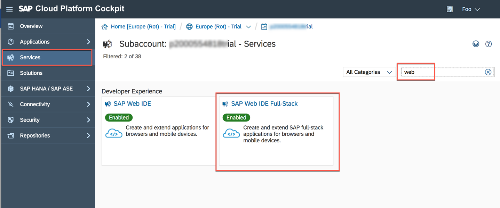

2. Enable the Service (if it's not already enabled).

    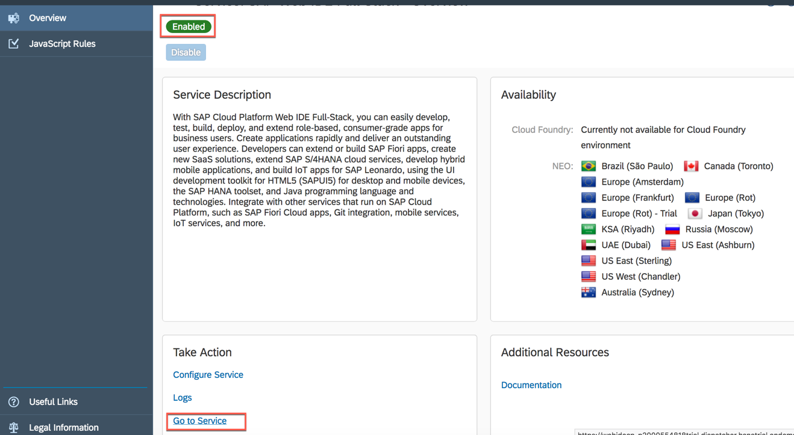

3. Launch the service.

[DONE]
[ACCORDION-END]


[ACCORDION-BEGIN [Step 3: ](Create SAP Fiori app)]

1. Create a new project from template.

    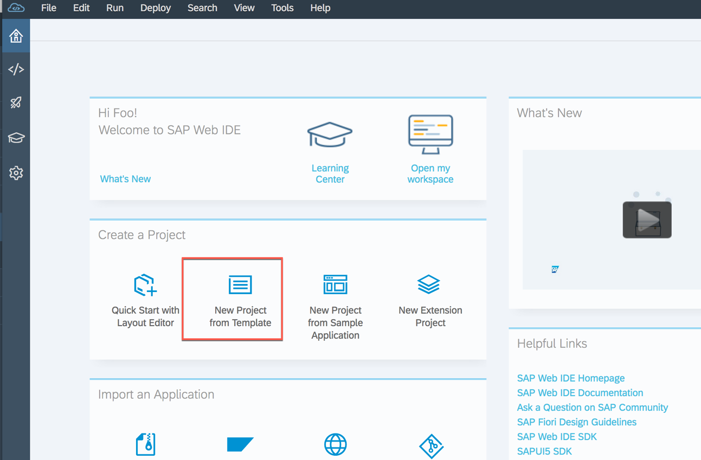

2. Select **SAP Fiori Master-Detail Application** template.

    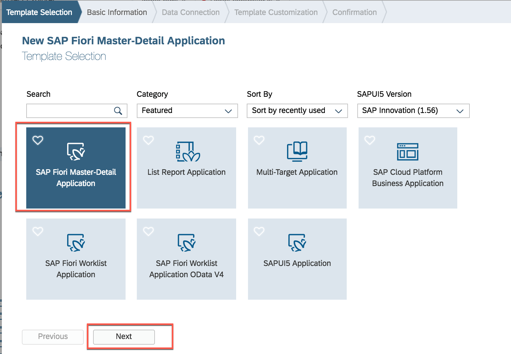

3. Enter a name, title and namespace for the project.

    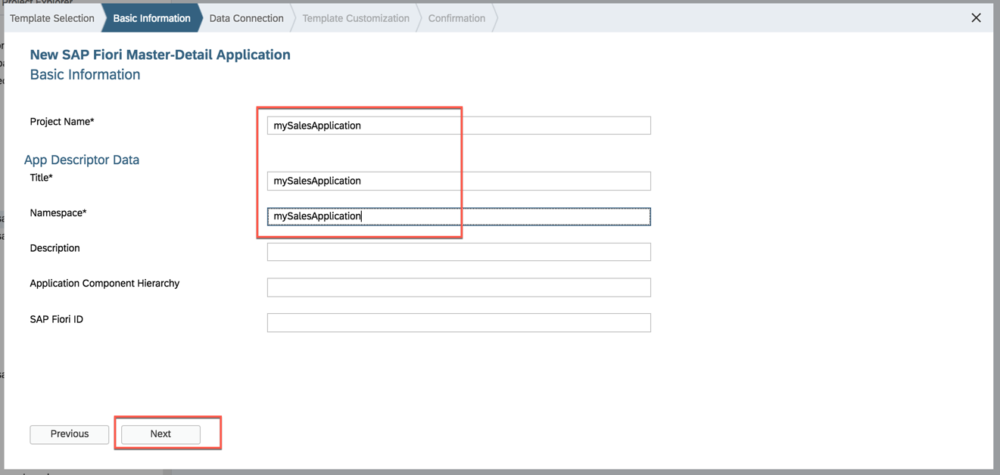

4. In **Service Catalog** as a data source, select the Developer Portal from the list of systems.

    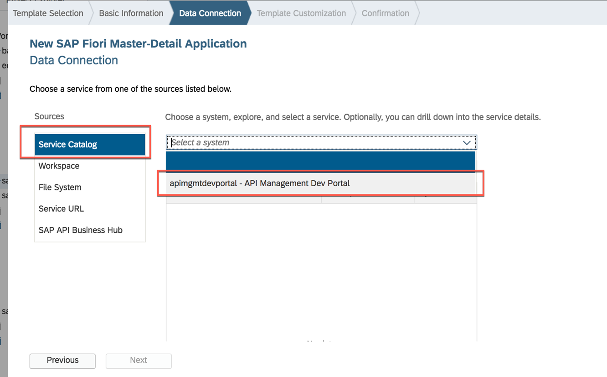

5. Select the API `salesTrackerAPI` we created in the above tutorials as the source.

    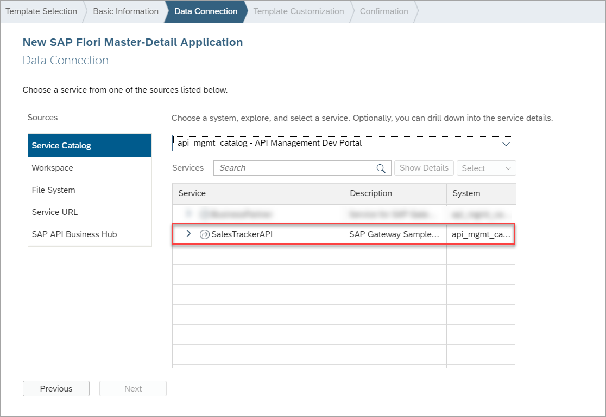

6. Select the product that this API is part of in order to continue.

    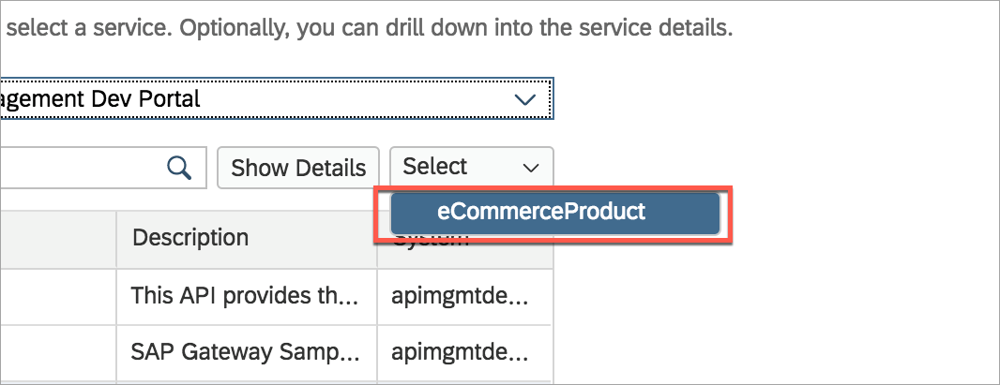

7. The system prompts that the selected API and product has been applied.

    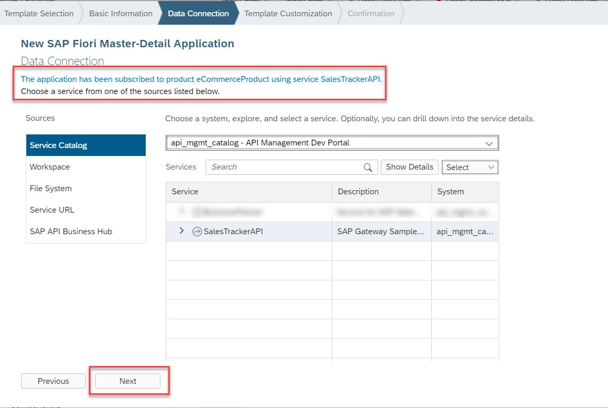

8. In the template customization screen, set the following properties:

    **Field** | **Value**
    ---- | ----
    `App Type` |`Standalone`
    `Object Collection` |`SalesOrderSet`
    `Object Collection Id` |`SalesOrderID`
    `Object Title` |`Customer Name`
    `Object Numeric Attribute` |`NetAmount`
    `Object Unit of Measure` |`CurrencyCode`

    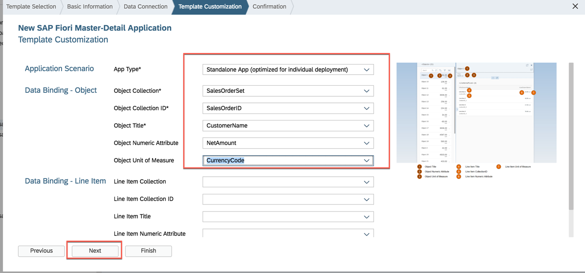

9. Click **Finish**

    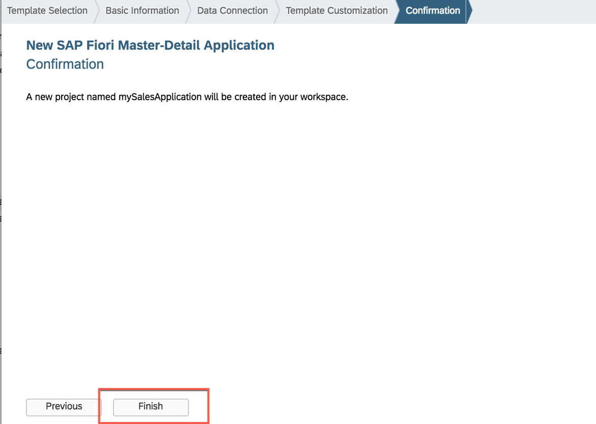

10. In the generated project, open `index.html` and set the script with source as:

    ```HTML
    <meta http-equiv="Content-Security-Policy" content="upgrade-insecure-requests">
   <script src="http://js.api.here.com/v3/3.0/mapsjs-core.js" type="text/javascript" charset="utf-8"></script>
   <script src="http://js.api.here.com/v3/3.0/mapsjs-service.js" type="text/javascript" charset="utf-8"></script>

    ```

    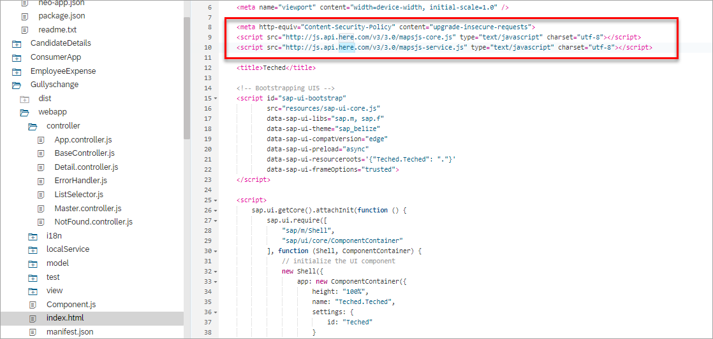

11. Go to `Detail.View.xml` and enter the `IconTabBar` node with the code as :

    ```XML
    <IconTabBar id="idIconTabBar" select="handleIconTabBarSelect" class="sapUiResponsiveContentPadding">
		   <items>
		      <IconTabFilter id="icon_tab1" text="Where Am I">
		         <ScrollContainer height="100%" width="100%" horizontal="false" vertical="true">
		            <HBox  height="300px" id="CustomerMapContainer" justifyContent="Center" alignItems="Center" />
		         </ScrollContainer>
		      </IconTabFilter>										
		   </items>
		</IconTabBar>

    ```

    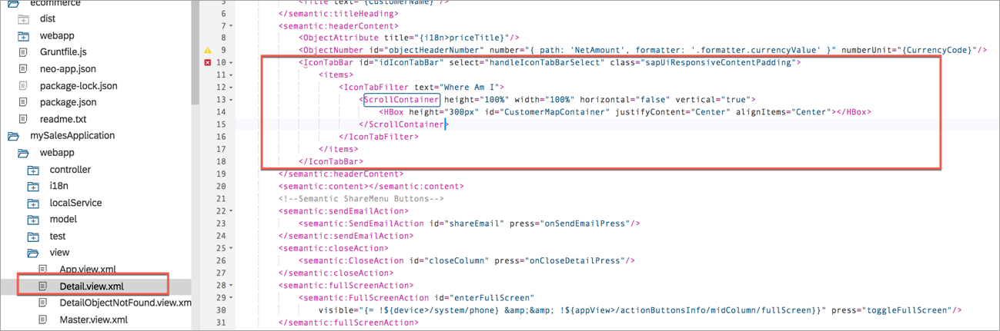

12. Go to `Detail.controller.js`, in the `onInit` method paste the following code:

    ```JavaScript
    this.map = null;
    this.marker = null;
    this.zoomLevel = 10;
    ```

    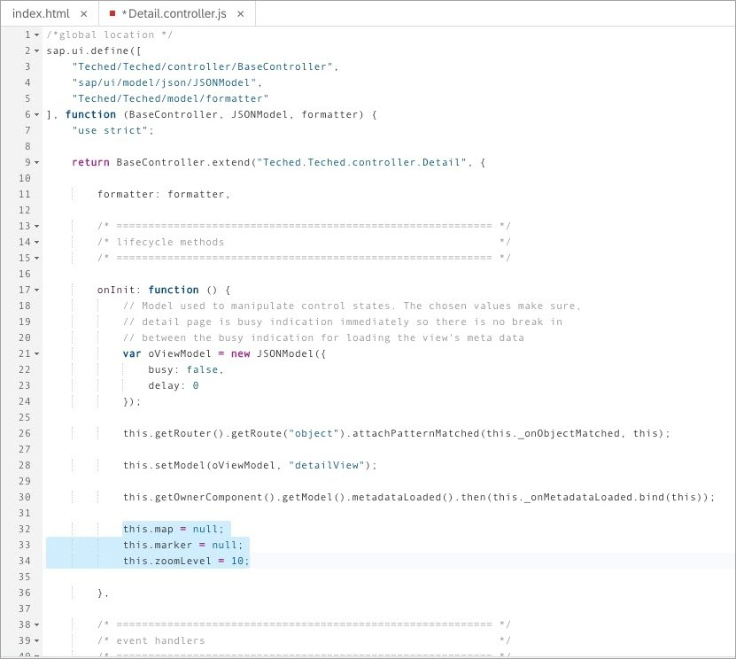

13. Place the following code:

    ```JavaScript
    var that = this;
    $.ajax({
                                                            url: this.getModel().sServiceUrl+oElementBinding.getPath()+"/ToBusinessPartner?$format=json",
                                                            json: true,
                                                            success:function(data){
                                                                           that.initHereMap();
                                                                           that.renderMap(data.d.Address.Latitude, data.d.Address.Longitude);
                                                            }
                                                          });
    ```

      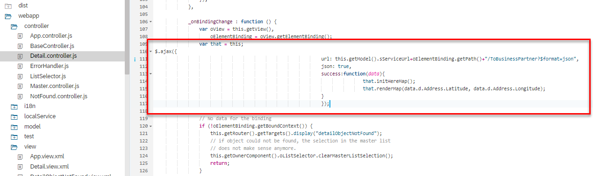

16. Open `manifest.json` file and check for URI path.

    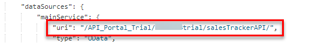

17. Render the `Map` by putting the following code:

    ```JavaScript
    initHereMap: function () {
            var _this = this;
            if (this.map !== null && this.map !== undefined && this.marker !== undefined && this.marker !== null)
                return;

            var platform = new H.service.Platform({
                'app_id': 'oQWjza17LVmRoXim1EPh',
                'app_code': '7T27TUp0PA0zQHiOriH8bA'
            });

            var defaultLayers = platform.createDefaultLayers();

            this.map = new H.Map(
                this.getView().byId("CustomerMapContainer").getDomRef(),
                defaultLayers.normal.map, {
                    zoom: _this.zoomLevel,
                    center: {
                        lng: 0,
                        lat: 0
                    }
                });

            this.marker = new H.map.Marker({
                lat: 0,
                lng: 0
            });
            this.map.addObject(this.marker);

        },
        renderMap: function (sLat, sLong) {
            if (sLong === null || sLat === undefined ||  sLong===undefined || sLat===null) {
                    let fixed=3;
                    sLat=(Math.random() * (90 - 0) + 0).toFixed(fixed) * 1;
                    sLong=(Math.random() * (180 - 0) + 0).toFixed(fixed) * 1;
            }

            this.marker.setPosition({
                    lat: sLat,
                    lng: sLong
                });

                this.map.setCenter({
                    lat: sLat,
                    lng: sLong
                });
        },
    ```
    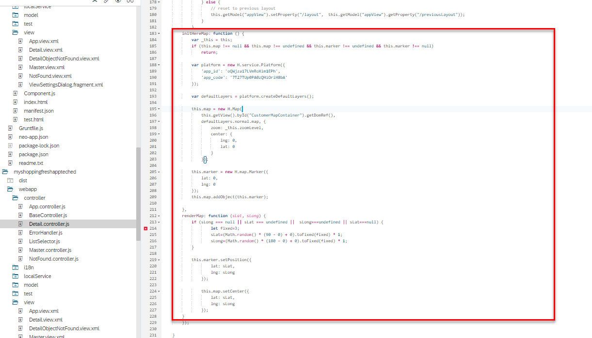

[DONE]
[ACCORDION-END]

[ACCORDION-BEGIN [Step 4: ](Deploy app)]

1. Click **Deploy** and deploy it to SAP Cloud Platform.

    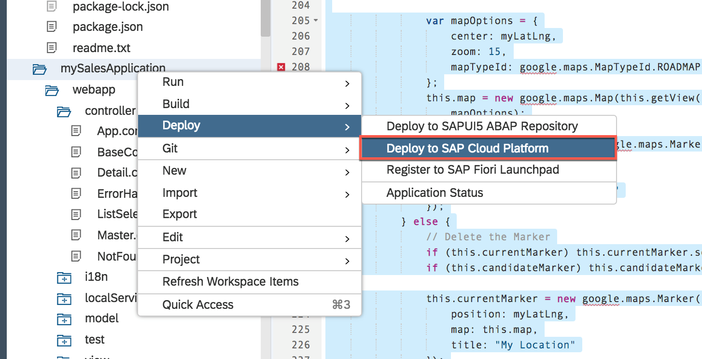

2. Go to the cockpit's home page and click **HTML 5 Applications**.

    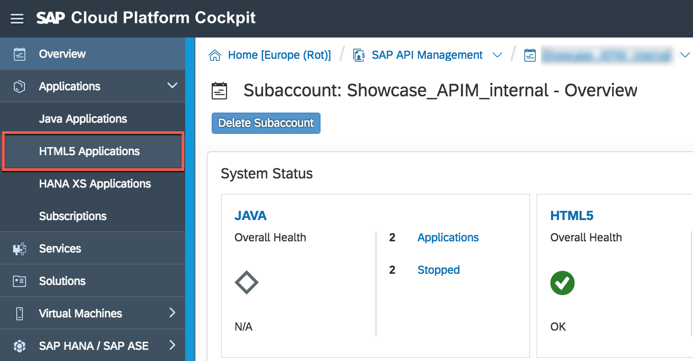

3. Select the application you just deployed.

    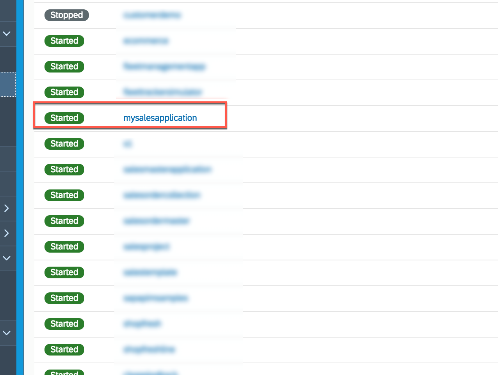

4. Click the application URL to launch the application.

    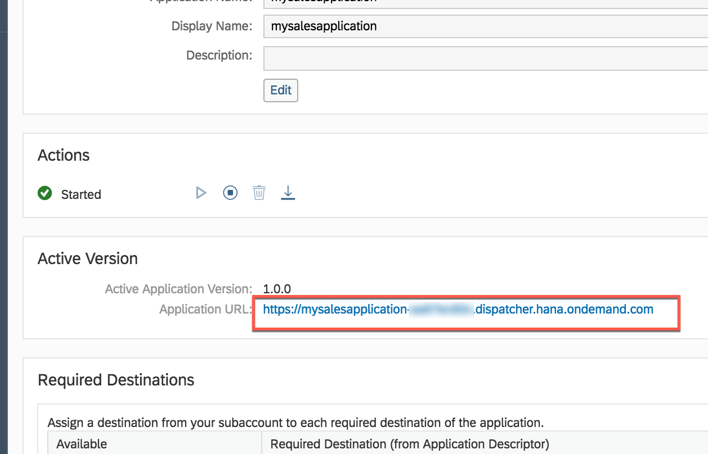

5. Click one of the results and the location in the map for the selected business partner responsible for the sales order shows up.

    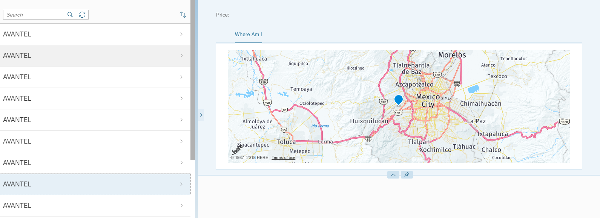

[DONE]
[ACCORDION-END]

---
