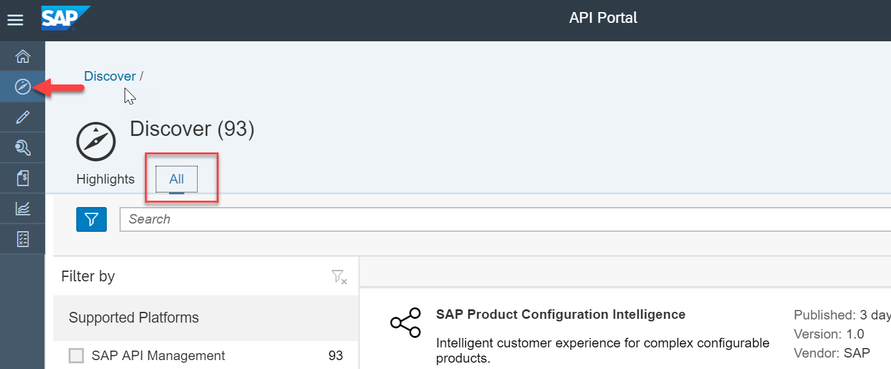
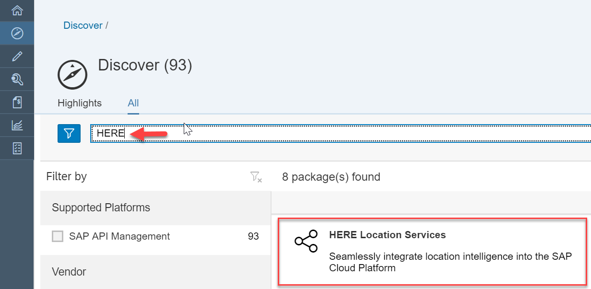
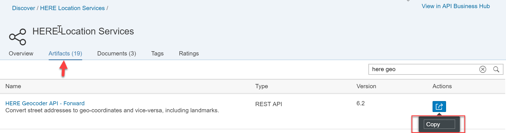
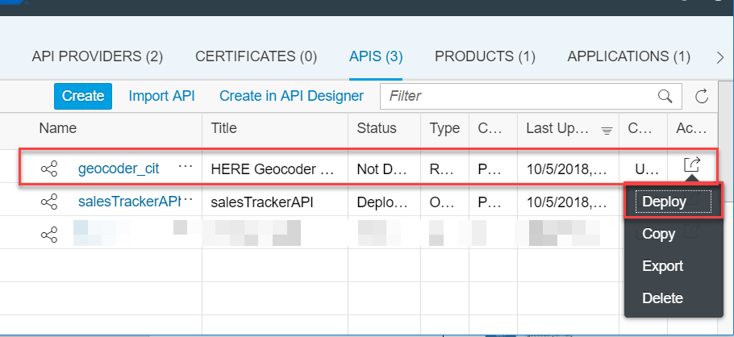
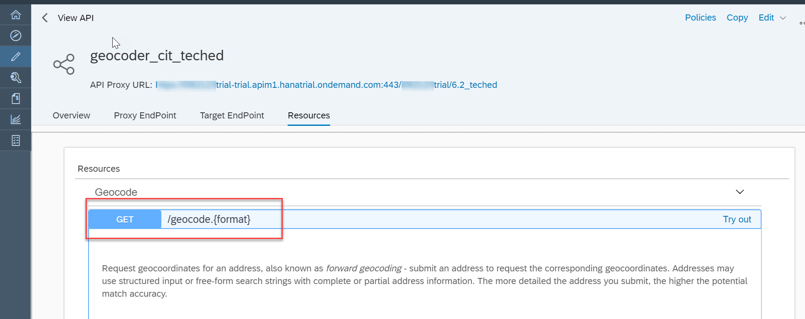

## Details
### You will learn
  - How to discover HERE Location Suite API from SAP API Business Hub

---

[ACCORDION-BEGIN [Step 1: ](Discover HERE APIs)]

1. Navigate to **Discover** on API Portal and select **ALL**.

    !

2. Enter the text `HERE` in the search box to filter the list of APIs shown.

    From the result list, click **HERE Location Services** .

    !

3. Click on **Artifacts** tab from the Package.

    Select the **Copy** action on the `HERE Geocoder API - Forward` line item.

    !

4. In the resulting dialog, review the populated parameters and click **OK**.

    

5. Select the newly created API and click on **Deploy**.

    !

    >Make a note of the API Proxy URL and the base path in a separate notepad (`/<yourtrialuser>/6.2`). You will need this for a later step.

6. Open the proxy again and click on **Resource** tab.

    Review the listed Resource ``/geocode.{format}``

    !

    >As you expand the resource, you will notice that in order to test the API, one needs a real `app_id` and `app_code` parameter. You can register with HERE.com and request your own `app_id` and `app_code`.
    It is suggested you write down your `app_id` / `app_code` to a notepad or other easily accessible location for future use.

[DONE]
[ACCORDION-END]

[ACCORDION-BEGIN [Step 1: ](Test yourself)]

[VALIDATE_1]
[ACCORDION-END]

---
