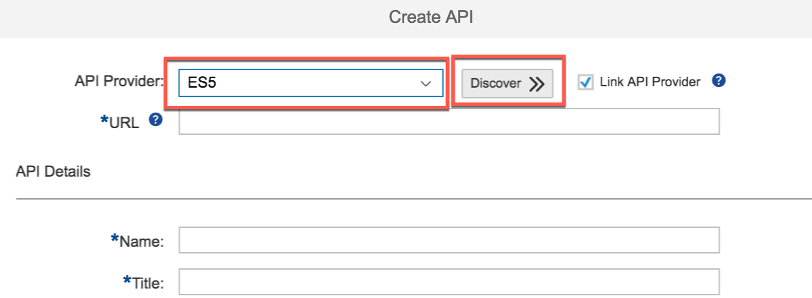
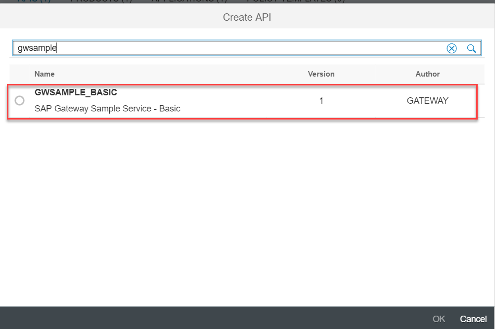
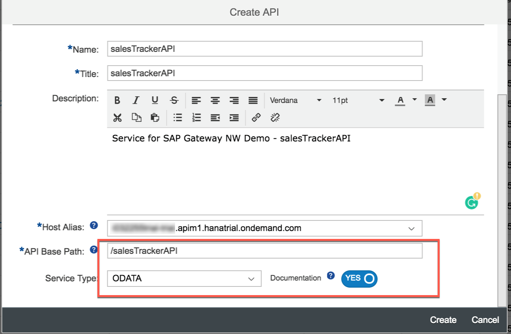
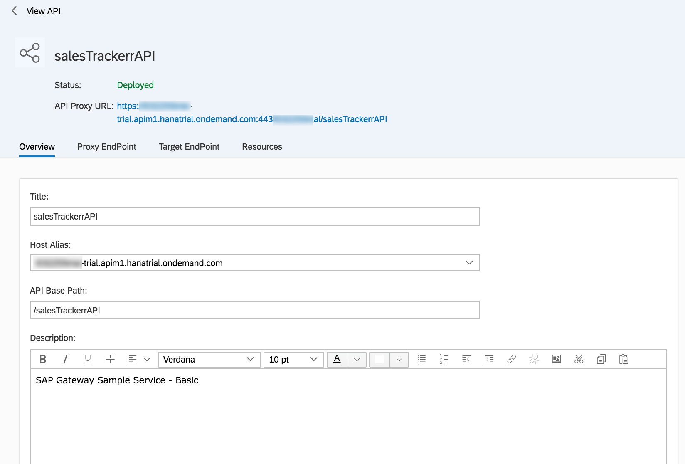
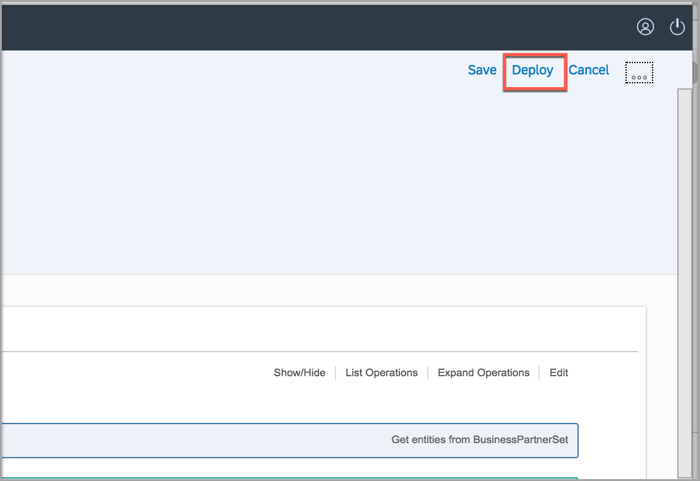

## Details
### You will learn
 - How to discover OData APIs from backend Gateway system  

---

[ACCORDION-BEGIN [Step 1: ](Discover OData API from Gateway system)]

1. Navigate to **Develop** and click on **Create** to launch the wizard for new API creation.

    

    >Note that by default the API Provider would have been set to NONE

2. Select `ES5` and click on **Discover** to discover the services in this system.

    

[VALIDATE_1]

[ACCORDION-END]

[ACCORDION-BEGIN [Step 2: ](Create API proxy)]

1. In the search field, start typing `gwsample`, this will list `GWSAMPLE_BASIC`, the sample service from Gateway, select this entry.

    

2. Enter the Name and Title of the API as provided below.

    **Field** | **Value**
    ---- | ----
    API Provider |`ES5`
    Name |`salesTrackerAPI`
    Title |`salesTrackerAPI`
    API Base Path |`salesTrackerAPI`

    

3. Click on **Create** and go to next page.

    

4. Click on **Deploy** to finally create and deploy the API proxy.

    

    >Inspect the API Proxy and note the API Proxy URL assigned.

[DONE]
[ACCORDION-END]

---
