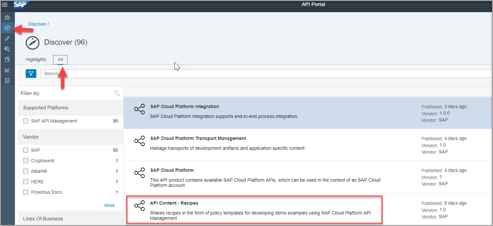
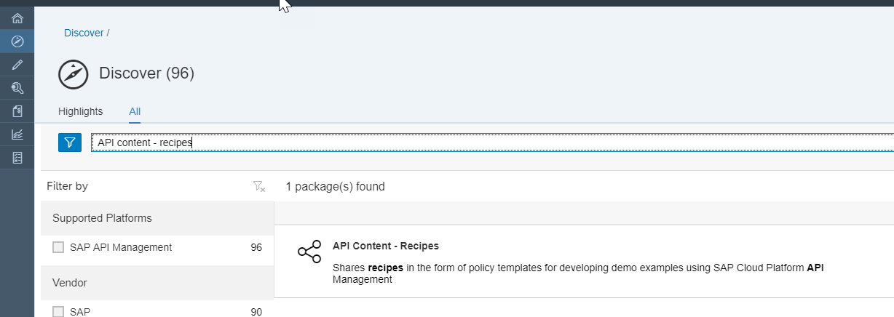
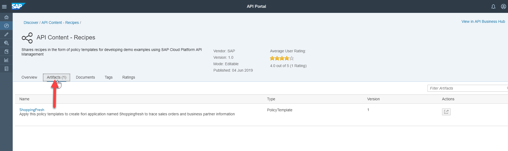
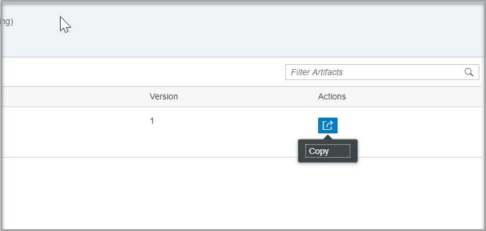
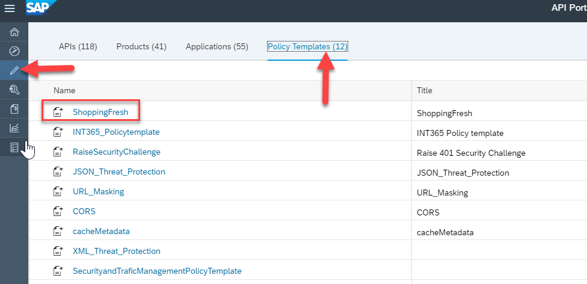
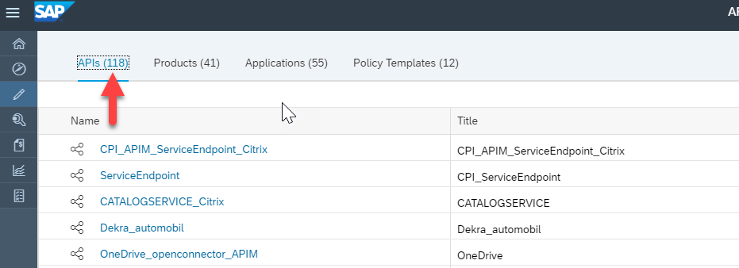
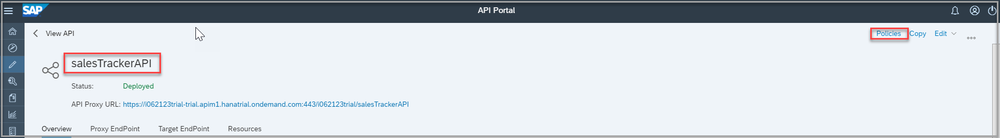
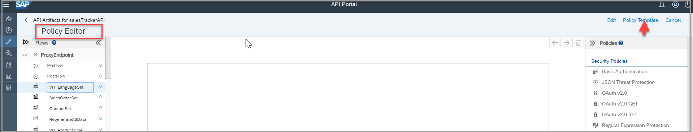
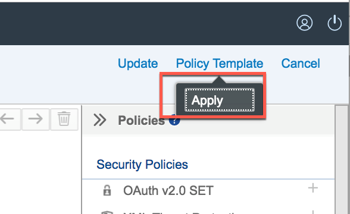
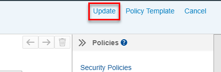

## Details
### You will learn
  - How to discover policy template in SAP API Business Hub.
  - How to import policies from template into the API Proxy.

---

[ACCORDION-BEGIN [Step 1: ](Discover policy template)]

1. Navigate to **Discover** from API Portal and select **ALL**.

    

2. Search for `API Content - Recipes`.

    

3. Click it and navigate to **Artifacts** tab.

    

[DONE]
[ACCORDION-END]

[ACCORDION-BEGIN [Step 2: ](Copy policy template)]

1. From the **Actions** drop down select **Copy**.

    

2. Navigate to **Develop** and select **Policy Templates** tab.

    

    >The copied policy template should be available

[DONE]
[ACCORDION-END]

[ACCORDION-BEGIN [Step 3: ](Apply policy template)]
1. Navigate to **APIs** tab.

    

2. Go back to `SalesTrackerAPI` details screen and click **Policies**.

3. In the Policy editor screen, click **Edit**.
    - Go to the **Policy Template** button and click **Apply**.

      
    

5. Click **Update**, to update the policy template.

    - Click **Save** to save the policy editor.

    

[VALIDATE_3]

[ACCORDION-END]

---
