## Details
### You will learn
  - More about the policies like JavaScript policy, service call out and more

---

[ACCORDION-BEGIN [Step 1: ](Inspect the API proxy)]

1. On the `PreFlow` request path, inspect the first policy we've added is an Assign Message policy that injects the Base64 encoded equivalent of the user and password credentials for the backend.

    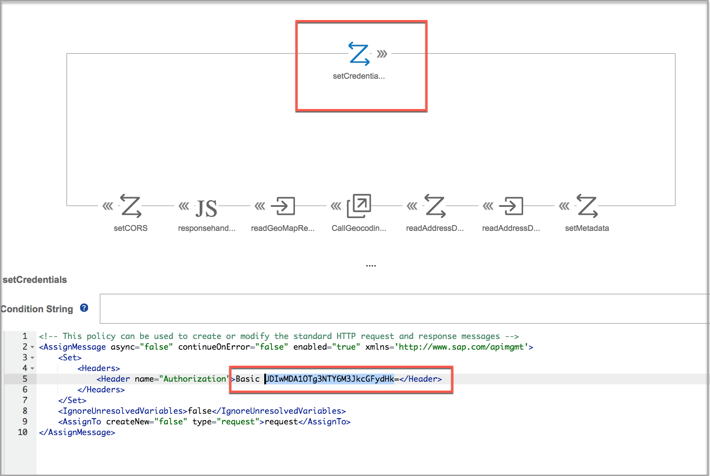

    >In case you have used your own `userid` and `password`, use a Base64 encoder tool to encode the text `username:password` – without the single quote and place it in the field instead.

2. On the `PreFlow` response path, note how we are redefining the $metadata resource of the ODATA API via the Assign Message policy.

    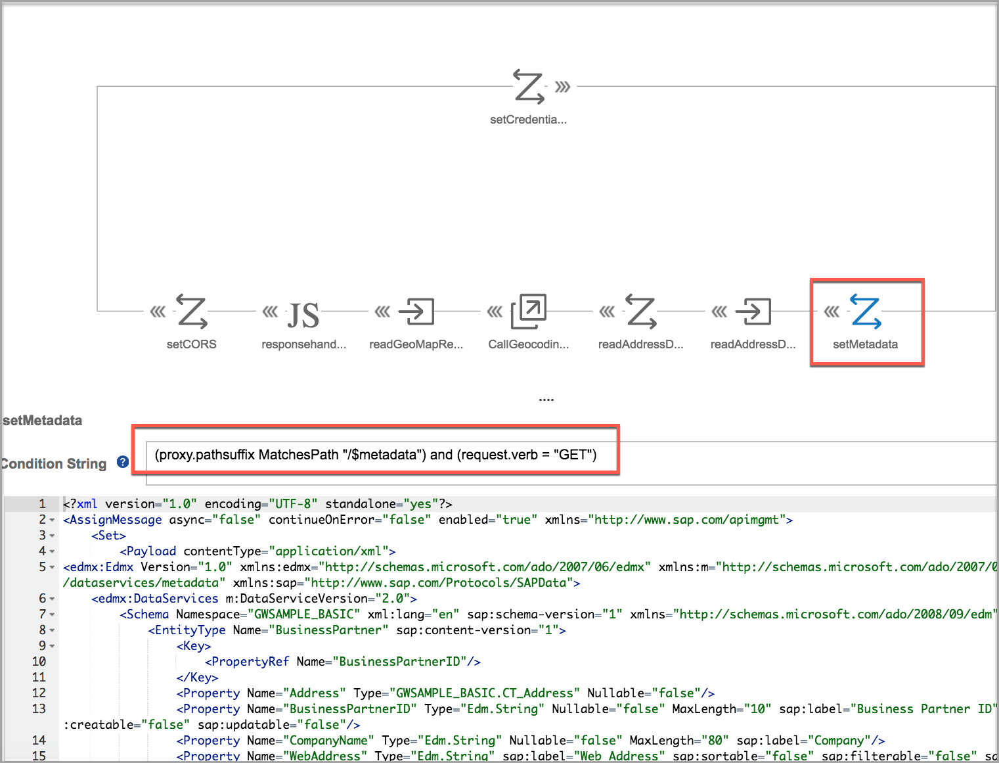  

    >Note in line no. 205 and 206 of the metadata, we have introduced properties `Latitude` and `Longitude` into the Address Complex type. These properties don't exist in the original service. By redefining the metadata at this point, we ensure that the client `(webIDE)` is led into assuming that the Latitude and Longitude is coming from the backend (composition scenario)

3. In the next policy, we extract the City, Street and Country variables from the payload.

    >Note that we do so, only if the call is for the `BusinessPartnerSet` `getEntity` operation or on the association call from `SalesOrderSet`

    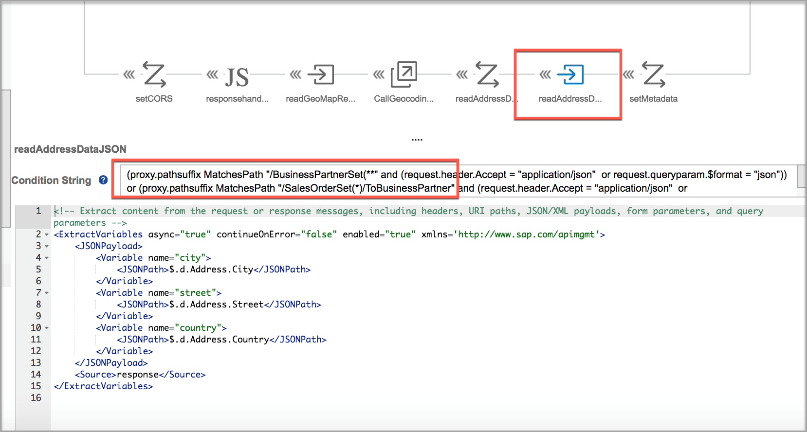

4. If the content type is XML, variables are extracted as shown in the policy.

    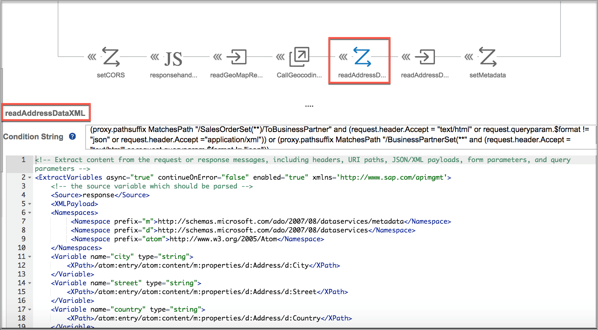

5. Make a service call out as a local target connection into the proxy path for the geocode API that we created. Replace the Path with `<actual relative path>/geocode.json` that represents your API proxy path of the geocoding API.

    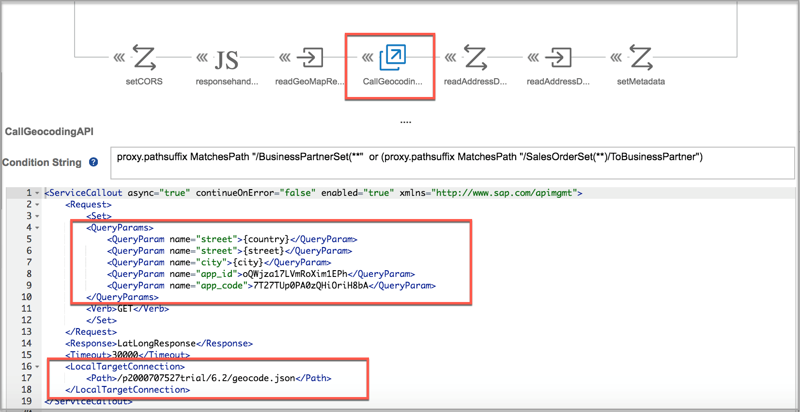

    >Note the `app_id` and `app_code` variables are hard coded for the scope of this exercise. We could have even retrieved these values from a secure key value map store.
    >If you are using the newer HERE trial `app_id` and `app_code` is combined into `appKey`. Kindly keep a watch.

6. Next, inspect the `readGeoMapResponse` policy, here you will note that we extract the Latitude and Longitude information from the response object and set in into variables named `lat` and `long`.

    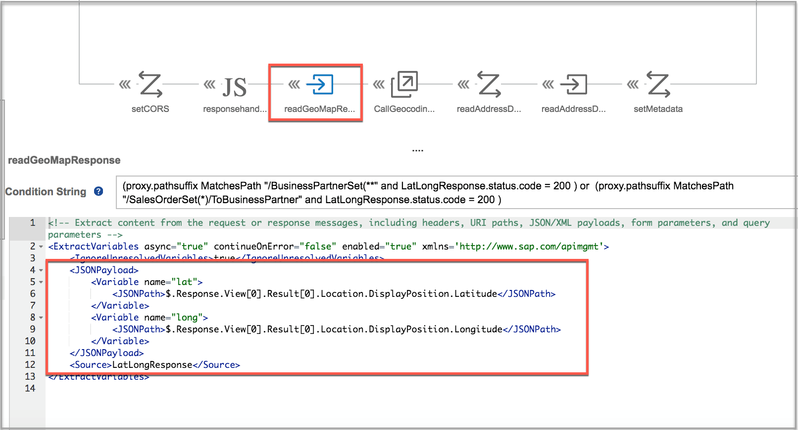

7. Refer to a Java Script policy to set the `lat` and `long` variables into the final response object.

    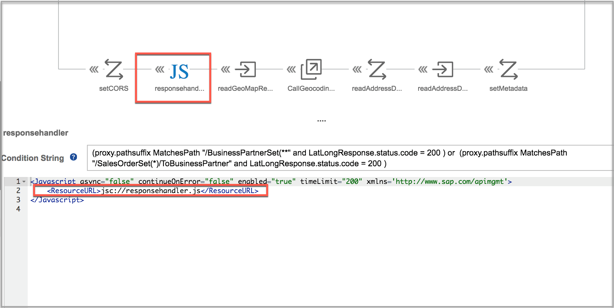

8. This policy is to introduce the headers needed to handle CORS.

    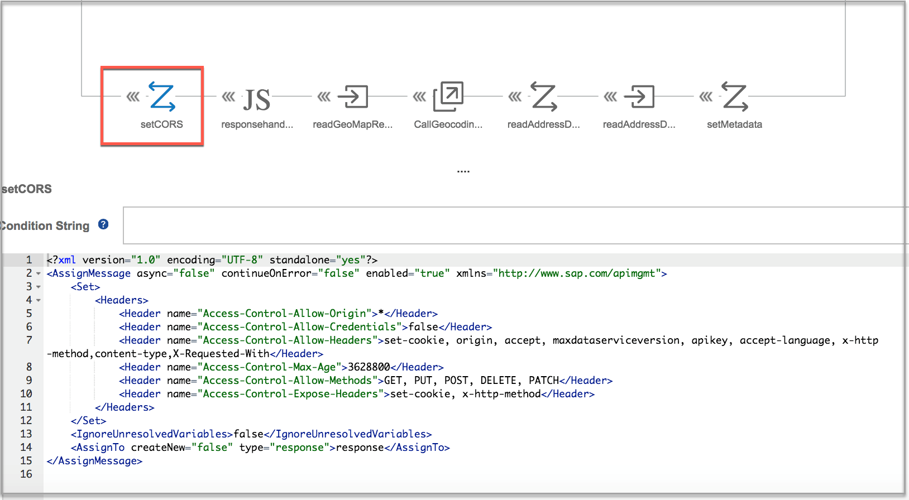

9. Go to the `responsehandler.js` resource under the `Scripts` section and here you will observe that we set the `lat` and `long` variables into the `Address` node of the response object both for JSON and XML type response.

    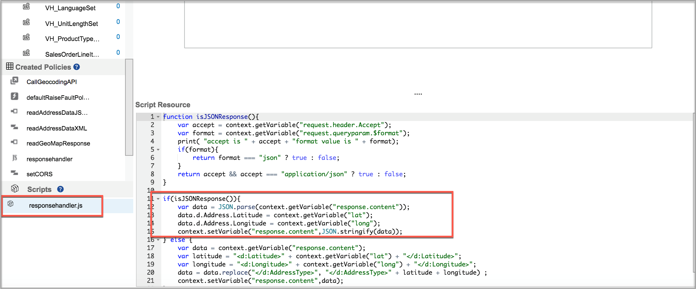

[VALIDATE_1]

[ACCORDION-END]

[ACCORDION-BEGIN [Step 2: ](Testing the API Proxy)]

1. Click the **API Proxy URL** from the details page to launch the URL in a new browser window.

      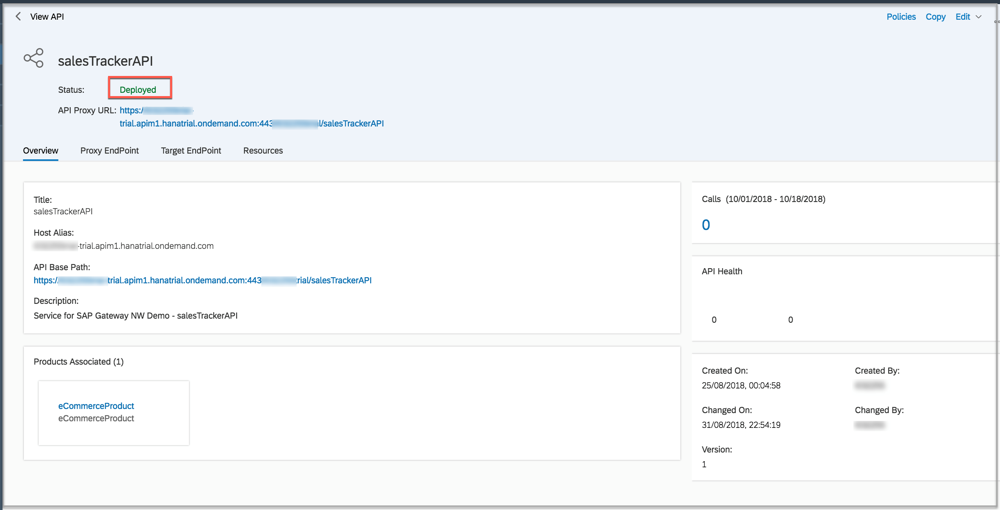

2. Append `BusinessPartnerSet` to the URL and you will notice that the call fails with a too big body exception.

    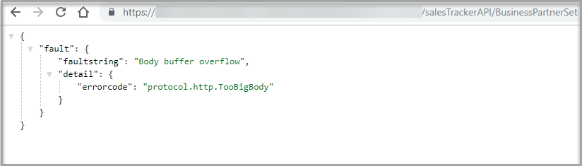
    >This is expected as there is a size restriction on the content that can be dispatched.

4. Append the API with `?$top=10`Query parameter.

    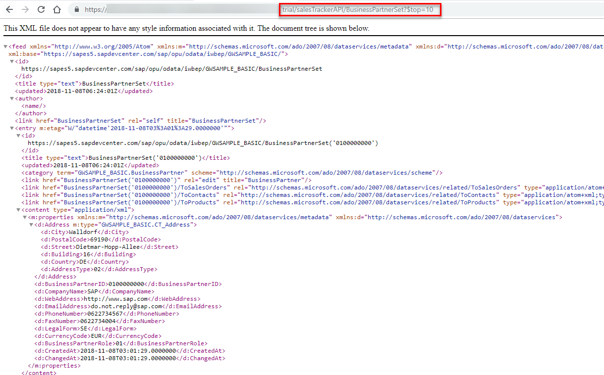
    >Make a note here that we don't find the Mashed up Geo coordinates in the response body. This is expected because, we have programmed to append the coordinates only in case of a get Specific call.

5. Pick up the instance id of any entry in the collection and make a get specific call.

    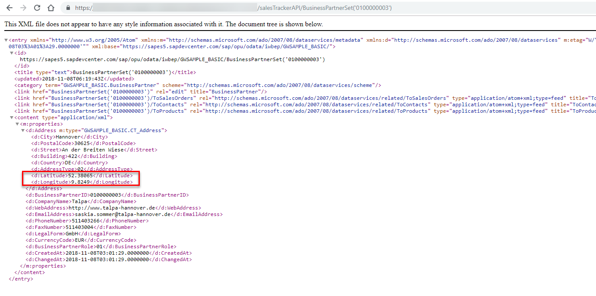
    >Now you will note that the Latitude and Longitude parameters are returned.

6. Make a call to the API metadata by appending `/$metadata` segment to the proxy base path.

    

[DONE]
[ACCORDION-END]

---
