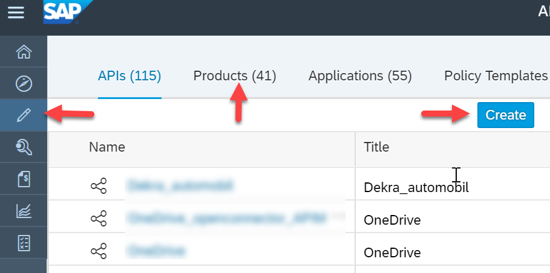
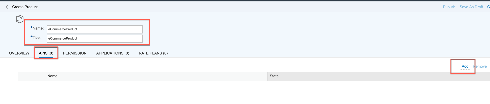
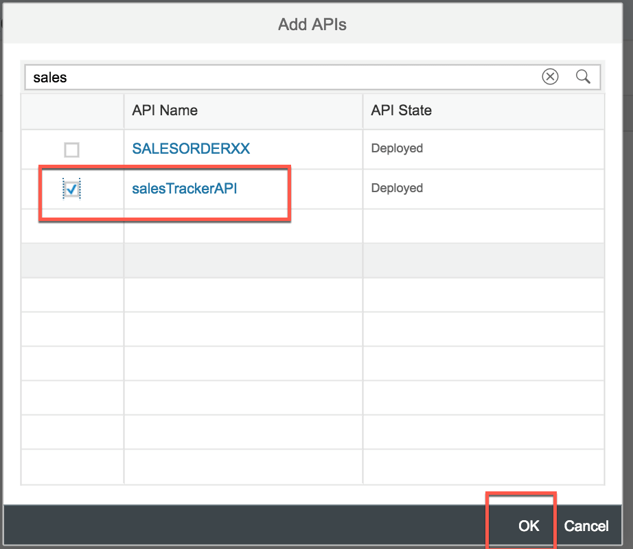
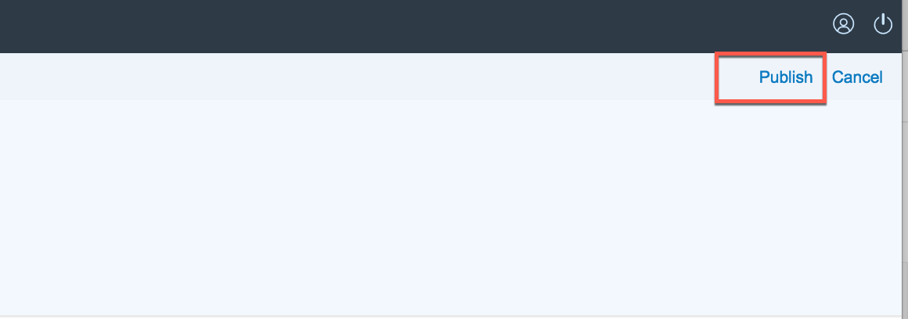
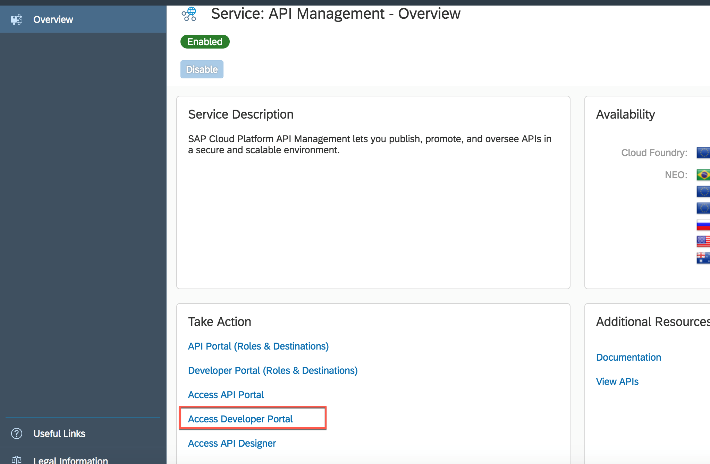
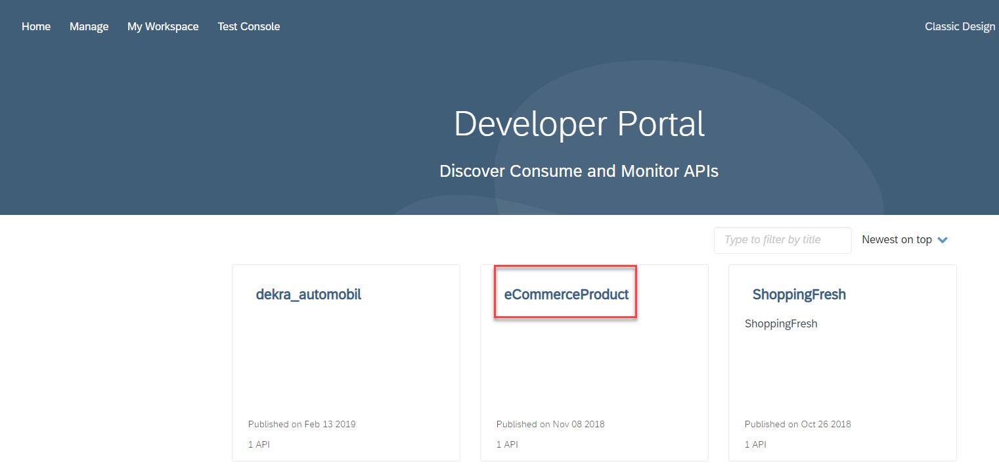

## Details
### You will learn
  - How to bundle APIs into product and publish it to Developer Portal

---

[ACCORDION-BEGIN [Step 1: ](Publish the API)]

1. Click on **Products** from the main API Portal **Develop** tab and click on **Create**.

    

2. Give the Product a name for example `eCommerceProduct`, click on **APIs** and click on **Add** button.

    

3. In the **Add APIs** dialog, select `saleTracketAPI` and check it.

    

4. Come back to the main product page and click on **Publish**.

    

[DONE]
[ACCORDION-END]

[ACCORDION-BEGIN [Step 2: ](Check published product in Developer Portal)]

1. Navigate  back to the main service page in Cloud Cockpit and click on `Access Developer Portal`.  

    

2. In the Dev Portal page, review that the published product appears. Now we are ready to consume this.

    

[VALIDATE_2]

[ACCORDION-END]

---
