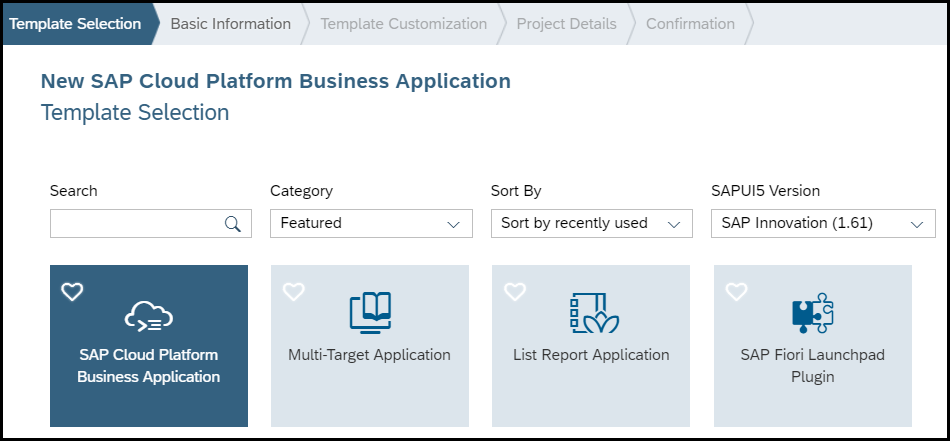
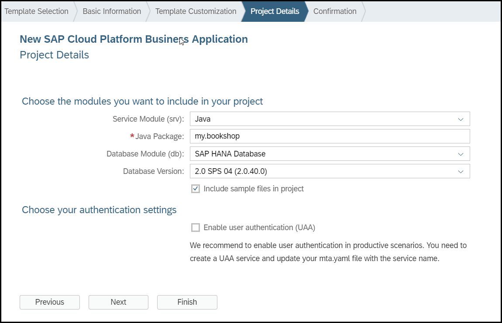
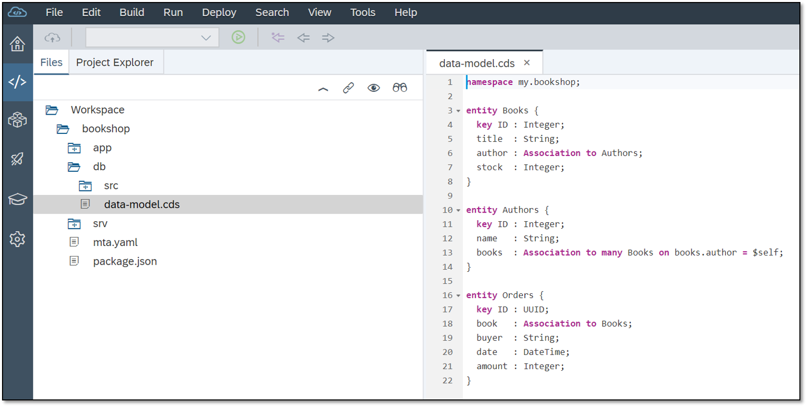
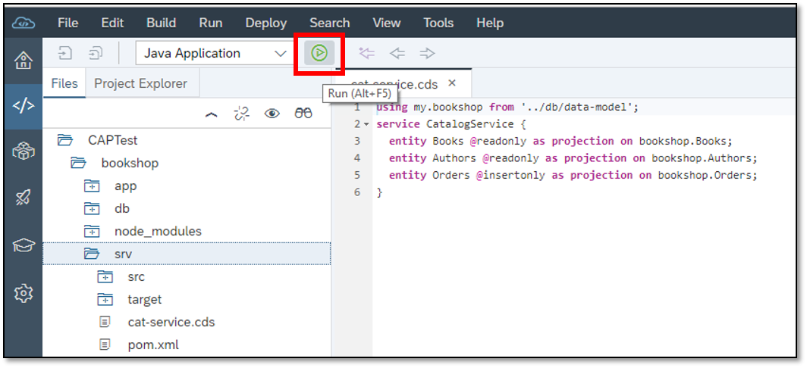
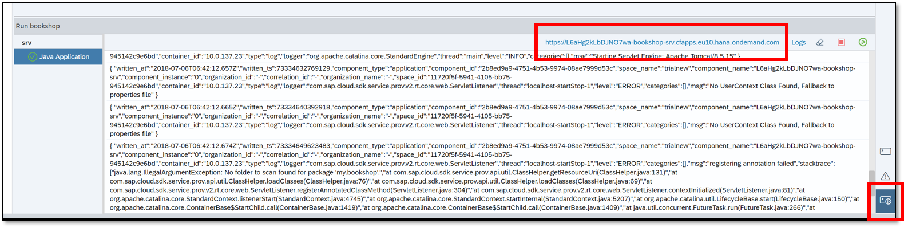

## Prerequisites  
 - [Get a free trial account on SAP Cloud Platform](https://developers.sap.com/tutorials/hcp-create-trial-account.html)
 - [Set Up Cloud Foundry and SAP Web IDE](https://developers.sap.com/tutorials/teched-cf-prereq1.html) 

## Details
### You will learn  
  - How to develop a simple business service on SAP Cloud Platform using the SAP Cloud Application Programming Model and SAP Web IDE Full-Stack

---

[ACCORDION-BEGIN [Step 1: ](Start a project)]

1. In SAP Web IDE choose **File** | **New** | **Project from Template**.

1. Search for **SAP Cloud Platform Business Application**.

    >If you see an error stating that you do not have a builder in your space, make sure you have completed the prerequisite, [Select a Cloud Foundry Space](https://help.sap.com/viewer/825270ffffe74d9f988a0f0066ad59f0/CF/en-US/98f49286ac05492f88428c603d146fc3.html), and saved your preferences.

       

    >If you do not see the template, make sure **All Categories** is selected from the **Category** drop-down menu and try again. If you still do not see the template, make sure the **SAP Cloud Platform Business Application Development Tools** are enabled. See [Developing SAP Cloud Platform Business Applications](https://help.sap.com/viewer/825270ffffe74d9f988a0f0066ad59f0/CF/en-US/99936743e1964680a0884479bfa75c8e.html).

1. Enter **`bookshop`** as the project name and choose **Next**.

1. In the **Template Customization** tab leave the default values.

1. Complete the **Project Details** tab as shown in the screenshot, ensuring that the **Include sample files in project** checkbox is checked.

    

    >You should update the **Java Package** to match the namespace used in this sample application, which is `my.bookshop`.

1. Choose **Finish**.

[DONE]

[ACCORDION-END]

[ACCORDION-BEGIN [Step 2: ](Define a data model)]

1. Open `db/data-model.cds` and replace the template with the following CDS definitions:

    ```CDS
    namespace my.bookshop;

    entity Books {
      key ID : Integer;
      title  : String;
      author : Association to Authors;
      stock  : Integer;
    }

    entity Authors {
      key ID : Integer;
      name   : String;
      books  : Association to many Books on books.author = $self;
    }

    entity Orders {
      key ID : UUID;
      book   : Association to Books;
      buyer  : String;
      date   : DateTime;
      amount : Integer;
    }
    ```

    

2. Save the file.

[VALIDATE_1]

[ACCORDION-END]

[ACCORDION-BEGIN [Step 3: ](Define a service)]

1. Go to `srv/my-service.cds` and open the context menu.

2. Choose **Rename** and change the file name to **`cat-service.cds`**.

3. Open `cat-service.cds` and replace the template with the following CDS definitions:

    ```CDS
    using my.bookshop from '../db/data-model';
    service CatalogService {
      entity Books    @readonly as projection on bookshop.Books;
      entity Authors  @readonly as projection on bookshop.Authors;
      entity Orders   @insertonly as projection on bookshop.Orders;
    }
    ```

    

4. Save the file.

[VALIDATE_2]

[ACCORDION-END]

[ACCORDION-BEGIN [Step 4: ](Test-run the service)]

1. Click on the **`srv`** module and choose **Run** from the global toolbar.

    

    >This might take a few minutes because a new cloud container has to be initialized and started. Subsequent restarts are much faster, because hot deployment is used.

1. Go to the **Run Console** and click on the URL.

    

    A new browser window opens containing a link to the OData service.

1. Click on the service link.

    The OData service document opens.

1. Add **`/$metadata`** to the URL and refresh.

    The OData metadata document opens in EDMX format.

1. Replace `/$metadata` with **`/Books`**.

    An error message is displayed because we have not added a database yet.

[DONE]

[ACCORDION-END]

---
