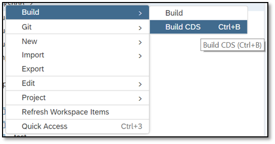
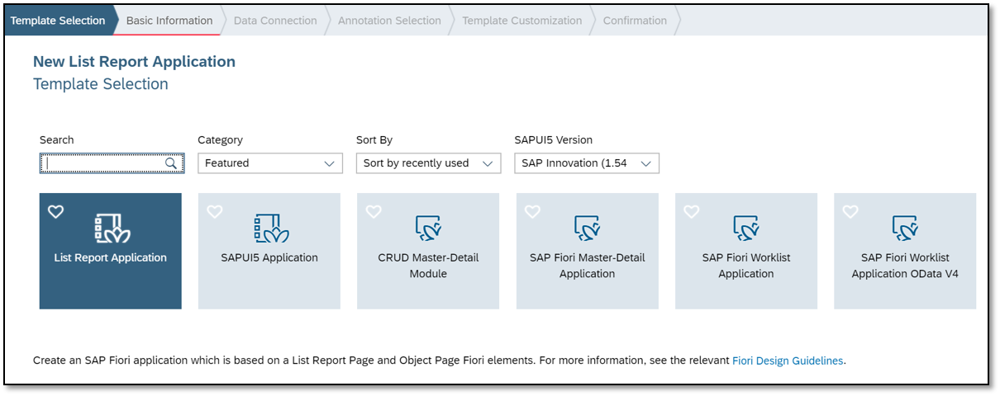
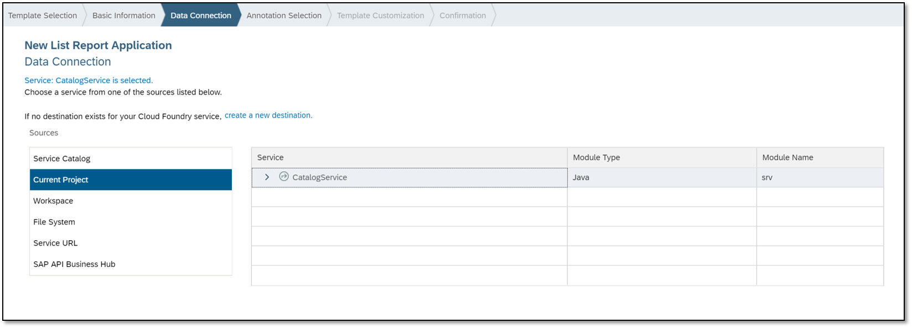
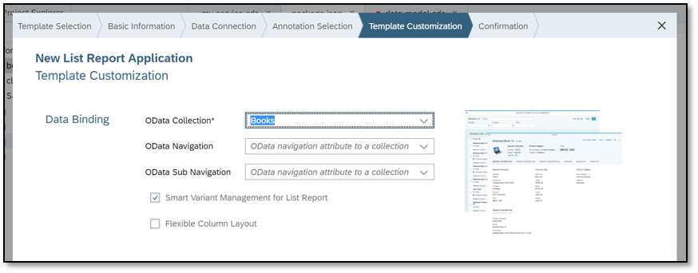
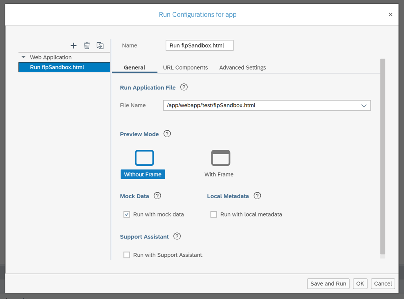
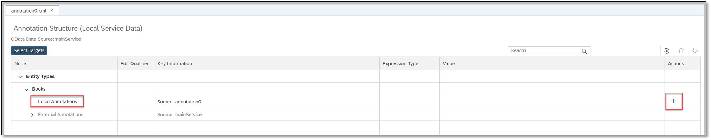
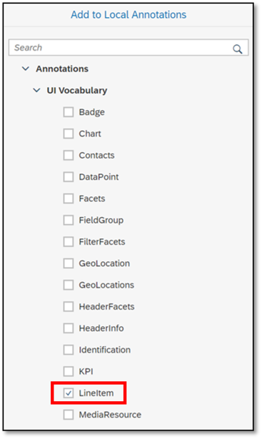

## Prerequisites  
 - **Tutorials:** [Create a Business Service Using CDS](https://www.sap.com/developer/tutorials/cp-apm-01-create-business-service.html)

## Details
### You will learn  
  - How to use SAP Web IDE Full-Stack HTML5 templates and the Annotation Modeler to create a UI for your business application.

---

[ACCORDION-BEGIN [Step 1: ](Compile OData models)]

1. In your workspace, right-click **bookshop**, your project root folder.
2. Choose **Build CDS**

    

The EDMX artifacts are generated and stored in `CatalogService.xml`.

[VALIDATE_2]

[ACCORDION-END]

[ACCORDION-BEGIN [Step 2: ](Add an HTML5 template)]

1. Right-click the **bookshop** folder and choose **New | HTML5 Module**
2. Choose **List Report Application**.

    

3. Complete the following fields:

    |  Field Name     | Value
    |  :------------- | :-------------
    |  Module Name    | `app`
    |  Title          | `Books`

4. Choose **Current Project** from the list of sources and then **`CatalogService`**.

    

5. Leave the **Annotation Selection** tab with the default values and choose **Next**.

6. In the **Template Customization** tab, choose **Books** in the **`OData Collection`** drop-down menu.

    >Leave the **`OData Navigation`** field blank.

    

This binds the application UI to the `Books` entity set.

[DONE]

[ACCORDION-END]

[ACCORDION-BEGIN [Step 3: ](Test-run the UI)]

1. Right-click the **app** module and choose **Run | Run As | Web Application**.
2. Choose **`flpSandbox.html`**.

    >If you have previously selected **`flpSandbox.html`** as your run configuration for web applications, you will not see a dialog box. Web IDE will use **`flpSandbox.html`** as the default.

3. In the **Destination Creation** dialog box, complete the following fields:

    |  Field Name                  | Description
    |  :-------------------------  | :--------------------------------------------------------------------------
    |  Neo Environment User ID     | The ID of your global subaccount that contains your Neo environment
    |  Neo Environment Password    | The password of your global subaccount that contains your Neo environment
4. Choose **Create**.
The SAP Fiori `launchpad` opens.

    >It might take a minute or two for the SAP Fiori `launchpad` to open.

[DONE]

[ACCORDION-END]

[ACCORDION-BEGIN [Step 4: ](Open your app)]

1. Select your app to see a preview of the UI application.
This might take a few seconds, but once it opens, you will see a table without columns, because UI annotations have not been defined.
2. Choose **Settings** to add the columns you want to see and choose **OK**.

    
3. Choose **Go**.
The empty columns are displayed.

[DONE]

[ACCORDION-END]

[ACCORDION-BEGIN [Step 5: ](Edit the run configurations)]

1. Right-click the **app** module and choose **Run | Run Configurations**.
2. Choose **`Run flpSandbox.html`** and check the **Run with mock data** option.

    

3. Choose **Save and Run**.

[DONE]

[ACCORDION-END]

[ACCORDION-BEGIN [Step 6: ](Re-open your app)]

1. Open the app from the SAP Fiori Launchpad and choose **Settings** to add the columns you want to see.
2. Choose **OK**.
3. Choose **Go**.

The columns are displayed with mock data

[DONE]

[ACCORDION-END]

[ACCORDION-BEGIN [Step 7: ](Add an annotation file)]

1. Go to `app/webapp`, right-click the **`localService`** folder and choose **New  Annotation File**
2. Leave the default values and follow the wizard.

[DONE]

[ACCORDION-END]

[ACCORDION-BEGIN [Step 8: ](Add UI annotations)]

1. Go to `app/webapp/localService` and right-click on the file you just created to use the context menu, selecting **`Open With -> Annotation Modeler`**.
2. Expand the **Books** entity.
The **Local Annotations** entry includes the annotation file you have just created.
3. Go to the **Actions** column and choose **`Add subnodes`**.

    

4. From the **Add to Local Annotations** dialog box, choose **`LineItem`** and then **OK**.

    

    A new entry is created: **`UI.LineItem`**.
5. For **`UI.LineItem`**, choose **`Add subnodes`**.
6. From the **`Add to UI.LineItem`** dialog box, choose **`DataField`** and then **OK**.
A new entry is created: **Value**.
7. Go to the **Value** column and choose **Title** from the **Property** drop-down menu.

    

8. Choose **Save** and then **Run**.
9. Choose **Go**

The application now shows data according to the added annotations.

[VALIDATE_1]

[ACCORDION-END]

---

## Next Steps
- [Add a Database to Your Business Application](https://www.sap.com/developer/tutorials/cp-apm-03-add-database.html)
