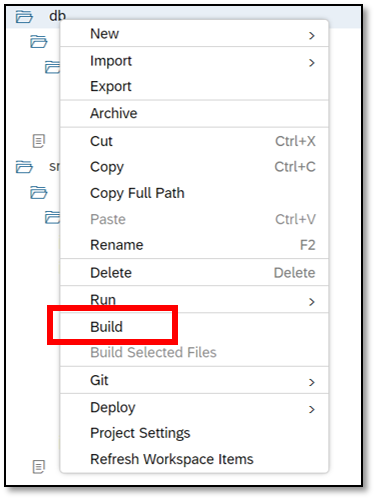
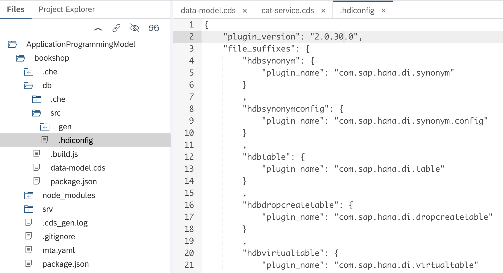
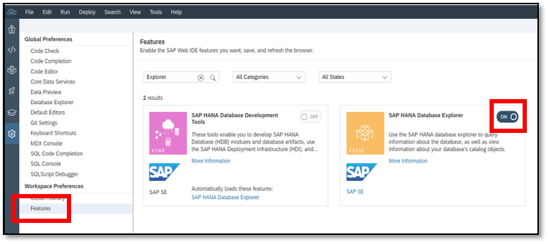
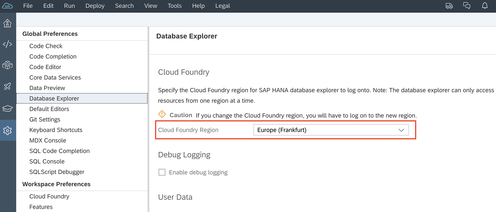
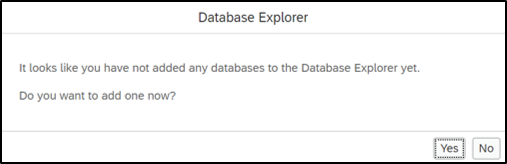
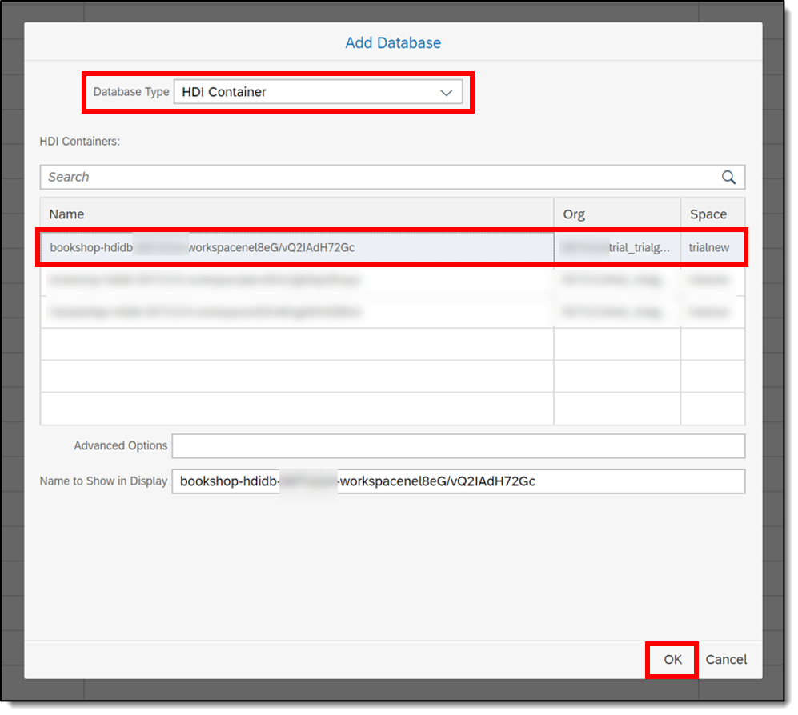

## Prerequisites  
 - [Add a UI to Your Business Application](https://developers.sap.com/tutorials/cp-apm-02-add-ui.html)

## Details
### You will learn  
  - How to deploy the data model you created for your business application to the SAP HANA database using SAP Web IDE Full-Stack

---

[ACCORDION-BEGIN [Step 1: ](Add a database)]

Right-click the **`db`** module and choose **Build**.

Wait for the notification that says the build was successful.

> If the build is unsuccessful, check the console log for errors. Errors similar to this one: `Warning: Could not find a configured library that contains the "com.sap.hana.di.afllangprocedure" build plugin in a version compatible to version 2.0.30.0 at "src/.hdiconfig"` can be addressed as follows:

> 1. Ensure all files in the project are shown, with menu path **View** > **Show Hidden Files**.

> 1. Expand the folder `db/src/` to find the file `.hdiconfig`.

> 1. Open the file and check the value of the `plugin_version` property at the top of the file. It needs to be `2.0.2.0`.

> 1. Change the value to `2.0.2.0` if necessary, being careful to maintain the structure and integrity of the rest of the file (basically, just change the value inside the double quotes).

> 1. **Save** the file, and re-try the build.

[DONE]

[ACCORDION-END]

[ACCORDION-BEGIN [Step 2: ](Enable SAP HANA Database Explorer)]

To view the generated deployment artifacts, SAP HANA database explorer must be enabled in SAP Web IDE. If you have already enabled the SAP HANA database explorer, go to step 3.

1. Go to **Tools | Preferences | Features**.

1. Search for the database explorer and enable it.

    

1. Choose **Save**. You may be prompted to refresh SAP Web IDE. If you are, do so.

1. While still in **Preferences**, choose **Database Explorer** and make sure the **Cloud Foundry Region** is set to the one you are using for this mission.

    

[DONE]

[ACCORDION-END]

[ACCORDION-BEGIN [Step 3: ](Open the SAP HANA Database Explorer)]

1. Go to **Tools | Database Explorer**.

1. If you haven't added any database before, you'll be prompted to do so - select **Yes** in the dialog box to continue (if you already have databases listed, you can add another one with the plus symbol at the top of the list).

    

1. Select the bookshop database.

    

    Once connected you can view the different database artifacts. For example, the books table that you have created.

[DONE]

[ACCORDION-END]

[ACCORDION-BEGIN [Step 4: ](Fill in initial data)]

1. Download the following files:

    [`Authors.csv`] (https://raw.githubusercontent.com/SAPDocuments/Tutorials/master/tutorials/cp-apm-03-add-database/csv/Authors.csv)

    [`Books.csv`] (https://raw.githubusercontent.com/SAPDocuments/Tutorials/master/tutorials/cp-apm-03-add-database/csv/Books.csv)

    [`Orders.csv`] (https://raw.githubusercontent.com/SAPDocuments/Tutorials/master/tutorials/cp-apm-03-add-database/csv/Orders.csv)

    [`Data.hdbtabledata`] (https://raw.githubusercontent.com/SAPDocuments/Tutorials/master/tutorials/cp-apm-03-add-database/csv/Data.hdbtabledata)

2. In your workspace, go to `bookshop/db/src/`, right-click on the **`src`** folder and choose **Import | File or Project**.

3. Browse to the location where you have saved the `Authors.csv` file.

4. In the **Import to** field, add **`/csv`** to the default location and choose **OK**.

    >This creates a **`/csv`** folder under `/bookshop/db/src` and adds the `Authors.csv` file to that location.

5. Repeat steps 2 and 3 to add the remaining 3 files to **`/csv`** folder.  

[VALIDATE_1]

[ACCORDION-END]

[ACCORDION-BEGIN [Step 5: ](Re-build the db module and run the app)]

1. Go back to your workspace and right-click the **`db`** module and choose **build**.

    Wait for the notification that says the build was successful.

2. Right-click the **app** module and choose **Run | Run Configurations**.

3. Choose **`Run flpSandbox.html`** and deselect **Run with mock data**.

4. Choose **Save and Run**.

5. Open your app from the SAP Fiori Launchpad and choose **Go**.

You now have actual data served automatically.

[DONE]

[ACCORDION-END]

---
