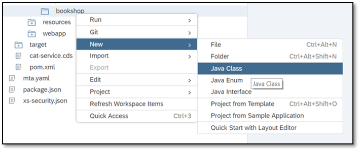

## Prerequisites  
 - **Tutorials:** [Add a Database to Your Business Application](https://www.sap.com/developer/tutorials/cp-apm-03-add-database.html)

## Details
### You will learn  
  - How to add custom handlers in your service model to adapt to situations that are not covered by the generic service provider

---

[ACCORDION-BEGIN [Step 1: ](Add a new Java class)]

1. In the **`srv`** module, go to `src/main/java/my/bookshop` and open the context menu.
2. Choose **New | Java Class**.

    

3. Enter **`OrdersService`** as the name and choose **Next**.

    

4. Choose **Finish**.

The `OrdersService.java` file is created.

[DONE]

[ACCORDION-END]

[ACCORDION-BEGIN [Step 2: ](Add custom code)]

Open the new `OrdersService.java` file and replace the template with the following code:

```java
package my.bookshop;

import java.util.ArrayList;
import java.util.List;

import com.sap.cloud.sdk.service.prov.api.*;
import com.sap.cloud.sdk.service.prov.api.annotations.*;
import com.sap.cloud.sdk.service.prov.api.exits.*;
import com.sap.cloud.sdk.service.prov.api.request.*;
import com.sap.cloud.sdk.service.prov.api.response.*;
import org.slf4j.*;

public class OrdersService {

  private static final Logger LOG = LoggerFactory.getLogger (OrdersService.class.getName());

  @BeforeRead (entity="Orders", serviceName="CatalogService")
  public BeforeReadResponse beforeReadOrders (ReadRequest req, ExtensionHelper h){
    LOG.error ("##### Orders - beforeReadOrders ########");
    return BeforeReadResponse.setSuccess().response();
  }

  @AfterRead (entity = "Orders", serviceName="CatalogService")
  public ReadResponse afterReadOrders (ReadRequest req, ReadResponseAccessor res, ExtensionHelper h) {
    EntityData ed = res.getEntityData();
    EntityData ex = EntityData.getBuilder(ed).addElement("amount", 1000).buildEntityData("Orders");
    return ReadResponse.setSuccess().setData(ex).response();
  }

  @AfterQuery (entity = "Orders", serviceName="CatalogService")
  public QueryResponse afterQueryOrders (QueryRequest req, QueryResponseAccessor res, ExtensionHelper h) {
    List<EntityData> dataList = res.getEntityDataList(); //original list
    List<EntityData> modifiedList = new ArrayList<EntityData>(dataList.size()); //modified list
    for(EntityData ed : dataList){
		  EntityData ex = EntityData.getBuilder(ed).addElement("amount", 1000).buildEntityData("Orders");
		  modifiedList.add(ex);
	  }
    return QueryResponse.setSuccess().setData(modifiedList).response();
  }
}  
```


>In this sample code, we set a value of 1000 for the property amount of each returned entity in reading operations.

[DONE]

[ACCORDION-END]

[ACCORDION-BEGIN [Step 3: ](Run the application)]

1. Right-click the **`srv`** module and choose **Run | Java Application**.
2. Go to the **Run Console** and click on the URL.
3. Add **`CatalogService/Orders`** to the URL.

    Look for **amount** and enter the value in the text area below.

[VALIDATE_1]

[ACCORDION-END]


---
