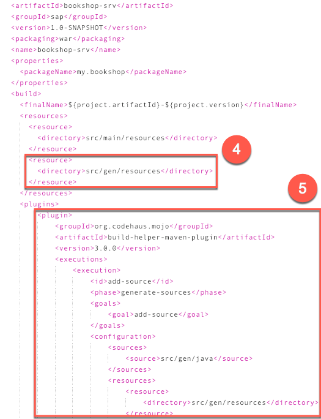
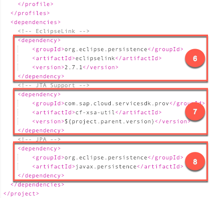

## Prerequisites  
 - **Tutorials:** [Add Custom Logic to Your Service](https://developers.sap.com/tutorials/cp-apm-04-custom-logic.html)

## Details
### You will learn  
  - How to use JPA to persist data to the underlying SAP HANA database layer

The application programming model intrinsically takes care of persisting data to the underlying SAP HANA database. However, you might also consider using JPA as an alternative, because it combines the best features from various other persistence mechanisms such as JDBC, JDO, and so on. JPA is also extremely easy to use.

---

[ACCORDION-BEGIN [Step 1: ](Generate JPA classes)]
In order to have JPA classes generated automatically for all the entities defined in the data model, let's add the CSN2JPA mapper to the build of the application.

1. Open the `package.json` file in the `bookshop` project folder and replace the build script as indicated in the following code:

    ```JSON
    "scripts": {
    	"build": "cds build --clean && cds compile db/data-model.cds -o ./",
    	[...]
    }
    ```

2. Save `package.json`.

3. In the **`srv`** module, open `pom.xml` file that specifies how Maven builds the Java backend.

4. Add the `resources` folder as a source directory.

    ```XML
    <project ...>
      [...]
      <build>
        [...]
        <resources>
          [...]
          <resource>
            <directory>src/gen/resources</directory>
          </resource>
        </resources>
        [...]
    ```

    

5. Add the CSN2JPA plugin in `pom.xml` as indicated in the following code:

    ```XML
    <project ...>
    	[...]
    	<build>
    	[...]
    		<plugins>
    			<!-- Add src/gen as source folder -->
    			<plugin>
    				<groupId>org.codehaus.mojo</groupId>
    				<artifactId>build-helper-maven-plugin</artifactId>
    				<version>3.0.0</version>
    				<executions>
    					<execution>
    						<id>add-source</id>
    						<phase>generate-sources</phase>
    						<goals>
    							<goal>add-source</goal>
    						</goals>
    						<configuration>
    							<sources>
    								<source>src/gen/java</source>
    							</sources>
    							<resources>
    								<resource>
    									<directory>src/gen/resources</directory>
    								</resource>
    							</resources>
    						</configuration>
    					</execution>
    				</executions>
    			</plugin>
    			<!-- Clean src/gen/java -->
    			<plugin>
    				<artifactId>maven-clean-plugin</artifactId>
    				<version>3.1.0</version>
    				<configuration>
    					<filesets>
    						<fileset>
    							<directory>src/gen/java</directory>
    							<followSymlinks>false</followSymlinks>
    						</fileset>
    					</filesets>
    				</configuration>
    			</plugin>
    			<!-- Use csn2jpa to generate JPA classes from CSN. -->
    			<plugin>
    				<groupId>com.sap.cloud.servicesdk.csn2jpa</groupId>
    				<artifactId>csn2jpa-maven-plugin</artifactId>
    				<version>1.4.0</version>
    				<executions>
    					<execution>
    						<phase>generate-resources</phase>
    						<goals>
    							<goal>csn2jpa</goal>
    						</goals>
    					</execution>
    				</executions>
    				<configuration>
    					<csnFile>${project.basedir}/../db/data-model.json</csnFile>
    					<outputDirectory>${project.basedir}/src/gen</outputDirectory>
    					<persistenceProvider>org.eclipse.persistence.jpa.PersistenceProvider</persistenceProvider>
    					<basePackage>com.sap.demo.bookshop.jpa</basePackage>
    					<parserMode>tolerant</parserMode>
    					<generatorMode>tolerant</generatorMode>
    				</configuration>
    			</plugin>

    			[...]
    ```

    > The CSN2JPA plugin is required in the build of the application to automatically generate the JPA classes. The latest version of `csn2jpa-maven-plugin` can be found in the [Maven Central Repository](https://search.maven.org).

6. In order to actually execute the JPA operations, add EclipseLink to the dependencies section of `pom.xml`.

    ```XML
    <project ...>
    	[...]
    	<dependencies>
    		[...]

    		<!-- EclipseLink -->
    		<dependency>
    			<groupId>org.eclipse.persistence</groupId>
    			<artifactId>eclipselink</artifactId>
    			<version>2.7.1</version>
    		</dependency>

    		[...]
    ```

    

7. Add `cf-xsa-util` to the dependencies section to support JTA transactions.

    ```XML
    <project ...>
    	[...]
    	<dependencies>
    		[...]

    		<!-- JTA Support -->
    		<dependency>
    			<groupId>com.sap.cloud.servicesdk.prov</groupId>
    			<artifactId>cf-xsa-util</artifactId>
    			<version>${project.parent.version}</version>
    		</dependency>

    		[...]
    ```

8. Add the JPA dependency.

    ```XML
    <project ...>
      [...]
      <dependencies>
        [...]

        <!-- JPA -->
        <dependency>
            <groupId>org.eclipse.persistence</groupId>
            <artifactId>javax.persistence</artifactId>
        </dependency>
        [...]
    ```

9. Save `pom.xml`.

10. Right-click the `bookshop` project and choose **Build**.
    > The CSN2JPA mapper generates all the JPA classes for the entities defined in the data model.

11. Right-click the `bookshop` project and choose **Refresh Workspace Items**.

[VALIDATE_1]

[ACCORDION-END]

[ACCORDION-BEGIN [Step 2: ](Add the JPA-based custom handler)]
Let's add the following JPA-based handler to the existing [custom logic](https://developers.sap.com/tutorials/cp-apm-04-custom-logic.html).

1. In the **`srv`** module, go to `src/main/java/my/bookshop` and open the `OrdersService.java` file.

2. Add the following imports:

    ```Java
    import java.util.UUID;
    import java.util.Date;
    import javax.naming.InitialContext;
    import javax.naming.NamingException;
    import javax.persistence.EntityManager;
    import com.sap.demo.bookshop.jpa.my.bookshop.Books;
    import com.sap.demo.bookshop.jpa.my.bookshop.Orders;
    import org.apache.olingo.odata2.api.exception.ODataApplicationException;
    import com.sap.cloud.sdk.service.prov.api.operations.*;
    ```

3. Add the following custom handler that overrides the Create operation of the `Orders` entity:

    ```Java
    @Create(entity = "Orders", serviceName="CatalogService")
    public CreateResponse createOrder(CreateRequest createRequest, ExtensionHelper extensionHelper) throws NamingException, ODataApplicationException {

      //First, we fetch an EntityManager from JNDI context to perform our JPA operations with.
      EntityManager em = (EntityManager) (new InitialContext()).lookup("java:comp/env/jpa/default/pc");

      //Next, we create an Orders object from the data sent with the Create request.
      //We set an ID for the order, its creation time, an order amount of 1000 units,
      //and set the object reference to the ordered book. All other attributes of the
      //Orders entity remain unchanged (for example, the buyer).
      Orders order = createRequest.getData().as(Orders.class);
      order.setID(UUID.randomUUID().toString());
      order.setDate(new Date());
      order.setAmount(1000);
      order.setBook(em.find(Books.class,createRequest.getData().getElementValue("book_ID")));

      //Using the persist method of the EntityManager we add the newly created
      //Orders object to the JPA persistency, so that once the current transaction is
      //committed, this new order is added to the database.
      em.persist(order);

      //Finally, to return the newly created entity in the response, we create an
      //EntityData representation of the order.
      EntityData createdEntity = EntityData.getBuilder(createRequest.getData())
        .addElement("ID", order.getID())
        .addElement("book", order.getBook())
        .addElement("buyer", order.getBuyer())
        .addElement("date", order.getDate())
        .addElement("amount", order.getAmount())
        .buildEntityData("Orders");

      return CreateResponse.setSuccess().setData(createdEntity).response();
    }
    ```

4. Save the file.

[DONE]

[ACCORDION-END]


[ACCORDION-BEGIN [Step 3: ](Enable JTA support and container management)]
In step 1, we saw how to generate the JPA classes. In addition to the JPA classes, a `persistence.xml` file is generated that contains some setup information for JPA. Let's enable JTA support in this file, so that the JPA transactions are in sync.

1. Open the `srv/src/gen/resources/META-INF/persistence.xml` file.

2. Add the `transaction-type` declaration to the persistence unit defined.

    ```XML
    <persistence ...>

    	<persistence-unit name="default" transaction-type="JTA">
    		[...]
    ```

3. Save the file.

4. Open the `srv/src/main/webapp/WEB-INF/web.xml` file.

5. Add the following reference so that the DataSource, encapsulating the connection to the database, is managed by the container (that is, application server):

    ```XML
    <web-app ...>

    	<resource-ref>
    		<res-ref-name>jdbc/java-hdi-container</res-ref-name>
    		<res-type>javax.sql.DataSource</res-type>
    		<res-auth>Container</res-auth>
    	</resource-ref>

    	[...]
    ```

6. Add the following reference so that the persistence context and persistence unit are known to the container:

    ```XML
    <web-app ...>
      [...]

      <persistence-context-ref>
        <persistence-context-ref-name>jpa/default/pc</persistence-context-ref-name>
        <persistence-unit-name>default</persistence-unit-name>
      </persistence-context-ref>

      [...]
    ```

7. Save the file.

8. Right-click the `srv` module and choose **Build**.

[DONE]

[ACCORDION-END]

[ACCORDION-BEGIN [Step 4: ](Change the runtime from Tomcat to TomEE)]
We are delegating the management of some resources to the container, like the management of transactions (JTA) and the management of the DataSource (encapsulating the connection to the database). These management features are supported by Java EE containers, like `TomEE`. As the default container of an application created using the application programming model is `Tomcat`, the following steps help you switch it from `Tomcat` to `TomEE`.

1. Open the `mta.yaml` file in the `bookshop` project folder.

2. Add `TARGET_RUNTIME: tomee` to the properties section. Also, update the `JBP_CONFIG_RESOURCE_CONFIGURATION` property, as `TomEE` uses `resources.xml` for this.

    ```YAML
    [...]
    modules:
    [...]
     - name: bookshop-srv
       type: java
       path: srv
       [...]
       requires:
        - name: bookshop-hdi-container
          properties:
             JBP_CONFIG_RESOURCE_CONFIGURATION: '[tomee/webapps/ROOT/WEB-INF/resources.xml:
                {"service_name_for_DefaultDB" : "~{hdi-container-name}"}]'
       properties:
          TARGET_RUNTIME: tomee
          buildpack: sap_java_buildpack
    [...]
    ```

    > The deployment of the whole application as an MTA is defined in the `mta.yaml` file. So we define `TomEE` as the runtime for the Java backend in this file.

3. Save the file.
4. Next, open `srv/src/main/webapp/META-INF/sap_java_buildpack/config/resource_configuration.yml`.
5. Replace the configuration with the following:

    ```YAML
    ---
    tomee/webapps/ROOT/WEB-INF/resources.xml:
      service_name_for_DefaultDB: java-hdi-container
    ```

6. Save the file.

7. Delete the file `srv/src/main/webapp/META-INF/context.xml`. This file is used by Tomcat for resource configuration and is, therefore, not needed anymore.

[DONE]

[ACCORDION-END]

[ACCORDION-BEGIN [Step 5: ](Test the application)]
Finally, let's run the application to see it all come together.

1. Build the `bookshop` project.

2. Right-click the `srv` module and choose **Run > Java Application**.

3. Use the `curl` tool to send the following request that creates an order for a specific book for a specific buyer.

    ```
    curl -H "Accept: application/json" -H "Content-Type: application/json" -X POST -d '{ "buyer": "JPA Buyer 1", "book_ID": 310 }' https://<Java-Backend-URL>/odata/v2/CatalogService/Orders
    ```

    > Here, the URL that the Java backend is listening to is `Java-Backend-URL`, the ID of the ordered book is 310, and the buyer is called JPA Buyer 1.

4. Request all the current orders (which include the newly created order), using the following command.

    ```
    curl -H "Accept: application/json" https://<Java-Backend-URL>/odata/v2/CatalogService/Orders
    ```

[DONE]

[ACCORDION-END]
---
