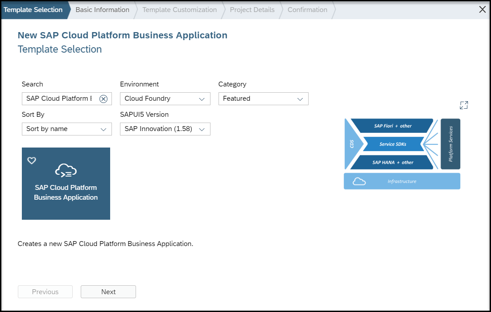
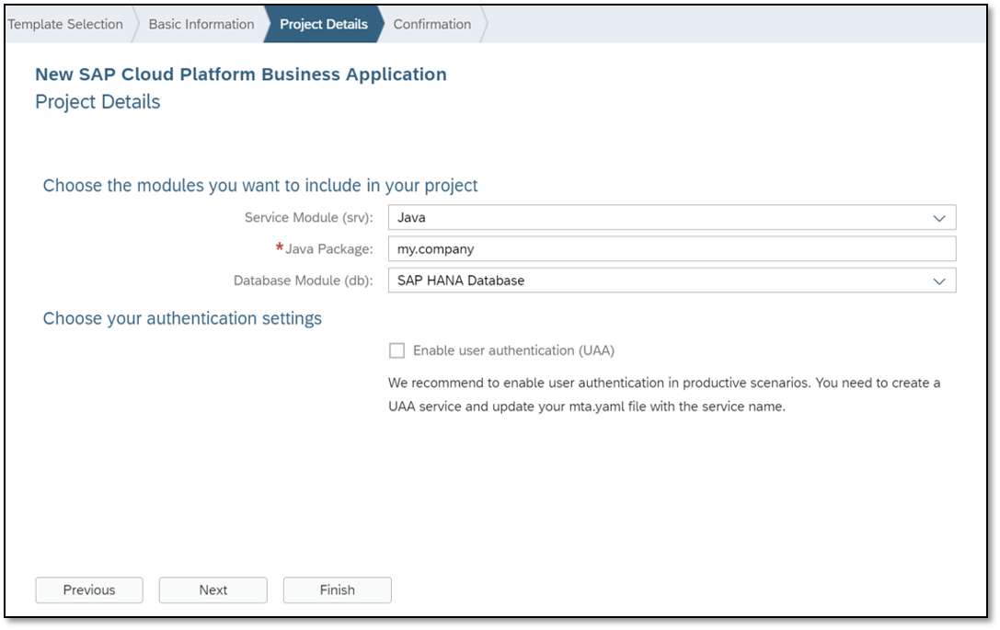
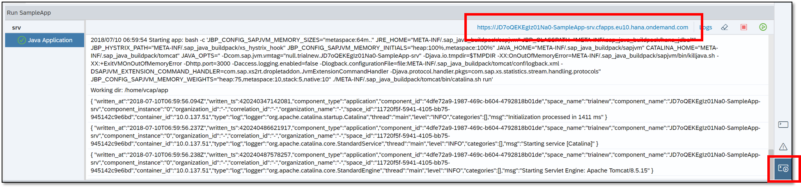
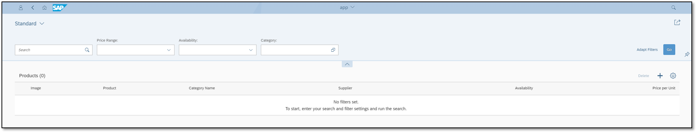

## Prerequisites  
 [Sign up for a free trial account on SAP Cloud Platform](https://www.sap.com/developer/tutorials/hcp-create-trial-account.html)
 [Enable SAP Web IDE Full-Stack](https://www.sap.com/developer/tutorials/webide-multi-cloud.html)
 [Select a Cloud Foundry Space](https://help.sap.com/viewer/825270ffffe74d9f988a0f0066ad59f0/CF/en-US/98f49286ac05492f88428c603d146fc3.html)

## Details
### You will learn  
  - How to reuse a CDS model within your business application
  - How to extend an existing service

Development projects can reuse CDS models and code from other projects by declaring dependencies in the `package.json` file. After dependencies are retrieved using `npm`, you can use CDS extension techniques to build the features that you need.

Our sample application consists of three layers:

- Data model
- Service model
- UI

With our application programming model you do not need to create an entire business application from scratch. You can easily reuse and extend your data and service models.

Imagine that you need to create a product catalog app that includes reviews for each product. You found a product catalog model that has everything you need, except for the reviews feature. In this example, you will learn how to reuse an existing model, add the missing entity and extend an existing service.

---

[ACCORDION-BEGIN [Step 1: ](Create a project in SAP Web IDE Full-Stack)]

The **SAP Cloud Platform Business Application** template is your starting point. After creating the template, you will have the default project layout, which includes a data and service module.

1. Open SAP Web IDE and choose **File** | **New** | **Project from Template**.

2. Choose **SAP Cloud Platform Business Application**, and in the **Basic Information** tab, specify **`SampleApp`** as the Project Name.

    

3. Complete the **Project Details** tab as shown in the screenshot:

    

5. Choose **Finish**.

[DONE]

[ACCORDION-END]

[ACCORDION-BEGIN [Step 2: ](Add the dependency to the product catalog)]

To reuse the product catalog model, you need to declare a dependency in the `package.json` root file. The `package.json` file is part of the default project layout.

1. Locate and open the `package.json` root file.

    

2. Add the dependency to the product catalog model:

    ```
    "@sap/cloud-samples-catalog": "https://github.com/SAP/cloud-samples-catalog.git#rel-1.0"

    ```

    Your `package.json` file should look like this:


    ```json
    {
        "name": "SampleApp",
        "description": "Reference application built according to the CAP model",
        "version": "1.0.0",
        "dependencies": {
            "@sap/cds": "2.x",
            "@sap/cloud-samples-catalog": "https://github.com/SAP/cloud-samples-catalog.git#rel-1.0"
        },
        "scripts": {
            "build": "cds build --clean",
            "watch": "nodemon -w . -i node_modules/**,.git/** -e cds -x npm run build"
        },
        "cds": {
            "data": {
                "model": "db/"
            },
            "service": {
                "model": "srv/"
            }
        },
        "private": true
    }
    ```
3. Save your file.

[DONE]

[ACCORDION-END]

[ACCORDION-BEGIN [Step 3: ](Define the data model)]

In your `data-model.cds`, you will:

- Import the `Product` entity with a `using` directive.

- Add a `Reviews` entity that will be associated with the `Product` entity.

>`Using` directives let you declare shortcut aliases to fully-qualified names or namespaces of definitions in other files and import them into your model. In this example, the `using` directive imports the Products entity.

1. Go to **`db`** module and open the `data-model.cds` file.

2. Replace the sample code with:

    ```CDS
    namespace SampleApp;

    using clouds.products.Products from '@sap/cloud-samples-catalog';

    entity Reviews {
      key Review: UUID;
      product: Association to Products @title: '{i18n>product}';
      title: String(60) @title: '{i18n>reviewTitle}';
      message: String(1024) @title: '{i18n>reviewText}';
      rating: Decimal(4, 2) @title: '{i18n>rating}';
      helpfulCount: Integer @title: '{i18n>ratedHelpful}';
      helpfulTotal: Integer @title: '{i18n>ratedTotal}';
    }
    ```

    > If you see CDS errors telling you that the artifact or module relating to the `using` statement could not be found, you can ignore them - they're temporary and not entirely accurate. You might also see an error in the console saying that the artifact `my.bookshop` was not found. This is because you have not updated the namespace in the service module. You can ignore this error for now, as it should be resolved in the next step.

    > There's a further error that you also may see in the console relating to a `syntax-anno-after-struct` warning. You can also ignore this for now.

3. Save your file.

[DONE]

[ACCORDION-END]

[ACCORDION-BEGIN [Step 4: ](Define the service model)]

You need to extend `CatalogService` with the view on the `Reviews` entity you added in your `data-model.cds` file.

1. Expand the **`srv`** module and open **`my-service.cds`**.

2. Replace the sample code with:

    ```CDS
    namespace SampleApp;
    using SampleApp as samp from '../db/data-model';

    using clouds.products.CatalogService from '@sap/cloud-samples-catalog';

    extend service CatalogService with {

    	entity Reviews @(
    		title: '{i18n>review}',
    		Capabilities: {
    			InsertRestrictions: {Insertable: false},
    			UpdateRestrictions: {Updatable: false},
    			DeleteRestrictions: {Deletable: false}
    		}
    	) as projection on samp.Reviews;

    }    
    ```

    > If you see CDS errors telling you that the artifact or module relating to the `using` statement could not be found, you can ignore them - they're temporary and not entirely accurate.

3. Save your file.

[VALIDATE_1]

[ACCORDION-END]

[ACCORDION-BEGIN [Step 5: ](Add the association to the Reviews entity)]

The ultimate goal is to navigate from `Products` to `Reviews`. To do this, you need to extend `Products` with an association to `Reviews`.

1. Back in the `data-model.cds` file, add the following sample code:

    ```CDS
    extend Products with {
    	Reviews: Association to many Reviews on Reviews.product = $self @title: '{i18n>review}';
    }
    ```

    Your `data-model.cds` file should now look like this:

    ```CDS
    namespace SampleApp;

    using clouds.products.Products from '@sap/cloud-samples-catalog';

    extend Products with {
      Reviews: Association to many Reviews on Reviews.product = $self @title: '{i18n>review}';
    }

    entity Reviews {
      key Review: UUID;
      product: Association to Products @title: '{i18n>product}';
      title: String(60) @title: '{i18n>reviewTitle}';
      message: String(1024) @title: '{i18n>reviewText}';
      rating: Decimal(4, 2) @title: '{i18n>rating}';
      helpfulCount: Integer @title: '{i18n>ratedHelpful}';
      helpfulTotal: Integer @title: '{i18n>ratedTotal}';
    }
    ```

2. Save your file.

[DONE]

[ACCORDION-END]


[ACCORDION-BEGIN [Step 6: ](Build the db module)]

Right-click the **`db`** module and choose **Build**.


[DONE]

[ACCORDION-END]

[ACCORDION-BEGIN [Step 7: ](Test-run your service)]

1. Right-click the **`srv`** module and choose **Run** | **Run as Java Application**.

2. Open the service URL from the **Run Console**.

    

3. Click on the service URL.

4. Add **`/$metadata`** to the URL to check your service.

[DONE]

[ACCORDION-END]

[ACCORDION-BEGIN [Step 8: ](Add an HTML5 template)]

You have successfully created the data and service module. To complete your application, you need to add a UI.

1. In your workspace, right-click **`SampleApp`** (your project root folder).

2. Choose **New | HTML5 Module**.

3. Choose **List Report Application** as your template.

4. Complete the following fields:

    |  Field Name     | Value
    |  :------------- | :-------------
    |  Module Name    | `webapp`
    |  Title          | `App`

5. Choose **Current Project**.

6. Choose **`clouds.products.CatalogService`**.

    > If there are multiple instances of the service listed, choose the first one.

7. In the **Template Customization** tab, choose **Products** from the **OData Collection** dropdown menu.

    >**Reviews** is automatically populated in the **OData Navigation** field.

8. Choose **Finish**.

[DONE]

[ACCORDION-END]

[ACCORDION-BEGIN [Step 9: ](Test-run the UI)]

1. Right-click the **`webapp`** module and choose **Run** | **Run as Web Application**.

1. Choose **`flpSandbox.html`**.

    >If you have previously selected **`flpSandbox.html`** as your run configuration for web applications, you will not see a dialog box. Web IDE will use **`flpSandbox.html`** as the default.

1. In the **Destination Creation** dialog box, complete the following fields:

    |  Field Name                  | Description
    |  :-------------------------  | :--------------------------------------------------------------------------
    |  Neo Environment User ID     | The ID of your subaccount that contains your Neo environment
    |  Neo Environment Password    | The password of your subaccount that contains your Neo environment

1. Choose **Create**.

    The SAP Fiori launchpad opens.

    >It might take a few seconds for the SAP Fiori launchpad to open.

    Since you have not added any data, the application is empty. You should see something like this:

    

[DONE]

[ACCORDION-END]

If you would like to add data to your sample application, you can use the database explorer feature in SAP Web IDE. To learn how, check out this tutorial: [Add Data to Your OData Service](https://developers.sap.com/tutorials/odata-06-add-data-odata-service.html)

---
