## Prerequisites  
  - [Sign up for a free trial account on SAP Cloud Platform](hcp-create-trial-account)
  - [Enable SAP Web IDE](webide-multi-cloud)
  - [Select a Cloud Foundry space](https://help.sap.com/viewer/825270ffffe74d9f988a0f0066ad59f0/CF/en-US/98f49286ac05492f88428c603d146fc3.html)
  - [Enable the SAP Cloud Platform Business Application Development Tools feature](https://help.sap.com/viewer/825270ffffe74d9f988a0f0066ad59f0/CF/en-US/90999000744441c6b1fe486d43428b4b.html)

## Details
### You will learn  
  - How foreign keys are handled in managed associations
  - What the CDS builder generates


In this tutorial you will enhance the product catalog of the SAP Cloud Platform business application project `ITelO` with a category for the products. To realize this you add a managed association to the data model and then add annotations, to show the category on the UI.

We use a slightly reduced variant from the cloud-samples-catalog repository for this tutorial, which is a reuse module of the reference application `ITelO`. This reference application is a showcase for the [application programming model on the Cloud Platform](https://help.sap.com/viewer/65de2977205c403bbc107264b8eccf4b/Cloud/en-US/00823f91779d4d42aa29a498e0535cdf.html).

The application programming model makes use of Core Data & Services (CDS) that comes with an infrastructure that enables you to focus on your business problem you want to solve.

Over the course of three tutorials you will add some CDS code and see how the application changes on the UI and its generated files. These tutorials cover the topics association, annotation, and localization.

>In this tutorial and others the general name "SAP Web IDE" is used. Specifically, the "Full-Stack" version is implied throughout.

---

[ACCORDION-BEGIN [Step 1: ](Download the code)]

We prepared an archive for you as the basis for the upcoming tutorials. Follow the link to GitHub to download the archive.

This archive contains the `cloud-samples-catalog` project, except some code, which you will add in this tutorial and the following. When you have finished all three tutorials of this group, the coding will be the same as in the original project.

[GitHub Repository: SAP/cloud-samples-catalog, Branch: tutorial](https://github.com/SAP/cloud-samples-catalog/blob/tutorials/tutorial-enhance-the-product-catalog.zip)


[DONE]
[ACCORDION-END]

[ACCORDION-BEGIN [Step 2: ](Add code to SAP Web IDE workspace)]
Open your SAP Web IDE and import the project to your workspace.

1. Open SAP Web IDE and choose **File** | **Import** | **File or Project**.

2. Select the archive you just downloaded.

3. Select **Extract Archive** and confirm.

In case you have problems with this procedure, these links might help (open in a new tab):

[Open SAP Web IDE](https://help.sap.com/viewer/825270ffffe74d9f988a0f0066ad59f0/CF/en-US/51321a804b1a4935b0ab7255447f5f84.html)

[Import a Project from an Archive](https://help.sap.com/viewer/825270ffffe74d9f988a0f0066ad59f0/CF/en-US/e39599b757c541beb8e50b454f8d2431.html)

[DONE]
[ACCORDION-END]


[ACCORDION-BEGIN [Step 3: ](Add a managed association)]
Add the following code to your **`db/model.cds`** file in the entity `Products` between `description` and `image` (line 18).

```
category: Association to Categories;
```
You've modelled a category inside the entity `Products`, which is an association to the entity `Categories`.

If you encounter any validation errors inside the editor, please fix these errors to have a valid CDS file before you save.

> Exception to this rule: The code might show validation errors out of the box. Please ignore these. The `.cds` files from the provided repository are valid.

This is how your code should look:

  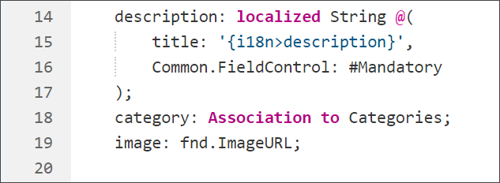

[DONE]
[ACCORDION-END]

[ACCORDION-BEGIN [Step 4: ](Build the CDS files)]

To enable build upon save go to **Tools** | **Preferences** | **Core Data Services** and select the checkbox for **Performs CDS Build upon save**. We assume you have enabled build upon save during the course of these tutorials.

Save your `.cds` file to start the builder.

This starts a build of all `.cds` file in this project. To check which files are created go to **View** | **Console** in the SAP Web IDE.

    >If you wonder about the filenames you see in the console, they are derived from the namespace of the `.cds` file, the service (`srv`), and entities (`srv/db`) they are modelled in. This is the pattern: `NAMESPACE_SERVICE_ENTITY`


[DONE]
[ACCORDION-END]

[ACCORDION-BEGIN [Step 5: ](Explore the build results)]

Let's check what the builder generated for you.

>Use the code editor to view the files. You find the entry **Open Code Editor** in the context menu.

1. First, open the **`db/src/gen/CLOUD_PRODUCTS_PRODUCTS.hdbcds`** file in the code editor and have a look at line 12.

    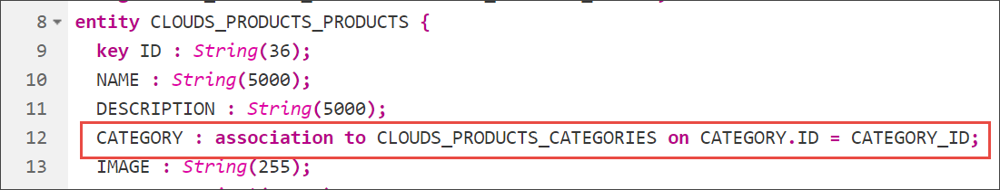

    Notice, that the CDS builder has added the foreign key `CATEGORY_ID` to your entity. So the CDS builder adds and resolves the foreign key for you by using a managed association. This file is the design time artifact for the **`CLOUD_PRODUCTS_PRODUCTS`** table that you will get to know later in this tutorial.

2. The second `.hdbcds` file is **`db/src/gen/CLOUDS_PRODUCTS_CATALOGSERVICE_PRODUCTS.hdbcds`**. The code that has been generated by the CDS builder is in line 10, 21, and 39.

    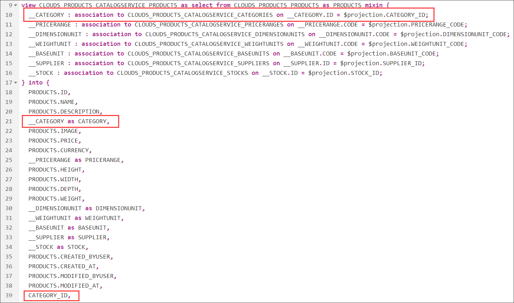

3. In the file **`srv/src/main/resources/edmx/clouds.products.CatalogService.xml`** within the entity type named `Products`, you have a navigation property (line 80) and a property for the  foreign key (line 98).

    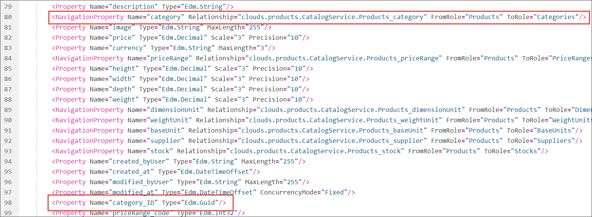

    In the `EntityContainer`, there is a new `Association` and `AssociationSet`.

    This is the added **`AssociationSet`**
    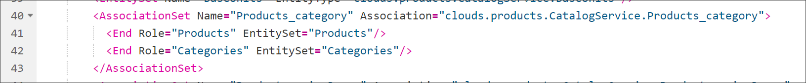

    This is the added **`Association`**
    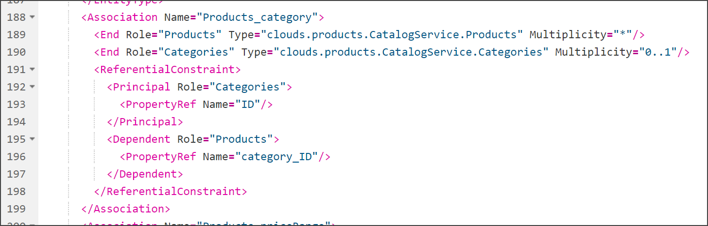

    The association is used in both, the association set and the navigation property.

    > The files in the **`edmx`** folder describe the OData exposure of your service.

These are all code snippets the CDS builder generates out of your added association, which you would otherwise have to code manually in all these separate files.

[More information about associations in CDS on the SAP Help Portal](https://cap.cloud.sap/docs/cds/cdl#associations)

Question: Where has the `Association` and `AssociationSet` been added?
>**Hint:** It's in the **`srv/src/main/resources/edmx/clouds.products.CatalogService.xml`** file. But in which part of the file?

Add your answer (case-sensitive) in the box below.

[VALIDATE_6]
[ACCORDION-END]

[ACCORDION-BEGIN [Step 6:](Add a mapping for CATEGORY_ID)]
So you can see the effect of your changes in the modeling, we have included some sample data. For the deployment, we have to add this association also to the mapping of the sample data.

The mapping of the data model and actual data is done in an `.hdbtabledata` file. This is used during the deployment of tables and data to the database.

Go to **`db/src/_csv/data.hdbtabledata`** and add this code to line 16:

 ```
 "CATEGORY_ID",
 ```

 Save your changes.

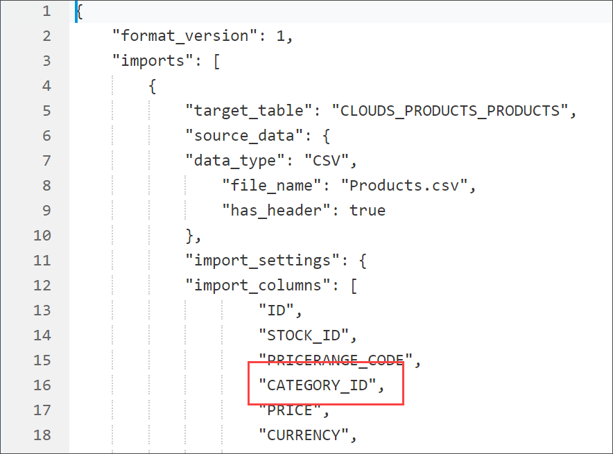

[DONE]
[ACCORDION-END]


[ACCORDION-BEGIN [Step 7:](Build your db module and explore build results)]

1. Open the context menu on the `db` module and select **Build** | **Build**

2. Open SAP HANA database explorer.

    If you haven't enabled that feature yet, go to **Tools** | **Preferences** | **Features** and enable `SAP HANA Database Explorer`.

    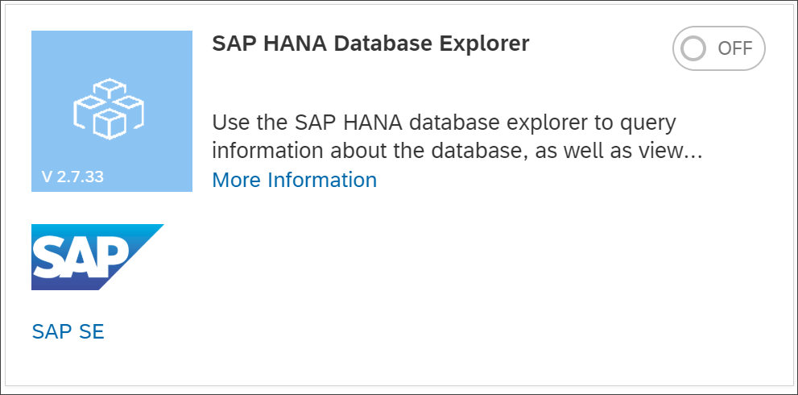

3. Add your newly created database to the database explorer.

    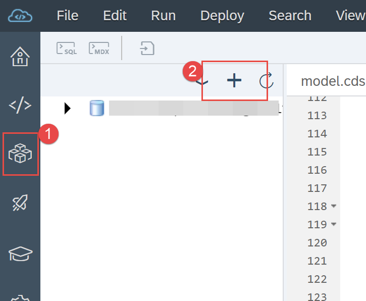

    >Hint to identify your database: The name of your project is also contained in the name of your HDI container, that you need to select in the `Add Database` dialog.

4. Choose `Tables` and open the **`CLOUDS_PRODUCTS_PRODUCTS`** table.

    There you find the `CATEGORY_ID` with its `SQL Data Type` [NVARCHAR(36)] and `Column Store Data Type` [STRING].

    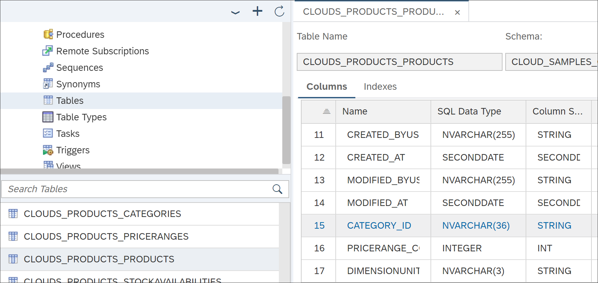

5. Select `Open Data` and locate the column `CATEGORY_ID`.

    Table **`CLOUDS_PRODUCTS_PRODUCTS`**
    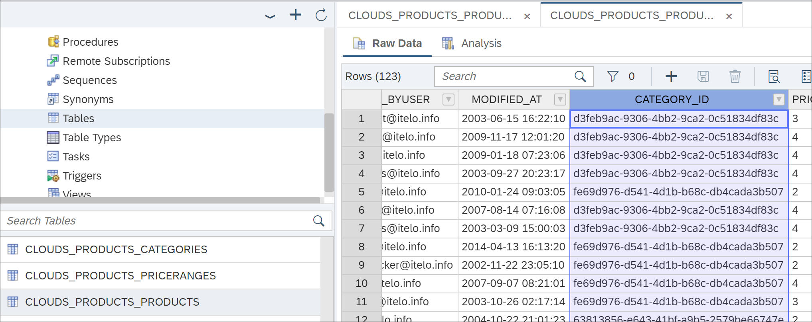


    The values there are defined in the table **`CLOUDS_PRODUCTS_CATEGORIES`**  in the column `ID`. Open the **`CLOUDS_PRODUCTS_CATEGORIES`** table and select `Open Data` to see the values in the first column.

    Table **`CLOUDS_PRODUCTS_CATEGORIES`**
    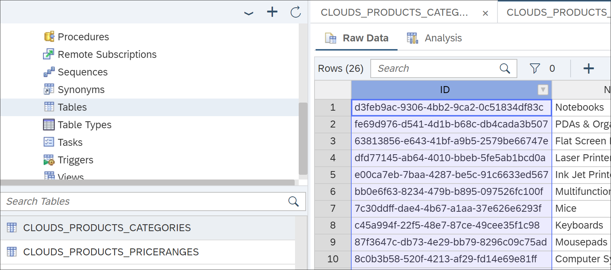

    This connection in design and deployment is what we added in this tutorial. In the next tutorial you will learn how to use this on the UI.

### One last task for you, in this tutorial

1. Go to the data in table **`CLOUDS_PRODUCTS_PRODUCTS`**.
2. Copy the description for **`ID`** `HT-1007`.
3. Paste the description in the box below.

[VALIDATE_7]
[ACCORDION-END]

### Some interesting blog posts

  - [Introducing the new Application Programming Model for SAP Cloud Platform](https://blogs.sap.com/2018/06/05/introducing-the-new-application-programming-model-for-sap-cloud-platform/)
  - [Interview with `Rui Nogueira` on the new Application Programming Model for SAP Cloud Platform](https://blogs.sap.com/2018/06/25/interview-with-rui-nogueira-on-the-new-application-programming-model-for-sap-cloud-platform/)
  - [`ITelO` – A Sample Business Application for the new Application Programming Model for SAP Cloud Platform](https://blogs.sap.com/2018/06/27/itelo-a-sample-business-application-for-the-new-application-programming-model-for-sap-cloud-platform/)
  - [Top 5 Time-Saving Benefits of the Application Programming Model for SAP Cloud Platform](https://blogs.sap.com/2018/08/24/top-5-time-saving-benefits-of-the-application-programming-model-for-sap-cloud-platform/)      

---
