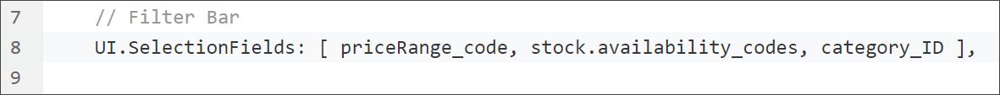
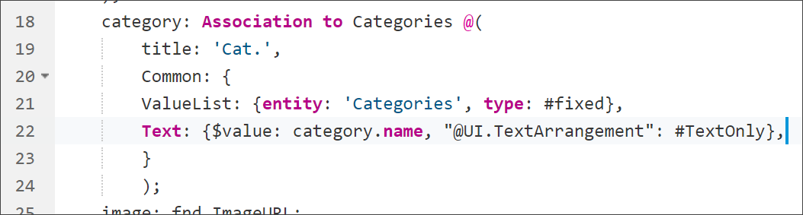

## Prerequisites  
 - You have the builders installed in your space.


## Details
### You will learn  
  - How to use OData annotations in CDS
  - How to improve filtering the product catalog
  - How to make a field mandatory

You build this tutorial upon your result from the previous tutorial where you added a category for the products in the product catalog of the SAP Cloud Platform business application project `ITelO`. Add now SAP Fiori elements annotations to your association, which have impact on the UI.

You add `title`, `ValueList`, and `Text` annotations, and you will see the effect on the user interface.

---

[ACCORDION-BEGIN [Step 1: ](Open SAP Web IDE Full-Stack)]

Open your SAP Web IDE Full-Stack and the workspace that contains the sources from the previous tutorial.

If you are not sure how to do this, have a look at the previous tutorial in Step 2.

[DONE]
[ACCORDION-END]


[ACCORDION-BEGIN [Step 2:](Add category to UI)]

Let's make the user interface aware of the association we created, that can be displayed to users.

Open the file **`srv/fiori-annotations.cds`**.

1. Add `category_ID` to the `UI.SelectionFields` in line 8. It should look like this:

    

2. Add the code as `UI.LineItem` in line 15:

    ```
    {$Type: 'UI.DataField', Value: category_ID, "@UI.Importance": #Medium},
    ```

This adds the category to the line items of the list report and as a filter in the UI.


[DONE]
[ACCORDION-END]

[ACCORDION-BEGIN [Step 3:](Add a title annotation)]

Add a title for the categories associated with the products.

Go back to your `model.cds` file and add a title annotation, let's call it `Cat.`, to your association in line 19.

It should look like this sample code:

```
category: Association to Categories @(
    title: 'Cat.',
);

```

`Cat. ` is an abbreviation for category.

[DONE]
[ACCORDION-END]

[ACCORDION-BEGIN [Step 4:](Build and start app)]


 1. If you haven't done already, save your `model.cds` file. This starts the CDS build.

 2. On your `app` folder go to **Run** | **Run as Fiori Launchpad Sandbox**. This starts your Java application (`srv`) automatically.

    >As SAP Web IDE runs on the Neo environment and the applications you deploy run on Cloud Foundry, you need to create a Destination in this step.


     - You see now `'Cat.'` as one of the columns in your product table.
     - You can now see `'Cat.'` as one of the possible filters.

 3. Select `Go` and have a look at the `'Cat.'` column that displays the GUID connected to the product.

[VALIDATE_4]

[ACCORDION-END]


[ACCORDION-BEGIN [Step 5:](Add a ValueList annotation)]

In your `model.cds` file add a `ValueList` annotation to your association in line 20.

1. Add a value list to your association.

    ```
    Common: {
        ValueList: {entity: 'Categories', type: #fixed},
        }
    ```

    A `ValueList` is used to specify a list of acceptable values. The value list is added to the filter `'Cat.'`.

2. Copy your association and paste it in the box below:

[VALIDATE_5]
[ACCORDION-END]


[ACCORDION-BEGIN [Step 6:](Build and start app)]

 1. If you haven't done already, save your `model.cds` file. This starts the CDS build.

 2. Restart your Java application in the `Run Console`.

 3. Refresh the tab where you have the Fiori launchpad sandbox open, or on your `app` folder go to **`Run> Run as Fiori Launchpad Sandbox`**.

 4. Open the filter dialog for `'Cat.'` and execute the search.

 5. Select one or more categories and confirm your selection.

 6. Select `Go`.

You see, that the column `'Cat.'` still shows inconvenient GUID. Let's have a closer look at this in the next step.


[VALIDATE_6]
[ACCORDION-END]

[ACCORDION-BEGIN [Step 7:](Add a Text annotation)]

You are adding the text annotation to your association.

```
Text: {$value: category.name, "@UI.TextArrangement": #TextOnly}
```

With the text annotation you can add a value to a key: This is useful in case the key is just a random number that you can hardly know and want to add a value that is easy to remember.

In our example this is the GUID of a category (key) and the name of a category (value).

Your association now looks like this:




[DONE]
[ACCORDION-END]

[ACCORDION-BEGIN [Step 8:](Build and start app)]

 1. If you haven't done already, save your `model.cds` file. This starts the CDS build.
 2. Then restart your Java application in the `Run Console`.
 3. Refresh the tab where you have the Fiori launchpad sandbox open, or on your `app` folder go to **`Run> Run as Fiori Launchpad Sandbox`**.
 4. Select `Go`.

You see, that the column `'Cat.'` displays now the category names, that are also used in the value list of the `'Cat.'` filter.

No more GUID, isn't that great!? The casual user will love this.

[VALIDATE_8]
[ACCORDION-END]


---
