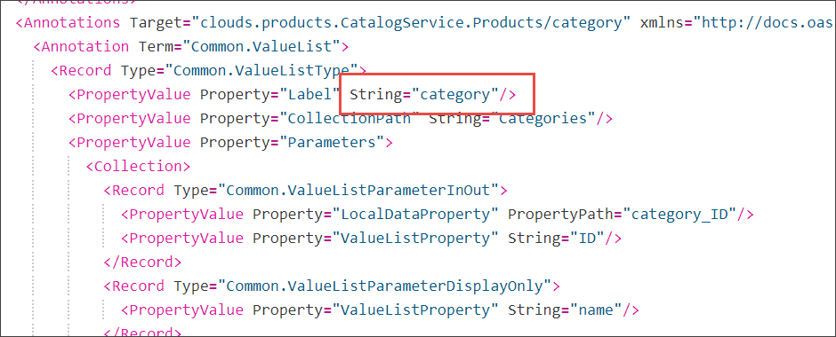
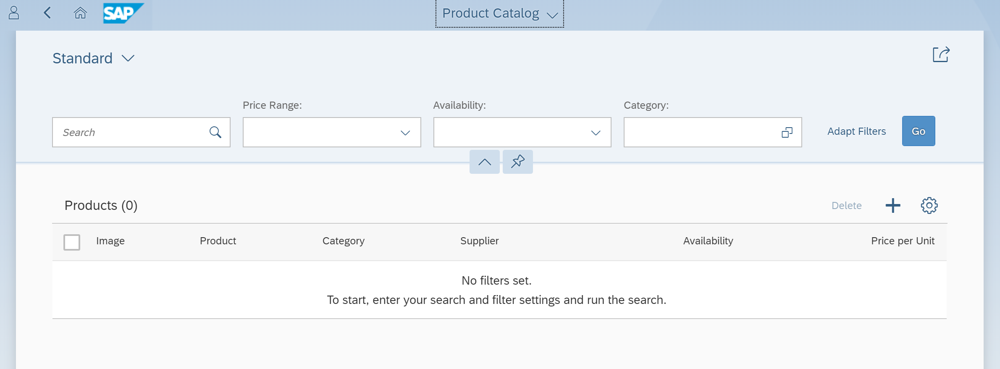
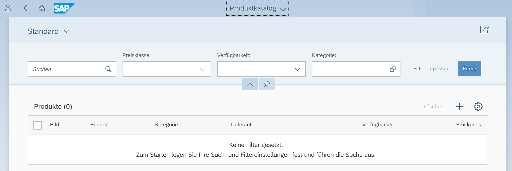

## Details
### You will learn  
  - How localization works with CDS

You build this tutorial upon your result from the previous tutorial where you added annotations to the managed association in the product catalog of the SAP Cloud Platform business application project `ITelO`. Switch from coding titles and strings in your files to an approach that enables localization.

---

[ACCORDION-BEGIN [Step 1: ](Open SAP Web IDE Full-Stack)]
Open your SAP Web IDE Full-Stack and the workspace that contains the sources from the previous tutorial.

[Open SAP Web IDE Full-Stack](https://help.sap.com/viewer/825270ffffe74d9f988a0f0066ad59f0/CF/en-US/51321a804b1a4935b0ab7255447f5f84.html)

[DONE]

[ACCORDION-END]


[ACCORDION-BEGIN [Step 2:](Introduce localization)]
Add a reference for the `title` annotation to the `i18n` file in your **`db/model.cds`** file. Use category as key in the i18n reference.

```CDS
category: Association to Categories @(
    title: '{i18n>category}',
    Common: {
        Text: {$value: category.name, "@UI.TextArrangement": #TextOnly},
        ValueList: {entity: 'Categories', type: #fixed},
        FieldControl: #Mandatory
    }
);

```

This makes the builder look into `i18n.properties` files for a string, which in our case is the title. You can reference that string from any file in your project, so it's kind of single-sourcing, and it enables translation workflows.

What is the key used as reference for the `title` annotation? Enter it in the box below.

[VALIDATE_2]
[ACCORDION-END]

[ACCORDION-BEGIN [Step 3: ](Build and explore)]
If you haven't done already, save your `model.cds` file. This starts the CDS build.

Have a look at **`srv/src/main/resources/edmx/clouds.products.CatalogService.xml`**.



You see, that the former fixed string `'Cat.'` has been replaced by "category". The key `category` is not yet contained in the `i18n` files so this reference can't be resolved. If the reference to `i18n`  can't be resolved, the key itself, here "category", is used.

Of course, this is also visible on the user interface.

[DONE]

[ACCORDION-END]

[ACCORDION-BEGIN [Step 4:](Add localized strings)]

The CDS builder checks specific places in your project for localized files. They can either be next to your modelling **`.cds`** file or in a parent folder. In this project the files are located in the **`_i18n`** folder, that is one of the default folders. If you have the need to deviate from the default, you can add the following code to the **`package.json`** in the root directory of your project and specify the folders as needed.

```JSON
"cds":{"i18n":{
  "folders": [ "_i18n", "i18n", "assets/i18n" ]
}}
```

In this step, you add the key `category` to the `i18n` files. We've included three `i18n` files for you.

- **`_i18n/i18n.properties`**

    This is the fallback if no language-specific file is in place.

- **`_i18n/i18n_en.properties`**

    The language-specific file for the English locale.

- **`_i18n/i18n_de.properties`**

    The language-specific file for the German locale.

> If you can't see the language-specific files, select `Show Hidden Files` at the top of your `Files` view.

1. Go to **`_i18n/i18n.properties`** and add this code:

    ```
    #XTIT: Category
    category=Category
    ```

2. Go to **`_i18n/i18n_en.properties`** and add this code:

    ```
    #XTIT: Category
    category=Category
    ```

3. Go to **`_i18n/i18n_de.properties`** and add this code:

    ```
    #XTIT: Category
    category=Kategorie
    ```

This reference can now be resolved by the builder, and the value for the key, in our case `category`, is used during the build process.

What does `XTIT` stand for? Copy the description from an **`i18n.properties`** file and paste it in the box below:

[VALIDATE_4]
[ACCORDION-END]

[ACCORDION-BEGIN [Step 5:](Build and explore)]

Even though we did not change any `.cds` file, you now need to build the CDS files to resolve the reference to `i18n` properly. Go to **`Build> Build CDS`** in the context menu of the project to start the compiler.

These files have been changed and localized:

  - **`clouds.products.CatalogService.xml`**
  - **`clouds.products.CatalogService_de.xml`**
  - **`clouds.products.CatalogService_en.xml`**
  - **`csn.json`**

This change touches so many files because we introduce the concept of localization. Localization means, that the string for `title` gets resolved as `Common.Label` in each `.xml` file in the provided languages. In the **`csn.json`** file, `category` and `category_ID` get the reference to `i18n`, as this file is not localized.

In our example, we provide a German and an English version for the strings. Keep in mind, that the translation process from English to German is not included. If you change strings in **`_i18n/i18n.properties`**, you have to translate them yourself to the localized versions.

[More information about localization in CDS on `cap.cloud.sap`](https://cap.cloud.sap/docs/guides/i18n)

To see your changes on the user interface, do the following:

 1. Restart your `srv` module in the `Run Console` of SAP Web IDE Full-Stack.

 2. On your **`app`** folder go to **`Run> Run Configurations`**.

 3. Select `Run Component.js`.

 4. Go to the `URL Components` tab

 3. Add `sap-language` with value `en` or `de` as parameter and select `Save and Run`.

English:


German:


Now, you're all set. Explore the application, add a product, set your filters and get your hands on, changing some code and see the changes.

Enter the URL of your application:

[VALIDATE_5]
[ACCORDION-END]

---
