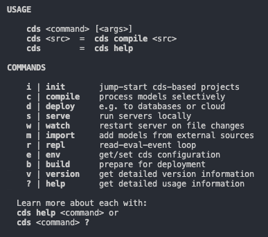
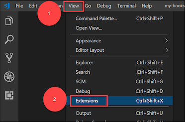
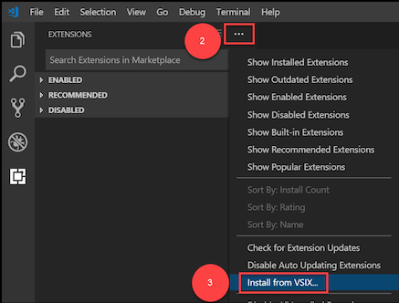
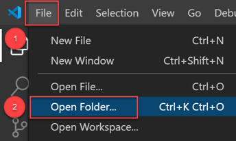
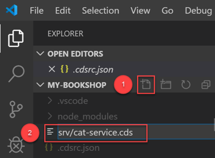
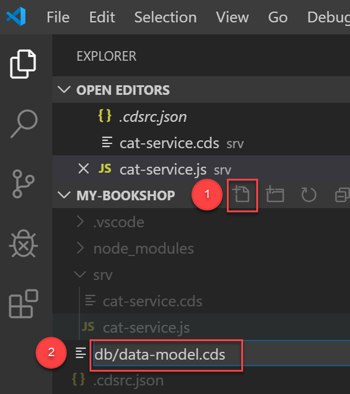
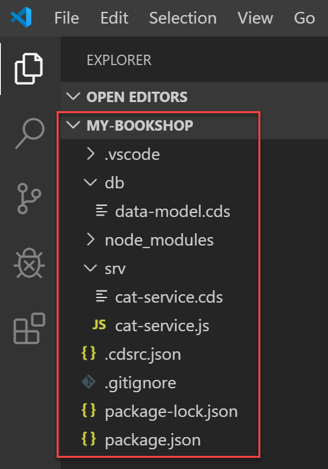

## Prerequisites  
- You have installed [Node.js](https://nodejs.org/en/) version 8 or higher.
- You have installed the latest version of [Visual Studio Code](https://code.visualstudio.com/).
- (For Windows users only) You have installed the [`SQLite`](https://sqlite.org/download.html) tools for Windows.

## Details
### You will learn  
  - How to do develop a sample business service using the SAP Cloud Application Programming Model and `Node.js`
  - Define a simple data model and a service that exposes the entities you created in your data model
  - Run your service locally
  - Deploy the data model to a `SQLite` database
  - Add custom handlers to serve requests that are not handled automatically

---

[ACCORDION-BEGIN [Step 1: ](Set up your local development environment)]

1. Before you start, make sure you have completed the prerequisites.

1. Configure the NPM registry by executing the following command:

    ```bash
    npm set @sap:registry https://npm.sap.com
    ```

2. Install the CDS command-line tools by executing the following command:

    ```bash
    npm i -g @sap/cds
    ```

    This installs the `cds` command, which we will use in the next steps.

3. To verify the installation was successful, run `cds` without arguments:

    ```bash
    cds
    ```

    

    This lists the available `cds` commands.  For example, use `cds version` to check the version you have installed.

[DONE]

[ACCORDION-END]

[ACCORDION-BEGIN [Step 2: ](Install Visual Studio Code Extension)]

1. Go to [SAP Development Tools](https://tools.hana.ondemand.com/#cloud) and download the CDS extension (`vsix` file) for [Visual Studio Code](https://code.visualstudio.com/).

1. Install the extension in Visual Studio Code:

    

    &nbsp;

    

    And look for the `vsix` file you downloaded.

    >If you see a compatibility error, make sure you have the latest version of VS Code.

[DONE]

[ACCORDION-END]

[ACCORDION-BEGIN [Step 3: ](Start a project)]

1. Open a command line window and run the following command in a folder of your choice:

    ```bash
    cds init my-bookshop
    ```

    This creates a folder `my-bookshop` in the current directory.

1. Open VS Code, go to **File | Open Folder** and choose the **`my-bookshop`** folder.

    

[DONE]

[ACCORDION-END]

[ACCORDION-BEGIN [Step 4: ](Define your first service)]

You will create a simplistic all-in-one service definition.

1. In VS Code, choose the **New File** icon and type **`srv/cat-service.cds`**.

    

    This creates a folder called **`srv`** and a file called **`cat-service.cds`**.

1. Open the file and add the following code:

    ```CDS
    using { Country, managed } from '@sap/cds/common';

    service CatalogService {

      entity Books {
        key ID : Integer;
        title  : localized String;
        author : Association to Authors;
        stock  : Integer;
      }

      entity Authors {
        key ID : Integer;
        name   : String;
        books  : Association to many Books on books.author = $self;
      }

      entity Orders : managed {
        key ID  : UUID;
        book    : Association to Books;
        country : Country;
        amount  : Integer;
      }

    }
    ```

1. Save your file.

1. Run your service locally.  In the `my-bookshop` folder, execute:

    ```bash
    cds run
    ```

1. To test your service, go to <http://localhost:4004>

    You won't see data, because you have not added a data model yet. However, click on the available links and confirm the service is running.

6. To stop the service and go back to your project directory, press `CTRL+C`.

[DONE]

[ACCORDION-END]

[ACCORDION-BEGIN [Step 5: ](Provide mock data)]

Add service provider logic to return mock data.

1. In the **`srv`** folder, create a new file called **`cat-service.js`**.

2. Add the following code:

    ```javascript
    module.exports = (srv) => {

     // Reply mock data for Books...
     srv.on ('READ', 'Books', ()=>[
       { ID:201, title:'Wuthering Heights', author_ID:101, stock:12 },
       { ID:251, title:'The Raven', author_ID:150, stock:333 },
       { ID:252, title:'Eleonora', author_ID:150, stock:555 },
       { ID:271, title:'Catweazle', author_ID:170, stock:222 },
     ])

     // Reply mock data for Authors...
     srv.on ('READ', 'Authors', ()=>[
       { ID:101, name:'Emily Brontë' },
       { ID:150, name:'Edgar Allen Poe' },
       { ID:170, name:'Richard Carpenter' },
     ])

    }
    ```

3. Save the file.

4. Run the `CatalogService` again:

    ```CDS
    cds run
    ```

5. To test your service, click on these links:

    - <http://localhost:4004/catalog/Books>

    - <http://localhost:4004/catalog/Authors>

    >You should see the mock data you added for the Books and Authors entities.

6. To stop the service and go back to your project directory, press `CTRL+C`.

[DONE]

[ACCORDION-END]

[ACCORDION-BEGIN [Step 6: ](Add a data model and adapt your service definition)]

To get started quickly, you have already added a simplistic all-in-one service definition. However, you would usually put normalized entity definitions into a separate data model and have your services expose potentially de-normalized views on those entities.

1. Choose **New File** and type **`db/data-model.cds`**.

    

    This creates a folder called **db** and a file called **`data-model.cds`**. Your project structure should look like this:

    

1. Add the following code to the **`data-model.cds`** file:

    ```CDS
    namespace my.bookshop;
    using { Country, managed } from '@sap/cds/common';

    entity Books {
      key ID : Integer;
      title  : localized String;
      author : Association to Authors;
      stock  : Integer;
    }

    entity Authors {
      key ID : Integer;
      name   : String;
      books  : Association to many Books on books.author = $self;
    }

    entity Orders : managed {
      key ID  : UUID;
      book    : Association to Books;
      country : Country;
      amount  : Integer;
    }
    ```

1. Open `cat-service.cds` and replace the code with:

    ```CDS
    using my.bookshop as my from '../db/data-model';

    service CatalogService {
      entity Books @readonly as projection on my.Books;
      entity Authors @readonly as projection on my.Authors;
      entity Orders @insertonly as projection on my.Orders;
    }
    ```

>Remember to save your files.

[VALIDATE_1]

[ACCORDION-END]

[ACCORDION-BEGIN [Step 7: ](Add a Database)]

The `cds` runtime includes built-in generic handlers that automatically serve all CRUD requests. After installing `SQLite3` packages, you can deploy your data model.

1. Install `SQLite3` packages

    ```CDS
    npm i sqlite3 -D
    ```

1. Deploy the data model to a `SQLite` database:

    ```CDS
    cds deploy --to sqlite:db/my-bookshop.db
    ```

    You have now created an `SQLite` database file under `db/my-bookshop.db`.
    This configuration is saved in your `package.json` as your default data source. For subsequent deployments using the default configuration, you just need to run `cds deploy`.

2. Open `SQLite` and view the newly created database:

    ```CDS
    sqlite3 db/my-bookshop.db -cmd .dump
    ```

    >If this does not work, check if you have [SQLite](https://sqlite.org/download.html) installed. On Windows, you might need to enter the full path to SQLite, for example: `C:\sqlite\sqlite3 db\my-bookshop.db -cmd .dump`.

1. To stop `SQLite` and go back to the your project directory, press `CTRL+C`.

[DONE]

[ACCORDION-END]

[ACCORDION-BEGIN [Step 8: ](Add initial data)]

Add plain CSV files under **`db/csv`** to fill your database tables with initial data.

1. In the `db` folder, choose **New File** and enter **`csv/my.bookshop-Authors.csv`**.   Add the following to the file:

    ```CSV
    ID;name
    101;Emily Brontë
    107;Charlote Brontë
    150;Edgar Allen Poe
    170;Richard Carpenter
    ```

1. In the `db` folder, choose **New File** and enter **`csv/my.bookshop-Books.csv`**.  Add the following to the file:

    ```CSV
    ID;title;author_ID;stock
    201;Wuthering Heights;101;12
    207;Jane Eyre;107;11
    251;The Raven;150;333
    252;Eleonora;150;555
    271;Catweazle;170;22
    ```

    >Make sure you now have a folder hierarchy `db/csv/...`. And remember that the `csv` files must be named like the entities in your data model and must be located inside the `db/csv` folder.

[DONE]

[ACCORDION-END]

[ACCORDION-BEGIN [Step 9: ](Test generic handlers with Postman)]

Your service is now backed by a fully functional database. This means you can remove the mock data handlers from `cat-service.js` and see the generic handlers shipped with the SAP Cloud Application Programming Model in action.

1. **Remove the code with mock data in `cat-service.js`**, because we want to see the actual data coming from the database.

1. Deploy the data model again to add your initial data:

    ```bash
    cds deploy
    ```

1. Run the service again:

    ```bash
    cds run
    ```

1. To test your service, open a web browser and go to:
    - <http://localhost:4004/catalog/Books>

    - <http://localhost:4004/catalog/Authors>

    - <http://localhost:4004/catalog/Authors?$expand=books($select=ID,title)>

    >You should see a book titled Jane Eyre. If this is not the case, make sure you have removed the mock data from `cat-service.js` as indicated above.

1. Download the [Postman application](https://www.getpostman.com/).

1. Click on the following link and save the file to a folder of your choice:  [`postman.json`](https://raw.githubusercontent.com/SAPDocuments/Tutorials/master/tutorials/cp-apm-nodejs-create-service/postman.json).

1. In the Postman app, use the **Import** button in the toolbar:

    

    Choose **Import from File** in the wizard.  Click on **Choose Files** and select the file that you saved before.

    

2. In the imported collection, execute the various requests in the `metadata` and `CRUD` groups.  They should all return proper responses.

    

    > Note that with our current service implementation, we can get only POST orders.  Any GET or DELETE to an order will fail, since we have specified the `Orders` entity to be `@insertonly` in `srv/cat-service.cds`.

[VALIDATE_3]

[ACCORDION-END]

[ACCORDION-BEGIN [Step 10: ](Add custom logic)]

1. Add the following code in the **`srv/cat-service.js`** file:

    ```javascript
      module.exports = (srv) => {

      const {Books} = cds.entities ('my.bookshop')

      // Reduce stock of ordered books
      srv.before ('CREATE', 'Orders', async (req) => {
        const order = req.data
        if (!order.amount || order.amount <= 0)  return req.error (400, 'Order at least 1 book')
        const tx = cds.transaction(req)
        const affectedRows = await tx.run (
          UPDATE (Books)
            .set   ({ stock: {'-=': order.amount}})
            .where ({ stock: {'>=': order.amount},/*and*/ ID: order.book_ID})
        )
        if (affectedRows === 0)  req.error (409, "Sold out, sorry")
      })

      // Add some discount for overstocked books
      srv.after ('READ', 'Books', each => {
        if (each.stock > 111)  each.title += ' -- 11% discount!'
      })

    }
    ```

    Whenever orders are created, this code is triggered.  It updates the book stock by the given amount, unless there are not enough books left.

1. Run your service:

    ```bash
    cds run
    ```

1. In Postman, execute the `GET Books` request.  

    Take a look at the stock of book `201`.

    

1. Execute one of the `POST Orders` requests.  

    This will trigger the logic above and reduce the stock.

1. Execute the `GET Books` request again.

    The stock of book `201` is lower than before.


[DONE]

[ACCORDION-END]

---
