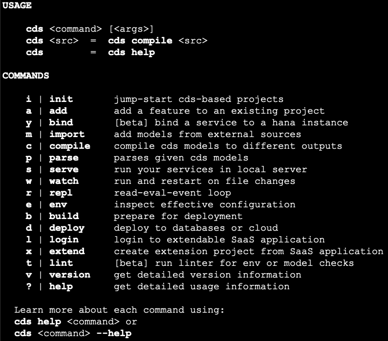
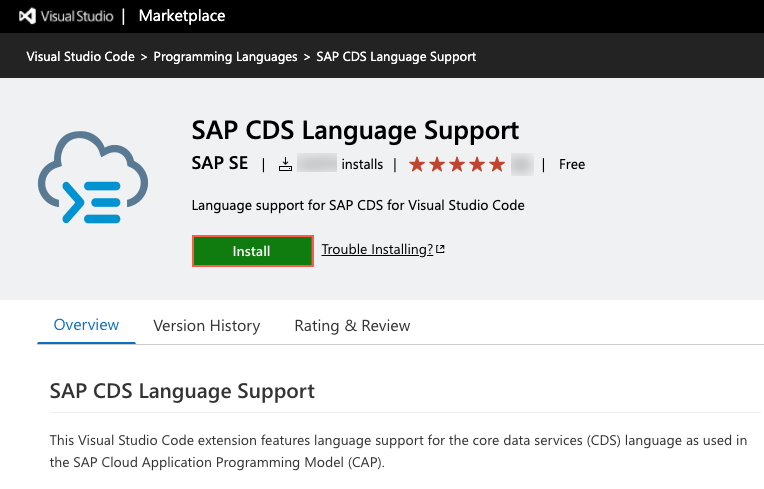
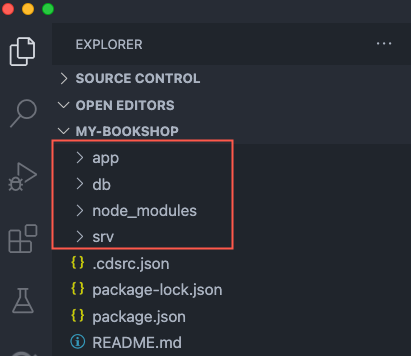
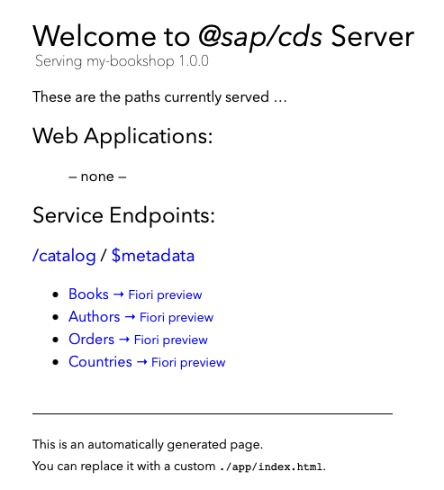

## Prerequisites
- You have installed [Node.js](https://nodejs.org/en/download/). Make sure you run the latest long-term support (LTS) version of Node.js with an even number like 14. Refrain from using odd versions, for which some modules with native parts will have no support and thus might even fail to install. In case of problems, see the [Troubleshooting guide](https://cap.cloud.sap/docs/advanced/troubleshooting#npm-installation) for CAP.
- You have installed the latest version of [Visual Studio Code](https://code.visualstudio.com/).
- (For Windows) You have installed the [SQLite](https://sqlite.org/download.html) tools for Windows. Find the steps how to install it in the Troubleshooting guide in section [How Do I Install SQLite](https://cap.cloud.sap/docs/advanced/troubleshooting#how-do-i-install-sqlite-on-windows) in the CAP documentation.
- You have installed [Postman application](https://www.getpostman.com/) or any other HTTP client.
- If you don't have a Cloud Foundry Trial subaccount and dev space on [SAP Business Technology Platform](https://cockpit.hanatrial.ondemand.com/cockpit/) yet, create your [Cloud Foundry Trial Account](hcp-create-trial-account) with **Europe (Frankfurt) or US East (VA) as region** and, if necessary [Manage Entitlements](cp-trial-entitlements). You need this to continue after this tutorial.

## Details
### You will learn
  - How to develop a sample business service using CAP and `Node.js`
  - How to define a simple data model and a service that exposes the entities you created in your data model
  - How to run your service locally
  - How to deploy the data model to an `SQLite` database
  - How to add custom handlers to serve requests that aren't handled automatically

---

[ACCORDION-BEGIN [Step 1: ](Set up local development environment)]

Before you start, make sure that you've completed the prerequisites.

1. Open a command line window and install the `cds` development kit globally by executing the following command:

    ```Shell/Bash
    npm i -g @sap/cds-dk
    ```

    > This process takes some minutes installing the `cds` command, which you will use in the next steps.

    > On MacOS/Linux, you need to follow the steps as described [here](https://docs.npmjs.com/resolving-eacces-permissions-errors-when-installing-packages-globally).

    > If there's an older `@sap/cds` package already installed on your machine, you have to remove it first; if so, you'll be instructed to do so.

    > In case of problems, see the [Troubleshooting guide](https://cap.cloud.sap/docs/advanced/troubleshooting#npm-installation) in the CAP documentation for more details.

2. To verify that the installation was successful, run `cds` without arguments:

    ```Shell/Bash
    cds
    ```

    

    > This lists the available `cds` commands. For example, use `cds version` to check the version that you've installed. To know what is the latest version, see the [Release Notes](https://cap.cloud.sap/docs/releases/) for CAP.

[DONE]

[ACCORDION-END]

[ACCORDION-BEGIN [Step 2: ](Install Visual Studio Code extension)]

1. Go to [Visual Studio Marketplace](https://marketplace.visualstudio.com/items?itemName=SAPSE.vscode-cds).

2. Choose **Install**.

    !

    > Visual Studio Code opens the extensions details page.

3. In VS Code choose **Install** to enable the extension for SAP CDS Language Support.

    

    > If the extension is already installed and enabled in VS Code, it will be updated automatically.

    > Learn more about the features in this short [demo](https://www.youtube.com/watch?v=eY7BTzch8w0) and see the [features and commands](https://cap.cloud.sap/docs/get-started/tools#cds-editor) in the CAP documentation.

[DONE]

[ACCORDION-END]

[ACCORDION-BEGIN [Step 3: ](Start project)]

[OPTION BEGIN [Windows]]

With your installed CDS command line tool, you can now create a new CAP-based project, in the form of a new directory with various things preconfigured.

1. Open a command line window and run the following command in a folder of your choice to create the project:

    ```Shell/Bash
    cds init my-bookshop
    ```

    > This creates a folder `my-bookshop` in the current directory.

2. In Visual Studio Code, go to **File** **&rarr;** **Open Folder** and choose the **`my-bookshop`** folder.

3. Go to **Terminal** **&rarr;** **New Terminal** to open a command line window within Visual Studio Code and run the following command in the root level of your project:

    ```Shell/Bash
    npm install
    ```

4. In the command line window run the following:

    ```Shell/Bash
      cds watch
    ```

    > This command tries to start a `cds` server. Whenever you feed your project with new content, for example, by adding or modifying `.cds`, `.json`, or `.js` files, the server automatically restarts to serve the new content.

    > As there's no content in the project so far, it just keeps waiting for content with a message as shown:

    ```Shell/Bash
    cds serve all --with-mocks --in-memory?
    watching: cds,csn,csv,ts,mjs,cjs,js,json,properties,edmx,xml,env,css,gif,html,jpg,png,svg...
    live reload enabled for browsers


        No models found in db/,srv/,app/,schema,services.
        Waiting for some to arrive...
    ```

[OPTION END]

[OPTION BEGIN [MacOS and Linux]]

1. Open a command line window and run the following command in a folder of your choice to create the project:

    ```Shell/Bash
    cds init my-bookshop
    ```

    > This creates a folder `my-bookshop` in the current directory.

2. Open Visual Studio Code, go to **File** **&rarr;** **Open** and choose the **`my-bookshop`** folder.

3. Go to **View** **&rarr;** **Command Palette** **&rarr;** **Terminal: Create New Integrated Terminal** to open a command line window within Visual Studio Code and run the following command in the root level of your project:

    ```Shell/Bash
    npm install
    ```
4. In the command line window run the following:

    ```Shell/Bash
      cds watch
    ```

    > This command tries to start a `cds` server. Whenever you feed your project with new content, for example, by adding or modifying `.cds`, `.json`, or `.js` files, the server automatically restarts to serve the new content.

    > As there's no content in the project so far, it just keeps waiting for content with a message as shown:

    ```Shell/Bash
    cds serve all --with-mocks --in-memory?
    watching: cds,csn,csv,ts,mjs,cjs,js,json,properties,edmx,xml,env,css,gif,html,jpg,png,svg...
    live reload enabled for browsers


        No models found in db/,srv/,app/,schema,services.
        Waiting for some to arrive...
    ```

[OPTION END]

[DONE]

[ACCORDION-END]

[ACCORDION-BEGIN [Step 4: ](Define your first service)]

After initializing the project, you should see the following empty folders:

- `app`: for UI artifacts
- `db`: for the database level schema model
- `srv`: for the service definition layer

  

1. Let's feed it by adding a simple domain model. In the **`srv`** folder choose the **New File** icon in Visual Studio Code and create a new file called `cat-service.cds`.

2. Add the following code to the file `cat-service.cds`:

    ```CDS
    using { Country, managed } from '@sap/cds/common';

    service CatalogService {

      entity Books {
        key ID : Integer;
        title  : localized String;
        author : Association to Authors;
        stock  : Integer;
      }

      entity Authors {
        key ID : Integer;
        name   : String;
        books  : Association to many Books on books.author = $self;
      }

      entity Orders : managed {
        key ID  : UUID;
        book    : Association to Books;
        country : Country;
        amount  : Integer;
      }

    }
    ```

    > Remember to save your files (keyboard shortcut **CTRL+S**).

3. As soon as you've saved your file, the still running `cds watch` reacts immediately with some new output as shown below:

    ```Shell/Bash
    [cds] - connect to db > sqlite { database: ':memory:' }
    [cds] - using bindings from: { registry: '~/.cds-services.json' }
    /> successfully deployed to sqlite in-memory db

    [cds] - serving CatalogService { at: '/catalog' }

    [cds] - launched in: 1.016s
    [cds] - server listening on { url: 'http://localhost:4004' }
    [ terminate with ^C ]
    ```
    > This means, `cds watch` detected the changes in `srv/cat-service.cds` and automatically bootstrapped an in-memory SQLite database when restarting the server process.

4. To test your service, go to: <http://localhost:4004>

    !

    > You won't see data, because you haven't added a data model yet. Click on the available links to see the service is running.

[DONE]

[ACCORDION-END]

[ACCORDION-BEGIN [Step 5: ](Provide mock data)]

Add service provider logic to return mock data.

1. In the **`srv`** folder, create a new file called `cat-service.js`.

2. Add the following code to the file `cat-service.js`:

    ```JavaScript
    module.exports = (srv) => {

     // Reply mock data for Books...
     srv.on ('READ', 'Books', ()=>[
       { ID:201, title:'Wuthering Heights', author_ID:101, stock:12 },
       { ID:251, title:'The Raven', author_ID:150, stock:333 },
       { ID:252, title:'Eleonora', author_ID:150, stock:555 },
       { ID:271, title:'Catweazle', author_ID:170, stock:222 },
     ])

     // Reply mock data for Authors...
     srv.on ('READ', 'Authors', ()=>[
       { ID:101, name:'Emily Brontë' },
       { ID:150, name:'Edgar Allen Poe' },
       { ID:170, name:'Richard Carpenter' },
     ])

    }
    ```

    > Remember to save your files (keyboard shortcut **CTRL+S**).

3. To test your service, click on these links:

    - <http://localhost:4004/catalog/Books>

    - <http://localhost:4004/catalog/Authors>

    > You should see the mock data that you've added for the `Books` and `Authors` entities.

[DONE]

[ACCORDION-END]

[ACCORDION-BEGIN [Step 6: ](Add data model and adapt service definition)]

To get started quickly, you've already added a simplistic all-in-one service definition. However, you would usually put normalized entity definitions into a separate data model and have your services expose potentially de-normalized views on those entities.

1. In the **`db`** folder choose the **New File** icon in Visual Studio Code and create a new file called `data-model.cds`.

2. Add the following code to the file `data-model.cds`:

    ```CDS
    namespace my.bookshop;
    using { Country, managed } from '@sap/cds/common';

    entity Books {
      key ID : Integer;
      title  : localized String;
      author : Association to Authors;
      stock  : Integer;
    }

    entity Authors {
      key ID : Integer;
      name   : String;
      books  : Association to many Books on books.author = $self;
    }

    entity Orders : managed {
      key ID  : UUID;
      book    : Association to Books;
      country : Country;
      amount  : Integer;
    }
    ```

3. Open the file `cat-service.cds` and replace the existing code with:

    ```CDS
    using my.bookshop as my from '../db/data-model';

    service CatalogService {
      entity Books @readonly as projection on my.Books;
      entity Authors @readonly as projection on my.Authors;
      entity Orders @insertonly as projection on my.Orders;
    }
    ```

    > Remember to save your files (keyboard shortcut **CTRL+S**).

[DONE]

[ACCORDION-END]

[ACCORDION-BEGIN [Step 7: ](Add initial data)]

In Visual Studio Code you will add plain CSV files in folder `db/csv` to fill your database tables with initial data.

1. In the `db` folder, choose **New File** and enter `csv/my.bookshop-Authors.csv` to create a new folder `csv` with the file named `my.bookshop-Authors.csv`. Add the following to the file:

    ```CSV
    ID;name
    101;Emily Brontë
    107;Charlote Brontë
    150;Edgar Allen Poe
    170;Richard Carpenter
    ```

2. In the newly created `csv` folder, choose **New File** and create a file called `my.bookshop-Books.csv`. Add the following to the file:

    ```CSV
    ID;title;author_ID;stock
    201;Wuthering Heights;101;12
    207;Jane Eyre;107;11
    251;The Raven;150;333
    252;Eleonora;150;555
    271;Catweazle;170;22
    ```
    > Remember to save your files (keyboard shortcut **CTRL+S**).

    > Make sure that you now have a folder hierarchy `db/csv/...`. Remember that the `csv` files must be named like the entities in your data model and must be located inside the `db/csv` folder.

    > After you added these files, `cds watch`restarts the server with an output, telling that the files have been detected and their content been loaded into the database automatically:

    ```Shell/Bash
    [cds] - connect to db > sqlite { database: ':memory:' }
    [cds] - using bindings from: { registry: '~/.cds-services.json' }
     > filling my.bookshop.Authors from ./db/csv/my.bookshop-Authors.csv
     > filling my.bookshop.Books from ./db/csv/my.bookshop-Books.csv
    /> successfully deployed to sqlite in-memory db

    [cds] - serving CatalogService { at: '/catalog', impl: './srv/cat-service.js' }

    [cds] - launched in: 656.931ms
    [cds] - server listening on { url: 'http://localhost:4004' }
    [ terminate with ^C ]
    ```

3. Remove the code with mock data in `cat-service.js`, because you want to see the data loaded from the `csv` files.

4. To test your service, open a web browser and go to:

    <http://localhost:4004/catalog/Books>

    <http://localhost:4004/catalog/Authors>

    > As you now have a fully capable SQL database with some initial data, you can send complex OData queries, served by the built-in generic providers.

    <http://localhost:4004/catalog/Authors?$expand=books($select=ID,title)>

    > You should see a book titled Jane Eyre. If not, make sure you've removed the mock data from `cat-service.js`.

[DONE]

[ACCORDION-END]

[ACCORDION-BEGIN [Step 8: ](Add persistent database)]

Before you continue, make sure that you've completed the prerequisites and installed SQLite (for Windows users only).

Instead of using in-memory, you can also use persistent databases.

1. If `cds watch` is running, choose **CTRL+C** in the command line to stop the service.

2. Install `SQLite3` packages.

    ```Shell/Bash
    npm i sqlite3 -D
    ```

3. Deploy the data model to an `SQLite` database:

    ```Shell/Bash
    cds deploy --to sqlite:db/my-bookshop.db
    ```

    > You've now created an `SQLite` database file under `db/my-bookshop.db`.

    > This configuration is saved in your `package.json` as your default data source. For subsequent deployments using the default configuration, you just need to run `cds deploy`.

    > The difference to the automatically provided in-memory database is that you now get a persistent database stored in the local file.

4. Open `SQLite` and view the newly created database:

    ```Shell/Bash
    sqlite3 db/my-bookshop.db -cmd .dump
    ```

    > If this doesn't work, check if you have [SQLite](https://sqlite.org/download.html) installed. On Windows, you might need to enter the full path to SQLite, for example: `C:\sqlite\sqlite3 db/my-bookshop.db -cmd .dump`. Find the steps how to install it in the Troubleshooting guide in section [How Do I Install SQLite](https://cap.cloud.sap/docs/advanced/troubleshooting#how-do-i-install-sqlite-on-windows) in the CAP documentation for more details.

5. To stop `SQLite` and go back to your project directory, choose **CTRL+C**.

6. Run your service.

    ```Shell/Bash
    cds watch
    ```

    ```Shell/Bash
    [cds] - connect to db > sqlite { database: '/Users/xxxxxx/my-bookshop/db/my-bookshop.db' }
    [cds] - using bindings from: { registry: '~/.cds-services.json' }
    [cds] - serving CatalogService { at: '/catalog', impl: './srv/cat-service.js' }

    [cds] - launched in: 537.482ms
    [cds] - server listening on { url: 'http://localhost:4004' }
    [ terminate with ^C ]
    ```

[DONE]

[ACCORDION-END]

[ACCORDION-BEGIN [Step 9: ](Test generic handlers with Postman)]

You can now see the generic handlers shipped with CAP in action.

1. Open the Postman application.

    > You can use any other HTTP client than Postman.


2. Click on the following link and save the file to a folder of your choice: [postman.json](https://raw.githubusercontent.com/SAPDocuments/Tutorials/master/tutorials/cp-apm-nodejs-create-service/postman.json).

3. In the Postman app, use the **Import** button in the toolbar:

    !

4. Choose **Import File** in the wizard. Click on **Choose Files** and select the file that you've saved before or add it per drag & drop  directly.

    !

5. In the imported collection, execute the various requests in the `metadata` and `CRUD` groups. They should all return proper responses.

    !

    > With your current service implementation, you can get only `POST` orders. Any `GET` or `DELETE` to an order fails, since you've specified the `Orders` entity to be `@insertonly` in `srv/cat-service.cds`.

[VALIDATE_1]

[ACCORDION-END]

[ACCORDION-BEGIN [Step 10: ](Add custom logic)]

1. In Visual Studio Code open the file `cat-service.js` and replace the existing code with:

    ```JavaScript
      module.exports = (srv) => {

      const {Books} = cds.entities ('my.bookshop')

      // Reduce stock of ordered books
      srv.before ('CREATE', 'Orders', async (req) => {
        const order = req.data
        if (!order.amount || order.amount <= 0)  return req.error (400, 'Order at least 1 book')
        const tx = cds.transaction(req)
        const affectedRows = await tx.run (
          UPDATE (Books)
            .set   ({ stock: {'-=': order.amount}})
            .where ({ stock: {'>=': order.amount},/*and*/ ID: order.book_ID})
        )
        if (affectedRows === 0)  req.error (409, "Sold out, sorry")
      })

      // Add some discount for overstocked books
      srv.after ('READ', 'Books', each => {
        if (each.stock > 111)  each.title += ' -- 11% discount!'
      })

    }
    ```
    > Remember to save your files (keyboard shortcut **CTRL+S**).

    > Whenever orders are created, this code is triggered. It updates the book stock by the given amount, unless there aren't enough books left.

2. In Postman, execute the `GET Books` request.

    > Look at the stock of book `201`.

    !

3. Execute one of the `POST Orders` requests.

    > This triggers the logic above and reduce the stock.

4. Execute the `GET Books` request again.

    > The stock of book `201` is lower than before.

[DONE]

[ACCORDION-END]

<p style="text-align: center;">Give us 55 seconds of your time to help us improve</p>

<p style="text-align: center;"><a href="https://sapinsights.eu.qualtrics.com/jfe/form/SV_0im30RgTkbEEHMV?TutorialID=cp-apm-nodejs-create-service" target="_blank"></a></p>
