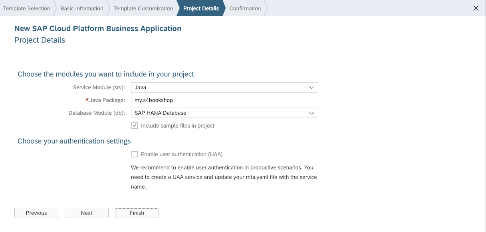
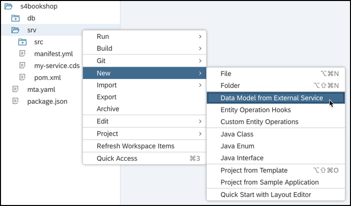
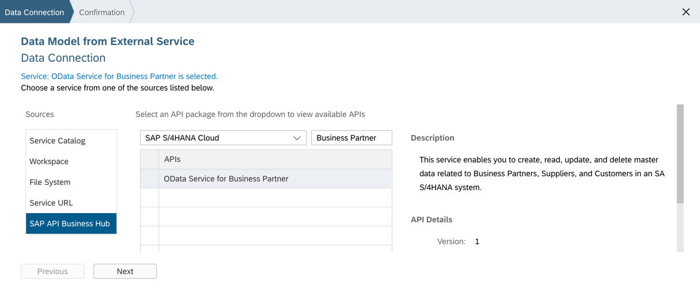
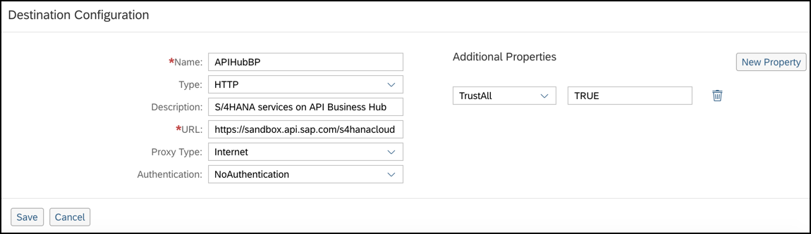
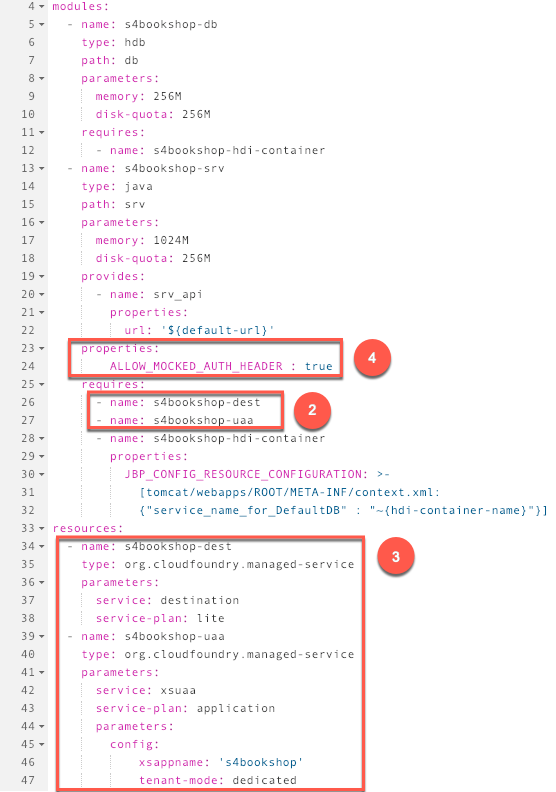

## Prerequisites  
- [Enable SAP Web IDE Full-Stack](https://developers.sap.com/tutorials/webide-multi-cloud.html)
- [Select a Cloud Foundry Space](https://help.sap.com/viewer/825270ffffe74d9f988a0f0066ad59f0/CF/en-US/98f49286ac05492f88428c603d146fc3.html)
- [Enable SAP API Business Hub feature in SAP Web IDE](https://help.sap.com/viewer/825270ffffe74d9f988a0f0066ad59f0/CF/en-US/90999000744441c6b1fe486d43428b4b.html)

## Details
### You will learn  
  - How to extend your bookshop application so that it can access and consume the [OData Service for Business Partner](https://api.sap.com/api/API_BUSINESS_PARTNER/resource?section=OVERVIEW) using SAP API Business Hub
  - How to query master data related to suppliers (of books) in an SAP S/4HANA system
  - How to read supplier information (in SAP S/4HANA) of an order (stored in your SAP HANA database)

---

[ACCORDION-BEGIN [Step 1: ](Start a project)]
Let's start off by creating a new business application project from a template.

1. In SAP Web IDE choose **File** | **New** | **Project from Template**.

2. Search for **SAP Cloud Platform Business Application** and select it.

    > If you do not see the template, make sure **All Categories** is selected from the **Category** drop-down menu and try again.

3. Enter `s4bookshop` as the project name and choose **Next**.

4. Leave the default MTA details and choose **Next**.

5. In the **Project Details** step, enter `my.s4bookshop` as the **Java Package** name.

    

    > Leave the default option of including sample files in project selected.

6. Choose **Finish**.

[DONE]

[ACCORDION-END]

[ACCORDION-BEGIN [Step 2: ](Define a data model)]
This model simply represents the bookshop application and consists of the Books, Authors, and Orders entities. The application programming model uses this data model to create the corresponding structure in your local SAP HANA database.

1. Open `db/data-model.cds` and replace the template with the following CDS definitions:

    ```CDS
    namespace my.s4bookshop;

    entity Books {
      key ID : Integer;
      title  : String;
      author : Association to Authors;
      stock  : Integer;
    }

    entity Authors {
      key ID : Integer;
      name   : String;
      books  : Association to many Books on books.author = $self;
    }

    entity Orders {
      key ID : UUID;
      book   : Association to Books;
      buyer  : String;
      date   : DateTime;
      amount : Integer;
      supplier : Integer;
    }
    ```

2. Save the file.

    > A build of the CDS files runs automatically and you may see a build error. This is because there is sample code in the service model (`srv/my-service.cds`) that needs to be updated. We will resolve this in step 4.

[VALIDATE_1]

[ACCORDION-END]

[ACCORDION-BEGIN [Step 3: ](Get the data model from S/4HANA)]
To complete the data model, we need to get the Suppliers entity which is available in the S/4HANA data source. So, in this step we will retrieve the corresponding data model from S/4HANA and save it to our project structure.

1. Right-click the `srv` module and choose `New > Data Model from External Service`.

    

2. Select **SAP API Business Hub** as the source.

3. Select the **SAP S/4HANA Cloud** API package.

4. Search for **OData Service for Business Partner** and select it.

    > When prompted, log on to SAP API Business Hub with your SAP Community User credentials in order to access the service.

    

5. Choose **Next**.

6. Deselect the **Generate Virtual Data Model classes** checkbox.

    > This is not needed for our tutorial as the API endpoint (`A_Supplier`) that we will use is a whitelisted one. This means that we can access it without having to download the corresponding VDM class into our project.

7. Choose **Finish**.

    > The data model from the external S/4HANA service is retrieved and stored in your project.

[VALIDATE_2]

[ACCORDION-END]

[ACCORDION-BEGIN [Step 4: ](Define a service model)]
Now, let's define a service model that builds on top of the data models from the earlier steps. The service that is finally provisioned is based on this model.

1. Open `srv/my-service.cds` and replace the template with the following CDS definitions:

    ```CDS
    using my.s4bookshop from '../db/data-model';
    using API_BUSINESS_PARTNER as bp from '../srv/external/csn/ODataServiceforBusinessPartner';

    service S4BookshopService {
      entity Books as projection on s4bookshop.Books;
      entity Authors @readonly as projection on s4bookshop.Authors;
      entity Orders @insertonly as projection on s4bookshop.Orders;
      entity Suppliers as projection on bp.A_SupplierType
    	   excluding {to_SupplierCompany, to_SupplierPurchasingOrg};

      function GetSupplier(OrderID:UUID) returns Suppliers;
    }
    ```

    > From this model, you can see that the `S4BookshopService` exposes Books, Authors, and Orders entities that are projections on the entities from your SAP HANA database. The Suppliers entity, on the other hand, is a projection on the corresponding entity from S/4HANA. The function `GetSupplier` exposed by the service returns the supplier information corresponding to an order.

2. Save the file.

    > A build of the CDS files runs automatically and you will see a notification that it completed successfully.

[DONE]

[ACCORDION-END]

[ACCORDION-BEGIN [Step 5: ](Add a database and fill in initial data)]
Let's create the SAP HANA database for our application and fill it with initial data.

1. Right-click the `db` module and choose **Build**.

    > Wait for the notification that says the build was successful.

2. Download the following files:

    [`Authors.csv`] (https://raw.githubusercontent.com/SAPDocuments/Tutorials/master/tutorials/cp-apm-s4hana-01/csv/Authors.csv)

    [`Books.csv`] (https://raw.githubusercontent.com/SAPDocuments/Tutorials/master/tutorials/cp-apm-s4hana-01/csv/Books.csv)

    [`Orders.csv`] (https://raw.githubusercontent.com/SAPDocuments/Tutorials/master/tutorials/cp-apm-s4hana-01/csv/Orders.csv)

    [`Data.hdbtabledata`] (https://raw.githubusercontent.com/SAPDocuments/Tutorials/master/tutorials/cp-apm-s4hana-01/csv/Data.hdbtabledata)

3. In your workspace, go to `s4bookshop/db/src/`, right-click on the **`src`** folder and choose **Import | File or Project**.

4. Browse to the location where you have saved the `Authors.csv` file.

5. In the **Import to** field, add `/csv` to the default location and choose **OK**.

    > This creates a `/csv` folder under `/s4bookshop/db/src` and adds the `Authors.csv` file to that location.

6. Repeat steps 4 and 5 to add the remaining 3 files to the `/csv` folder.

7. Right-click the `db` module and choose **Build**.

    > Wait for the notification that says the build was successful. This fills the tables with the data from the `csv` files.

[DONE]

[ACCORDION-END]

[ACCORDION-BEGIN [Step 6: ](Configure a destination to the SAP S/4HANA system)]
Let's configure a destination that points to the SAP S/4HANA system. We will use this destination in a later step when writing custom code to query the Supplier information.

1. Open your subaccount in the Cloud Foundry environment in the SAP Cloud Platform cockpit.

    > For more information, see [Navigate to Global Accounts and Subaccounts in the Cockpit](https://help.sap.com/viewer/65de2977205c403bbc107264b8eccf4b/Cloud/en-US/0874895f1f78459f9517da55a11ffebd.html).

2. From the navigation menu, select **Connectivity > Destinations**.

3. Choose **New Destination**.

4. Enter `APIHubBP` as the name for the destination.

5. Enter `https://sandbox.api.sap.com/s4hanacloud` as the URL. This URL points to the SAP S/4HANA Cloud package on SAP API Business Hub.

6. Select **Internet** as the proxy type.

7. Select **`NoAuthentication`**.

    > In a productive scenario, select the appropriate authentication option to your system.

8. Add an additional property **TrustAll** with the value **TRUE**.

9. Choose **Save**.

    

[DONE]

[ACCORDION-END]

[ACCORDION-BEGIN [Step 7: ](Bind managed services)]
Now, let's bind a destination service to your application. This service lets your Cloud Foundry application find the destination information required to access the SAP S/4HANA system.  We'll also bind the extended services for User Account and Authentication (XSUAA) to your application. Additionally, we'll specify these services as being managed, which means that they will be automatically created and started for you once you deploy the application.

1. Open the `mta.yaml` file of your SAP Web IDE project in the Code Editor.

2. Under the **requires** section of the `srv` module, specify the name of the destination and XSUAA services.

    ```YAML
    [...]
    modules:
      [...]
      - name: s4bookshop-srv
        [...]
        requires:
          - name: s4bookshop-dest
          - name: s4bookshop-uaa
          [...]
    ```

    

3. Under the **resources** section, add the configuration for the destination and XSUAA services.

    ```YAML
    [...]
    resources:
      [...]
      - name: s4bookshop-dest
        type: org.cloudfoundry.managed-service
        parameters:
          service: destination
          service-plan: lite
      - name: s4bookshop-uaa
        type: org.cloudfoundry.managed-service
        parameters:
          service: xsuaa
          service-plan: application
          parameters:
            config:
                xsappname: 's4bookshop'
                tenant-mode: dedicated
    ```

4. Add the environment variable `ALLOW_MOCKED_AUTH_HEADER` to the **properties** section of the `srv` module.

    ```YAML
    [...]
    modules:
      [...]
      - name: s4bookshop-srv
        [...]
        properties:
            ALLOW_MOCKED_AUTH_HEADER : true
        [...]
    ```

    > **This variable must never be enabled in productive environments.** When the variable is explicitly set to true, mock tenant and user information is used when no actual tenant information is available. It is only meant to make testing easier if you do not yet implement the authentication mechanisms of Cloud Foundry.

5. Save the `mta.yaml` file.

[DONE]

[ACCORDION-END]

[ACCORDION-BEGIN [Step 8: ](Add Custom Logic)]
Add a custom handler that implements the query operation on the `Suppliers` entity defined in your service. Let's also add a function that accepts Order ID from the request URL, reads the associated order information from SAP HANA database and then reads the corresponding supplier information from SAP S/4HANA system.

1. In the `srv` module, go to `src/main/java/my/s4bookshop` and open the context menu.

2. Choose **New > Java Class**.

3. Enter **`S4BookshopService`** as the class name and choose **Next**.

4. Choose **Finish**.

    > The `S4BookshopService.java` file is created.

5. Open the new `S4BookshopService.java` file and replace the template with the following code:

    ```Java
    package my.s4bookshop;

    import java.util.*;

    import com.sap.cloud.sdk.service.prov.api.annotations.*;
    import com.sap.cloud.sdk.service.prov.api.*;
    import com.sap.cloud.sdk.service.prov.api.operations.Query;
    import com.sap.cloud.sdk.service.prov.api.request.*;
    import com.sap.cloud.sdk.service.prov.api.response.*;
    import com.sap.cloud.sdk.odatav2.connectivity.*;

    import org.slf4j.Logger;
    import org.slf4j.LoggerFactory;

    import com.sap.cloud.sdk.s4hana.connectivity.*;
    import com.sap.cloud.sdk.s4hana.datamodel.odata.namespaces.businesspartner.Supplier;
    import com.sap.cloud.sdk.s4hana.datamodel.odata.services.DefaultBusinessPartnerService;


    public class S4BookshopService {

      Logger logger = LoggerFactory.getLogger(S4BookshopService.class);

    	private static final String DESTINATION_NAME = "APIHubBP"; //Refers to the destination created in Step 6
    	private static final String apikey = "xxxxxxxxxxxxxxxxxxxxxxxxxxxxxxxx"; //Replace with your API key


    	private ErpConfigContext context = new ErpConfigContext(DESTINATION_NAME);

      @Query(serviceName = "S4BookshopService", entity = "Suppliers")
    	public QueryResponse querySupplier(QueryRequest qryRequest) {

        QueryResponse queryResponse;
        int top = qryRequest.getTopOptionValue();
        int skip = qryRequest.getSkipOptionValue();

        try {
        	// Create Map containing request header information
            	Map<String, String> requestHeaders = new HashMap<>();
            	requestHeaders.put("Content-Type","application/json");
            	requestHeaders.put("APIKey",apikey);

        	final List<Supplier> suppliers =
        	             new DefaultBusinessPartnerService().getAllSupplier()
        	            .withCustomHttpHeaders(requestHeaders).onRequestAndImplicitRequests()
        	            .select(Supplier.SUPPLIER, Supplier.SUPPLIER_NAME)
        	            .top(top >= 0 ? top : 50)
        	            .skip(skip >= 0 ? skip : -1)
        	           .execute(context);
        	queryResponse = QueryResponse.setSuccess().setData(suppliers).response();

        } catch (final ODataException e) {
        	logger.error("Error occurred with the Query operation: " + e.getMessage(), e);
        	ErrorResponse er = ErrorResponse.getBuilder()
        	                            .setMessage("Error occurred with the Query operation: " + e.getMessage())
        	                            .setStatusCode(500).setCause(e).response();
        	queryResponse = QueryResponse.setError(er);
        }

    	  return queryResponse;
    	}

      @Function(serviceName = "S4BookshopService", Name = "GetSupplier")
    	public OperationResponse getSupplierOfOrder(OperationRequest functionRequest, ExtensionHelper extensionHelper) {
    		OperationResponse opResponse;

    		try {
    			// Retrieve the parameters of the function from the
    			// OperationRequest object
    			Map<String, Object> parameters = functionRequest.getParameters();

    			//Get the DataSourceHandler object from the ExtensionHelper. This is required
    			//to execute operations on the local HANA database
    			DataSourceHandler handler = extensionHelper.getHandler();

    			//Retrieve the Order ID from the request
    			Map<String, Object> ordersKey = new HashMap<String, Object>();
    			ordersKey.put("ID", String.valueOf(parameters.get("OrderID")));

    			List<String> orderElements = Arrays.asList("ID","SUPPLIER");

    			//Read the Order information from the local HANA database
    			EntityData orderData = handler.executeRead("Orders", ordersKey, orderElements);

    			String supplierID = "";
    			List<Object> supplierList = new ArrayList<Object>();
    			if (orderData != null) {
    				//Retrieve the supplier ID from the order information
    				supplierID = orderData.getElementValue("SUPPLIER").toString();

    				// Create Map containing request header information required for querying the S/4HANA system
    	        	Map<String, String> requestHeaders = new HashMap<>();
    	        	requestHeaders.put("Content-Type","application/json");
    	        	requestHeaders.put("APIKey",apikey);

    	        	//Use SAP S/4HANA Cloud SDK's Virtual Data Model to read the Supplier information
    				final Supplier supplier =
    				             new DefaultBusinessPartnerService().getSupplierByKey(supplierID)
    				            .withCustomHttpHeaders(requestHeaders).onRequestAndImplicitRequests()
    				            .select(Supplier.SUPPLIER, Supplier.SUPPLIER_NAME)
    				           .execute(context);

    				// Add the retrieved entity data to a supplier list object
    				supplierList.add(supplier);
    			}

    			// Return an instance of OperationResponse containing the list of supplier data
    			opResponse = OperationResponse.setSuccess().setData(supplierList).response();

    		} catch (Exception e) {
    			logger.error("Error in GetSupplier: " + e.getMessage());
    			// Return an instance of OperationResponse containing the error in
    			// case of failure
    			ErrorResponse errorResponse = ErrorResponse.getBuilder()
    					.setMessage(e.getMessage())
    					.setCause(e)
    					.response();

    			opResponse = OperationResponse.setError(errorResponse);
    		}
    		return opResponse;
    	}

    }
    ```

    > In the code, replace the masked API key with your own API key to the API Sandbox environment. To get the key, go to [OData Service for Business Partner](https://api.sap.com/api/API_BUSINESS_PARTNER/resource) and choose **Show API Key**. For more information, see [Trying Out APIs in a Sandbox Environment](https://help.sap.com/viewer/84b35b9c39b247e3ba2a31f02beee46d/Cloud/en-US/74fa07983b1c41ffba251e14e4c31a11.html).

6. Save `S4BookshopService.java`.

[DONE]

[ACCORDION-END]

[ACCORDION-BEGIN [Step 9: ](Run the application)]
Finally, let's run the application to see it all come together.

1. Right-click the `srv` module and choose **Run > Run as Java Application**.

2. Choose **View > Run Console** and click on the application URL.

3. Click on the service link to open the OData service document. The service URL is of the format: `https://host/odata/v2/S4BookshopService`.

4. Add `/$metadata` to the URL and open it. The URL is of the format: `https://host/odata/v2/S4BookshopService/$metadata`.

5. Replace `/$metadata` with `/Suppliers` and open it. The URL is of the format: `https://host/odata/v2/S4BookshopService/Suppliers`.

    > The suppliers data from SAP S/4HANA is displayed.

6. Retrieve just the top 5 suppliers using the URL format: `https://host/odata/v2/S4BookshopService/Suppliers?$top=5`.

    > The top 5 suppliers from SAP S/4HANA is displayed.

7. Now, let's retrieve the supplier information corresponding to a specific order (`ID=46262d7a-0fe3-11e8-b642-0ed5f89f718b`) using the function `GetSupplier`. The URL format for this is `https://host/odata/v2/S4BookshopService/GetSupplier?OrderID=guid'46262d7a-0fe3-11e8-b642-0ed5f89f718b'`.

    > The supplier information (from SAP S/4HANA) corresponding to the order (in SAP HANA database) is displayed.

[DONE]

[ACCORDION-END]

---
