## Prerequisites
 - [Get a free trial account on SAP Cloud Platform](hcp-create-trial-account)

## Details
### You will learn
  - How to create a simple cloud application from scratch.
  - How to build HANA objects and add business logic.


---

[ACCORDION-BEGIN [Step 1: ](Login to SAP Web IDE)]

1. Login into [SAP Cloud Platform](https://account.hanatrial.ondemand.com/).

    >If you can't login, make sure you have completed all the prerequisites from the above list.

1. The opening screen will appear. Choose **Neo Trial** as the type of account.

    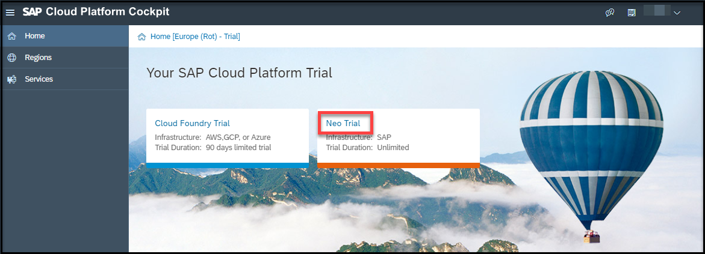

1. Choose `Services`.

    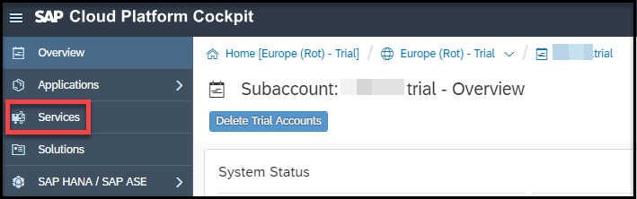

1. Search for **SAP Web IDE** and select **SAP Web IDE Full-Stack**.    

    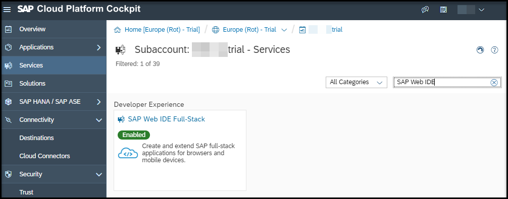

1. Under `Take Action`, choose **Go to Service**. This will access SAP Web IDE.    

    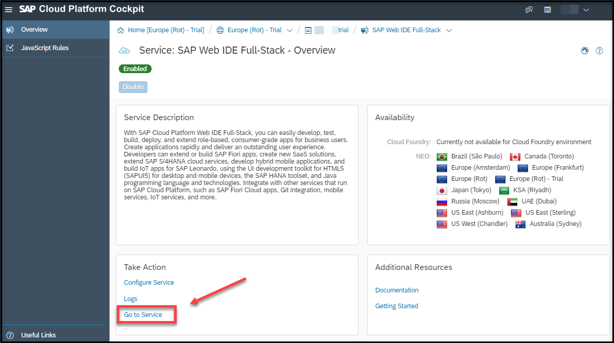

[DONE]
[ACCORDION-END]

[ACCORDION-BEGIN [Step 2: ](Create a project)]

1. In SAP Web IDE choose **File** | **New** | **Project from Template**.

1. Search for **SAP Cloud Platform Business Application**.

    >If you see an error stating that you do not have a builder in your space, make sure you have completed the prerequisite, [selected a Cloud Foundry Space](https://help.sap.com/viewer/825270ffffe74d9f988a0f0066ad59f0/CF/en-US/98f49286ac05492f88428c603d146fc3.html), and have saved your preferences.
    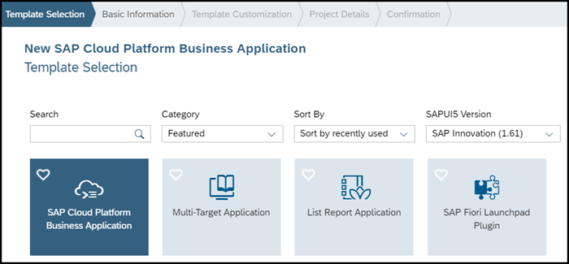   

    >If you do not see the template, make sure **All Categories** is selected from the **Category** drop-down menu and try again. If you still do not see the template, make sure the **SAP Cloud Platform Business Application Development Tools** are enabled. See [Developing SAP Cloud Platform Business Applications](https://help.sap.com/viewer/825270ffffe74d9f988a0f0066ad59f0/CF/en-US/99936743e1964680a0884479bfa75c8e.html).

1. Enter **`bikeshop`** as the project name and choose **Next**.

1. In the **Template Customization** tab leave the default values.

1. Complete the **Project Details** tab as shown in the screenshot and ensure that the **Include sample files in project** checkbox is checked.

    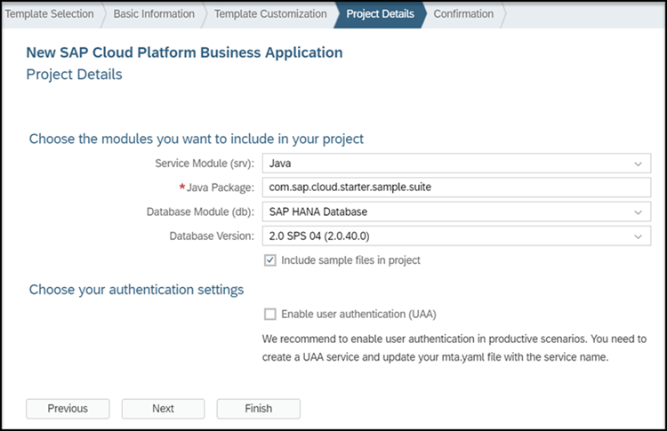

    >You should update the **Java Package** to `com.sap.cloud.starter.sample.suite`.

1. Choose **Finish**. This will create your project inside your workspace.


[DONE]
[ACCORDION-END]

[ACCORDION-BEGIN [Step 3: ](Add a data model)]

The `data-model.cds` file is a Core Data Services (CDS) document. CDS  documents are design-time source files that contain DDL code that describes a persistence model according to rules defined in CDS. This documents are used to create corresponding data objects. In this case, the entity `Bike` will be a data structure to be store in a `CSV` file, but it could be also a table in a database.

1. Open the `db/data-model.cds` and replace the existing content with the following CDS definitions:

    ```CDS
    namespace starter.sample.suite;

    entity Bike {

      key productUID : String;
      productType  : String;
      variantType  : String;
      baseProductUID  : String;
      catalogVersion  : String;
      name  : String;
      description  : String;
      superCategories  : String;
      unit:String;
      price:Double;
      currency: String;
      attributeHeader1  : String;
      attributeValue1  : String;
      attributeHeader2  : String;
      attributeValue2  : String;
      image		: String;
    }
    ```

    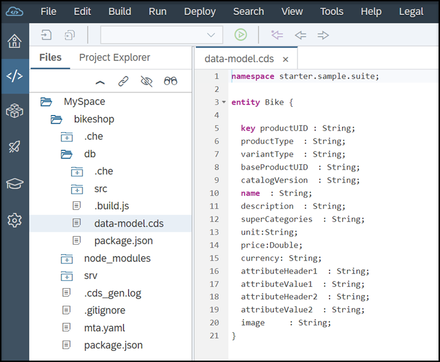

2. Save the file.

3. Go to `db/src` and open the context menu. Create a new folder named `csv`.

4. In your new `csv` folder, open the context menu and create a new file named `Bike.csv`.

5. Open `Bike.csv` and replace the template with the following data:

    ```CSV
    PRODUCTUID,PRODUCTTYPE,VARIANTTYPE,BASEPRODUCTUID,CATALOGVERSION,NAME,DESCRIPTION,SUPERCATEGORIES,UNIT,PRICE,CURRENCY,ATTRIBUTEHEADER1,ATTRIBUTEVALUE1,ATTRIBUTEHEADER2,ATTRIBUTEVALUE2
    MZ-FG-M520,VeloticsProduct,,,veloticsProductCatalog,Velotics City Cruiser,We present the ultimate e-bike with our brand new VELOTICS RECHARGE ULTIMATE ECO battery for awesome and endless rides. Feel the power; feel the pace and you will have endless adventures with your bike.,CAT1,pieces,1548,USD,,,,
    MZ-FG-E105,VeloticsProduct,,,veloticsProductCatalog,Velotics Lean Folding,"Biking beyond boundaries: We present this awesome folding bike with the  latest and greatest innovations. During the design phase the motto was ""From good to great"" and we achieved that with this new 2016 model of our famous Velotics Lean Folding.",CAT1,pieces,799,USD,,,,
    MZ-FG-E104,VeloticsProduct,,,veloticsProductCatalog,Velotics X-Country,Be on the fast track: We had to deliver something. But what is something? We found an answer to that with our brand-new VELOTICS X-COUNTRY E-Bike. Feel the nature and the wind being always on the fast track. If your time is always tight this is the right choice for your ride.,CAT1,pieces,1599,USD,,,,
    MZ-FG-K201,VeloticsProduct,,,veloticsProductCatalog,Velotics Wind Speed,The Velotics Speed Gear is the cheapest way of saving the environment. This rechargeable e-bike adopts High-strength Carbon Steel Frame; what make it light; cheap and useful for most your activities outdoors.,CAT1,pieces,499,USD,,,,
    MZ-FG-K202,VeloticsProduct,,,veloticsProductCatalog,Velotics Mountain Rider,Jack of all trades: mountains; city; beaches; night; day. Its removable 36V; 8AH Ion lithium battery gives you more time with power and ideal for long rides.,CAT1,pieces,639,USD,,,,
    MZ-FG-K203,VeloticsProduct,,,veloticsProductCatalog,Velotics Ecosport ,28'' super lightweight magnesium; integrated wheel with anti-slip resistant thick tire. Can be used for Rainy or snowy mountain way and normal road. This bike will carry you to your eco-adventures.,CAT1,pieces,869,USD,,,,
    MZ-FG-W371,VeloticsProduct,,,veloticsProductCatalog,Velotics Road Master,Excellent all-around mountain bike that is right at home on a rugged unpaved path or cruising the streets in your neighborhood. The perfect choice for the day-to-day rides.,CAT1,pieces,99,USD,,,,
    MZ-FG-W372,VeloticsProduct,,,veloticsProductCatalog,Velotics Hybrid Fit,Not a regular mountain bike; we present the new Velotics Hybrid Fit. Good for the weekend at the mountains; parks and beaches; it is also a perfect fit for normal roads and city.,CAT1,pieces,159,USD,,,,
    MZ-FG-W373,VeloticsProduct,,,veloticsProductCatalog,Velotics Pro Folding,700c folding gravel bike. Knobby 33mm tires; 30 speeds; and disc brakes has this bike at home on dirt roads and gravel trails. You can fold it for the train; car trunk; or closet.,CAT1,pieces,959,USD,,,,
    MZ-FG-W374,VeloticsProduct,,,veloticsProductCatalog,Velotics Sharp Eagle,We present the ultimate 21-speed mountain bike. This a versatile bike that will guide you to your most exciting adventures. If you are looking for a cheap option for the mountains; this is your choice.,CAT1,pieces,199,USD,,,,
    ```

    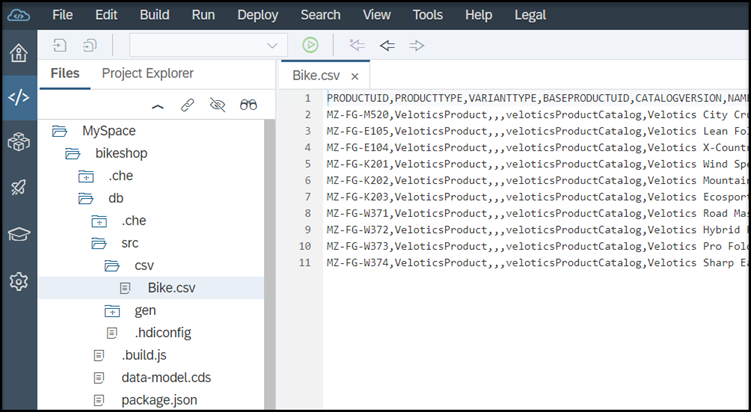

    This file contains the data that is loaded into the HANA table.

6. Save the file.    

7. Stay inside your `csv` folder, open the context menu, and create a new file named `Data.hdbtabledata`.

8. Open `Data.hdbtabledata` and replace the template with the following CDS definitions:

    ```CDS
    {
    	"format_version": 1,
    	"imports": [
    		{
    			"target_table": "STARTER_SAMPLE_SUITE_BIKE",
    			"source_data": {
    			"data_type": "CSV",
    				"file_name": "Bike.csv",
    				"has_header": true
    			},
    			"import_settings": {
    			"import_columns": [
    				"PRODUCTUID",
    				"PRODUCTTYPE",
    				"VARIANTTYPE",
    				"BASEPRODUCTUID",
    				"CATALOGVERSION",
    				"NAME",
    				"DESCRIPTION",
    				"SUPERCATEGORIES",
    				"UNIT",
    				"PRICE",
    				"CURRENCY",
    				"ATTRIBUTEHEADER1",
    				"ATTRIBUTEVALUE1",
    				"ATTRIBUTEHEADER2",
    				"ATTRIBUTEVALUE2"
    				]
    			}
    		}

    	]
    }
    ```

    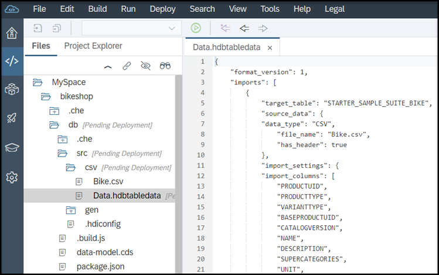


    This file contains the mapping of the HANA table and its corresponding `csv` files.

9. Save the file.    

[DONE]
[ACCORDION-END]

[ACCORDION-BEGIN [Step 4: ](Update Your service module)]

1. Go to `srv/my-service.cds` and right-click your `my-service.cds` and rename it to `bikeService.cds`

2. Double-click `bikeService.cds` and replace the template with the following CDS definitions:

    ```CDS
    //we have defined a Service called CatalogService that contains a single Entity called Bike.
    //The Bike Entity allows the read method to be performed on a projection of the database table suite.Bike

    using {starter.sample.suite} from '../db/data-model';

    service CatalogService {
     entity Bike @readonly as projection on suite.Bike;
    }
    ```
    >This is the file where we define the OData service that we want to expose. In this case, the Bike entity is defined as read only.

3. Save the file.    

[DONE]
[ACCORDION-END]

[ACCORDION-BEGIN [Step 5: ](Add a database)]

1. Right-click the **`db`** module and choose **Build**.

    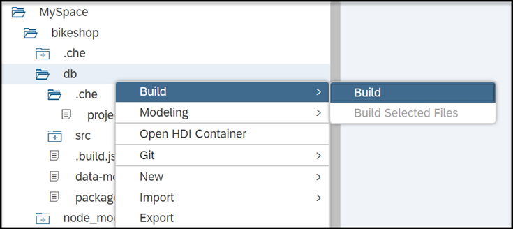

2. Wait for the notification that says the **Build** was successful.

> If the build is unsuccessful, check the console log for errors. Errors similar to this one: `Warning: Could not find a configured library that contains the "com.sap.hana.di.afllangprocedure" build plugin in a version compatible to version 2.0.30.0 at "src/.hdiconfig"` can be addressed as follows:

> 1. Ensure all files in the project are shown, with menu path **View** | **Show Hidden Files**.

> 1. Expand the folder `db/src/` to find the file `.hdiconfig`.                    
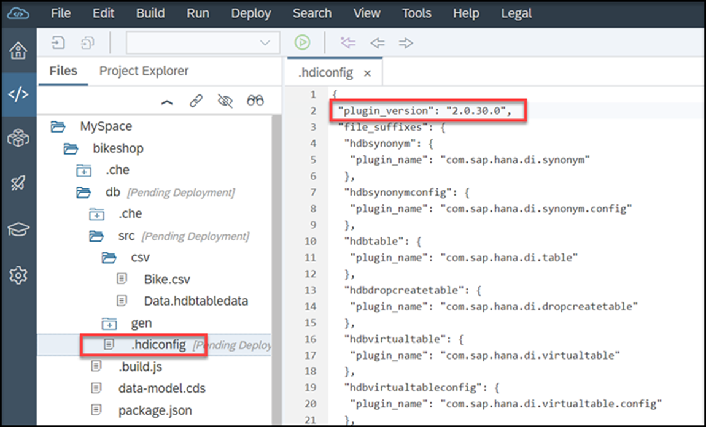

> 1. Open the file and check the value of the `plugin_version` property at the top of the file. It needs to be `2.0.2.0`.

> 1. Change the value to `2.0.2.0` if necessary. Be careful to maintain the structure and integrity of the rest of the file (basically, just change the value inside the double quotes).

> 1. **Save** the file and retry the **Build**.


[DONE]
[ACCORDION-END]

[ACCORDION-BEGIN [Step 6: ](Build and run your service)]

1. Right click on the **`srv`** module and choose **Build**.


    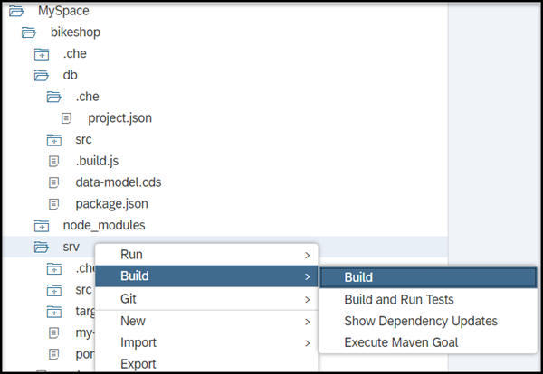

    Wait for the notification that says the **Build** was successful.

2. Click on the **`srv`** module and choose **Run** from the global toolbar.


    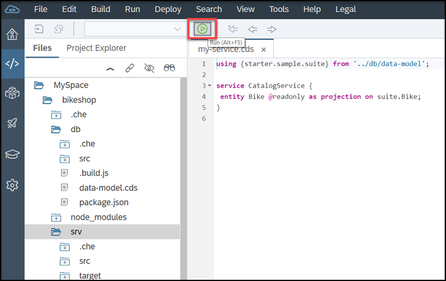

    >This might take a few minutes because a new cloud container has to be initialized and started. Subsequent restarts are much faster because hot deployment is used.

3. Go to the **Run Console** and click on the URL.

    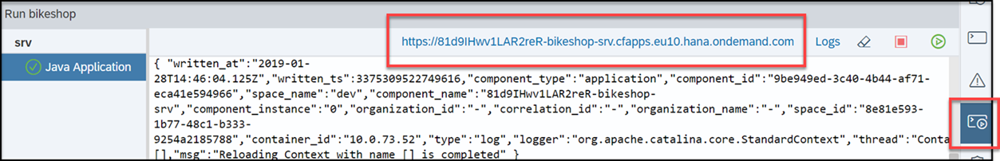

    A new browser window opens containing a link to the OData service.

4. Click on the service link to open the OData service document.

5. Add **`/$metadata`** to the URL and refresh.

    The OData metadata document opens in EDMX format.

6. Replace `/$metadata` with **`/Bike`**. You can now see the data from the `Bike.csv` that is loaded into the HANA table, which is exposed via the application.

7. Replace `/Bike` with **`/Bike('MZ-FG-E104')`** to see the bike details sorted by ID.

8. Replace `/Bike('MZ-FG-E104')` with **`/Bike?$filter=price gt 200 and price lt 1000`** to retrieve the bikes in the price range between 200 and 1000.

9. Replace `/Bike?$filter=price gt 200 and price lt 1000` with **`/Bike?$filter=name eq 'Velotics X-Country'`** to retrieve the bikes sorted by name.


[DONE]
[ACCORDION-END]

---
