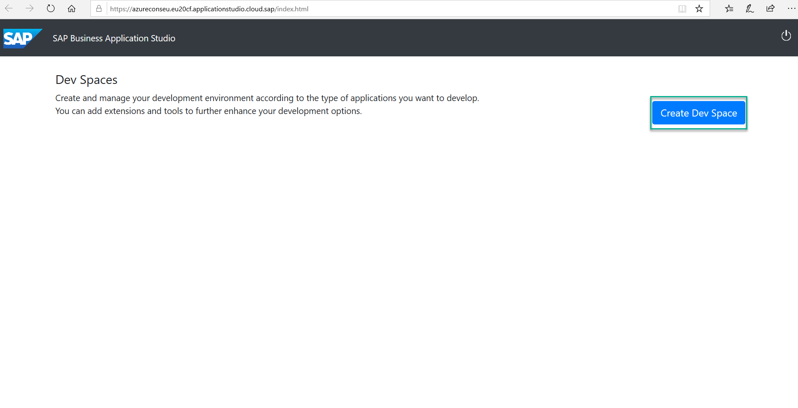
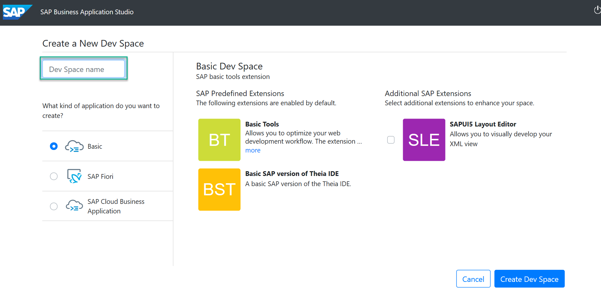
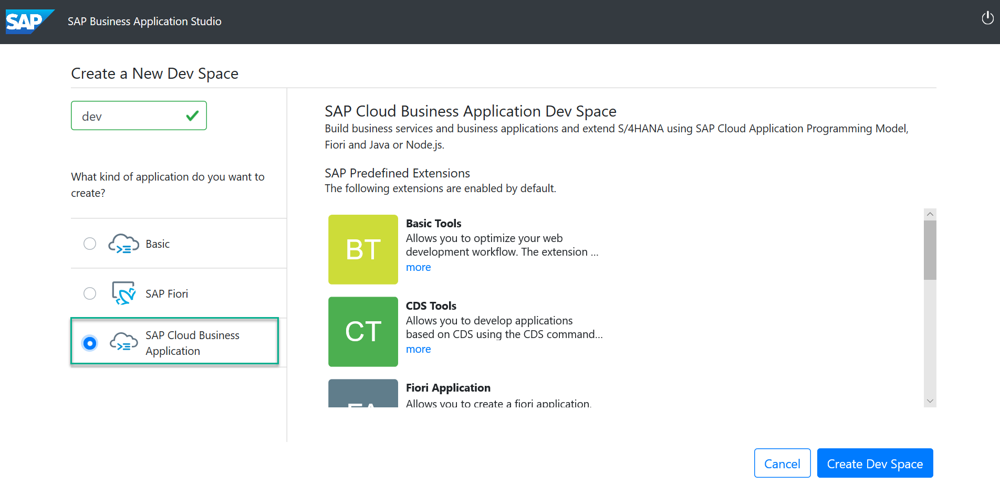

## Prerequisites
 - You have enabled SAP Business Application Studio.

## Details
### You will learn
  - How to create a dev space for developing business applications.

---
[ACCORDION-BEGIN [Step 1: ](Create your preconfigured dev space)]
1. Open the **SAP Business Application Studio**.

    

2. Choose **Create Dev Space**.

    

3. Choose a **name** for your dev space.

    

4. Choose **SAP Cloud Business Application** as the application type.

    

5. Choose **Create Dev Space**.

    

[VALIDATE_6]
[ACCORDION-END]
