## Prerequisites
 - You have an SAP BTP, Cloud Foundry environment subscription or a trial account, and you are a security administrator of it (meaning that you can see the **Security** menu in the SAP BTP cockpit).
 - You have an Microsoft Azure subscription or a free account.

## Details
### You will learn
  - How to set up Microsoft Azure AD as one of your Identity Providers (IdP) for SAP BTP, Cloud Foundry environment applications

You will enable trust between SAP Business Technology Platform, Cloud Foundry environment subaccount and your Microsoft Azure AD. As a result, your Microsoft Azure AD can serve as a primary IdP or alternative IdP to communicate later with the UAA services of the SAP BTP, Cloud Foundry environment.

---

[ACCORDION-BEGIN [Step 1: ](Identify tenant name and region from your SAP BTP, Cloud Foundry environment subaccount)]

You have to replace some variables in provided URLs throughout the tutorial like a **`tenant_name`** or **`region`**.

Navigate to your SAP BTP, Cloud Foundry environment subaccount in the [SAP BTP cockpit](https://account.hanatrial.ondemand.com/cockpit/#/home/trialhome) in order to have your `tenant` and `region` values for the next step handy.

>The **`tenant_name`** is equal to the subaccount domain, which can be found on the **Overview** page of the SAP BTP, Cloud Foundry environment subaccount.

>The correct **`region`** is part of the API Endpoint URL on the same page.

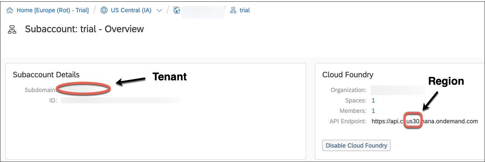

[DONE]
[ACCORDION-END]

[ACCORDION-BEGIN [Step 2: ](Download UAA metadata file for your SAP BTP, Cloud Foundry environment subaccount)]

1. To download the metadata file of your SAP BTP, Cloud Foundry environment subaccount, navigate to the **Trust Configuration** section in your SAP BTP cockpit.

2. Click on **SAML Metadata** to download the corresponding SAML metadata file.

    !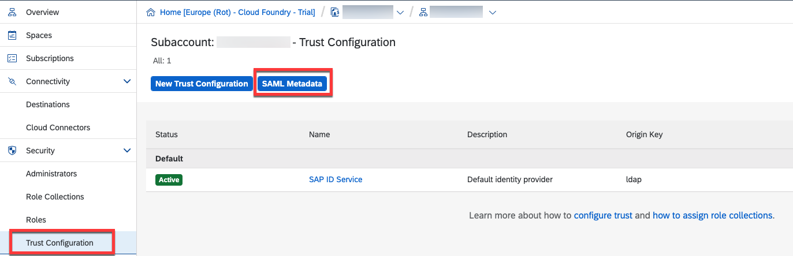

[DONE]
[ACCORDION-END]

[ACCORDION-BEGIN [Step 2: ](Add Cloud Foundry as enterprise application on Microsoft Azure)]

Go to the [Microsoft Azure Portal](https://portal.azure.com/) and navigate to **Azure Active Directory** and to the sub menu **Enterprise applications**.

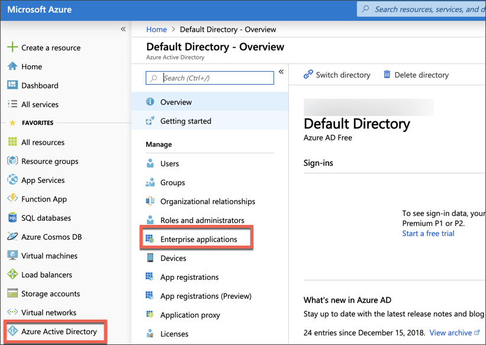

>Note:
> Your Azure Portal might look different according to your configured colour scheme. You can change your colour scheme whenever you want in the portal settings section.

Click **New Application**.

Search for the **SAP Cloud Platform** application in the gallery, enter **`MyAzureTutorial`** as the name, and save it.

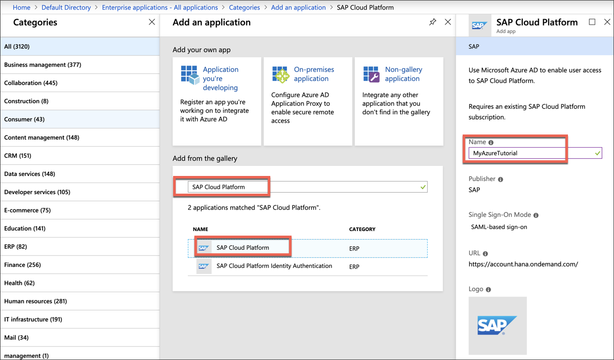

After the successful creation, an overview of your application appears. Click the menu item **Single-sign on** (left) and select **SAML**.

Import the previously downloaded metadata file from the SAP BTP, Cloud Foundry environment subaccount via **Upload metadata file**.

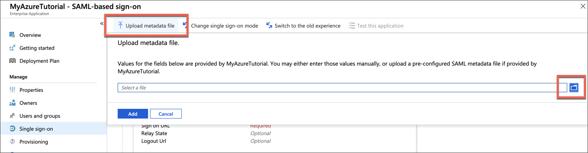

A new view to update your **Basic SAML Configuration** should appear. Provide a **Sign on URL** and save. In this example, you are using the UAA tenant URL from Step 1.

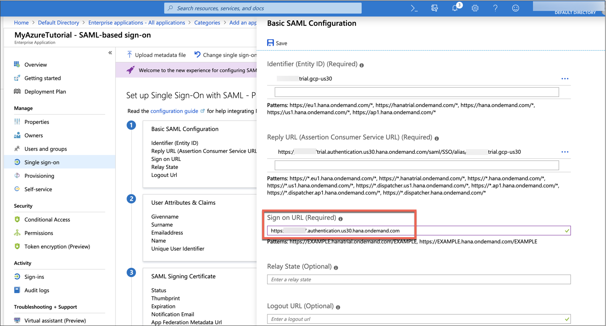

>Your UAA tenant URL has the following pattern: `https://<tenant_name>.authentication.<region>.hana.ondemand.com`

[DONE]
[ACCORDION-END]

[ACCORDION-BEGIN [Step 4: ](Enable provisioning of Group Assertions)]

Before you configure user attributes and claims as part of SAML assertions, you are going to make the `Groups` attribute visible to the application. The `Groups` attribute is necessary on SAP BTP, Cloud Foundry environment to match with Role Collections and, therefore, grant authorizations to users in business applications. Microsoft Azure AD does not provide the user groups claim by default.

Thus, navigate to **Azure Active Directory > App registrations**. Click **View all applications** and enter in the name of the application you created earlier, **`MyAzureTutorial`**.

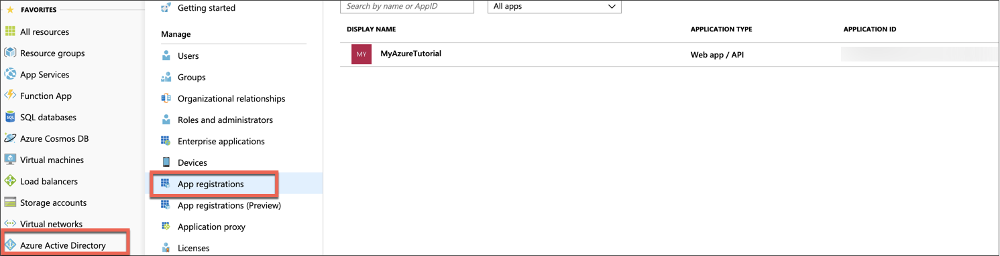

Click **Manifest**.

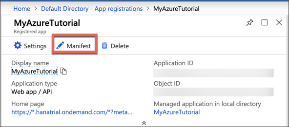

Change the value of `groupMembershipClaims` and save. In this tutorial, you are going to use `SecurityGroup` (for security groups and Azure AD roles). An alternative attribute value is **`All`** (security groups, distribution groups, and Azure AD directory roles).

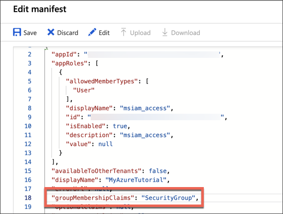

Go back to **Azure Active Directory > Enterprise applications >** **`MyAzureTutorial`** **> Single Sign-on** , and you will note that the `Groups` attribute has been added to **User Attributes & Claims**.

> Note:
> A claim is usually a piece of information about a user, which is then provided to the connected application

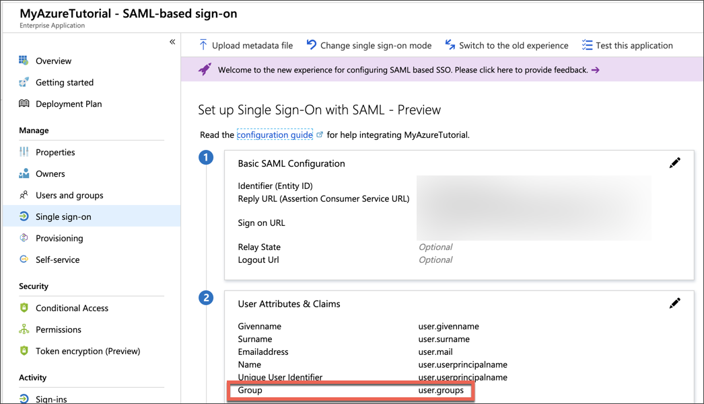

Click the pencil button to adjust your **name identifier value**. Switch the **Name identifier value** to **`user.mail`**.

Then, click on each claim to open the editor mode and change the and user attributes as shown below (case sensitive).

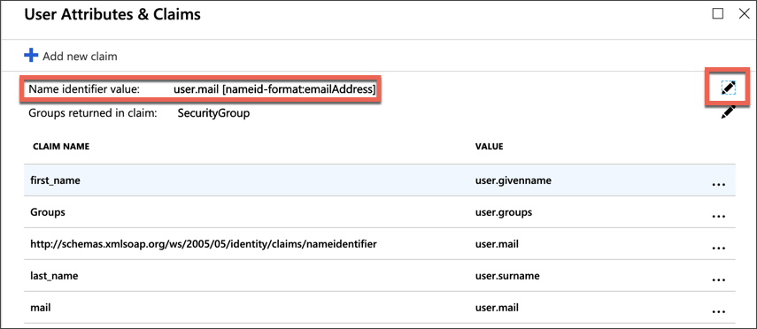

For the `Groups` attribute, you will have to use the Advanced options as below:

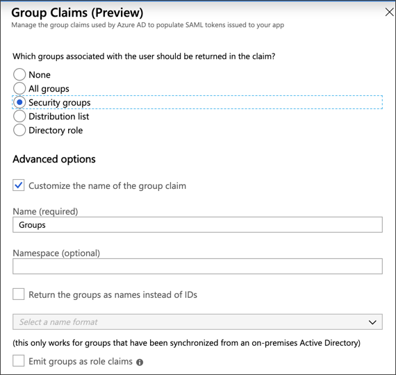

Finally, download the Federation Metadata XML from Microsoft Azure. This file contains several assertion information and the certificate for SAP BTP, Cloud Foundry environment.

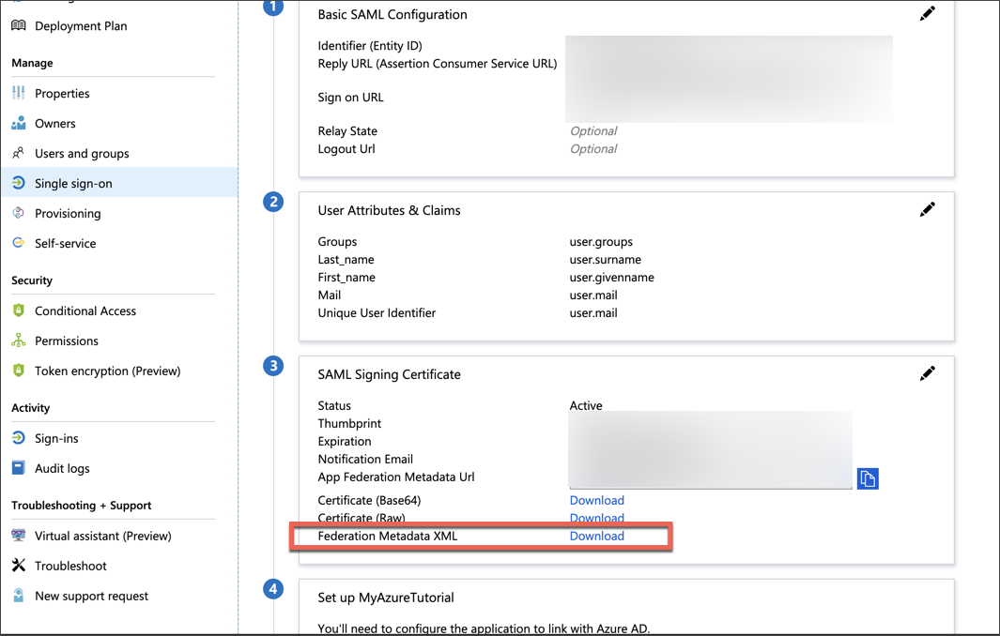

[DONE]
[ACCORDION-END]

[ACCORDION-BEGIN [Step 4: ](Add Azure AD as Identity Provider in the SAP BTP, Cloud Foundry environment account)]

Access your SAP BTP, Cloud Foundry environment account (as in Step 1) and go to **Security > Trust Configuration**. Choose **New Trust Configuration** and import the metadata file downloaded from Microsoft Azure.

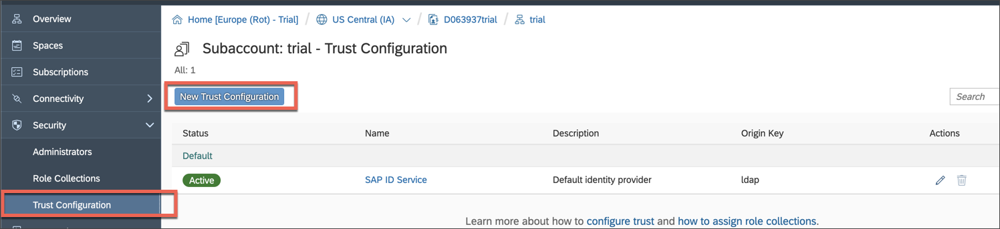

The **Link Text** is the text that will be displayed in the logon page of the UAA tenant for end users.

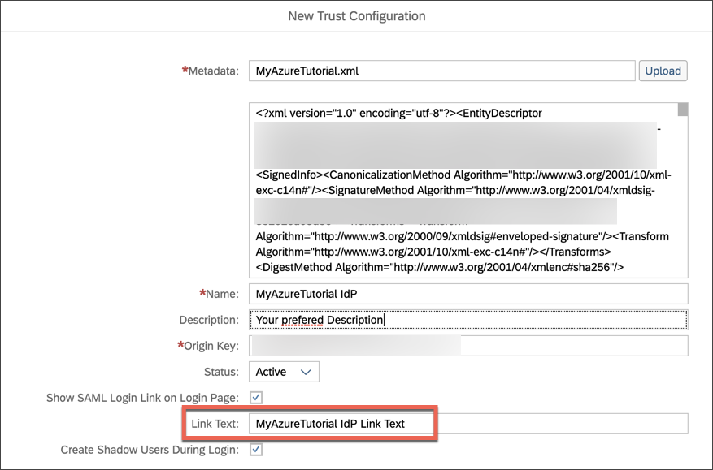

[DONE]
[ACCORDION-END]

[ACCORDION-BEGIN [Step 5: ](Add users to enterprise application in Microsoft Azure AD)]

Open a new browser window and enter the UAA tenant URL again:

`https://<tenant_name>.authentication.<region>.hana.ondemand.com`

You will still be able to logon with your S-Users/P-Users e-mail and password. You will see a link to Azure AD below the form. In **Trust Configuration**, you can enable/disable the SAP ID Service or any other IdP (`MyAzureTutorial IdP Link Text`) you have configured. If you disable the SAP ID Service, you will only see the links to the external Identity Providers. If there is only one Identity Provider configured, you will be automatically redirected to it.

Log on via the Microsoft Azure AD IdP (`MyAzureTutorial IdP Link Text`) and enter your Microsoft user.

An error message should appear:

*AADSTS50105: The signed in user '`xyz`' is not assigned to a role for the application '`abc`'(`MyAzureTutorial`).*

Until now, you don't have any users assigned to this enterprise application in Microsoft Azure AD. Only your Microsoft Azure AD is known as an IdP in your SAP Cloud Platform Cloud Foundry subaccount, but so far no users are allowed to log in with it.

Go back to your [overview of enterprise applications](https://portal.azure.com/#blade/Microsoft_AAD_IAM/StartboardApplicationsMenuBlade/AllApps/menuId/) in Microsoft Azure AD and click your application. Add a new user by clicking **Add user** in the **Users and groups** submenu, as shown on the screenshot.

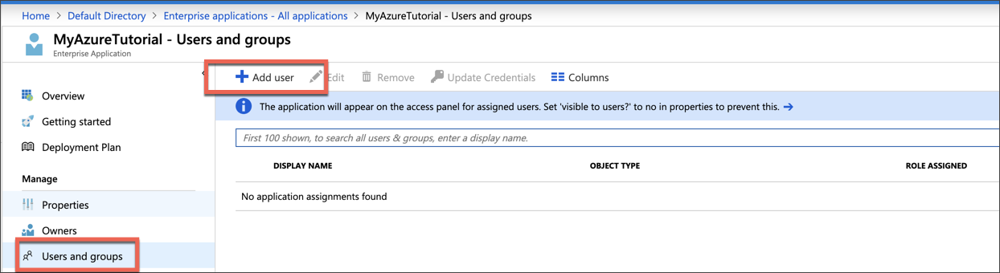

For this tutorial you only want to add a single user (e.g. instead of whole groups). Continue with a click on **Users** (so far the application has no users assigned, accordingly **None Selected** should appear). Search for either your name or the email address you want to continue working with.

By hitting the result tile you select the user and should appear under `Selected members` panel. Finish your user assignment with clicks on **`Select`** and **`Assign`**.

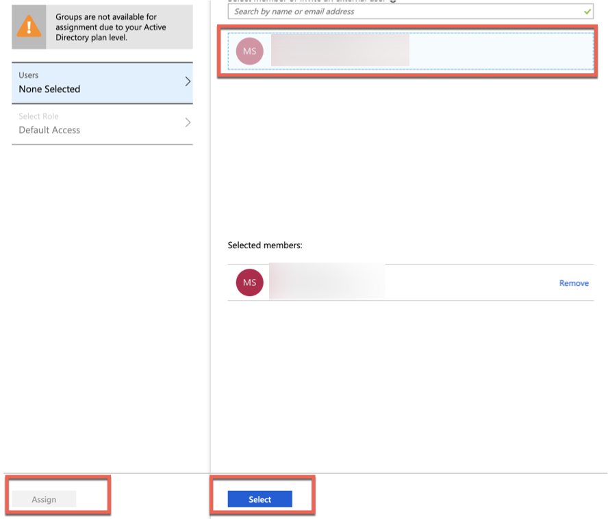

[DONE]
[ACCORDION-END]

[ACCORDION-BEGIN [Step 6: ](Test your configuration)]

Check if your user assignment was successful. Open a new browser window again and enter the UAA tenant URL again:

`https://<tenant_name>.authentication.<region>.hana.ondemand.com`

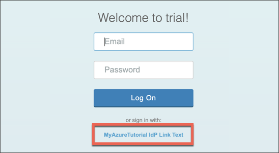

Click the Azure link (`MyAzureTutorial IdP Link Text`) and log on with your Microsoft Azure user you previously assigned to the enterprise application in Microsoft Azure AD. You will be redirected back to UAA afterwards.

You should not see any particular application, because you did not access a CF application, only the UAA tenant page.

>You can check the users details, including the groups mapped, by accessing the following URL:

>`https://<tenant_name>.authentication.<region>.hana.ondemand.com/config?action=who&details=true`

[VALIDATE_1]
[ACCORDION-END]

Congratulation! You have configured Azure AD as the SAML Identity Provider for your SAP BTP, Cloud Foundry environment applications.

---
