## Prerequisites
 - If you don't have a Cloud Foundry Trial Subaccount on [SAP Cloud Platform](https://cockpit.hanatrial.ondemand.com/cockpit/) yet, create your [Cloud Foundry Trial Account](hcp-create-trial-account).
 - Basic knowledge of Spring Boot and Java (optional)

## Details
### You will learn
  - What the SAP Business Application Studio is
  - How to create a project skeleton for a CAP Java project
  - How to expose ports of the application in SAP Business Application Studio to the internet.

First things first, you need to set up your development environment and check that everything is running smoothly.

For this tutorial, we use the new SAP Business Application Studio as the development tool of choice. SAP Business Application Studio provides a web-based Visual Studio Code-like experience. So, it's like VS Code, but for your browser.

> ### What's great about using SAP Business Application Studio?
> You get an editor, useful extensions and all the tools required to develop CAP applications and full access to the terminal.

To make sure that everything is set up correctly, this tutorial also includes how to build and run a simple Hello World application. Cloud Application Programming Model (CAP) supports both Java and Node.js development. But for this tutorial, we're using Java. The [CAP Java SDK](https://cap.cloud.sap/docs/java/) is able to tightly integrate with [Spring Boot](https://spring.io/projects/spring-boot), which provides numerous features out of the box. This means, Spring Boot will be your runtime container.

For a general overview about CAP, you might also want to check out at some blog posts or the live streams by Developer Advocates **`Max Streifeneder`** and **`DJ Adams`**.

 - [Cloud Application Programming Model (CAP) for SAP Cloud Platform – start here](https://blogs.sap.com/2018/10/10/application-programming-model-start-here/)
 - [Max's Adventure in SAP Cloud Platform: CAP in Love.](https://blogs.sap.com/2019/11/21/maxs-adventure-in-sap-cloud-platform-cap-in-love./)
 - [`Live Stream`: Max's Adventure in SAP Cloud Platform](https://www.youtube.com/playlist?list=PLzLY5gikd9hCE52Xlz9e9tYGQj_U2ThYx)
 - [`Live Stream`: Hands-on SAP Dev with `qmacro`](https://www.youtube.com/playlist?list=PL6RpkC85SLQAIntm7MkNk78ysDm3Ua8t0)


---

[ACCORDION-BEGIN [Step 1: ](Open SAP Business Application Studio and create your Dev Space)]

Before you can start using SAP Business Application Studio, you need to create your developer space, where your project will run. Depending on the application you want to develop, you can create different types of dev spaces.

For this tutorial, you'll create a dev space personalized for building services and applications with CAP.

1. Go to the [SAP Cloud Platform Trial cockpit](https://cockpit.hanatrial.ondemand.com/cockpit#/home/trial).

2. Click **Enter Your Trial Account**.

3. Select your subaccount.

    !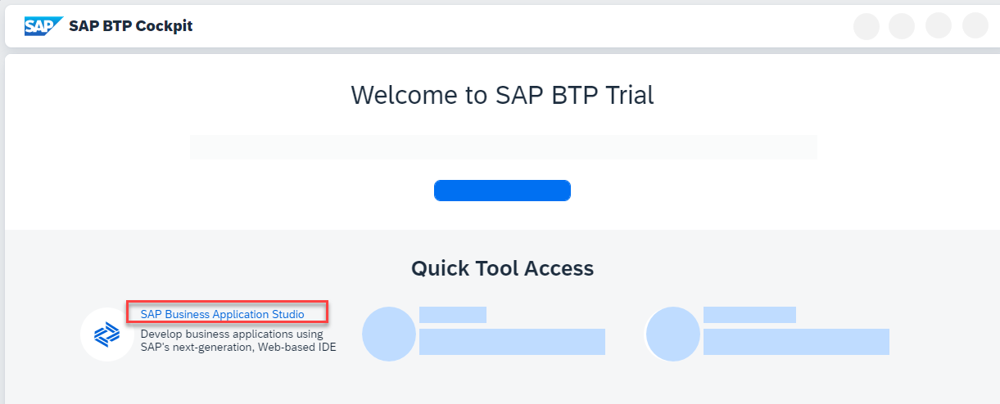

4. Go to **Subscriptions** submenu and filter for **Business Application Studio**.

    !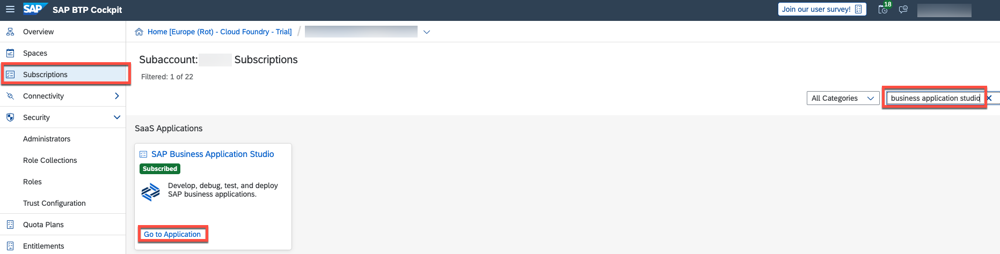

5. Open the SAP Business Application Studio by clicking on **Go to Application** on the according tile.
> If you aren't already subscribed, please subscribe first.

6. Choose **Create Dev Space**

    !

7. Choose **`CAPTutorial`** as the name for your dev space and **SAP Cloud Business Application** as the application type. Continue with **Create Dev Space**.

    !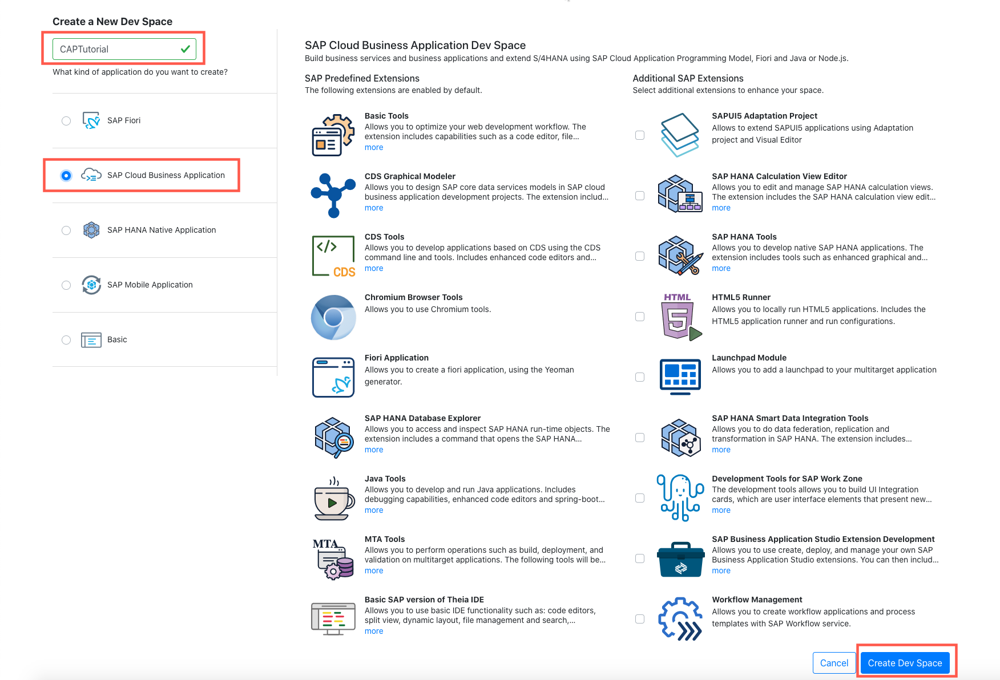

    By selecting SAP Cloud Business Application, your space comes with several extensions out of the box that you'll need to develop CAP applications. For example, CDS tools are built in. This saves unnecessary setup time.
    The creation of the dev space takes a few seconds.

8. When it's ready, open your dev space by clicking on the name.

    !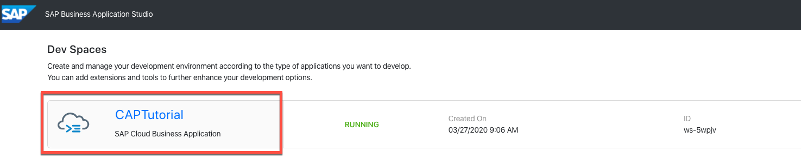

[DONE]
[ACCORDION-END]

[ACCORDION-BEGIN [Step 2: ](Create application skeleton)]

1. Change the color theme to your preferences.

    Go to **File** > **Settings** > **Color Theme** and choose an item from the list. We used **Dark (Visual Studio)**.

    !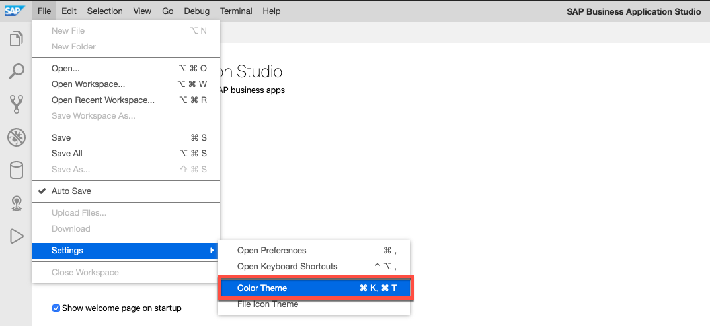

2. From the main menu, choose **Terminal** > **New Terminal**.

    !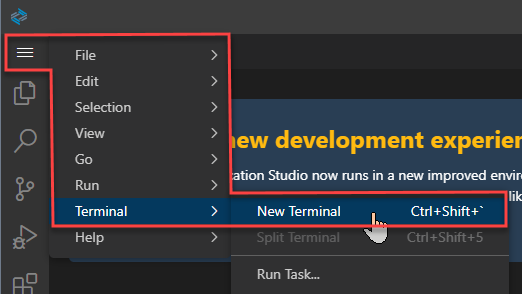

3. A terminal window should now have been opened on the bottom of the window. From the terminal, run `cd projects` to go to the projects directory.

    !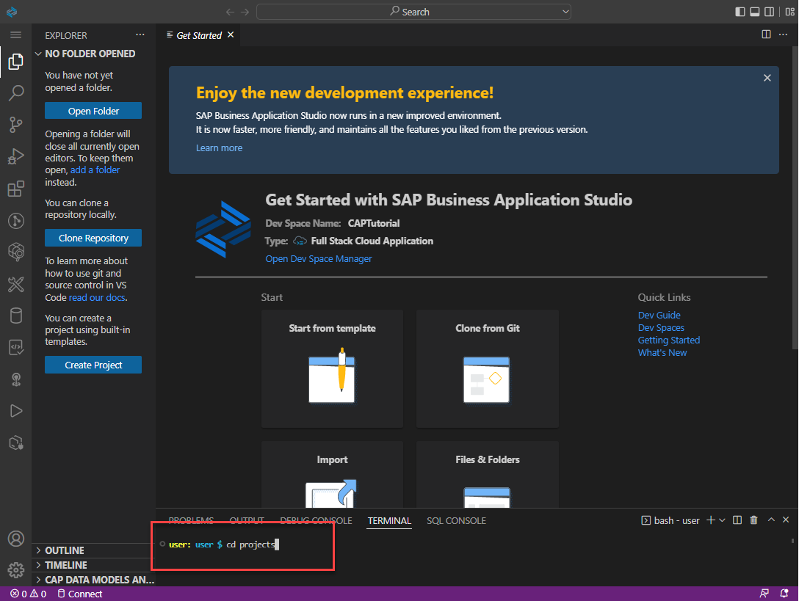

4. Now, run:

    ```Shell/Bash
    mvn -B archetype:generate -DarchetypeArtifactId=cds-services-archetype -DarchetypeGroupId=com.sap.cds \
    -DarchetypeVersion=RELEASE \
    -DgroupId=com.sap.cap -DartifactId=products-service -Dpackage=com.sap.cap.productsservice
    ```

    This will initialize the application using the [maven archetype](http://maven.apache.org/guides/introduction/introduction-to-archetypes.html) `cds-services-archetype` and create your project as follows:

    - The project is named `products-service`.
    - The `db` folder stores database-related artifacts.
    - The `srv` folder stores your Java application.

      !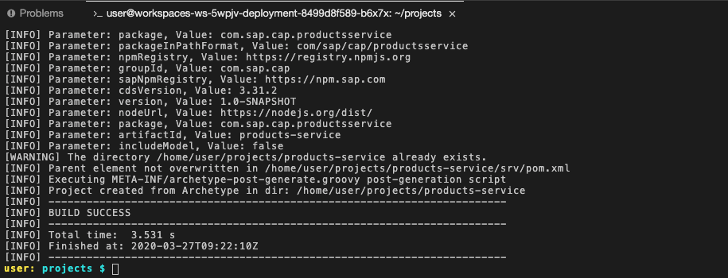

5. From the main menu, choose **File** > **Open Workspace**.

6. Choose **products-service** and then **Open**.

    !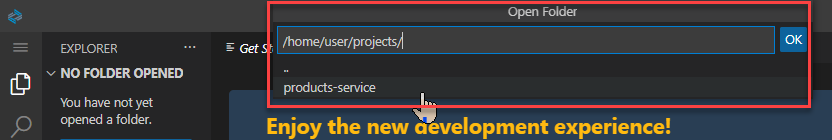

    > If you see a notification asking if you want to synchronize the `Java classpath/configuration`, choose **Always**.

    > If you have any problem indication for any of the `pom.xml` files yet, don't worry; ignore them for now.

[DONE]
[ACCORDION-END]

[ACCORDION-BEGIN [Step 3: ](Define a service)]

CAP applications use [Core Data Services](https://cap.cloud.sap/docs/cds/) (CDS) to describe:

- Data structures by using [entity definitions](https://cap.cloud.sap/docs/cds/cdl#entities-views)
- How data structures are consumed by using [service definitions](https://cap.cloud.sap/docs/cds/cdl#services)

In this step, you'll define a simple service, which also defines its own entity. In more complex applications, services usually expose projections on entities defined in the data model.

1. Right-click on the `srv` folder and choose **New File**.

    !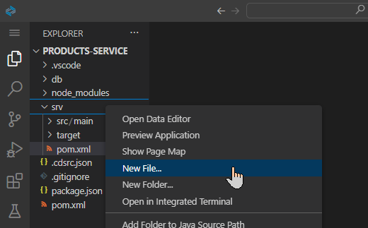

2. Call it `admin-service.cds` and click **OK** to create the file.

3. Add the following service definition to the file and make sure you **Save** the file (keyboard shortcut **CTRL+S**):

    ```CDS
    service AdminService {
        entity Products {
            key ID : Integer;
            title  : String(111);
            descr  : String(1111);
        }
    }
    ```

[DONE]
[ACCORDION-END]

[ACCORDION-BEGIN [Step 4: ](Compile model definition)]

1. From the main menu, open a terminal with **Terminal** > **New Terminal**.
 You should be in the **products-service** project but in order to be sure run `pwd`.

    ```Shell/Bash
    pwd
    ```

    !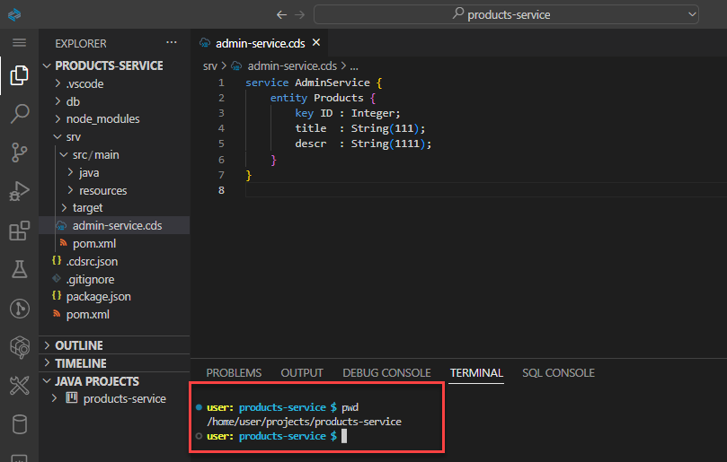

2. Run the following command in the terminal to trigger the maven build process:

    ```Shell/Bash
    mvn clean install
    ```

Running this for the first time in a fresh dev space might take a while, depending on the network. Please wait until you see the **BUILD SUCCESS** message before continuing with the tutorial.

After running this command, some files are generated and added to the `srv/src/main/resources/edmx` folder. This is the default path, where CAP Java runtime looks for the model definitions.

!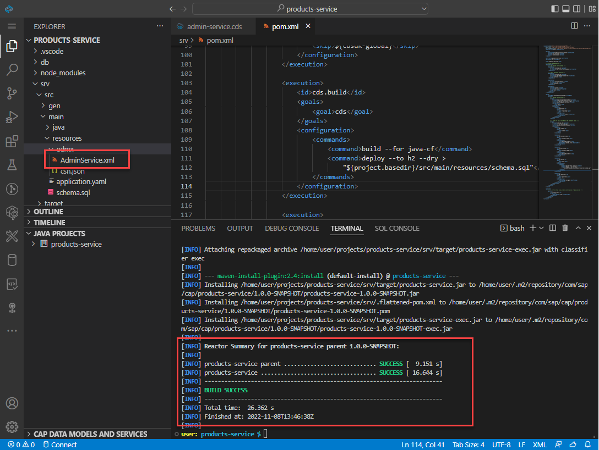

[DONE]
[ACCORDION-END]

[ACCORDION-BEGIN [Step 5: ](Run the application)]

While creating the project skeleton, the application `Application.java` file was created, which contains a `main` method. The `Application.java` is the startup class for the Spring Boot container.

1. Look at the `Application.java` in the `com.sap.cap.productsservice` package (file path: `srv/src/main/java/com/sap/cap/productsservice`).


    !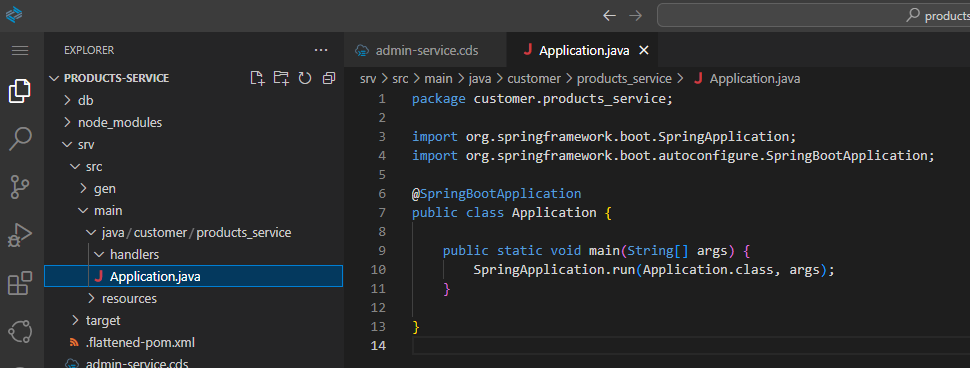

    >If you use **CTRL+P** in SAP Business Application Studio, you open a search bar. Start typing `Application.java` to find and open the file.

    As you can see, the file doesn't contain CAP-specific startup instructions. It's the typical boilerplate code found in every Spring Boot application. The initialization of the CAP Java runtime is done by Spring automatically, based on the dependencies defined in the `pom.xml`.

2. Go to the root of your project by running the following command in the terminal:

    ```Shell/Bash
    cd ~/projects/products-service
    ```

3. Start the application:

    ```Shell/Bash
    mvn clean spring-boot:run
    ```

      A notification message saying "A service is listening to port 8080" will appear in the bottom right.

      !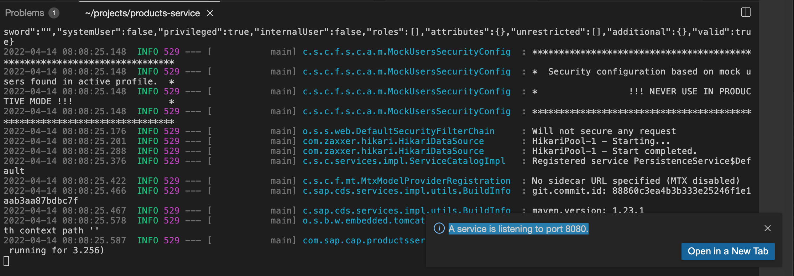

      If you have issues exposing the port or opening the application, take a look at the next step where alternative ways to expose the port and open the application are explained.

4. Choose **Expose and Open**.

5. Provide **app-port** as the unique description.

6. Hit the **Enter** key to open the application in a new tab.

    !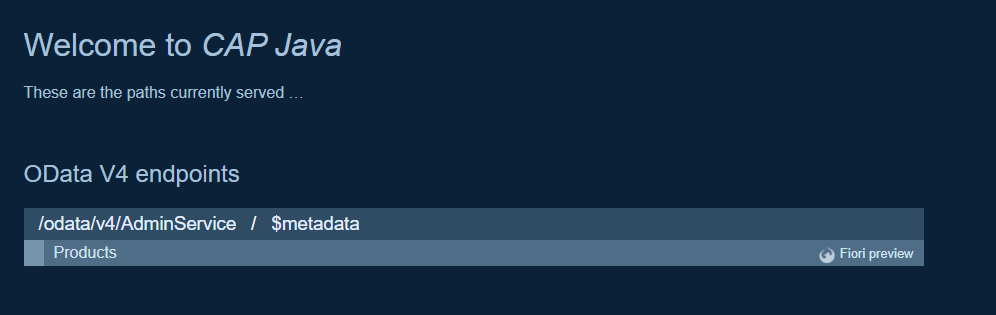

[DONE]
[ACCORDION-END]

[ACCORDION-BEGIN [Step 6: ](Manually open the application)]

1. Make sure that your application is running. From the main menu, go to **View** > **Find Command** to open the command palette.

    !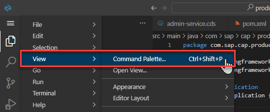

2. Type **Ports: Expose** and select or enter `8080`. Provide `app-port` as the unique description. If you don't see port `8080` listed in the **Ports: Expose** view, use **View** > **Find Command** again and type **Ports: Preview** instead. Then click on the port `8080` to open the application.

    !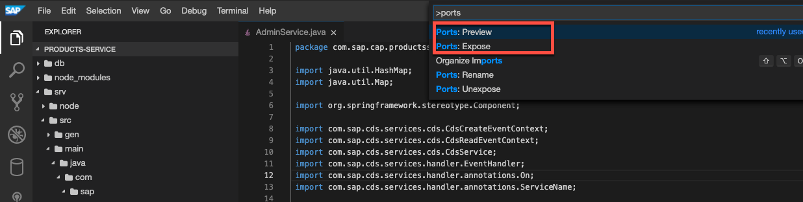

[VALIDATE_1]
[ACCORDION-END]

[ACCORDION-BEGIN [Step 7: ](Inspect OData metadata)]

1. Choose **`$metadata`** from the welcome page to inspect the OData metadata that is automatically served by the CAP Java runtime.

    !

    > Alternatively add `/odata/v4/AdminService/$metadata` to your app URL. Your URL should be the same either way.

In the next tutorial, you'll learn how to add custom logic. Specifically, so that your application can read and create Products.

[DONE]
[ACCORDION-END]

[ACCORDION-BEGIN [Step 8: ](Troubleshooting)]

Sometimes it happens that your CAP Project can't be started. Does your log output look similar to this one?

!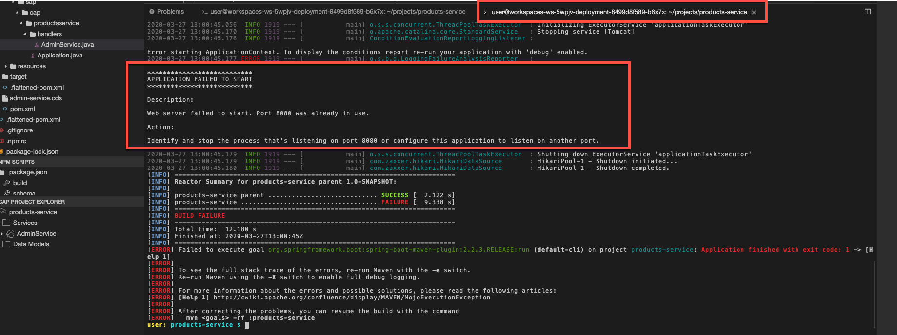

This means that your application is still running in another terminal. Check if you have multiple terminals opened.

!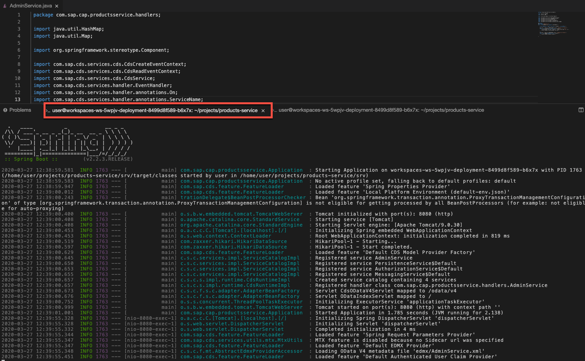

1. Stop the application in the other terminal by using **CTRL+C** or

2. Click on the **x** icon next to the terminal to close the terminal window and implicitly stop all inherited processes.

!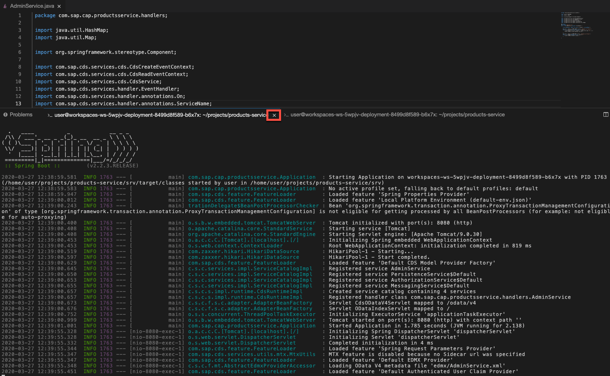

[DONE]
[ACCORDION-END]

Great Job! You have built your CAP Java application skeleton and are good to serve some data.


---
