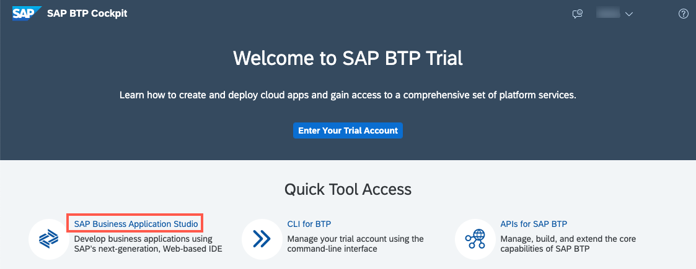
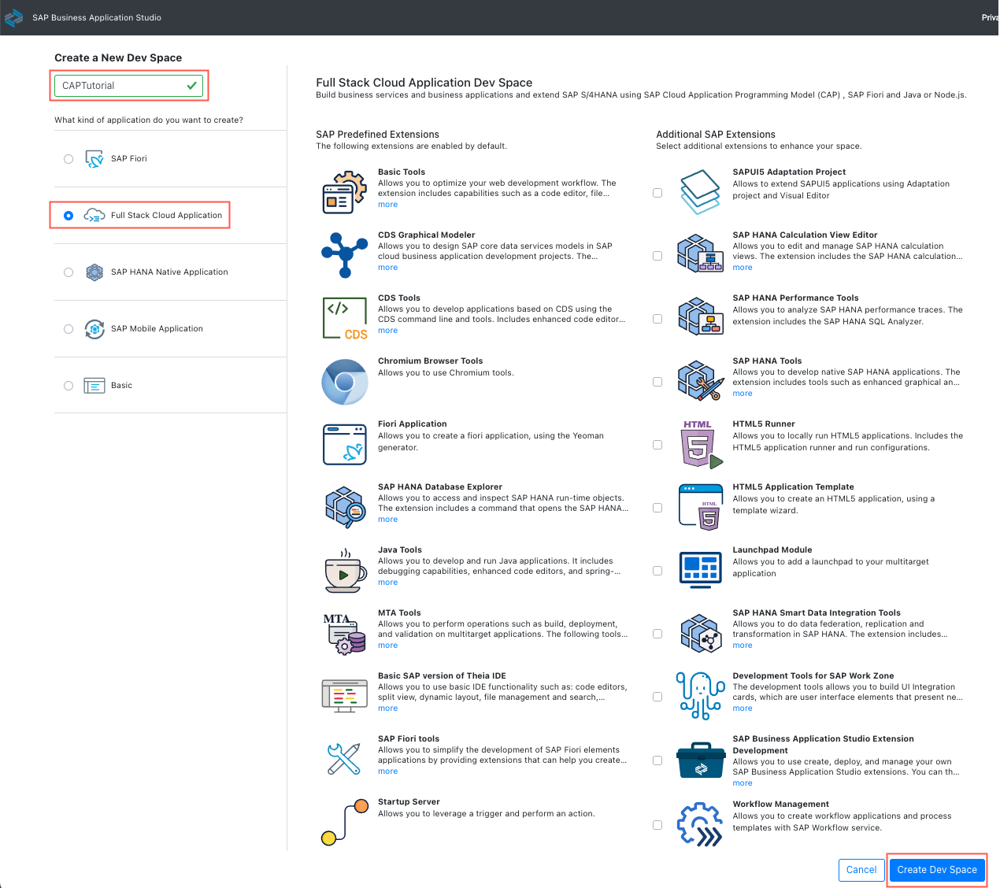
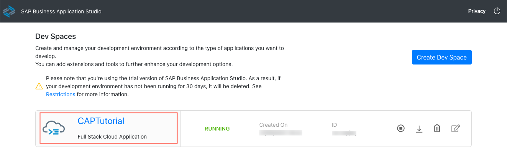
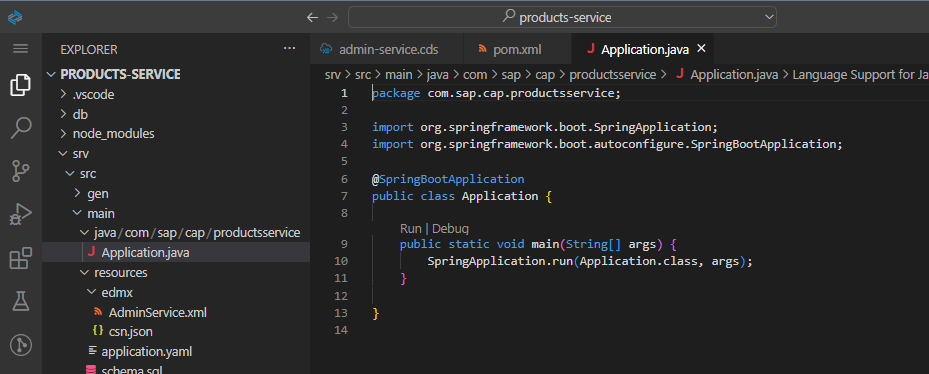

# Set Up SAP Business Application Studio for CAP Java
<!-- description --> Set up the SAP Business Application Studio and create a first service implementation.

## Prerequisites
 - If you don't have a Cloud Foundry Trial Subaccount on [SAP Business Technology Platform (SAP BTP)](https://cockpit.hanatrial.ondemand.com/cockpit/) yet, create your [Cloud Foundry Trial Account](hcp-create-trial-account).
 - Basic knowledge of Spring Boot and Java (optional)

## You will learn
  - What is SAP Business Application Studio
  - How to create a project skeleton for a CAP Java project
  - How to expose ports of the application in SAP Business Application Studio to the internet.

## Intro
First things first, you need to set up your development environment and check that everything is running smoothly.

For this tutorial, we use the SAP Business Application Studio as the development tool of choice. SAP Business Application Studio provides a web-based Visual Studio Code-like experience. So, it's like VS Code, but for your browser.

> ### What's great about using SAP Business Application Studio?
> You get an editor, useful extensions and all the tools required to develop CAP applications and full access to the terminal.

To make sure that everything is set up correctly, this tutorial also includes how to build and run a simple Hello World application. The SAP Cloud Application Programming Model (CAP) supports both Java and Node.js development. But for this tutorial, we're using Java. The [CAP Java SDK](https://cap.cloud.sap/docs/java/) is able to tightly integrate with [Spring Boot](https://spring.io/projects/spring-boot), which provides numerous features out of the box. This means, Spring Boot will be your runtime container.

For a general overview about CAP, you might also want to have a look at the official [CAP documentation](https://cap.cloud.sap/docs/) and the [CAP Community](https://community.sap.com/topics/cloud-application-programming).

---

### Open SAP Business Application Studio and create your Dev Space


Before you can start using SAP Business Application Studio, you need to create your developer space, where your project will run. Depending on the application you want to develop, you can create different types of dev spaces.

For this tutorial, you will create a dev space personalized for building services and applications with CAP.

Before you begin, check the settings of your browser. You need to add domains `ondemand.com` and `cloud.sap.com` to the list of the exceptions to enable pop-ups and new tabs and disable the ad blocker extension if you use one.

1. Go to the [SAP BTP Cockpit](https://cockpit.hanatrial.ondemand.com/cockpit#/home/trial) on Trial.

2. Choose **SAP Business Application Studio** under **Quick Tool Access**.

    <!-- border -->

3. On the welcome page choose **Create Dev Space**.

4. Choose **`CAPTutorial`** as the name for your dev space and **Full Stack Cloud Application** as the application type. Continue with **Create Dev Space**.

    <!-- border -->

    By selecting **Full Stack Cloud Application**, your space comes with several extensions out of the box that you will need to develop CAP applications. For example, CDS tools are built in. This saves unnecessary setup time.
    The creation of the dev space takes a few seconds.

5. When it's ready, open your dev space by clicking on the name.

    <!-- border -->

    > Please note that you're using the trial version of SAP Business Application Studio. See section [Restrictions](https://help.sap.com/viewer/9d1db9835307451daa8c930fbd9ab264/Cloud/en-US/a45742a719704bdea179b4c4f9afa07f.html) in the SAP Business Application Studio documentation for more details on how your development environment can be affected.


### Create application skeleton


1. Change the color theme to your preferences.

    Go to **File** **&rarr;** **Preferences** **&rarr;** **Color Theme** and choose an item from the list. We used **Dark (Visual Studio)**.

2. From the main menu, choose **Terminal** **&rarr;** **New Terminal**.

    <!-- border -->

3. A terminal window should now have been opened on the bottom of the window. From the terminal, run `cd projects` to go to the projects directory.

    <!-- border -->

4. Now, run:

    ```Shell/Bash
    mvn -B archetype:generate -DarchetypeArtifactId=cds-services-archetype -DarchetypeGroupId=com.sap.cds \
      -DarchetypeVersion=RELEASE -DjdkVersion=17 \
      -DgroupId=com.sap.cap -DartifactId=products-service -Dpackage=com.sap.cap.productsservice
    ```

    This will initialize the application using the [maven archetype](http://maven.apache.org/guides/introduction/introduction-to-archetypes.html) `cds-services-archetype` and create your project as follows:

    - The project is named `products-service`.
    - The `db` folder stores database-related artifacts.
    - The `srv` folder stores your Java application.

      <!-- border -->

    > Until it's the default in the SAP Business Application Studio, you need to set the default JDK to 17.
    > From the main menu, choose **File** **&rarr;** **Help** **&rarr;** **Show All Commands**, type `Java: Set Default JDK` and choose **JavaSE-17**.

5. From the main menu, choose **File** **&rarr;** **Open Folder**.

6. Choose **projects &rarr; products-service** and then **OK**.

    <!-- border -->

    > If you see a notification asking if you want to synchronize the `Java classpath/configuration`, choose **Always**.

    > If you have any problem indication for any of the `pom.xml` files yet, don't worry; ignore them for now.


### Define a service


CAP applications use [Core Data Services](https://cap.cloud.sap/docs/cds/) (CDS) to describe:

- Data structures by using [entity definitions](https://cap.cloud.sap/docs/cds/cdl#entity-and-type-definitions)
- How data structures are consumed by using [service definitions](https://cap.cloud.sap/docs/cds/cdl#services)

In this step, you will define a simple service, which also defines its own entity. In more complex applications, services usually expose projections on entities defined in the data model.

1. Right-click on the `srv` folder and choose **New File**.

    <!-- border -->

2. Call it `admin-service.cds` and choose **OK** to create the file.

3. Add the following service definition to the file and make sure you **Save** the file (keyboard shortcut **CTRL+S**):

    ```CDS
    service AdminService {
        entity Products {
            key ID : Integer;
            title  : String(111);
            descr  : String(1111);
        }
    }
    ```


### Compile model definition


1. From the main menu, open a terminal with **Terminal** **&rarr;** **New Terminal**.
 You should be in the **products-service** project but in order to be sure run `pwd`.

    ```Shell/Bash
    pwd
    ```

    <!-- border -->

2. Run the following command in the terminal to trigger the maven build process:

    ```Shell/Bash
    mvn clean install
    ```

Running this for the first time in a fresh dev space might take a while, depending on the network. Please wait until you see the **BUILD SUCCESS** message before continuing with the tutorial.

After running this command, some files are generated and added to the `srv/src/main/resources/edmx` folder. This is the default path, where CAP Java runtime looks for the model definitions.

<!-- border -->


### Run the application


While creating the project skeleton, the application `Application.java` file was created, which contains a `main` method. The `Application.java` is the startup class for the Spring Boot container.

1. Look at the `Application.java` in the `com.sap.cap.productsservice` package (file path: `srv/src/main/java/com/sap/cap/productsservice`).


    <!-- border -->

    > If you use **CTRL+P** in SAP Business Application Studio, you open a search bar. Start typing `Application.java` to find and open the file.

    As you can see, the file doesn't contain CAP-specific startup instructions. It's the typical boilerplate code found in every Spring Boot application. The initialization of the CAP Java runtime is done by Spring automatically, based on the dependencies defined in the `pom.xml`.

2. Go to the root of your project by running the following command in the terminal:

    ```Shell/Bash
    cd ~/projects/products-service
    ```

3. Start the application by running the following command in the terminal:

    ```Shell/Bash
    mvn clean spring-boot:run
    ```

      A notification message saying "A service is listening to port 8080" will appear in the bottom right.

      <!-- border -->

4. Choose **Open New Tab**.

5. The application start page will be opened in a new tab.

    <!-- border -->


### Manually open the application


1. Make sure that your application is running. From the main menu, go to **View** **&rarr;** **Find Command** to open the command palette.

    <!-- border -->

2. Type **Port: Preview** and select or enter `8080`. There will be one application visible and you can open new tab for it.


### Inspect OData metadata


1. Choose **`$metadata`** from the welcome page to inspect the OData metadata that is automatically served by the CAP Java runtime.

  <!-- border -->

> Alternatively add `/odata/v4/AdminService/$metadata` to your app URL. Your URL should be the same either way.

In the next tutorial, you will learn how to add custom logic. Specifically, so that your application can read and create Products.


### Troubleshooting


Sometimes it happens that your CAP Project can't be started. Does your log output look similar to this one?

<!-- border -->

This means that your application is still running in another terminal. Check if you have multiple terminals opened or use **Ports: Preview** to check if you have another application running on same port.

<!-- border -->

1. Stop the application in the other terminal by using **`CTRL+C`** or ...

2. Choose the **x** icon next to the terminal to close the terminal window and implicitly stop all inherited processes.

<!-- border -->

Great Job! You have built your CAP Java application skeleton and are good to serve some data.


---
