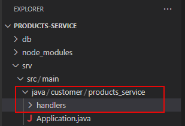
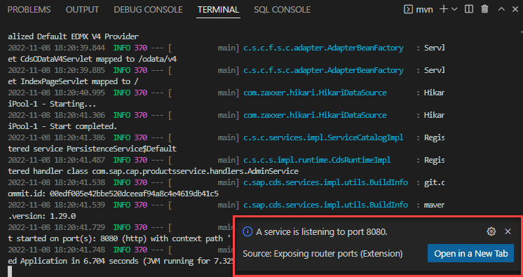
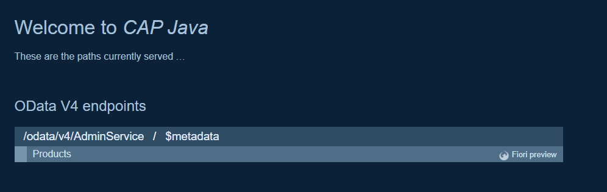
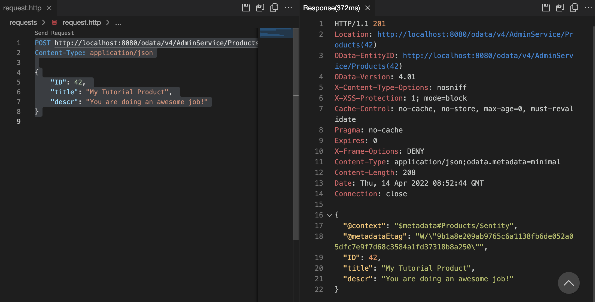
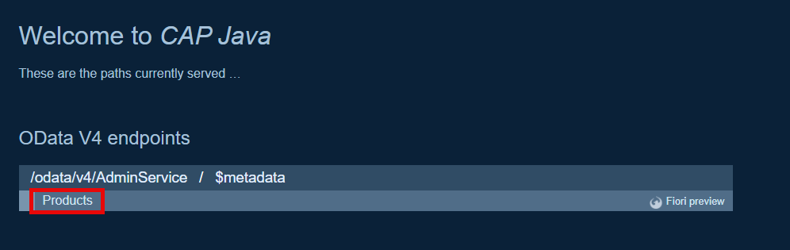
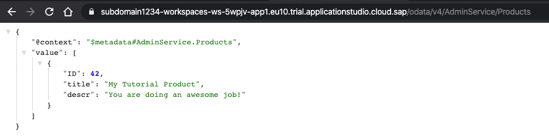

# Add a Custom Event Handler
<!-- description --> Write your first CAP Java Custom Event Handler.

## You will learn
  - How to write a custom event handler for CAP Java
  - Which event handler classes and methods are available

## Intro
In the following tutorials, you will learn that the CAP Java runtime can handle all CRUD events (create, read, update, and delete) triggered by OData requests out of the box. For now, we'll show you how to do this manually, so that you can see how to write a custom event handler to extend the event handling process.

---

### Create Java class for custom event handler


1. Create the Java package, by creating a new folder called `handlers` under `srv/src/main/java/com/sap/cap/productsservice`.

    <!-- border -->

2. Create the Java class file `AdminService.java` in the created `handlers` folder, with the following content and make sure you **Save** the file:

```Java
package com.sap.cap.productsservice.handlers;

import java.util.HashMap;
import java.util.Map;

import org.springframework.stereotype.Component;

import com.sap.cds.services.cds.CdsCreateEventContext;
import com.sap.cds.services.cds.CdsReadEventContext;
import com.sap.cds.services.cds.CqnService;
import com.sap.cds.services.handler.EventHandler;
import com.sap.cds.services.handler.annotations.On;
import com.sap.cds.services.handler.annotations.ServiceName;

@Component
@ServiceName("AdminService")
public class AdminService implements EventHandler {

    private Map<Object, Map<String, Object>> products = new HashMap<>();

    @On(event = CqnService.EVENT_CREATE, entity = "AdminService.Products")
    public void onCreate(CdsCreateEventContext context) {
        context.getCqn().entries().forEach(e -> products.put(e.get("ID"), e));
        context.setResult(context.getCqn().entries());
    }

    @On(event = CqnService.EVENT_READ, entity = "AdminService.Products")
    public void onRead(CdsReadEventContext context) {
        context.setResult(products.values());
    }

}
```

This class now handles the `READ` and `CREATE` events that target the `Products` entity of the `AdminService`.

  - The `READ` operation just returns all entities kept in memory.

  - The `CREATE` event extracts the payload from the CQN representation and stores it in memory.

[CDS Query Notation](https://cap.cloud.sap/docs/cds/cqn) (CQN) is the common language in CAP to run queries against services. It can be used to talk to the services defined by your model, but also remote services, such as the database.

The event handler uses the following APIs, which are available for service providers in CAP Java:

* [Event handler classes](https://cap.cloud.sap/docs/java/provisioning-api#handlerclasses) have to implement the marker interface `EventHandler` and register themselves as Spring Beans (`@Component`). The marker interface is important, because it enables the CAP Java runtime to identify these classes among all Spring Beans.
* You register your [Event Handler Methods](https://cap.cloud.sap/docs/java/provisioning-api#handlerannotations) with `@Before`, `@On`, or `@After` annotations. Every event, such as an entity creation, runs through these three [phases](https://cap.cloud.sap/docs/java/provisioning-api#phases). Each phase has a slightly different semantic. You will learn more about these semantics in the subsequent tutorial.
* The annotation `@ServiceName` specifies the default service name all event handler methods apply to. Here this is `AdminService`, as this was also the name when defining the service in the CDS model.
* Event handler methods get an event-specific event context parameter, which provides access to the input parameters of the event and the ability to set the result. For example, let's look at the `CdsCreateEventContext context` parameter. The event we're extending is the `CREATE` event. The type of the context variable is specific to this extended `CREATE` event. The `onCreate` method returns `void`, as the result is set by running: `context.setResult(…)`.


### Stop the application


Stop your application if it's still running by using **`CTRL+C`** in the terminal.


### Restart the application


1. Restart the application by running the following command in the terminal:

    ```Shell/Bash
    cd ~/projects/products-service && mvn clean spring-boot:run
    ```

2. Choose **Open in New Tab** when prompted.

    <!-- border -->

    A new Browser tab is opened with your application.

    <!-- border -->


### Insert data through HTTP request


Try to insert some data into the running application. For example, by using the HTTP request plugin bundled in SAP Business Application Studio.

1. Create a new file `requests.http` in the root directory.

2. Add the following request to the file:

    ```HTTP
    ### Create Product

    POST http://localhost:8080/odata/v4/AdminService/Products
    Content-Type: application/json

    {"ID": 42, "title": "My Tutorial Product", "descr": "You are doing an awesome job!"}
    ```

    The POST request causes an [OData Insert](https://www.odata.org/getting-started/basic-tutorial/#create) on the entity **Products** of the service **`AdminService`**. The type of the content is specified in the Content-Type header of the HTTP request and the content of the actual request is passed in the body of the request as [JSON](https://www.json.org/json-en.html).

3. Choose **Send Request** above the request in the file. You will see the result on the right side of the window.

    <!-- border -->


### Read data using the Products entity page


1. To read the data again, open the welcome page of the application.

2. Choose **Products** from the app welcome page or add `/odata/v4/AdminService/Products` to the app URL.

  <!-- border -->

You should see something like this:

  <!-- border -->

This is the record you have inserted in the previous step through the HTTP request.

> If the data isn't formatted the way it is shown in the screenshot, use the [JSON Formatter extension](https://chrome.google.com/webstore/detail/json-formatter/bcjindcccaagfpapjjmafapmmgkkhgoa?hl=en) for Google Chrome or another JSON Formatter for your preferred browser. The data itself should be the same anyway.

Great Job! You have successfully added custom logic to handle specific requests. The next tutorial will show you how to extend the application and build the products service from scratch.

In addition, you will use an actual database as the persistence and see some of the features the CAP Java SDK provides out of the box, without a single line of custom coding.


---
