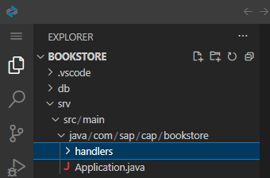
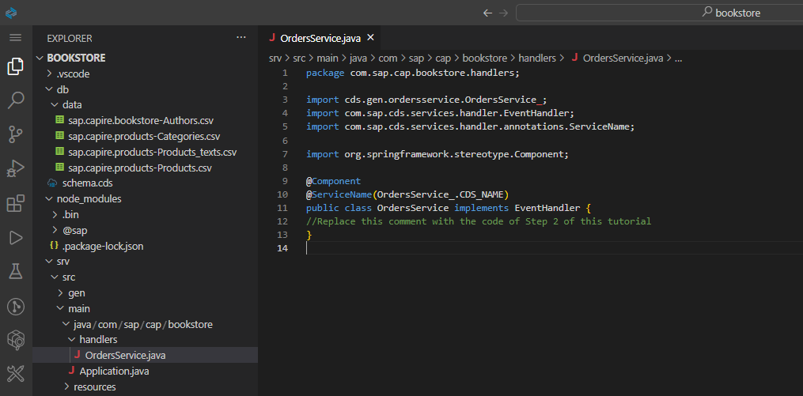
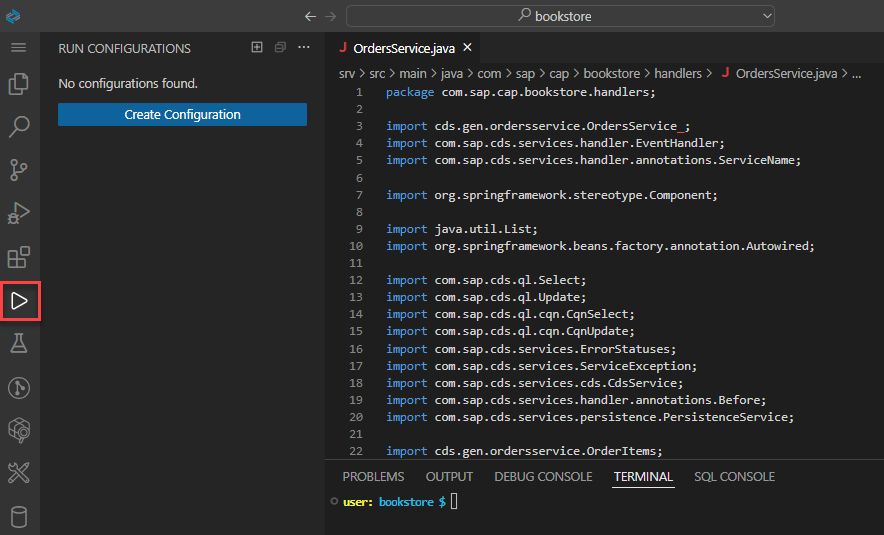
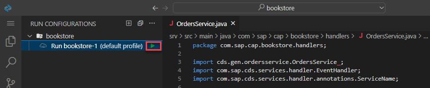
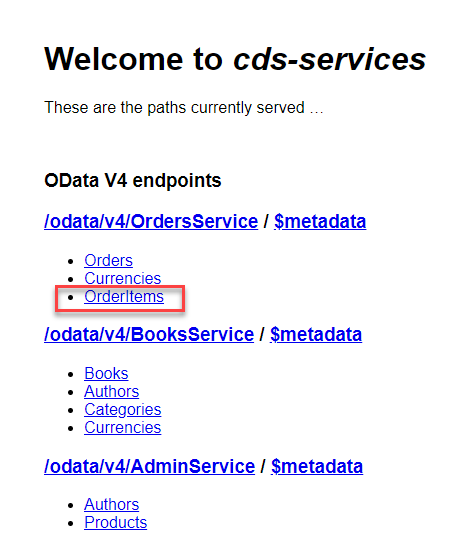

# Extend the Bookstore with Custom Code
<!-- description --> Extend the previously built bookstore with custom coding, for example, to validate requests.

## You will learn
  - How to use the CAP Java SDK
  - How to use the debugger in SAP Business Application Studio

## Intro
In the previous tutorial, you have built the data model and exposed the services of your bookstore application. In this tutorial, you will extend the bookstore with custom code to calculate the `total` and `netAmount` elements of the `Orders` and `OrderItems` entity. In addition, when creating an order the available stock of a book will be checked and decreased.


### Define custom handler for `OrdersService`

In one of the previous tutorials, you have already seen how to register a [custom event handler](https://cap.cloud.sap/docs/java/provisioning-api) to handle `READ` or `CREATE` events of an entity. You used the `@On` annotation, which replaces the default handling of an event that is provided by the CAP Java runtime.

As we want to augment the default handling now, we'll use the [`@Before`](https://cap.cloud.sap/docs/java/srv-impl#before) and [`@After`](https://cap.cloud.sap/docs/java/srv-impl#after) annotations. Event handlers registered using the `@Before` annotation are meant to perform validation of the input entity data. This makes it possible to validate the available stock of a particular book before creating an order. In contrast event handlers registered using the `@After` annotation can post-process returned entities. This is useful for calculating the `total` and `netAmount` elements after reading orders or their items from the database.

First of all, a new Java class for your event handler methods needs to be defined:

1. From the terminal, stop your application if it's still running using **`CTRL+C`**.

2. Go to `srv/src/main/java/com/sap/cap/bookstore` and create a new folder called `handlers`.

    <!-- border -->

3. In the created package, create the `OrdersService.java` file with the following content and make sure you **Save** the file:

```Java
package com.sap.cap.bookstore.handlers;

import cds.gen.ordersservice.OrdersService_;
import com.sap.cds.services.handler.EventHandler;
import com.sap.cds.services.handler.annotations.ServiceName;

import org.springframework.stereotype.Component;

@Component
@ServiceName(OrdersService_.CDS_NAME)
public class OrdersService implements EventHandler {
//Replace this comment with the code of Step 2 of this tutorial
}
```

<!-- border -->


> If you see validation errors in your editor, open the context menu on your `pom.xml` in the `srv` directory and select **Update Project**. That regenerates the classes and makes them available.


### Decrease stock when posting order


You will now add a method to the `OrdersService` Java class to decrease the stock whenever a new order item is posted.

1. Add the following code to your `OrdersService` Java class and make sure you **Save** the file:

    ```Java
    @Autowired
    PersistenceService db;

    @Before(event = CqnService.EVENT_CREATE, entity = OrderItems_.CDS_NAME)
    public void validateBookAndDecreaseStock(List<OrderItems> items) {
        for (OrderItems item : items) {
            String bookId = item.getBookId();
            Integer amount = item.getAmount();

            // check if the book that should be ordered is existing
            CqnSelect sel = Select.from(Books_.class).columns(b -> b.stock()).where(b -> b.ID().eq(bookId));
            Books book = db.run(sel).first(Books.class)
                    .orElseThrow(() -> new ServiceException(ErrorStatuses.NOT_FOUND, "Book does not exist"));

            // check if order could be fulfilled
            int stock = book.getStock();
            if (stock < amount) {
                throw new ServiceException(ErrorStatuses.BAD_REQUEST, "Not enough books on stock");
            }

            // update the book with the new stock, means minus the order amount
            book.setStock(stock - amount);
            CqnUpdate update = Update.entity(Books_.class).data(book).where(b -> b.ID().eq(bookId));
            db.run(update);
        }
    }

    @Before(event = CqnService.EVENT_CREATE, entity = Orders_.CDS_NAME)
    public void validateBookAndDecreaseStockViaOrders(List<Orders> orders) {
        for (Orders order : orders) {
            if (order.getItems() != null) {
                validateBookAndDecreaseStock(order.getItems());
            }
        }
    }
    ```

2. Add the following import statements to the top of the `OrdersService` Java class and make sure you **Save** the file:

    ```Java
    import java.util.List;
    import org.springframework.beans.factory.annotation.Autowired;

    import com.sap.cds.ql.Select;
    import com.sap.cds.ql.Update;
    import com.sap.cds.ql.cqn.CqnSelect;
    import com.sap.cds.ql.cqn.CqnUpdate;
    import com.sap.cds.services.ErrorStatuses;
    import com.sap.cds.services.ServiceException;
    import com.sap.cds.services.cds.CqnService;
    import com.sap.cds.services.handler.annotations.Before;
    import com.sap.cds.services.persistence.PersistenceService;

    import cds.gen.ordersservice.OrderItems;
    import cds.gen.ordersservice.OrderItems_;
    import cds.gen.ordersservice.Orders;
    import cds.gen.ordersservice.Orders_;
    import cds.gen.sap.capire.bookstore.Books;
    import cds.gen.sap.capire.bookstore.Books_;
    ```

Let's break down what is happening:

- The method `validateBookAndDecreaseStock` is registered using the `@Before` annotation. This means that the method is called before the `OrderItems` entities are persisted. The annotation also specifies, that the method should be called whenever an entity `OrderItems` is created.

- The method has a parameter `items`, which gives access to the list of `OrderItems`. The interface used here is generated by CAP Java. It generates a [POJO interface](https://cap.cloud.sap/docs/java/data#typed-access) for each entity defined in the CDS model.

- The `CqnSelect sel` variable defines a database query to retrieve the book that is referenced by the order item. The query is performed and the returned entity data is accessed using the POJO interface for `Books`.

- After that the available stock of the book is compared against the ordered amount. If enough stock is available the stock is decreased on the book and the book is updated within the database.

- As order items can also be created via a [deep insert](https://cap.cloud.sap/docs/java/query-execution#deep-insert-upsert) on the `Orders` entity, the same validation is triggered by the `validateBookAndDecreaseStockViaOrders` method.

It's important to note, that the CAP Java SDK automatically takes care of combining all database queries and updates in a single transaction. This means, that if the creation of the order item fails for some reason, the stock of the book won't be decreased.

The complete **OrdersService.java** file should now have the following format:

```Java
package com.sap.cap.bookstore.handlers;

import cds.gen.ordersservice.OrdersService_;
import com.sap.cds.services.handler.EventHandler;
import com.sap.cds.services.handler.annotations.ServiceName;

import org.springframework.stereotype.Component;

import java.util.List;
import org.springframework.beans.factory.annotation.Autowired;

import com.sap.cds.ql.Select;
import com.sap.cds.ql.Update;
import com.sap.cds.ql.cqn.CqnSelect;
import com.sap.cds.ql.cqn.CqnUpdate;
import com.sap.cds.services.ErrorStatuses;
import com.sap.cds.services.ServiceException;
import com.sap.cds.services.cds.CqnService;
import com.sap.cds.services.handler.annotations.Before;
import com.sap.cds.services.persistence.PersistenceService;

import cds.gen.ordersservice.OrderItems;
import cds.gen.ordersservice.OrderItems_;
import cds.gen.ordersservice.Orders;
import cds.gen.ordersservice.Orders_;
import cds.gen.sap.capire.bookstore.Books;
import cds.gen.sap.capire.bookstore.Books_;

@Component
@ServiceName(OrdersService_.CDS_NAME)
public class OrdersService implements EventHandler {
    @Autowired
    PersistenceService db;

    @Before(event = CqnService.EVENT_CREATE, entity = OrderItems_.CDS_NAME)
    public void validateBookAndDecreaseStock(List<OrderItems> items) {
        for (OrderItems item : items) {
            String bookId = item.getBookId();
            Integer amount = item.getAmount();

            // check if the book that should be ordered is existing
            CqnSelect sel = Select.from(Books_.class).columns(b -> b.stock()).where(b -> b.ID().eq(bookId));
            Books book = db.run(sel).first(Books.class)
                    .orElseThrow(() -> new ServiceException(ErrorStatuses.NOT_FOUND, "Book does not exist"));

            // check if order could be fulfilled
            int stock = book.getStock();
            if (stock < amount) {
                throw new ServiceException(ErrorStatuses.BAD_REQUEST, "Not enough books on stock");
            }

            // update the book with the new stock, means minus the order amount
            book.setStock(stock - amount);
            CqnUpdate update = Update.entity(Books_.class).data(book).where(b -> b.ID().eq(bookId));
            db.run(update);
        }
    }

    @Before(event = CqnService.EVENT_CREATE, entity = Orders_.CDS_NAME)
    public void validateBookAndDecreaseStockViaOrders(List<Orders> orders) {
        for (Orders order : orders) {
            if (order.getItems() != null) {
                validateBookAndDecreaseStock(order.getItems());
            }
        }
    }
}
```

If your `OrdersService.java` file still shows some errors right-click on the `pom.xml` in the `srv` directory and choose **Update Project**. After closing and reopening the `OrderService.java` file the errors should be gone.


### Test handler


1. Go to the terminal in SAP Business Application Studio and stop your application if it's still running by using **`CTRL+C`**.

2. Choose the **Run Configuration** icon on the side panel of SAP Business Application Studio.

    <!-- border -->

3. Choose the **Create Configuration** icon (plus sign) and select **`Bookstore`** as your project to run. Choose **Enter** to confirm the name.

4. Click the green arrow to start the application.

    <!-- border -->

    You should see the application starting in the **Debug Console**.

5. You will now test your application using some HTTP requests. Create a new file `requests.http` in the root directory.

6. Enter the following content in the file:

    ```HTTP
    ### Create Order

    POST http://localhost:8080/odata/v4/OrdersService/Orders
    Content-Type: application/json

    {
      "items": [
        {
          "book_ID": "abed2f7a-c50e-4bc5-89fd-9a00a54b4b16",
          "amount": 2
        }
      ]
    }
    ```

7. Choose **Send Request** to execute the request.

8. From the welcome page, choose **Books** and you will see that the stock of the book `Wuthering Heights` was decreased to 10.

      You can also add `/odata/v4/BooksService/Books` to the end of your app URL. Remember the app URL is the URL created when you run your application.  You may also combine the requests in the file you have created by adding a second request at the end of the file:

    ```HTTP
    ### Read Book

    GET http://localhost:8080/odata/v4/BooksService/Books(abed2f7a-c50e-4bc5-89fd-9a00a54b4b16)
    Accept: application/json
    ```

9. Choose **Send Request** above the second request to execute the request. You will see the current stock of the book you are ordering.

10. Repeat the request from step 7, until you get an error that the book ran out of stock.

      Basically, by repeating the request, you're ordering 2 books each time and therefore decreasing the stock by 2.


### Calculate `netAmount` of order item

Next, let's add a method to the `OrdersService` Java class to calculate the `netAmount` element of the `OrderItems` entity.

1. Add the following code to the class and make sure you **Save** the file:

    ```Java
    @After(event = { CqnService.EVENT_READ, CqnService.EVENT_CREATE }, entity = OrderItems_.CDS_NAME)
    public void calculateNetAmount(List<OrderItems> items) {
        for (OrderItems item : items) {
            String bookId = item.getBookId();

            // get the book that was ordered
            CqnSelect sel = Select.from(Books_.class).where(b -> b.ID().eq(bookId));
            Books book = db.run(sel).single(Books.class);

            // calculate and set net amount
            item.setNetAmount(book.getPrice().multiply(new BigDecimal(item.getAmount())));
        }
    }
    ```

2. Add the following import statements to the top of the `OrdersService` Java class and make sure you **Save** the file:

    ```Java
    import java.math.BigDecimal;
    import com.sap.cds.services.handler.annotations.After;
    ```

Let's break it down again:

- The method `calculateNetAmount` is registered using the `@After` annotation. This means that the method is called after the `OrderItems` entities have been read from the database. The annotation also specified, that the method should be called whenever an entity `OrderItems` is read or created.

- The method has a parameter `items` that gives access to all `OrderItems` entities that were either read or created.

- The `CqnSelect sel` variable defines a database [query](https://cap.cloud.sap/docs/java/query-api), to retrieve the book that is referenced by the order item. The query is [executed](https://cap.cloud.sap/docs/java/query-execution#queries) and the [query result](https://cap.cloud.sap/docs/java/query-execution#result) is accessed using the POJO interface for `Books`.

- In the last line the net amount of the order item is calculated, based on the price of the book and the amount of books ordered.


### Test handler


1. In SAP Business Application Studio, stop your application if it's still running by clicking on the red stop icon in the **Debug** side panel.

    <!-- border -->

2. Choose the **Run Configuration** icon on the side panel of SAP Business Application Studio.

    <!-- border -->

3. Click the green arrow to start the application.

    <!-- border -->

    You should see the application starting in the **Debug Console**.

4. You will now test your application using some HTTP requests. Add a new request to the file `requests.http`:

    ```HTTP
    ### Create another Order

    POST http://localhost:8080/odata/v4/OrdersService/Orders
    Content-Type: application/json

    {
      "items": [
        {
          "book_ID": "fd0c5fda-8811-4e20-bcff-3a776abc290a",
          "amount": 4
        }
      ]
    }
    ```

6. Choose **Send Request** above the new request to execute the request.

7. From the welcome page, choose **`OrderItems`** and you will see that the `netAmount` element is filled with the calculated value.

    <!-- border -->

    <!-- border -->

    >You can also add `/odata/v4/OrdersService/OrderItems` to the end of your app URL.


### Calculate total amount of order


Finally, add a method to the `OrdersService` Java class to calculate the `total` element of the `Orders` entity.

1. Add the following code to the class and make sure you **Save** the file:

    ```Java
    @After(event = { CqnService.EVENT_READ, CqnService.EVENT_CREATE }, entity = Orders_.CDS_NAME)
    public void calculateTotal(List<Orders> orders) {
        for (Orders order : orders) {
            // calculate net amount for expanded items
            if(order.getItems() != null) {
                calculateNetAmount(order.getItems());
            }

            // get all items of the order
            CqnSelect selItems = Select.from(OrderItems_.class).where(i -> i.parent().ID().eq(order.getId()));
            List<OrderItems> allItems = db.run(selItems).listOf(OrderItems.class);

            // calculate net amount of all items
            calculateNetAmount(allItems);

            // calculate and set the orders total
            BigDecimal total = new BigDecimal(0);
            for(OrderItems item : allItems) {
                total = total.add(item.getNetAmount());
            }
            order.setTotal(total);
        }
    }
    ```

Let's break down the code:

- Again, the `@After` annotation is used to register the method and to indicate that the method should be called, whenever the `Orders` entity was read or created.

- For the order items, that may be returned as part of the operation, the net amount is calculated, reusing the `calculateNetAmount` method. Please note that this may only be a subset of all of the order's items.

- For each order, all of the order items are read from the database using the query defined in `CqnSelect selItems`.

- For each order item, the net amount is calculated first by reusing the method `calculateNetAmount`. After that all net amounts are added to the order's total amount.


### Test the handler


1. In SAP Business Application Studio stop your application if it's still running by clicking on the stop icon in the **Debug** side panel.

    <!-- border -->

2. Choose the **Run Configuration** icon on the side panel of SAP Business Application Studio.

    <!-- border -->

3. Click on the green arrow to start the application, which appears when you hover over the run configuration.

    <!-- border -->

    You should see the application starting in the **Debug Console**.

4. Update the `amount` to 10 in the third request in the `requests.http` file.

5. Choose **Send Request** above the third request and execute the request.

6. From the welcome page, choose **Orders**. You will see that the `total` element is filled with the calculated value.

    <!-- border -->

    >You can also add `/odata/v4/OrdersService/Orders` to the end of your app URL.

7. Add `/odata/v4/OrdersService/Orders?$expand=items` to the end of your app URL.

    This expands the `Orders` with its `OrderItems`. You will see that the `netAmount` element of the `OrderItems` is calculated.

    <!-- border -->

8. Stop your application by clicking on the stop icon in the **Debug** side panel.

    <!-- border -->

Great job!

You have extended the application with quite some custom business logic. In the next tutorial you will start to make the application ready for SAP BTP, by running it with SAP HANA as the database.

---
